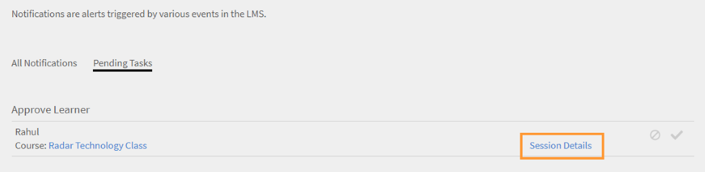

# 학습 객체

이 문서는 관리자용 학습 객체 정보로 구성되어 있습니다.

관리자는 본인의 강의, 학습 프로그램 및 인증에 학습자를 등록할 수 있습니다. 등록에 필요한 정보 및 단계에 대한 자세한 내용은 [학습자 등록](../../administrators/feature-summary/courses.md#main-pars_header_1058138132)을 참조하십시오.

## 강의 {#courses}

## 강의 보기 {#viewingcourses}

관리자는 사용 가능한 모든 강의의 목록을 볼 수 있습니다. 다음을 수행합니다. **[!UICONTROL 강의]** 왼쪽 창에서 검색 및 필터 옵션이 있는 강의 목록을 볼 수 있습니다. 강의 축소판에서 각 강의의 강의 효과 진행률 또한 볼 수 있습니다. 학습자 응용 프로그램에서 볼 수 있는 강의에만 팀 회원을 등록할 수 있다는 것을 참고하십시오.

>[!NOTE]
>
>중단된 전체 강의 목록은 **중단됨** 탭.

## 퀴즈 점수 보기 {#viewquizscores}

1. 강의 축소판에서 강의 이름을 클릭합니다.
1. 왼쪽 창의 &#39;퀴즈 점수&#39;를 클릭합니다.

사용자 이름 또는 각 질문을 기준으로 모든 강의의 퀴즈 점수를 볼 수 있습니다. 적절히 &#39;사용자&#39; 또는 &#39;질문&#39; 탭을 선택합니다. 귀하의 팀 회원의 퀴즈 점수만 볼 수 있습니다.

강의의 각 인스턴스 기반 점수를 보려면 드롭다운 목록에서 인스턴스 유형을 선택합니다.

## 강의 학습자 목록 관리 {#managelearnerslistforacourse}

관리자는 팀 회원의 학습자 목록을 관리할 수 있습니다.

1. 강의 축소판에서 강의 이름을 클릭합니다.
1. 왼쪽 창에서 **[!UICONTROL 학습자]**.

*학습자 동작 선택*

학습자 페이지에서 다음 작업을 수행할 수 있습니다.

* 제거할 학습자를 선택한 다음, &#39;동작&#39; > &#39;제거&#39;를 클릭합니다.
* 출석 표시를 할 학습자를 선택한 다음, &#39;동작&#39; > &#39;완료 표시&#39;를 클릭합니다.

학습자가 모듈을 재설정하고 해당 모듈을 다시 수료하게 하려면, &#39;재설정&#39;을 클릭합니다. 팝업 대화 상자에서 &#39;예&#39;를 클릭하여 재설정을 확인합니다. 완료된 모듈은 재설정할 수 없습니다. 실패 또는 미완료 모듈만 재설정할 수 있습니다.

또한 학습자를 엑셀 시트로 내보낼 수 있습니다. 학습자 목록을 내보내려면 &#39;동작&#39; > &#39;내보내기&#39;를 클릭합니다.

>[!NOTE]
>
>강의에 여러 인스턴스가 있는 경우, 엑셀에 있는 학습자 목록은 각 탭에 개별적으로 제공됩니다. 학습자 목록은 학습자 이름, 상태, 선택 조건으로 구성됩니다. 학습자 상태는 다음과 같습니다 **시작되지 않음**&#x200B;또는 **진행 중**&#x200B;또는 **완료됨**.

## L1 및 L3 피드백 보기 {#viewl1andl3feedback}

강의에 대해 학습자가 제공한 L1 피드백과 팀 회원에게 제공되는 L3피드백을 볼 수 있습니다.

1. 강의 목록에서 강의 타일을 클릭합니다.
1. 받은 피드백을 보려면 왼쪽 창에서 L1 피드백 또는 L3 피드백을 클릭합니다.
1. 특정 인스턴스에 대한 피드백을 보려면 드롭다운 목록에서 인스턴스를 선택합니다.

## 강의 미리 보기 {#previewcourses}

작성자는 **학습자로 미리 보기** 강의 모듈을 보는 동안 표시되는 옵션입니다.

1. 다음을 수행합니다. **[!UICONTROL 강의]** 로그인 후 왼쪽 창에 표시됩니다.
1. 페이지의 강의 목록 중 하나를 클릭합니다.
1. 왼쪽 창에서 &#39;학습자로 미리 보기&#39;를 클릭한 다음 페이지에 있는 모듈 이름을 클릭하여 플레이어에서 강의 모듈을 미리 봅니다.

## 강의 효과 {#courseeffectiveness}

강의가 학습자에게 유용했는지 파악하기 위해 강의 효과를 평가합니다. 강의 내용에 대한 학습자 피드백 결과, 학습자를 위한 강의 퀴즈 결과 및 강의 학습을 기반으로 학습자를 평가하는 관리자의 피드백 조합입니다.

아래 스냅샷과 같이 강의 축소판에서 강의 효과 등급 또한 볼 수 있습니다. 이 강의의 등급은 100으로 표시돼 있습니다.

<!---->

강의 효과 등급 값은 L1, L2 및 L3 피드백 값을 고려하여 산출됩니다. 각 피드백의 내용을 확인하려면 강의 효과 값을 클릭합니다. 아래와 같이 팝업이 나타납니다.

*피드백에 대한 강의 효과 보기*

샘플 스냅샷에서는 총 사용자 1명 중 1명이 3개의 피드백을 전부 받았으며 점수는 100/100입니다. 이 표에서 보듯 강의에 3개의 피드백(L1, L2 및 L3) 중 제공되지 않은 것이 있는 경우, 전체 효과에 부정적인 영향을 미칩니다. 팝업의 오른쪽 아래 모서리에 있는 아래로 화살표를 클릭하면 강의 효과가 어떻게 계산되는지 볼 수 있습니다.

*강의 효과 계산*

위에 표시된 원형 도표에서 볼 수 있듯이 관리자의 L3 피드백에는 가중치가 부여됩니다.

## 강의, 학습 프로그램 및 인증 검색 {#searchingcourseslearningprogramsandcertifications}

Adobe Learning Manager에서는 원하는 강의/학습 프로그램을 빠르고 쉽게 찾을 수 있습니다. 강의는 두 가지 방법으로 검색할 수 있습니다.

1. 검색 필드를 사용할 수 있습니다. 오른쪽 상단 모서리에 표시된 검색 아이콘을 클릭합니다. 검색창이 나타납니다. 강의 이름 또는 강의와 관련된 키워드를 입력하여 강의/학습 프로그램을 찾습니다. Captivate, C, Java, HTML 등 미리 정의된 태그를 사용하여 검색할 수도 있습니다. 태그는 검색 필드 내에서 검색할 수 있습니다. 즉, 태그를 입력할 때 검색 필드에 표시됩니다. 고유 ID로도 검색을 실행할 수 있습니다.
1. 필터를 사용하여 강의/학습 프로그램/인증 목록을 필터링할 수 있습니다. 전체, 게시됨, 중단됨 등의 상태로 강의에 필터를 적용할 수 있습니다.

&#39;역량&#39;을 클릭하여 선택하면 역량 기준으로 검색할 수도 있습니다. 관리자는 강의를 네 가지 방법으로 정렬하여 필요한 강의를 더 잘 찾을 수 있습니다. &#39;정렬 기준&#39;을 클릭한 다음 알파벳 오름차순, 알파벳 내림차순, 강의 업데이트 날짜 또는 강의 효과 중 하나를 선택합니다.

*역량 기반 검색*

학습 프로그램은 세 가지 방법으로 정렬할 수 있습니다. 알파벳 오름차순, 알파벳 내림차순, 업데이트 날짜 기준입니다.

## 강의에 학습자 등록 {#enrollinglearnersintocourses}

관리자는 조직의 요구 사항에 따라 필수 강의에 학습자를 등록할 수 있습니다.

1. 게시된 강의 타일에 마우스를 가져다 대고 학습자 등록 을 클릭합니다.

   또는 게시된 강의 타일을 클릭한 뒤 왼쪽 창에서 학습자를 클릭할 수도 있습니다. 학습자 목록이 있는 페이지가 나타납니다. &#39;등록&#39;을 클릭합니다.\
   학습자 등록 대화 상자가 나타납니다.

1. 학습자 이름이나 프로필을 입력하여 학습자를 선택한 다음 &#39;저장&#39;을 클릭합니다.

>[!NOTE]
>
>귀하의 팀에 속한 학습자만 등록할 수 있습니다.

## 학습 프로그램 {#learningprograms}

관리자는 등록 및 퀴즈 점수, L1 및 L3 피드백을 볼 수 있으며 본인의 부하 직원에 한하여 등록을 취소할 수 있습니다.

## 학습 프로그램에 학습자 추가 {#addlearnerstoalearningprogram}

1. 관리자 모드의 왼쪽 창에서 &#39;학습 프로그램&#39;을 클릭합니다.
1. 타일 목록에 게시된 학습 프로그램 중 학습자를 추가할 프로그램을 선택합니다.
1. 왼쪽 창에서 프로그램 보고서 범주 아래의 &#39;학습자&#39;를 클릭합니다. 참고: 학습 프로그램은 학습자를 추가하기 전에 게시되어야 합니다.
1. 페이지에서 &#39;등록&#39; 링크를 클릭합니다.
1. 학습자의 이름 또는 프로필을 입력하고 학습자 드롭다운 목록에서 학습자를 선택합니다. &#39;저장&#39;을 클릭합니다.

## 퀴즈 점수 보기 {#Viewquizscores-1}

1. 학습 프로그램 타일을 클릭합니다.
1. 왼쪽 창의 &#39;퀴즈 점수&#39;를 클릭합니다.

사용자 이름 또는 각 질문을 기준으로 모든 학습 프로그램의 퀴즈 점수를 볼 수 있습니다. 적절히 &#39;사용자&#39; 또는 &#39;질문&#39; 탭을 선택합니다. 한 번에 한 강의의 퀴즈 점수가 나타납니다. 다른 강의의 퀴즈 점수를 보려면 드롭다운에서 강의 이름을 변경합니다. 각 강의의 퀴즈 점수를 내보낼 수도 있습니다. 학습 프로그램의 각 인스턴스 기준 점수를 보려면 드롭다운 목록에서 인스턴스 유형을 선택합니다.

## 학습자 등록 취소 {#unenrollmentforlearners}

관리자는 아직 학습 프로그램을 시작하지 않은 학습자의 등록을 취소할 수 있습니다.

## 완료 표시 {#markcompletion}

관리자는 학습자에게 LP를 완료로 표시할 수 있습니다. 자세한 내용은 [완료 표시](../../administrators/feature-summary/learning-paths.md)를 참조하십시오.

## 인증 {#certifications}

## 인증에 학습자 등록 {#enrolllearnerstothecertification}

두 가지 방법으로 인증에 학습자를 등록할 수 있습니다. 아래 단계에 따라 학습자를 등록하십시오.

1. 관리자로 로그인한 후 왼쪽 창에서 인증 을 클릭합니다. 게시됨 탭 목록에서 각 인증에 마우스를 가져다 대고 학습자 등록 을 클릭합니다. 또는 게시된 인증 타일을 클릭한 뒤 왼쪽 창에서 학습자를 클릭할 수도 있습니다. 학습자 페이지 오른쪽에 있는 + 등록 을 클릭하여 학습자를 추가합니다.
1. 위의 두 단계 각각에서 학습자 등록 옵션을 클릭하면 학습자 등록 팝업 대화 상자가 표시됩니다. 학습자 이름과 프로필을 입력하고 드롭다운 목록에서 학습자 이름을 선택한 다음 저장 을 클릭합니다.

## 학습자 등록 취소 {#Unenrollmentforlearners-1}

관리자는 아직 인증을 시작하지 않은 학습자의 등록을 취소할 수 있습니다.

## 완료 표시 {#Markcompletion-1}

관리자는 인증 완료 표시를 할 수 있습니다. 자세한 내용은 [완료 표시](../../administrators/feature-summary/certifications.md#main-pars_header_303097138)를 참조하십시오.

## 학습자 과정 승인을 위한 관리자 알림 {#manager-notifications-course-approval}

학습자의 등록을 승인하거나 거절하려는 경우 관리자는 이제 세션의 세부 정보를 볼 수 있습니다(**화상 회의** 또는 **강의실**)를 선택합니다.

*학습자의 등록 요청 승인 또는 거부*

다음 세션 세부 정보가 표시됩니다.

* 세션 이름
* 강사 이름
* 위치
* 날짜 및 시간

다음은 워크플로우입니다.

1. 관리자는 학습자가 과정 승인을 요청한 후 알림을 확인합니다.

1. 관리자가 **세션 세부 정보**.

   

   *보류 중인 작업 보기*

1. 그러면 관리자는 요청을 승인하거나 거부합니다.
1. 관리자는 승인 또는 거절이 예상대로 수행되지 않은 경우 확인 또는 오류 메시지를 받습니다.
1. 학습자는 과정 등록에 대한 알림이나 승인 또는 거부를 받습니다.

## 외부 인증에 대한 선택적 제출 {#optional}

Learning Manager 초기 릴리스에서는 외부 인증을 완료하기 위해 학습자가 제출한 파일을 관리자가 수락했습니다. 관리자는 학습자가 파일을 제출한 이후에만 알림을 받습니다.

이제 관리자는 외부 인증에 등록한 학습자 목록을 외부 인증 내부에 있는 제출 페이지에서 볼 수 있으며, 알림을 기다릴 필요 없이 해당 페이지 자체를 수락 또는 거부할 수 있습니다.

관리자가 파일 제출을 기다리지 않고 수락하면, 학습자는 관리자가 수락했다는 새로운 메시지를 볼 수 있으며 해당 파일을 제출할 필요가 없습니다. 관리자가 파일 제출을 기다리지 않고 거부하면, 관리자는 파일을 기다리지 않고 다시 수락할지 선택할 수 있습니다.

학습자가 파일을 제출하는 경우, 관리자는 제출 페이지에서 해당 파일을 보고 제출된 파일에 따라 수락 또는 거부할 수 있습니다.

*파일 제출에 따라 수락 또는 거부*

강의가 필수로 설정되는 경우:

* 제출 페이지에는 학습자가 과정을 완료한 이후에만 학습자가 표시됩니다.
* 학습자는 강의를 완료해야만 파일을 업로드할 수 있습니다.

## 작업 지원 {#jobaids}

관리자는 부하 직원에 대한 작업 지원 할당을 관리할 수 있습니다. 그러나 관리자는 게시된 작업 지원만 볼 수 있으며 책임자는 철회된 작업 지원도 볼 수 있습니다.
