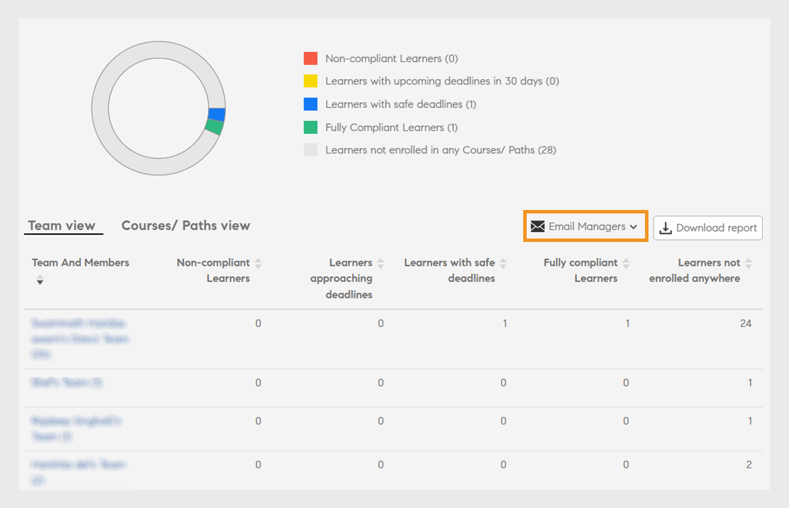
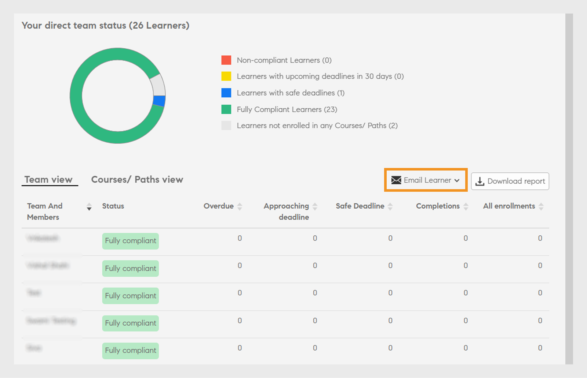

# 관리자 대시보드

관리자 대시보드에서 학습을 보고 추적하는 방법을 알아봅니다.

관리자는 팀의 학습 이니셔티브에서 중요한 역할을 합니다. 더 효과적으로 안내하기 위해 학습 플랫폼은 관리자에게 팀에서 학습을 추적하는 대시보드 보기를 제공합니다.

관리자용 *대시보드 보고서*

그래프의 세부 사항을 보려면 그래프를 클릭하거나 **[!UICONTROL 세부 사항]** 하이퍼링크를 클릭합니다.

## 학습 요약 {#learningsummary}

관리자는 선택한 기간 동안 팀의 학습 활동 요약을 볼 수 있습니다. 드롭다운 메뉴에서 월, 분기 또는 연도를 선택합니다.

책임자가 계정 설정에서 구성한 대로 &#39;월&#39;과 &#39;연도&#39;는 역년을 기반으로 하며 &#39;분기는&#39; 회계 연도를 기반으로 합니다.

*일정 기간 동안 학습 활동 보기*

## 팀 보기 {#teamview}

팀 보기는 학습 개체의 팀, 팀 멤버, 각 등록 상황, 진행률 및 완료를 표시합니다.

*팀 보기에는 팀, 멤버 및 해당 등록이 표시됩니다*

팀 이름(예: Venkatesh&#39;s Team)을 클릭하면 학습 개체에 대한 총 등록 수, 진행 수 및 완료 수와 함께 Venkatesh&#39;s Team의 구성원을 볼 수 있습니다.

*팀 구성원 선택*

각 팀 멤버의 학습 요약을 보려면 팀 관리자에 해당하는 각 열의 수를 클릭합니다. 등록 날짜, 기한 및 진행률 정보와 함께 학습 개체 목록을 표시하는 표가 열립니다.

*팀 관리자 선택*

이와 유사하게 해당하는 열 아래에 있는 값을 클릭하여 등록, 진행률 또는 완료의 수와 함께 학습 개체를 볼 수 있습니다.

*강의 및 학습 요약 보기*

각 학습에 대한 등록, 진행 또는 완료 수를 추가로 클릭하면 인력, 등록/완료 날짜, 기한 및 진행 상황 등의 세부 정보를 볼 수 있습니다.

*등록/완료 날짜, 기한 및 진행 상황 보기*

## 학습 보기 {#learningsview}

학습 보기는 학습 개체의 등록, 진행률 및 완료 수를 표시합니다.

각 학습 개체의 사람, 등록 날짜, 기한 및 진행률을 포함한 세부 사항을 보려면 등록, 진행률 및 완료 열에서 해당하는 값을 클릭합니다.

*학습 보기*

## 보고서 내보내기 {#exportreport}

Excel 보고서를 생성하려면 **[!UICONTROL 작업] > [!UICONTROL 보고서]**&#x200B;를 선택하십시오.

## 준수 상태 {#compliancestatus}

준수 대시보드에서 관리자는 특정 범주(예: 영업, 마케팅 및 법률)에 걸쳐 구성된 학습에 대한 팀의 전반적인 준수 상태를 볼 수 있습니다. 관리자는 준수 과정, 학습 경로 또는 인증이 있는 대시보드를 만들고 관리자와 공유할 수 있습니다. 관리자는 해당 인스턴스에서 관리자가 공유한 대시보드를 볼 수 있습니다.

### 대시보드 보기

대시보드를 보려면 관리자 앱에서 **[!UICONTROL 준수 대시보드]**&#x200B;를 선택하세요.

_준수 대시보드-관리자 앱_

준수 대시보드에는 다음과 같은 준수 상태가 포함됩니다.

* **[!UICONTROL 비준수 학습자]**: 마감일을 놓친 학습자의 수를 표시합니다.
* **[!UICONTROL 마감일에 도달한 학습자]**: 30일 이내에 마감일이 있는 학습자의 수를 표시합니다.
* **[!UICONTROL 안전한 마감일을 가진 학습자]**: 마감일이 30일 이상인 학습자의 수를 표시합니다.
* **[!UICONTROL 완전히 호환되는 학습자]**: 완전히 호환되는 학습자의 수를 표시합니다.
* **[!UICONTROL 등록되지 않은 학습자]**: 강의, 학습 경로 또는 인증에 등록되지 않은 학습자의 수를 표시합니다.

### 전자 메일 관리자 및 학습자

**여러 팀 관리**

여러 팀을 관리하는 경우 **[!UICONTROL 팀 보기]** 섹션에서 사용할 수 있는 **[!UICONTROL 전자 메일 관리자]** 옵션을 선택하여 팀원의 학습 상태를 관리자에게 알릴 수 있습니다.

_전자 메일 관리자_

**[!UICONTROL 전자 메일 관리자]**&#x200B;는 다음 옵션을 제공합니다.

* **[!UICONTROL 비준수 학습자의 전자 메일 관리자]**: 팀 멤버가 마감일을 놓친 관리자에게 알립니다.
* **[!UICONTROL 마감일에 도달한 학습자의 전자 메일 관리자]**: 팀 구성원에게 마감일이 다가오는 관리자에게 알립니다.

**단일 팀 관리**

단일 팀을 관리하는 경우 **[!UICONTROL 팀 보기]** 섹션에서 사용할 수 있는 **[!UICONTROL 학습자에게 전자 메일 보내기]** 옵션을 선택하여 학습자에게 학습 상태를 알릴 수 있습니다.

_전자 메일 학습자_

**[!UICONTROL 학습자에게 전자 메일 보내기]** 옵션은 다음과 같은 옵션을 제공합니다.

* **[!UICONTROL 비준수 학습자에게 전자 메일 보내기]**: 기한을 넘긴 학습자에게 알립니다.
* **[!UICONTROL 마감일이 다가오는 학습자에게 전자 메일 보내기]**: 마감일이 다가오는 학습자에게 알립니다.

### 보고서 다운로드

보고서를 다운로드하려면 다음 단계를 따르십시오.

1. 관리자 앱에서 **[!UICONTROL 준수 대시보드]** > **[!UICONTROL 팀 보기]**&#x200B;로 이동합니다.
1. **[!UICONTROL 보고서 다운로드]**를 선택하여 대시보드를 보고서로 저장합니다.
이를 통해 팀의 전반적인 학습 진행률을 추적할 수 있습니다.

_보고서 다운로드_

<!--On this dashboard, managers can also view the learners who are compliant, in a safe deadline, approaching deadline, and non-compliant for a selected learning object. 

Learning Objects with completion deadlines can be configured in compliance dashboard for tracking. 

**Compliant**: Displays the number of learners who have completed the learning object within completion deadline.

**Safe deadline**: Displays the number of learners who have less than 30 days available to complete a learning object.

**Upcoming Deadline**: Displays the number of learners with more than 30 days available to complete a learning object.

**Non-compliant**: Displays the number of learners who did not complete the learning object within the completion deadline.

*View compliance dashboard*

## Team View {#TeamView-1}

Displays the compliance status of a course for respective teams. Compliant, Safe Deadline, Upcoming Deadline, and Non-Compliant are columns in the Team View table.

*compliance status of a course for respective teams*

To display names of the members in a team and the individual number of courses for which their status is Compliant, in Safe Deadline, reaching Upcoming Deadline, and Non Compliant, click the corresponding values in the table.

*Select individual teams*

On further clicking the values in the compliant, safe deadline, upcoming deadline, and non-compliant column, the corresponding course details are displayed: Learning object name, enrollment/ completion date, due date, and progress in percentage.

 

*View progress of courses*

## Learnings View {#LearningsView-1}

In the Compliance Status Learnings View, the list of Learning Objects and the corresponding number of team members that are Compliant, within a Safe Deadline, have an Upcoming Deadline, or are Non Compliant is displayed.

*View deadline and compliance status*

On further clicking the values in the compliant, safe deadline, upcoming deadline, and non compliant columns, the following data is displayed: People, Enrollment Date, Completion date, and Progress.

*View details of compliance*

## Export data & send emails {#exportdataampsendemails}

* To export the compliance status for team and learnings view, click **[!UICONTROL Actions]** > **[!UICONTROL Export]**.

* To send an email to team members, click **[!UICONTROL Actions]** > **[!UICONTROL Send Email]**.

*Export and email data*-->

## 팀 스킬 {#teamskills}

관리자는 스킬 완료 그래프를 보고 다양한 레벨에서 스킬 완료 예측을 구성할 수 있습니다. 스킬 드롭다운 목록에는 5개의 스킬이 포함됩니다. 관리자는 팀원이 쌓은 전문성을 알게 되고 특정 스킬에 강한 재능을 발견하게 된다.

또한 관리자는 목표를 설정하고 타임라인 내에서 팀의 특정 비율에 대한 스킬을 달성하는 데 걸리는 시간을 예측하여 팀에서 특정 스킬을 추진할 수 있습니다.

이 예측은 해당 특정 스킬의 진행률에 대해 향후 보기를 제공하는 시스템 계산을 기반으로 합니다.

*스킬 예측 보기*

팀의 스킬 상태를 조회하려면 다음 단계를 따르십시오.

1. 내 팀 보기 섹션 아래의 왼쪽 창에서 **[!UICONTROL 팀 스킬]**&#x200B;을 클릭합니다.
1. 표시된 스킬을 보려면 스킬 필터를 클릭하고 드롭다운 목록에서 하나를 선택합니다.
1. 레벨(레벨 1, 레벨 2, 레벨 3)을 선택하려면 레벨 드롭다운 메뉴를 클릭합니다.
1. 선택한 스킬 및 레벨에 따라 스킬 상태가 있는 그래프가 표시됩니다. 그래프 위에 마우스를 올려 놓으면 스킬 상태의 다음 백분율을 볼 수 있습니다: **진행 중** 및 **달성됨**.

   

   *스킬 상태의 백분율 보기*

## 스킬에 대한 팀 완료율 %를 예측하는 방법 {#howtoforecasttheteamcompletionforaskill}

스킬에 대한 팀 완료율 %를 예측하려면 다음 단계를 따릅니다.

1. 트래커 구성을 표시하려면 하이퍼링크 구성을 클릭합니다.

   

   *하이퍼링크 구성 선택*

1. 팝업 대화 상자 구성에서 구성하려는 스킬에 대해 **목표 완료율 %** 필드에 백분율 값을 입력하고 **목표 날짜** 필드에 목표 완료율 %를 달성하려는 날짜를 입력합니다.****

   

   *목표 완료율 입력*

1. 예측에 대한 결과를 보려면 **예상** 버튼을 클릭합니다. 출력은 아래 스크린샷과 같이 보입니다.

   

   *스킬 Tracxker 출력 보기*

## 스킬 레벨 완료 예상 {#skilllevelcompletionforecast}

팀의 관리자는 목표 완료율 %와 스킬 트래커에서 제공한 날짜 시간을 기반으로 특정 시간 기간에 대해 스킬의 팀 완료율 백분율을 보고 구성할 수 있습니다.

예상 그래프에는 각각 세 개의 꼭지점이 있는 두 가지 유형의 선(실선 및 점선)이 있습니다.

실선에서 첫 번째 지점은 스킬 레벨에 대한 첫 등록 날짜를 표시합니다.

*스킬 수준에 대한 첫 번째 등록 보기*

두 번째 지점은 스킬의 현재 날짜 및 팀 완료율 % 레벨을 표시합니다.

*스킬의 현재 날짜 및 팀 완료 % 수준 보기*

선의 세 번째 지점은 예상 목표 완료율 % 및 목표 완료 날짜를 표시합니다.

*예상 목표 완료 % 및 목표 완료 날짜를 봅니다*

## 예상 선 {#forecastline}

점선은 주어진 시간 기간에 스킬에 대한 현재 팀 완료율 %에 따라 예상을 표시하는 예측 선입니다.

점선의 첫 번째 지점은 해당 날짜의 스킬에 대한 팀 완료율 % 및 예상 팀 완료율 %를 나타냅니다.

*스킬에 대한 팀 완료 % 및 예상 팀 완료 % 보기*

두 번째 지점은 예상 팀 완료율 %가 스킬에 대해 달성된 날짜를 표시합니다.

*스킬에 대한 예상 팀 완료율(%)이 달성된 날짜 보기*

예측 선의 세 번째 지점은 스킬 트래커에서 제공된 목표 날짜에 달성된 팀 완료율 %를 표시합니다.

*스킬 트래커에 제공된 대상 날짜에 달성된 팀 완료 %를 봅니다*

그래프 아래에서 팀의 보기와 등록, 달성 및 진행 중인 스킬의 수가 포함된 표가 표시됩니다. 학습에 완료 날짜가 있는 경우 예상 완료 날짜도 표시됩니다.

*팀의 보기 및 등록되고 달성되어 진행 중인 스킬 수가 있는 표*

팀 이름을 클릭하면 스킬, 스킬 상태 및 완료 날짜에 등록한 멤버 목록이 표시됩니다.

*구성원 목록 보기*

팀을 클릭하면 팀의 구성원과 등록된 경우 선택한 스킬에 대한 해당 세부 정보, 상태(진행 중인지 달성 여부) 및 완료 날짜(설정된 경우)를 볼 수 있습니다.

*멤버 스킬 보기*

등록, 달성됨 및 진행 중 열에서 팀의 값을 선택하면 스킬에 등록한 사용자의 수를 볼 수 있습니다. 또한 사용자가 스킬을 완료한 경우 사용자가 스킬에 등록한 날짜, 상태 및 완료 날짜를 볼 수도 있습니다.

<!-- -->

## 보고서 내보내기 {#Exportreport-1}

* **[!UICONTROL 작업]** > **[!UICONTROL 내보내기]**&#x200B;를 클릭하여 데이터를 Excel 파일로 내보냅니다.

*데이터 내보내기*
