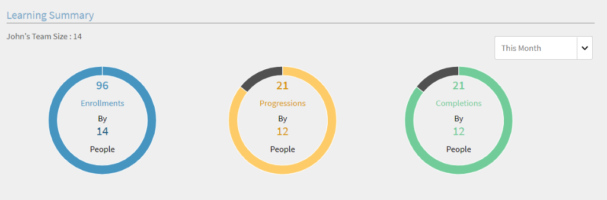
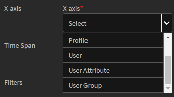

# 보고서

관리자용 보고서 생성 및 관리

Adobe Learning Manager에서는 학습자 활동을 추적, 모니터링 및 제어하는 다양한 보고서를 생성할 수 있습니다. 학습자의 활동이 추적되고 데이터베이스에 자동으로 캡처됩니다. 관리자 및 관리자 보고서는 데이터베이스에서 생성됩니다.

## 개요 {#overview}

책임자와 관리자의 보고서 생성 프로세스는 둘 다 동일합니다. 관리자는 자신의 하위 보고서를 볼 수 있지만 책임자는 조직 전체의 모든 보고서를 볼 수 있습니다.

보고서는 대시보드에서 집계됩니다. 보고서는 대시보드 내에 있어야 합니다. A **기본 대시보드** 이(가) 보고서 페이지에 기본적으로 있습니다. 사용자가 추가한 보고서가 이 기본 대시보드로 이동합니다. 개별 대시보드에 보고서를 추가하려면 드롭다운 화살표를 사용하여 보고서 추가를 선택합니다. 대시보드 작성에 대한 자세한 내용은 이 페이지의 대시보드 섹션을 참조하십시오.

## 관리자 대시보드 {#manager-dashboards}

관리자는 자신의 직접 또는 간접 팀에 대한 정보를 요약으로 볼 수 있습니다.

그런 다음 관리자는 분기별, 이번 달, 지난 3달 및 지난 12개월과 같은 범위에 따라 보고서를 필터링할 수 있습니다.

## 학습 요약 {#learningsummary}

*학습 요약 보기*

*날짜별 학습 요약 필터링*

## 준수 대시보드 {#compliancedashboard}

팀의 규정 준수 여부 및 규정 미준수에 경계가 되는 팀원을 확인합니다. 학습 객체를 선택하고 각 상태를 확인합니다.

*준수 대시보드 보기*

## 스킬 상태 {#skillsstatus}

각 스킬에 대한 학습자의 백분율을 참조하십시오. 학습자 스킬을 확인할 스킬을 최대 5개 선택합니다. 시각화는 누적 막대 차트 형태입니다. 각 막대 위에 마우스를 올리면 해당 스킬 상태를 자세하게 확인할 수 있습니다.

*학습자의 스킬 상태 보기*

## Skils Tracker {#skilstracker}

팀 전체의 스킬 완료 예상치를 참조하십시오. 스킬의 목표 완료율 및 완료일을 선택합니다.

과거 데이터를 바탕으로, 선택한 날짜에 스킬 완료 예상 상황을 그래픽으로 볼 수 있습니다.

*스킬 완료 예상 보기*

## 보고서 만들기 {#creatingreports}

1. 왼쪽 창에서 보고서 를 클릭합니다. 보고서 요약 페이지가 나타납니다.\
   **참고**
기본적으로 보고서 요약 페이지에 최소 3개 이상의 샘플 보고서가 있어야 합니다. 이러한 샘플 보고서만 보고 생성 및 사용자 정의 방법에 대한 아이디어를 얻을 수 있습니다.

1. 보고서 요약 페이지에서 추가를 누릅니다. 보고서 생성 대화 상자가 나타납니다.
1. 보고서 생성을 완료하려면 저장 을 클릭합니다. 다음은 샘플 보고서입니다.

*보고서 추가 대화 상자*

보고서 유형에서 미리 정의된 보고서 세트를 선택하거나 사용자 정의를 선택할 수 있습니다. 미리 정의된 보고서 세트의 일부로 다음 보고서를 볼 수 있습니다.

* 스킬 할당 및 달성
* 강의 등록 및 완료
* 강의 효과
* 학습 프로그램 등록 및 완료
* 강의당 학습 소요 시간
* 분기당 학습 소요 시간

위에서 언급한 보고서 유형을 사용하여 300개 이상의 변형 보고서를 생성할 수 있습니다.

보고서명 보고서의 제목을 입력합니다.

**기본 Y축** 드롭다운 옵션에서 보고서의 첫 번째/기본 기준을 선택합니다. 선택한 기준 중 일부에 대해 인접한 상태 드롭다운 상자에서 하나 또는 여러 상태를 선택할 수 있는 옵션이 있습니다. 예를 들어 강의 등록 통계 기본 기준의 경우 완료, 미완료, 등록 등의 상태가 될 수 있습니다. 기본 범위 데이터는 보고서에 막대 그래프 형태로 표시됩니다.

**보조 Y축** 드롭다운 옵션에서 보고서에 대한 보조 Y축 기준/범위를 선택합니다. 예를 들어 학습 프로그램 등록 옵션의 인접한 상태 드롭다운에서 하나 이상의 상태를 선택합니다. 보조 범위 데이터는 선 그래프 형태로 표시됩니다.

**X축** 드롭다운 옵션에서 보고서에 적합한 X축 기준을 선택합니다. x축을 날짜로 선택한 경우 x축 기준을 일, 월, 분기 및 연도로 그룹화하는 옵션을 사용할 수 있습니다.

**날짜** 드롭다운에서 적절한 옵션을 선택합니다. 옵션: 최근 1개월, 분기, 연도, 분기(최근 90일), 연간(최근 365일) 및 날짜 범위. 일자 범위를 선택하는 경우 다음과 같이 일자: 부터 및 일자: 까지를 입력합니다.

**출처** 보고서를 보려는 시작 날짜를 선택합니다.

**받는 사람** 보고서의 종료 날짜를 선택합니다.

## 필터 {#filters}

필터는 선택한 보고서 유형에 따라 하단의 보고서 추가 대화 상자에 나타납니다. 눈에 띄는 필터 중 일부는 아래에 설명되어 있습니다.

**관리자** 계층 구조를 기준으로 관리자 중 하나를 선택할 수 있습니다. 일부 관리자의 경우 하위 관리자가 있을 수 있으며 각 하위 관리자에게 보고하는 사원이 여러 명 있을 수 있습니다.

**프로필** 직원 지정을 선택합니다. 프로필/지정에 따라 직원 보고서를 보는 데 도움이 됩니다. 예를 들어, 컴퓨터 과학자, 엔지니어 등등.

**사용자 그룹** 보고서를 필터링할 기준 사용자 그룹을 선택합니다. 사용자 기능에서 계정이 정의된 사용자 그룹을 Learning Manager로 가져옵니다.

**강의** 드롭다운에서 선택하면 모든 과정에서 보고서를 필터링할 수 있습니다.

*등록 및 완료한 강의 그래프 보기*

>[!NOTE]
>
>그래프의 범례 위에 확대/축소 상자를 볼 수 있습니다. 확대/축소할 확대/축소 상자 영역 위로 커서를 이동하고 클릭한 다음 크로스바를 드래그할 수 있습니다.

그래프 막대에서 선 형식으로 보조 y축 값을 볼 수 있습니다. 예를 들어 위의 샘플에서는 그래프에 걸쳐 회색 선으로 된 [효과] 값을 볼 수 있습니다.

## 사용자 그룹 보고서 {#user-group-reporting}

부서, 외부 파트너 및 역할과 같은 사용자 그룹이 다른 사용자 그룹과 비교하거나 다른 학습 목표와 비교하여 어떻게 수행되고 있는지 추적합니다.

### 사용자 그룹 {#usergroups}

사용자 그룹을 기반으로 보고서를 생성하려면 **사용자 그룹** 아래 스크린샷과 같이 드롭다운 옵션 목록의 X축

*사용자 그룹 보고서 생성*

다른 항목 **선택** 사용자 계정에 사용할 수 있는 사용자 그룹 목록이 있는 드롭다운이 X축 옆에 나타납니다. 이 드롭다운에서는 하나 또는 여러 사용자 그룹을 선택할 수 있습니다.

이 보고서를 저장하고 생성한 후 여러 사용자 그룹을 선택한 경우, 막대 그래프로 표시된 모든 사용자 그룹이 x축으로 서로 인접한 상태로 보고서가 생성됩니다.

이 사용자 그룹 보고서를 사용하면 한 부서/부서/역할의 성과를 다른 부서/부서/역할과 비교하여 학습 성과를 평가할 수 있습니다.

### 사용자 정의 사용자 그룹/사용자 속성 {#customusergroupsuserattributes}

또한, Learning Manager에서 사용자/사용자 그룹 추가 기능을 사용하여 사용자 정의 사용자 그룹을 생성할 수도 있습니다. 사용자 그룹을 만든 후 위치, 분기 등과 같은 속성 목록을 사용하여 사용자 정의된 사용자 그룹에 대한 보고서를 생성할 수 있습니다.

X축에서 사용자 속성 옵션을 선택하고 다음에서 속성을 선택합니다. **선택** 옆에 있는 드롭다운. 이러한 속성을 기반으로 사용자 정의된 사용자 그룹 보고서를 작성하려면 필터에서 적절한 사용자 그룹을 선택해야 합니다.

관리자는 학습자로 자신의 팀 멤버에 대해서만 사용자 그룹 보고서를 만들 수 있습니다.

## 보고서 유형 {#typesofreports}

* 학습자용 강의 전달 통계
* 강의 효과 보고서
* 학습자 스킬 기반 보고서
* 학습자용 학습 프로그램 등록 통계
* 학습자가 보낸 학습 시간
* 인증 완료

## 내 보고서 {#myreports}

대시보드는 보고서 모음입니다. 보고서는 필요에 따라 대시보드로 그룹화할 수 있습니다.

**샘플 보고서**

이 탭을 누르면 샘플 데이터 포인트를 기반으로 하는 몇 가지 지표 보고서를 볼 수 있습니다. 이러한 보고서를 통해 계정 데이터를 사용하여 생성할 수 있는 다양한 유형의 풍부한 기능 보고서에 대한 아이디어를 얻으십시오.

**내 보고서**

이 게시판 탭을 클릭하면 작성한 모든 게시판을 볼 수 있습니다. 보드 보기 드롭다운 목록에서 기본 보드 또는 작성한 대시보드를 선택할 수 있습니다.

**대시보드 추가**

1. 자체 보드 만들기를 시작하려면 페이지 오른쪽에 있는 &#39;대시보드 추가&#39;를 클릭합니다.

   

   *나만의 보드 만들기*

1. 대시보드의 이름과 설명을 입력하고 를 클릭합니다. **[!UICONTROL 저장]**.

내 대시보드 목록에서 최근에 만든 보드를 볼 수 있습니다.

게시판에 보고서를 추가하려면 게시판 창의 오른쪽 상단 모서리에 있는 드롭다운을 클릭하고 보고서 추가 를 클릭합니다. 이 방법으로 만든 보고서는 대시보드에 연결됩니다.

>[!NOTE]
>
>보고서 페이지의 오른쪽 상단 모서리에 있는 &#39;추가&#39;를 클릭하면 생성된 보고서가 기본 대시보드에 추가됩니다.

**공유된 보고서**

공유 보고서 는 조직 내 다른 사용자가 사용자와 공유한 보고서 컬렉션입니다. 권한이 있으면 공유 보고서를 다운로드하거나 복제할 수 있습니다. 공유 보고서에 대한 다운로드/복제 액세스 권한을 얻으려면 조직의 관리자에게 문의하십시오.

**구독한 보고서**

여기에서 전자 메일 ID를 입력하여 자주 사용하는 보고서에 구독할 수 있습니다. 구독한 보고서는 이메일로 전송됩니다.

다음을 클릭합니다. **편집** 아이콘을 클릭하여 언제든지 구독을 수정할 수 있습니다.

## 보고서 보기 {#viewingreports}

보고서 요약 페이지에서 모든 보고서를 볼 수 있습니다. 각 보고서의 오른쪽 위 모서리에 있는 마이너스(-) 아이콘을 클릭하여 각 보고서를 최소화할 수 있습니다. 보고서를 다시 보려면 + 아이콘을 클릭합니다.

**다른 날짜로 빠르게 보기**

보고서를 보는 데 사용하는 날짜 값은 임시 값입니다. 이 보고서 보기는 다운로드 옵션을 선택할 때 다운로드되지 않습니다. 임시 보기일 뿐입니다.

보고서의 날짜 범위/값을 변경하고 보고서를 수정하거나 저장하지 않고 다른 날짜를 빠르게 볼 수 있습니다. 날짜 범위 옆에 있는 편집 아이콘(아래 스냅샷에 화살표와 함께 표시됨)을 클릭합니다(예: QTD, 최근 1년 등). 드롭다운 메뉴에서 새 값을 선택하고 눈금 표시를 클릭하여 변경 내용을 확인합니다. X 표시를 클릭하여 변경을 취소할 수 있습니다.

**다른 관리자와 함께 빠른 보기**

관리자에게 보고하는 관리자가 여러 명인 경우 각 관리자에 대한 보고서를 빠르게 볼 수 있습니다. 드롭다운 목록에서 관리자 이름을 선택하여 각 관리자에 대해 고유한 보고서를 표시합니다.
**편집/보드로 이동/사본 만들기/삭제/보고서 크기 조정**&#x200B;각 보고서의 오른쪽 상단 모서리에 있는 드롭다운 화살표를 클릭하여 편집/대시보드로 이동/사본 만들기/삭제/크기 조정과 같은 드롭다운 옵션을 봅니다.

<!---->

**편집** 데이터를 수정하는 동안 초기 값으로 돌아가려면 재설정을 누릅니다. 값을 수정한 후 저장 을 클릭합니다.

**대시보드로 이동** 현재 보고서를 대시보드 목록에서 선택한 다른 대시보드로 이동할 수 있습니다.

**사본 만들기** 보고서를 대시보드 목록에서 선택한 동일한 대시보드 또는 다른 대시보드에 복사할 수 있습니다.

**삭제** 삭제 를 클릭하여 보고서를 제거합니다. 보고서를 삭제하기 전에 경고/확인 메시지가 나타납니다.

**크기 조정** 보고서의 크기를 1×1(중간) 및 2×2(대형) 크기로 변경할 수 있습니다.

## 전자 메일 구독 {#emailsubscriptions}

즐겨찾는 보고서를 구독하면 전자 메일로 받을 수 있습니다.

보고서 페이지의 오른쪽 상단 모서리에 있는 &#39;추가&#39; 버튼 옆의 &#39;이메일 구독&#39;을 클릭합니다. 보고서 구독 페이지가 나타납니다.

보고서 필드에 보고서 이름을 입력하여 드롭다운 목록에서 보고서 이름을 선택합니다. 선택한 방식에 따라 매일, 매주, 매월 의 전자 메일 빈도를 선택하고 전자 메일 제목을 추가한 다음 추가 를 클릭하여 구독하십시오.

구독을 수정하려면 편집 을 클릭합니다. 구독을 삭제하려면 [제거]를 클릭하십시오.
