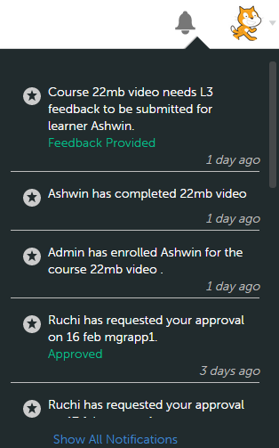

# 사용자 알림

관리자를 위한 사용자 알림 설정

알림 기능은 Adobe Learning Manager 1.0의 모든 사용자에게 적용됩니다. 그러나 각 사용자는 역할에 따라 다양한 시나리오에서 서로 다른 종류의 알림을 받습니다. 모든 경고 및 사용자에게 알림은 알림 팝업 대화 상자를 통해 표시됩니다.

## 액세스 알림 {#accessnotifications}

사용자는 창의 오른쪽 상단 모서리에 있는 알림 아이콘을 클릭하여 알림을 볼 수 있습니다. 관리자 로그인에서 왼쪽 창의 알림 을 클릭하여 이러한 알림에 액세스할 수도 있습니다.

샘플 관리자 알림 스냅샷:

*모든 알림 보기*

이 팝업 창에는 모든 알림의 강조 표시와 함께 스크롤 막대가 나타나는 시간이 표시됩니다. 모든 알림에 대한 자세한 내용을 보려면 팝업 창의 하단에 있는 모든 알림 표시 를 클릭합니다. 알림 페이지가 나타납니다.

관리자는 통지 페이지에서 보류 중인 태스크와 모든 통지를 탭 양식으로 볼 수 있습니다. 보류 중인 작업 알림은 승인, 지명 등을 기준으로 분류됩니다. 모든 알림을 보려면 **[!UICONTROL 모든 알림]** 탭. 모든 알림 탭에서는 날짜와 시간을 기준으로 알림이 정렬되어 나열됩니다.

*보류 중인 모든 작업 보기*

알림 아이콘 상단에 강조 표시된 번호로 최신 알림 수를 알 수 있습니다. 예를 들어 이전 로그인 후 최근 5개의 알림이 있는 경우, 알림 아이콘 상단에 숫자 5가 표시되는 것을 볼 수 있습니다. 이러한 숫자는 모든 최신 알림을 읽으면 사라집니다.

## 강의에 학습자 지정 {#nominatelearnersforcourses}

알림 창에서 위의 스냅샷에 나타난 것과 같이 지정 링크를 클릭합니다. 팝업 대화 상자가 나타납니다. [지정]을 클릭합니다.

*강의에 학습자 지정*

**관리자를 위한 알림 유형**

관리자는 다음 이벤트가 트리거될 때 알림을 받을 수 있습니다.

1. 학습자가 강의 또는 학습 프로그램에 등록합니다
1. 학습자가 강의 또는 학습 프로그램을 완료합니다.
1. 책임자는 학습자를 강의 또는 학습 프로그램에 등록합니다
1. 학습자에게 L3 피드백을 제공하려면 관리자가 필요합니다
1. 강의에 학습자를 지명하려면 관리자가 필요합니다
1. 관리자는 학습자에게 강의를 승인해야 합니다.
1. 관리자는 학습자가 업로드한 인증 증명서를 승인해야 합니다
1. 학습자가 기한 일자가 지나도 강의를 완료하지 않습니다. (이 이벤트는 강의 인스턴스에 대한 알림 미리 알림이 학습자의 관리자에게 에스컬레이션 레벨로 설정된 경우에만 트리거됩니다.)

>[!NOTE]
>
>관리자는 학습자 역할일 때도 알림을 받을 수 있습니다. 자세한 내용은 학습자 알림 을 참조하십시오.

## 피드백 제공 {#providefeedback}

위의 스냅샷과 같이 관리자는 &#39;피드백 제공&#39;을 클릭하여 각 강의 또는 학습 프로그램의 학습자에게 L3 피드백을 제공할 수 있습니다.

>[!NOTE]
>
>학습자와 관리자는 책임자가 특정 강의의 해당 옵션을 활성화했을 때만 강의 피드백 옵션을 이용할 수 있습니다.
