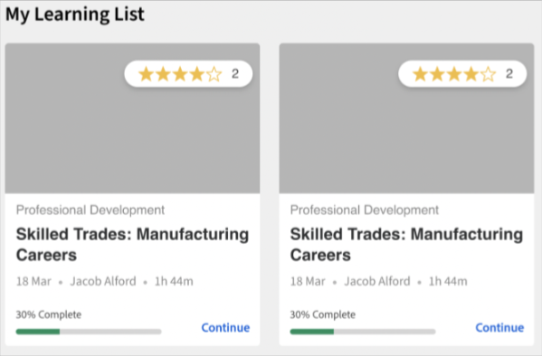

# Adobe Learning Manager 추천

Adobe Learning Manager에 강의에 대한 새롭게 개선된 추천 시스템을 도입했습니다. 이 추천 기능은 AI 알고리즘과 제품, 역할, 레벨 등 사용자의 관심사를 활용해 개인화된 콘텐츠 추천을 제공한다.

새로운 추천 시스템을 사용하면 학습자가 개인화된 추천을 받을 때 선택할 수 있는 사용자 정의 매개 변수를 생성할 수 있습니다. 이러한 추천은 학습자의 홈페이지 피드에 강의, 학습 경로 및 인증으로 표시됩니다.

이 기능을 시작하려면 책임자 앱에서 이 기능을 활성화해야 합니다.

## 권장 사항 활성화 및 구성

1. 강의 및 사용자 데이터를 업로드합니다(선택 사항).
1. 변경 사항을 실시간으로 적용합니다.
1. 권장 사항을 활성화하고 구성한 후 작업을 시작하기 위한 권장 사항을 보려면 데이터를 Adobe Learning Manager에 업로드합니다. 이 데이터는 다음과 같이 구성됩니다.

   * 강의 데이터
   * 사용자 데이터(선택 사항)

## 강의 평가 알고리즘

추천 엔진의 핵심은 Learning Manager의 새로운 기능에 의해 이루어집니다 **[!UICONTROL 강의 순위 알고리즘]**. 이 알고리즘은 5천만 개의 데이터 포인트와 5년간의 누적 학습 데이터를 수백만 명의 사용자에게 사용하여 등록 가능성에 따라 강의 순위를 지정합니다. 이 평가는 등록 가능성이 가장 많은 강의가 학습자 앞에 표시되도록 합니다.

## 주요 용어

Learning Manager의 새로운 AI 기반 추천 엔진은 학습자에게 개인화된 경험을 제작하기 위해 구성 가능한 매개변수 기반 추천 시스템을 학습 리더에게 제공합니다.

매개 변수는 다음과 같습니다. **제품/항목**, **역할**, 및 **레벨**. 또한 이러한 매개 변수의 이름을 필요에 맞게 변경할 수 있습니다. 그래서 &#39;상품&#39;이 &#39;주제&#39;가 될 수도 있고 &#39;역할&#39;이 &#39;지역&#39;이 될 수도 있다.

## 추천 시스템 설정

Adobe Learning Manager의 새로운 추천 엔진은 고객/파트너와 연계된 제품 및 역할에 대한 데이터를 일반적으로 관리자가 사용할 수 있기 때문에(예: 구매 레코드에서) 개인화된 추천 설정과 관련된 관리자 워크플로우를 간소화합니다.

새 추천 엔진 설정에는 주로 세 가지 워크플로우가 포함됩니다.

* 책임자
* 작성자
* 학습자

책임자는 계정의 제품, 역할 및 레벨 매개 변수 값을 구성합니다. 예를 들어, 은행을 주 고객으로 하는 IT 솔루션 공급업체는 &quot;Product&quot; 매개변수를 Payment Gateway, Secure Cloud Storage, Fraud Detection System, Trading Platform 등의 값을 갖도록 구성하고 &quot;Role&quot; 매개변수를 Integration Specialist, Network Administrator, Risk Analyst, Compliance Officer 등의 값을 갖도록 구성할 수 있습니다.

관리자에게는 추천 엔진을 최적으로 설정하고 계정의 사용 사례에 따라 엔진을 사용자 정의할 수 있는 Learning Manager의 안내 작업 과정이 제공됩니다. 또한 책임자는 일회성 CSV 업로드를 통해 PRL 추천을 설정하는 옵션도 사용할 수 있습니다.

1. 선택 **[!UICONTROL Recommendations]** 관리자 앱에서

   

   *Recommendations 옵션 선택*

1. **[!UICONTROL 업그레이드]**&#x200B;를 클릭합니다.

   

   *업그레이드 옵션 선택*

1. **[!UICONTROL 계속]**&#x200B;을 클릭하여 새 추천 시스템으로 업그레이드합니다.

   
   *계속 버튼을 선택합니다.*

1. 제품 및 역할에 대한 추천 매개 변수를 생성합니다.

   
   *추천 매개 변수 만들기*

1. **[!UICONTROL 더 많은 값 추가]**&#x200B;를 클릭합니다.
1. 제품을 추가합니다. 제품의 이름을 입력하고 Enter 키를 누릅니다.

   시작하려면 최소 두 개 이상의 제품을 추가해야 합니다.

   
   *제품 추가*

1. 역할을 추가합니다. 역할의 이름을 입력하고 Enter 키를 누릅니다.

   
   *역할 추가*

1. **[!UICONTROL 계속]**&#x200B;을 클릭합니다.

   이제 제품 및 역할이 매개변수 목록에 표시됩니다.

   
   *제품 및 역할 목록*

## 데이터 준비

권장 사항이 제대로 작동하려면 사용자 관심 데이터, 제품, 역할 및 수준을 업로드해야 합니다.

**데이터 업로드 옵션**

추천 기능은 구성이 가능합니다. 따라서 제품/역할/레벨 대신 주제/역할/레벨을 사용하거나 제품/주제만, 역할만, 제품/주제 및 역할만, 역할-레벨만 또는 제품-레벨만 옵션 중 하나를 선택할 수 있습니다.

선택한 추천 구성에 따라 데이터 시트를 수정합니다.

다음 섹션에서는 제품, 역할 및 레벨 사용의 가장 광범위한 옵션에 관해 설명합니다.

책임자는 미리 정해진 형식으로 사용자 데이터를 업로드해야 합니다. 업로드된 데이터는 추천 알고리즘에 반영되므로 학습자는 자신의 역할 및 레벨에 따라 적합한 강의에 대한 추천을 받을 수 있습니다.

**사전 요구 사항**

추천이 작동하도록 데이터를 업로드하려면 사용자 및 RecommendationLO CSV의 제품, 역할 및 레벨을 채우십시오.

데이터 준비 연습의 일부로 두 개의 CSV 템플릿을 제공합니다.

**RecUser.csv**

* 사용자 ID
* 제품
* 역할
* 레벨(초급, 중급 또는 고급)

다음은 csv 형식의 레코드 예입니다.

| 사용자 ID | 제품 | 역할 | 레벨 |
|--- |--- |--- |--- |
| 123 | 데이터 사이언스 | 분석가 | 분석가: 중급 |
| 456 | 항공 우주 공학 | 기술자 | 기술자: 고급 |

**RecLO.csv**

* 강의/학습 경로
* 교육 유형
* 교육 이름
* 제품
* 역할
* 레벨
* 태그
* 스킬

다음은 csv 형식의 레코드 예입니다.

| 교육 ID | 교육 유형 | 교육 이름 | 제품 | 역할 | 레벨 | 태그 | 스킬 |
|---|---|---|---|---|---|---|---|
| 111 | 강의 | Python 101 | 데이터 사이언스 | 분석가 | 분석가: 중급 | 데이터 | 일반 |
| 222 | 강의 | Julia 101 | 데이터 사이언스 | 분석가 | 분석가: 고급 | 데이터 | 일반 |

해당 CSV를 채우고 고객 성공 팀에 연락하여 형식을 다운로드하고 해당 CSV를 업로드하십시오.

## 추천을 실시간으로 표시

두 CSV가 모두 업로드되었으면 라이브 실행을 클릭합니다. 그러면 새로운 추천 시스템이 학습자에게 표시됩니다.

*권장 사항을 실시간으로 제공*

이제 학습자가 추천 시스템을 사용할 수 있습니다.

## 매개 변수 편집

1. 매개 변수 목록에서 3개 점으로 표시되는 아이콘을 선택하고 **[!UICONTROL 매개 변수 이름 편집]**&#x200B;을 선택합니다.

   

1. 매개 변수 이름을 변경하고 **[!UICONTROL 저장]**&#x200B;을 클릭합니다.

   
   *매개 변수 편집*

## 매개 변수 삭제

1. 매개 변수 목록에서 3개 점으로 표시되는 아이콘을 선택하고 **[!UICONTROL 매개 변수 삭제]**&#x200B;를 선택합니다.

*매개 변수 삭제*

## 강의 설정 페이지

강의 설정 페이지에는 제품 및 역할에 대한 추천이 나열됩니다. 학습자가 해당 제품 및 역할에 관심을 표시한 경우 이 강의를 추천합니다.

*강의 설정 페이지*

## 학습자 보기

PRL 기반 추천이 설정된 계정의 경우 학습자가 학습 플랫폼에 로그인하면 학습자는 안내 워크플로우를 통해 제품, 역할 및 레벨 환경 설정에 기반한 추천을 설정할 수 있습니다. 그러면 추천 엔진이 분석할 학습자 프로필이 생성됩니다.

새로운 추천 시스템으로 전환한 계정의 학습자는 추천 강의와 교육을 볼 수 있습니다.

학습자는 다음을 확인할 수 있습니다.

* 제품, 역할 - 레벨: 학습자에게 제품과 역할, 선택한 각 역할의 레벨을 차례로 선택하라는 메시지가 표시됩니다
* 제품 - 레벨: 학습자에게 제품과 선택한 각 제품의 레벨을 차례로 선택하라는 메시지가 표시됩니다
* 역할 - 레벨: 학습자에게 먼저 역할을 선택한 다음 선택한 각 역할에 대한 레벨을 선택하라는 메시지가 표시됩니다.
* 제품 및 역할: 학습자에게 제품과 역할을 차례로 선택하라는 메시지가 표시됩니다.
* 제품: 학습자에게 제품만 선택하라는 메시지가 표시됩니다.
* 역할: 학습자에게 역할만 선택하라는 메시지가 표시됩니다.

왼쪽 패널에서 추천을 선택하면 학습자에게 추천을 설정하는 팝업이 표시됩니다.

*학습자가 권장 사항을 설정합니다*

추천 설정을 클릭하면 학습자가 제품 선택 팝업으로 이동합니다.

*제품 선택*

그런 다음, 다음 팝업에서 학습자가 역할을 선택할 수 있습니다.

*역할 선택*

그러면 학습자가 레벨을 추가할 수 있습니다.

*레벨 선택*

## 학습자 앱에서의 학습 스트립

학습자는 앱에서 다음의 스트립을 확인할 수 있습니다.

* 내 학습 스트립
* 달력, 소셜 및 게임화 위젯이 있는 스트립
* 내가 저장한 항목 스트립
* 관련성이 매우 높은 스트립
* 제품 스트립 - 1
* 제품 스트립 - 2
* 검색 스트립
* 책임자 추천 스트립
* 카탈로그 스트립별로 탐색

### 내 학습 스트립의 카드

*학습 스트립의 카드*

각 카드에는 등급과 카드 이미지, 제목, 스킬, 게시 날짜, 작성자, 지속 시간, 진행률 표시줄 및 계속 또는 탐색 단추가 있습니다.

### 내 스트립으로 저장된 카드

*저장된 카드*

각 카드에는 등급과 카드 이미지, 제목, 스킬, 게시 날짜, 작성자, 지속 시간, 진행률 표시줄 및 시작 또는 탐색 또는 계속 또는 재방문 단추가 있습니다.

학습자가 강의를 시작한 후에는 카드에 진행률 표시줄이 표시되지 않습니다. 학습자는 강의 저장을 취소할 수도 있습니다.

### 슈퍼 관련 스트립의 카드

*관련 카드*

각 카드에는 등급과 카드 이미지, 제목, 스킬, 게시 날짜, 작성자, 지속 시간, 진행률 표시줄 및 시작 또는 탐색 또는 계속 또는 재방문 단추가 있습니다.

학습자가 강의를 시작한 후에는 카드에 진행률 표시줄이 표시되지 않습니다.

메뉴에는 두 가지 옵션이 있습니다 **[!UICONTROL 저장]** 및 **[!UICONTROL 추천 안 함]**. 학습자가 **[!UICONTROL 저장]**, 강의가 &#39;내가 저장한&#39; 스트립에 저장됩니다. 학습자가 **[!UICONTROL 추천 안 함]**, 권장 교육이 목록에서 제거됩니다.
