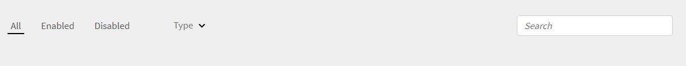

# Adobe Learning Manager 릴리스 정보

<!--<table>
 <tbody>
  <tr>
   <td></td>
   <td>
    
<a href="https://business.adobe.com/products/learning-manager/adobe-learning-manager.html">Adobe Learning Manager</a> was launched in August 2015. As part of our continuous improvement efforts to enhance the product, we have been rolling out regular updates. Read on to know the features enhanced/issues fixed in update releases. 
</td>
  </tr>
 </tbody>
</table>-->

+++업데이트 101: Adobe Learning Manager 2025년 6월 릴리스

## 역할 기반 전자 메일 템플릿

### 대상자

전자 메일 템플릿을 관리하는 관리자 및 작성자

### 개요

책임자 또는 작성자는 수신자의 역할, 학습자, 관리자 또는 강사를 기반으로 이메일 템플릿을 활성화하거나 비활성화할 수 있습니다. 학습자와의 커뮤니케이션 유형 및 빈도를 보다 효과적으로 제어할 수 있습니다.

### 사용 사례

* 관리자와 작성자는 학습자에게 통지하지 않고 전자 메일을 보내야 합니다(예: 학습자 등록).
* 특정 역할에 대한 전자 메일을 일괄 활성화하거나 비활성화하는 옵션(예: 관리자에게 보내는 모든 전자 메일 비활성화).

### 기존 워크플로우

강의 등록과 같이 학습자에게 전자 메일을 보내려고 하지만 관리자가 아닌 경우 현재 템플릿에서는 모든 역할에게 전자 메일을 보냅니다.

### 새로운 기능

* 전자 메일 템플릿 UI에서 역할 기반 전환을 수행합니다.
* 특정 역할에 대한 대량 활성화/비활성화
* 템플릿당 역할에 대한 가시성.

자세한 내용은 이 [문서](/help/migrated/administrators/feature-summary/email-templates.md#enable-or-disable-email-at-a-role-level)를 참조하세요.

## 강의를 완료한 학습자를 위한 콘텐츠 버전 제어 개선

### 개요

완료한 강의의 콘텐츠 모듈이 최신 버전으로 업데이트되어도 이미 강의를 완료한 학습자는 백그라운드에서 업데이트된 모듈 버전을 계속 수신하게 됩니다. 업데이트된 콘텐츠가 자신에게 적합하지 않기 때문에 강의를 다시 방문하려고 하면 예기치 않은 동작이 발생합니다.

### 기존 동작

작성자가 강의 콘텐츠를 새 버전으로 업데이트하고 아직 강의를 시작하지 않은 학습자에게만 적용하도록 선택하면 Adobe Learning Manager은 이미 완료한 학습자의 모듈 버전을 계속 업데이트했습니다. 그 결과 이들 학습자는 원래의 콘텐츠에 제대로 액세스할 수 없었습니다.

이러한 향상된 기능을 통해 강의 모듈을 업데이트하고 아직 시작하지 않은 학습자에게만 적용하도록 설정하면 이미 강의를 완료한 학습자는 원래 버전에 중단 없이 계속 액세스할 수 있습니다.

### 변경된 내용

이제 Adobe Learning Manager은 작성자에게 콘텐츠 업데이트를 관리하는 더 명확한 옵션을 제공합니다. 작성자는 강의에서 이미 사용할 수 있는 콘텐츠를 업데이트할 수 있습니다. 새 버전이 추가되면 콘텐츠 옆에 버전 번호가 표시됩니다.

책임자가 업데이트된 콘텐츠가 있는 강의를 방문하면 새 버전 옆에 업데이트 버튼이 표시됩니다. 또한 관리자에게는 새로운 콘텐츠 버전이 학습자에게 적용되는 방법을 선택하기 위한 명확한 업데이트 옵션이 표시됩니다.

| 학습자 상태 | 지금 업데이트 | 최종 업데이트 | 업데이트가 시작되지 않음 |
|---|---|---|---|
| 등록되지 않음 | V2 | V2 | V2 |
| 아직 시작하지 않음 | V2 | V2 | V2 |
| 진행 중 | V2 * | V1 → V2 * | V1 |
| 완료됨 | V2 * | V2 * | V1(유지됨) |

(*) 버전이 업데이트될 때 모듈이 재설정됨을 나타냅니다.

업데이트가 시작되지 않으면 이미 강의를 완료한 학습자에게 원래 콘텐츠 버전(V1)이 계속 표시됩니다. 이렇게 하면 예기치 않은 재생 문제가 발생하지 않으며 완료한 과정을 다시 방문하는 학습자에게 일관된 환경이 보장됩니다.

### 콘텐츠 업데이트 옵션

관리자가 **[!UICONTROL 업데이트]**&#x200B;를 클릭하면 다음 옵션 중에서 선택할 수 있습니다.

* **[!UICONTROL 지금 모든 학습자 업데이트]**: 모든 학습자에게 콘텐츠 업데이트를 즉시 적용합니다. 시작되지 않음, 진행 중 및 완료됨 학습자가 새 버전으로 즉시 이동합니다.
* **[!UICONTROL 모든 학습자 업데이트]**: 모든 학습자에 대한 업데이트를 단계적으로 적용합니다. 시작되지 않음 및 완료한 학습자는 이제 새로운 버전을 받습니다. 진행 중 학습자는 현재 버전을 완료하면 업데이트를 받습니다.
* **[!UICONTROL 시작되지 않은 학습자만 업데이트]**: 아직 강의를 시작하지 않은 학습자에게만 업데이트를 적용합니다. 진행 중 및 완료한 학습자는 원래 버전을 유지합니다.

### 사용자 인터페이스 변경 사항

| 이전 레이블 | 새 옵션 |
|---|---|
| 모든 학습자에게 콘텐트 업데이트 적용 | 지금 모든 학습자 업데이트:모든 학습자에 대한 콘텐츠 업데이트 적용 |
| 아직 시작하지 않은 학습자 업데이트 적용 | 시작되지 않은 학습자만 업데이트: 시작되지 않은 학습자만 콘텐츠 업데이트를 적용합니다 |
| 진행 중인 학습자는 완료 후 업데이트를 받습니다. | 모든 학습자 최종 업데이트: 모든 학습자에 대한 콘텐츠 업데이트를 최종 적용합니다 |

<!--
_Content update options_-->

콘텐츠 라이브러리에 대한 자세한 내용은 이 [문서](/help/migrated/authors/feature-summary/content-library.md#content-version-control-for-learners-who-have-completed-a-course)를 참조하십시오.

## Fluidic Player 개선 사항

이 릴리스에서는 최신 모양과 보다 직관적인 학습 경험을 갖춘 새롭게 업데이트된 Fluidic Player를 Adobe Learning Manager에 제공합니다. 업데이트된 플레이어에는 더 깔끔한 인터페이스, 개선된 내비게이션 컨트롤, 데스크탑 및 모바일 장치에서 일관된 디자인이 포함됩니다. 학습자는 세로, 가로, 전체 화면, 표준 보기 등 모든 화면 모드에서 콘텐츠에 쉽게 액세스하고 상호 작용할 수 있습니다.

* **Fluidic Player 스킨 새로 고침**: 업데이트된 UI 요소를 사용하여 현대화된 모양입니다.
* **개선된 탐색 컨트롤**: 더 나은 학습자 경험을 위해 더 매끄럽고 직관적인 탐색을 제공합니다.
* **최적화된 디자인**: 데스크탑과 모바일 장치에서 향상된 모양과 사용 편의성은 세로, 가로, 전체 화면 및 표준 화면 모드를 지원합니다.

기본 경험이든 헤드리스 경험이든 상관없이 Adobe Learning Manager을 통해 콘텐츠에 액세스하는 모든 학습자는 이러한 새로운 UI 및 탐색 개선 사항을 자동으로 보게 됩니다. 학습자는 업데이트된 레이아웃 및 컨트롤로 인해 플레이어와 상호 작용하는 방법이 약간 변경될 수 있습니다.

>[!NOTE]
>
>이 개선 사항은 정적 콘텐츠에만 사용할 수 있습니다.

Fluidic Player에 대한 자세한 내용은 이 [문서](/help/migrated/learners/feature-summary/fluidic-player.md)를 참조하십시오.

## 이 릴리스에서 수정된 버그

* 콘텐츠 모듈을 새 버전으로 업데이트한 후 강의를 완료한 학습자가 강의를 다시 방문할 때 흰색 화면이 표시되는 문제를 수정했습니다.

+++

+++업데이트 100: Adobe Learning Manager 2025년 5월 릴리스

**출시일**: 2025년 5월 10일

## 이 릴리스의 새로운 기능

자세한 내용은 [Adobe Learning Manager의 새로운 기능](/help/migrated/whats-new.md)을 참조하십시오.
+++

+++업데이트 99: Adobe Learning Manager 2025년 2월 릴리스

## SAML을 통해 인터페이스 언어 설정

이제 Adobe Learning Manager(ALM)에서 언어에 대한 SAML 속성을 허용합니다. 그런 다음 이 속성이 사용자의 인터페이스 및 콘텐츠 언어 설정에 매핑되어 선호하는 언어로 LMS와 원활한 상호 작용을 보장합니다. 이러한 언어 설정의 구성은 SSO(Single Sign-On)용 SAML을 사용하는 IAM(Identity and Access Management) 플랫폼을 통해 관리됩니다. 이렇게 하면 SP(서비스 공급자) 시작 로그인과 IdP(신원 공급자) 시작 로그인을 모두 지원하여 사용자가 선택한 언어로 인터페이스와 콘텐츠를 볼 수 있습니다.

자세한 내용은 이 [문서](/help/migrated/administrators/feature-summary/set-up-interface-language-through-saml.md)를 참조하세요.

## 마이그레이션 API 개선 사항

이전에는 API(`GET /bulkimport/cansync` 및 `POST /bulkimport/startrun`)를 사용하여 마이그레이션된 외부 링크가 있는 활동 모듈이 링크에 액세스한 후 학습자에게 **[!UICONTROL 완료로 표시]** 옵션을 표시하지 않았습니다. 이 문제는 수정되었습니다. 이제 API를 통해 마이그레이션된 외부 링크가 있는 활동 모듈이 학습자용 **[!UICONTROL 완료로 표시]** 옵션을 올바르게 표시합니다.

## 학습자 앱의 정렬 기능

학습자 앱의 정렬 기능은 콘텐츠 및 인터페이스 언어를 기반으로 개인화된 강의 추천 항목을 제공합니다. &#x200B; 이 개선은 학습자가 선호하는 언어로 강의를 찾고 보다 지능적인 정렬 옵션을 활용하는 프로세스를 간소화합니다.

자세한 내용은 이 [문서](/help/migrated/learners/feature-summary/catalogs.md#sorting-functionality-in-the-learner-app)를 참조하세요.

+++

+++업데이트 98: Adobe Learning Manager 2024년 11월 릴리스

**출시일**: 2024년 11월 16일

## 이 릴리스의 새로운 기능

자세한 내용은 [Adobe Learning Manager의 새로운 기능](/help/migrated/whats-new-nov-24.md)을 참조하십시오.
+++

+++업데이트 97: Adobe Learning Manager 2024년 7월 릴리스

**출시일:** 2024년 7월 13일

## 이 릴리스의 새로운 기능

자세한 내용은 [Adobe Learning Manager의 새로운 기능](/help/migrated/whats-new-july-2024.md)을 참조하십시오.
+++

+++업데이트 96: Adobe Learning Manager 2024년 3월 릴리스

**릴리스 날짜:** 2023년 3월 1일

## 이 릴리스의 새로운 기능

자세한 내용은 [Adobe Learning Manager의 새로운 기능](/help/migrated/whats-new-march-2024.md)을 참조하십시오.
+++

+++업데이트 95: Adobe Learning Manager 2023년 11월 릴리스

**출시일:** 2023년 11월 18일

## 이 릴리스의 새로운 기능

자세한 내용은 [Adobe Learning Manager의 새로운 기능](/help/migrated/whats-new-november-2023.md)을 참조하십시오.
+++

+++업데이트 94

**릴리스 날짜:** 2023년 8월 23일 목요일

## 이 업데이트의 새로운 기능

* 비디오 품질을 변경하려면 플레이어의 톱니바퀴 아이콘을 선택합니다.
* 소셜에서 비디오의 품질과 속도를 변경합니다.
+++

+++업데이트 93: Adobe Learning Manager 2023년 7월 릴리스

**출시일:** 2023년 7월 10일

이 릴리스의 새로운 기능

### 개선된 추천

Adobe Learning Manager에 강의에 대한 새롭게 개선된 추천 시스템을 도입했습니다. 이 추천 기능은 AI 알고리즘과 제품, 역할, 레벨 등 사용자의 관심사를 활용해 개인화된 콘텐츠 추천을 제공한다.

### 다중 등록

Adobe Learning Manager의 이번 릴리스에서는 학습자가 하나 이상의 기간에 둘 이상의 강의 인스턴스에 등록할 수 있도록 하는 학습자용 다중 등록을 도입합니다.

### Exavault 커넥터 사용 중단

이번 Adobe Learning Manager 릴리스에는 AWS Transfer 제품군의 SFTP 프로토콜을 사용하는 새 커넥터가 포함됩니다.

자세한 내용은 [Adobe Learning Manager 2023년 7월 릴리스의 새로운 기능](/help/migrated/whats-new-2023-july.md)을 참조하세요.
+++

+++업데이트: 92

**릴리스 날짜:** 2023년 6월 23일

**이 업데이트에서 수정된 버그**

* 모듈을 완료한 후 등급 API가 자동으로 트리거되지 않으므로 녹색 눈금 표시가 사용자 인터페이스에 예상대로 표시되지 않습니다.
* 학습 경로 또는 인증에서 몇 가지 모듈을 완료한 후 성공적인 완료를 나타내는 녹색 눈금 표시가 예상대로 표시되지 않습니다.
* 잘못된 필드가 있는 사용자 CSV를 업로드한 후 Adobe Learning Manager가 예상대로 실행되지 않습니다.
* 관리자에게 문의하는 방법에 대한 경고 팝업에는 다른 이메일 주소도 표시됩니다.
* 학습자가 획득한 모든 배지가 응답에 표시되지 않습니다.
* 사용자 등록 중에 &#39; &#39;의 사용자 이름을 수락해야 합니다.

#### 플레이어

* 비디오 재생 시 화면 해상도를 선택할 수 있는 메뉴를 추가합니다.
+++

+++업데이트 91

**릴리스 날짜:** 2023년 6월 1일 금요일

### 커넥터

* Adobe Connect 커넥터는 CSRF 토큰을 전송하기 위해 API가 필요합니다. 자세한 내용은 Adobe Connect 계정 보안 향상 을 참조하십시오.

### 문자열 변경

* 학습자가 받은 교육을 기반으로 이 교육을 평가 강의, 이 학습 경로 평가 또는 이 인증 등급을 매기도록 문자열의 이름을 변경했습니다. 교육 유형에 따라 학습자는 문자열을 적절히 볼 수 있습니다.

### 이번 업데이트에서 수정된 문제

* Play Store의 Adobe Learning Manager 모바일 앱 설명에 학습자가 오프라인으로 강의를 수강할 수 있다는 잘못된 설명이 표시됩니다.
* linkedIn에서 Adobe Learning Manager으로 콘텐츠(module_version.csv 및 course_module.csv)를 마이그레이션할 때 문제가 발생했습니다.
* 계정이 비활성 상태이고 3년 이상 전에 생성된 경우, 계정의 모든 사용자는 사용자 상태에 관계없이 GDPR로 삭제됩니다.
* 강사 앱에서 세션의 대기자 명단 제한을 0으로 설정하고 세션을 저장하면 사용자 인터페이스에서 0 대신 &quot;적용할 수 없음&quot;으로 잘못 표시됩니다.
* Power BI 커넥터의 학습자 성적 증명서를 생성할 때 교육 또는 모듈 지속 기간(분) 열에 특정 강의실 또는 VC 모듈에 대해 null 값이 표시됩니다.
* 인스턴스 또는 여러 인스턴스의 학습자에 대해 강의를 완료로 표시하면 현재 인스턴스의 학습자뿐만 아니라 강의에 있는 모든 학습자가 완료로 표시됩니다.
+++

+++업데이트 90

**출시일:** 2023년 4월 4일

### 이번 업데이트에서 수정된 버그

SSO 로그인 URL에 entity_id 가 있으면 SAML 로그인이 실패합니다.
+++

+++업데이트 89: Adobe Learning Manager 2023년 3월 릴리스

**출시일:** 2023년 4월 4일

### 이 업데이트의 새로운 기능

**ILT(Instructor Led Training) 환경의 개선 사항**

ILT(Instructor-Led Training) 경험에 대한 몇 가지 개선 사항이 적용되었습니다. 향상된 주요 기능으로는 위치를 기반으로 강의실 세션을 필터링하는 기능, 진행률을 잃지 않고 인스턴스(VILT)를 전환하는 기능, 강사 및 강의실 예약 시 충돌을 관리할 수 있는 새로운 &#39;예약 도우미&#39;, 강사에게 &#39;스킬&#39;을 첨부하고 스킬을 기반으로 강사를 선택할 수 있는 기능이 있습니다.

**관찰 체크리스트 개선 사항**:

작성자는 이제 &quot;관리자&quot; 및 &quot;스토어 관리자&quot;를 체크리스트의 관찰자로 선택할 수 있습니다. 관리자는 강사로 역할을 전환하지 않아도 관리자 인터페이스에서 체크리스트를 확인하고 완료할 수 있습니다. 체크리스트가 할당되면 관리자에게 알림이 전송됩니다.

**앱/스마트폰 카메라를 사용하여 Learning Manager QR 코드 스캔**

학습자는 이제 모든 QR 코드 스캔 앱이나 스마트폰 카메라를 사용하여 Learning Manager에서 생성한 강의 등록, 완료 등에 대한 QR 코드를 스캔할 수 있습니다.

**보고 개선 사항**

새로운 강사 활용률 보고서, 교육 재방문 보고서, 작업 지원 보고서 및 기타 보고 개선 사항.

**&#39;하이브리드&#39; 세션 지원**

이제 Adobe Learning Manager에서 &quot;하이브리드&quot; ILT(강사 주도 교육) 세션을 만드는 기능을 지원합니다. 선택 위치 정보로 가상 ILT 세션을 생성할 수 있으므로 학습자는 가능한 경우 해당 위치에서 직접 세션에 참석할 수 있습니다.

**강의실 및 가상 ILT에 대한 더 나은 진행률 추적**

강의실 및 가상 ILT 모듈은 이제 학습자의 출석 상태와 함께 퀴즈 상태(합격 또는 불합격)를 보고할 수 있는 기능을 제공합니다. 따라서 출석과 퀴즈 합격 여부 모두 학습자의 진행률을 결정하는 요인이 될 수 있습니다.

**Microsoft Teams용 Adobe Learning Manager 앱**

Microsoft Teams에서의 새로운 Adobe Learning Manager 앱은 작업 흐름에서 학습을 촉진하고 소셜 학습을 향상하도록 설계되었습니다. 학습자는 브라우저를 전환하지 않아도 Microsoft Teams 플랫폼에서 학습 콘텐츠에 액세스할 수 있습니다. MS Teams에서의 Adobe Learning Manager 앱 베타 릴리스는 CSAM에게 문의하십시오.

### 이번 업데이트에서 수정된 문제

**강의**

* 사용자 정의 작성자는 강의가 &quot;UNDER_CONSTRUCTION&quot; 상태일 때 모듈을 미리볼 수 없습니다. 응답에 오류 404가 표시됩니다.
* 강의 제목이 특정 문자 제한을 초과할 경우 작성자 앱의 강의/추가 페이지에 있는 강의 제목이 오버플로됩니다.

**작성자**

* 작성자 앱에서 강의의 제목(긴 경우)이 강의를 만드는 동안 페이지 경계를 초과합니다.
* 가끔 작성자가 선택되지 않은 강의가 추가되기도 합니다.

**대시보드 보고서**

* 인터페이스 언어가 영어이면 도구 설명이 제대로 표시되지만 인터페이스 언어가 다르면 콘솔 오류가 발생합니다.
* 학습자 대시보드에서 &#39;필수&#39;를 &#39;필수&#39;로 변경합니다.

**강사 앱**

* 강사 앱의 시간 형식이 다른 앱과 일치하지 않습니다.

**소셜**

* 특정 게시물 유형의 경우, 소셜 게시판이 예상한 대로 열리지 않습니다.

**관리**

* 사용자 정의 역할이 있는 사용자는 강의를 미리 볼 때 리소스를 다운로드할 수 없습니다.

**전자 메일 템플릿**

* 학습자가 강의실/VC 강의가 포함된 학습 프로그램 등록을 취소하면 취소 전자 메일을 수신하지 않습니다.

**작업 지원**

* 작업 지원 위젯에서 강의 이름을 볼 수 없습니다.

**게시**

* 모듈이 ALM에 게시되면 Adobe Captivate에 추가된 모듈 설명이 Learning Manager에 표시되지 않습니다.

**활성 필드**

* 많은 수의 기록이 포함된 CSV를 처리 중인 경우 상당한 시간이 소요되며, 이 시간 동안 사용자가 로그인하여 속성 중 하나에 대한 값을 입력하면 새 사용자 그룹이 생성되어 CSV 오류가 발생할 수 있습니다. 이 문제를 해결하려면 CSV 가져오기가 진행 중일 때 활성 필드 속성 팝업 메시지가 비활성화되고 CSV 업로드가 완료되면 다시 활성화됩니다.
* 사용자 csv 파일의 열이 외부 사용자 활성 필드와 동일한 이름을 가지면 csv 업로드가 실패합니다.

**API 관련 수정**

* learningObjects 응답에서 책갈피 특성이 누락되었습니다.
* 삭제된 사용자에 대한 oauth 새로 고침 토큰을 생성하는 동안 액세스 항목이 생성됩니다.
* LO API는 핵심 콘텐츠와 함께 강의 유형을 계산하기 위해 사전 작업 모듈을 고려했기 때문에 잘못된 loFormat을 반환합니다.

**이 업데이트의 알려진 문제**

* 학습자 카탈로그의 공유 버튼이 Safari 브라우저, 모바일 및 iPad MS Teams 앱에서 예상대로 작동하지 않습니다.
* 다른 컴퓨터에서 앱을 제거하고 나면 활동 탭에 알림이 표시되지 않습니다.
iPhone 14 앱의 활동 탭에서 알림을 클릭해도 아무 동작도 수행되지 않습니다.
* MS Teams 앱에서 Learning Manager 알림(완료됨, 등록됨, 기한 및 기한 지남)은 활동 탭에 상태 및 강의 이름을 표시하지 않습니다.
* 통합 관리자가 MS Teams 앱을 승인하지 않으면 XML 콘텐츠를 포함한 팝업이 표시됩니다.
* MS Teams의 Adobe Learning Manager 앱에 있는 사용자 인터페이스 언어는 언어가 변경될 때 예상대로 변경되지 않는 경우가 있습니다.
* 초점이 Iframe(홈 및 카탈로그 탭) 내에 있는 경우 첫 번째 알림과 상호 작용할 수 없습니다.

**Adobe Learning Manager 모바일 앱의 제한**

* 오프라인 콘텐츠 보기
* 카탈로그/내 학습 페이지의 눈금/목록 보기
* 강의 수강을 여러 번 시도
* 강의 카드의 등록 기한
* iOS 디바이스에서 앱이 전경에 있을 때 푸시 알림이 표시되지 않습니다.
* 푸시 알림의 딥 링크는 원하는 랜딩 페이지로 리디렉션되지 않습니다.
* 관심 등록 버튼을 클릭하면 웹으로 리디렉션됩니다.
* 소셜 학습에서 회신하거나 댓글을 다는 동안 파일을 첨부할 수 없습니다.
* LinkedIn 학습에 로그인할 수 없습니다.
+++

+++업데이트 88

**릴리스 날짜:** 2023년 3월 7일

### 이 릴리스의 성능 개선 사항

학습자를 일괄 등록하면 각 학습자에 대해 생성된 로그 파일이 없습니다.
대규모 계정에 대한 학습 계획 처리가 최적화되었습니다. 이렇게 하면 검색 문제나 지연이 발생하지 않습니다.
+++

+++업데이트 87

**릴리스 날짜:** 2023년 3월 1일

## 이번 업데이트에서 수정된 버그

* CR/VC 모듈이 등록된 강의에서 제거된 경우 학습자에게 세션 취소 전자 메일이 전송되지 않습니다.
* GetNotificationData를 GET에서 POST으로 변경합니다. 원래 구현에서 **IllegalArgumentException: 요청 헤더가 너무 큼** 오류가 발생하여 알림이 실패했습니다.
+++

+++업데이트: 86

**출시일:** 2023년 2월 17일

### 이 릴리스에서 해결한 버그

학습자 앱에서 일부 로케일 설정 문제로 인해 사용자 및 사용자 그룹 검색이 실패합니다.
+++

+++업데이트 85

**출시일:** 2023년 2월 13일 화요일

### 이번 업데이트에서 변경된 사항

GET learningmanagerapi/v2/learningObjects에서 언어를 필터링하는 동안 4개의 문자 언어 코드에 대한 지원이 추가되었습니다.

### 이번 업데이트에서 수정된 버그

일부 로케일의 경우 잘못된 결과가 반환됩니다.
강의에 동일한 로케일의 변형이 두 개 이상 있는 경우 강의 메타데이터를 덮어씁니다.
+++

+++업데이트 84

**출시일:** 2023년 2월 2일 금요일

### 이번 업데이트에서 변경된 사항

**작업 지원 보고서**

이 업데이트는 계정의 모든 작업 지원을 나열하는 새 작업 지원 보고서를 제공합니다.

**버전 제어**

강의를 생성하는 동안 리소스를 추가할 때 리소스에 대한 버전 제어를 추가했습니다.

**시도 보고**

모든 교육에 대한 학습자의 전체 재시도 및 재방문 보고서를 확인할 수 있습니다.

**모듈 재설정 API**

이제 책임자는 모듈 재설정 API를 사용하여 모듈을 재설정할 수 있습니다. 자세한 내용은 [Adobe Learning Manager API 참조](https://captivateprime.adobe.com/docs/primeapi/v2/)를 참조하십시오.

**전자 메일 템플릿**

이제 일부 전자 메일 템플릿에 필수 구성 요소를 추가할 수 있습니다.

**기타 변경 내용**

* 관리자 승인 강의를 필수 구성 요소로 추가할 수 있습니다.
* 학습 요약 대시보드를 새로 고침할 때 성능이 개선되었습니다.
* 바운스 보고서를 전송하기 전 전자 메일 ID 및 계정 ID를 확인합니다.

### 이번 업데이트에서 수정된 버그

* 강의 개요 페이지에 중복 작성자 이름이 표시됩니다.
* 개정 생성 페이지의 하이퍼링크가 오류 404로 연결됩니다.
* 체코어 로케일이 플레이어 설정에 제대로 반영되지 않았습니다.
* 경우에 따라 진행 중 및 아직 학습을 시작하지 않은 학습자에게 스킬이 정의되지 않은 것으로 표시됩니다.
* 여러 날에 걸쳐 소요된 시간은 학습자 성적 증명서 및 등록 보고서에 소요된 서로 다른 시간을 표시합니다.
* 강의 > L2 퀴즈 점수 > 질문별 탭 및 출석 및 점수 의 책임자 및 관리자 프로필에 대해 뒤로 버튼이 응답하지 않습니다.
* 일부 로케일의 경우, 전자 메일 템플릿에서 전자 메일 본문의 일부 컨텐츠가 누락되었으며 템플릿의 언어 번역이 일치하지 않습니다.
+++

+++업데이트 83

**출시일:** 2023년 1월 18일

### 이번 업데이트에서 변경된 사항

**새 열**

새 열 **unenrollmentAllowed**&#x200B;이(가) course.xlsx에 추가되었습니다. 이 설명서에서 파일을 다운로드합니다.

**Linkedin Learning 커넥터**

LinkedIn Learning 커넥터의 경우 [필터] 페이지에 [학습자가 등록 취소할 수 있음] 확인란이 새로 도입되었습니다. 자세한 내용은 [LinkedIn Learning 커넥터](/help/migrated/integration-admin/feature-summary/connectors.md)를 참조하십시오.

### 이번 업데이트에서 수정된 버그

* 막대 차트에 마우스를 가져가면 대시보드 보고서 도구 설명이 예상대로 나타납니다.
* 사용자 활동 아래 보고서에서 학습 소요 시간 보고서는 일별/월간 데이터에 대해 잘못된 데이터를 표시합니다.
* 경우에 따라 퀴즈 점수 그래프에 잘못된 값이 표시됩니다.
* 다중 시도가 설정된 SCORM 콘텐츠 강의에서 학습자가 강의를 시도하면 재방문 단추가 비활성화됩니다.
* 경우에 따라 학습자를 강의에 등록하고 전자 메일 감사 로그를 다운로드하면 전자 메일이 전송되지만 로그에 표시되지 않습니다.
* 강사 일정 초대는 주제에 텍스트 강사를 포함해야 합니다.
* 교육 카드 아이콘은 강의 개요 페이지의 관련 강의 추천 및 학습 경로 카드에 반영되지 않습니다.
* 학습자 홈페이지 설정에서 내가 저장한 섹션을 추가합니다.
* 특정 계정의 경우 Adobe ID가 필요한 계정에 대해 SSO 로그인을 요청하는 메시지가 사용자에게 표시됩니다.
* 일광 절약 시간대에서 &#39;start_time&#39; 필드는 실제 시작 날짜 및 시간의 시차가 아닌 현재 시차를 기준으로 계산됩니다. 이로 인해 시간이 잘못된 초대가 발생했습니다.
* 인증이 다시 실행될 때마다 기본 강의의 복사본이 데이터베이스에 내부적으로 생성됩니다. 그러면 예상 동작과 달리 검색 창에 해당 강의가 표시됩니다.
* CSV 업로드에 실패하면 전자 메일 알림을 수신하지 않습니다.
* 활성 필드의 이름이 긴 경우, 끌어다 놓으면 이름이 사라집니다. 그런 다음 저장 버튼도 예상대로 작동하지 않습니다.
* 세션 보고서의 첫 번째 사용자가 활동 점수표에 의견이 null인 기록이 있는 경우 보고서가 강의 출석 및 채점 페이지를 통해 내보내지지 않습니다.
* 책임자 계정을 사용하여 배지를 검색하면 목록이 제대로 정렬됩니다. 그러나 학습자에게 동일한 작업을 수행하면 결과가 정렬되지 않습니다.
* 검색 결과에서 강의를 선택한 다음 뒤로 버튼을 사용하여 검색 결과로 돌아가려고 하면 검색 결과가 사라집니다.
* 일부 사용자가 사용자 그룹에 세션의 강사로 추가되지 않습니다.
* 템플릿에 여러 사용자 템플릿이 있고, 해당 제목이 일부 값으로 재정의됩니다.
+++

+++업데이트 82

**출시일:** 2022년 12월 15일

* 이제 GET LO API에 가격 정보(제공 가능한 경우)가 포함됩니다.
* 새로운 열( Completed by )이 LT 보고서에 추가되었습니다. 이를 통해 책임자는 LO 소스 완료를 식별할 수 있습니다.
* 학습자의 참석 여부와 함께 합격/불합격 상태를 기록할 수 있는 새 ILT 모듈을 추가했습니다. 강사는 이제 학습자가 합격 또는 불합격으로 참석했는지 옵션을 통해 표시할 수 있습니다.
* 이제 관리자는 학습자가 다음 모듈/강의를 시작하기 전에 완료 및 합격하는 것을 요청할 수 있습니다. 기본 요건(주문한 코스 및 LP)에 적용됩니다.

**버그 수정**

* 인도네시아 언어 문제(사이드바 및 바닥글에서 몰입감 있는 모바일 경험)를 해결했습니다.
* 모듈 미리 보기와 관련된 몰입형 보기 버그를 수정했습니다.
* 관리자 및 작성자의 코스 검색은 입력한 것과 다른 로케일의 결과를 반환합니다.
* 환영 이메일 템플릿에 대한 변경사항이 편집 후에 저장되지 않는 버그를 수정했습니다.
* 다른 이메일 ID 및 Adobe ID를 가진 사용자는 모바일 앱에서 로그인할 수 없는 버그를 수정했습니다.
* Zoom/BJ VC 세션에 참여하는 중에 사용자를 잘못 식별했습니다.
+++

+++업데이트 81 - Adobe Learning Manager 2022년 11월 릴리스

**출시일:** 2022년 11월 5일

**참고:** 이 Adobe Learning Manager 릴리스에서는 비활성 계정이 있는 사용자가 더 이상 하위 도메인을 사용하여 계정에 액세스할 수 없습니다. 계정은 계정 id 또는 acapindex.html 페이지를 사용하거나 이메일 id를 입력하여 액세스할 수 있습니다.

### 이 릴리스의 새로운 기능

Adobe Learning Manager의 2022년 11월 릴리스는 다음으로 구성됩니다.

* SSO 다중 로그인 구성
* 임시 방문 기능 지원
* 교육 개요 페이지 개선 사항
* Fluidic Player 사용자 정의
* 학습자 및 관리자의 대리 로그인

**참고:** Adobe Learning Manager의 2022년 11월 릴리스부터 Zoom에서 2023년 6월까지 [JWT 인증](https://marketplace.zoom.us/docs/guides/auth/jwt/)이 중단됩니다. 따라서 JWT가 지원되는 Zoom 커넥터는 언급한 날짜까지 작동하지만 사용자가 서버간 Oauth 앱을 생성하여 계정에서 해당 기능을 대체하는 것이 좋습니다. 모든 새로운 연결은 기본적으로 Zoom Oauth 인증을 거치게 됩니다.

### 이번 업데이트에서 수정된 문제

* 학습자가 모바일에서 10개 이상의 강의로 구성된 학습 프로그램에 액세스하려고 할 때 오류 메시지가 나타납니다.
* 강의의 마감일을 놓친 후 n일 후에 알림 메시지를 보내도록 설정한 경우, 예상대로 n일 후에 전자 메일이 전송되지만 마감일을 놓친 일수가 n이 아닌 n-1이 됩니다.
* 학습자 앱에서 강의에 대해 L1 피드백이 활성화되어 있고 사용자에게 학습자 역할만 있는 경우 비디오가 플레이어에 로드되지 않습니다.
* 완료 알림 전자 메일의 시간이 사용자의 표준 시간대를 기준으로 표시되지 않습니다.
* 대시보드 보고서를 통해 생성되는 학습자 성적 증명서에 필터가 제대로 적용되지 않으며 필요 이상의 정보를 표시합니다.
* 인터페이스 언어가 콘텐츠 언어로 추가되지 않은 콘텐츠를 선택할 수 없습니다.
* 강의를 두 번째로 자체 등록할 경우 표시된 URL이 올바르지 않았습니다.
* 강사가 VC 세션에서 제거될 때 세션 취소를 알리는 메일을 받지 못합니다.
* 학습자 교육 페이지의 타일에 있는 &#39;분&#39; 텍스트가 예상대로 바하사 인도네시아어로 번역되지 않습니다.
* 준수 대시보드에 비준수 학습자에 대한 잘못된 데이터가 표시됩니다.
* 보고서를 추가하는 동안 인터페이스 언어가 콘텐츠 언어로 추가되지 않은 강의 또는 카탈로그를 선택할 수 없습니다.
* 이번 릴리스에서 다음 콘텐츠 언어를 추가했습니다.
   * 불가리아어
   * 플라망어
   * 포르투갈어(브라질)

### 이 업데이트의 알려진 문제

* 퀴즈 점수 그래프가 예상대로 표시되지 않는 경우가 있습니다. 그래프의 크기를 조정할 경우 시작 부분에 공백이 표시됩니다. 또한 간헐적으로 모든 질문이 표시되지 않거나 잘못된 데이터가 표시되는 경우도 있습니다.
+++

+++업데이트 80

**출시일:** 2022년 9월 20일

* 이제 iOS 모바일 앱의 로그인 문제가 해결되었습니다.
* 반송된 이메일로 문제를 해결했습니다.
* 강사는 학습자가 과제물을 제출하기 전에 잘못된 알림을 받았습니다.
* 강사는 학습자가 활동을 제출하지 않아도 전자 메일 알림을 받습니다.
* MS Teams 또는 Adobe Connect에서 VC 세션을 만든 후에 강사가 세션 초대장을 받지 못했습니다.
* 학습 경로에 상태가 잘못되었습니다.
* 앱의 성능이 개선되었습니다.
+++

+++업데이트 79

**릴리스 날짜:** 2022년 8월 18일 금요일

* 이제 Google 캘린더에서 ILT/VILT 세션에 대한 일정 초대 확인이 가능합니다.
* 이제 스토어 관리자는 사용자가 사용자 관리자로 제거되는 경우에도 알림을 볼 수 있습니다.
* 경우에 따라 강의 등록이 실패하면 500 오류가 표시됩니다.
* Teams의 가상 강의 인스턴스를 수정할 수 없는 경우도 있습니다.
* 관리자 및 강사는 ILT/VILT 세션에 참여하지 않은 사용자에 대해 댓글을 추가할 수 있습니다.
* 큰 크기의 보고서를 다운로드할 때 성능이 향상되었습니다.
* 사용자의 전자 메일이 반송되면 관리자는 이메일 알림을 받습니다. 전자 메일에는 클릭하면 전자 메일이 반송된 사용자 목록의 CSV를 다운로드할 수 있는 링크가 포함되어 있습니다. 해당 관리자는 필요한 조치를 취할 수 있습니다.
   * 전자 메일이 반송되거나 삭제되면 전자 메일이 트리거됩니다.
   * 전자 메일은 목록에 추가된 모든 책임자에게 하루에 한 번 트리거됩니다.
   * 링크는 7일 후에 만료됩니다.
* 이미 통합된 Adobe Connect 계정이 다른 Learning Manager 계정과 통합되려고 할 때 오류 메시지가 표시됩니다.
+++

+++업데이트 78

**릴리스 날짜:** 2022년 8월 4일

### 이번 업데이트에서 수정된 문제

* 미리 보기가 있는 모듈이 포함된 과정이 있고 API를 사용하여 과정에서 리소스를 검색하는 경우, 응답에는 위치, contentZipUrl 및 contentStructureInfoUrl의 데이터가 포함되지 않습니다.
* 도메인 이름이 learningmanager인 Swagger 문서에서 XAPI 요청을 보낸 후의 응답이 잘못되었습니다.
* /boards/{id}/posts API 응답에서 &quot;post.attributes.myPoll&quot; 속성이 빈 개체로 나타납니다.
* 로그인하지 않은 사용자의 경우 일부 과정 또는 학습 경로에 대해 장바구니에 추가 버튼이 비활성화되어 있습니다.
* 브랜딩 페이지의 하위 도메인 URL이 잘못되었습니다.
+++

+++업데이트 77

**출시일:** 2022년 5월 24일

**이 업데이트에서 수정된 문제:**

* 새 과정이 Salesforce 앱의 순서를 따르지 않습니다. 순서를 변경해도 과정이 원하는 순서로 표시되지 않습니다.
* 클래식 홈페이지에서 설정을 수정하고 저장한 후 변경 사항이 예상대로 저장되지 않습니다. 이 문제가 간헐적으로 발생합니다.
* 학습자가 알림을 확인할 때 HTML 코드가 표시되어 경험에 부정적인 영향을 미칩니다.
* 대시보드에서 학습 소요 시간이 0시간으로 잘못 표시됩니다.

## 업데이트: Adobe Learning Manager이 Adobe Learning Manager으로 리브랜딩

예정된 변경사항에 관한 업데이트 내용이며 준비하실 수 있도록 도와드립니다.

**2022년 7월에 Adobe Learning Manager 제품이 Adobe Learning Manager으로 리브랜딩됩니다**. 이는 특정 비즈니스 우선순위에 따라 제품의 정렬을 더 정확하게 반영하기 위해 실행된 전략적인 노력입니다.

제품 팀에서는 귀하의 플랫폼을 사용하는 데 문제가 없도록 철저하게 준비하고 있으며, 제품을 평소와 같이 계속 사용할 수 있습니다. 해당 플랫폼의 책임자는 7월의 특정 화면에서 새로운 브랜드 이름을 발견할 수도 있습니다.

이번 변경사항에 따라 Learning Manager URL 액세스가 영향을 받습니다.

예를 들어, 귀하의 계정에 대한 액세스 URL이 `https://learningmanager.adobe.com/XYZ`이면 새 URL은 `https://learningmanager.adobe.com/XYZ`이(가) 됩니다.

기존의 모든 URL을 계속 사용할 수 있습니다.

이 작업을 완료하려면 귀하의 기관의 IT 부서와 협력하시기 바랍니다. 자세한 내용은 `learningmanagersupport@adobe.com`(으)로 문의하십시오.
+++

+++업데이트 76

**출시일:** 2022년 4월 20일 목요일

* 일부 대시보드 보고서에서 제품 용어를 수정했습니다.
* 엔드포인트의 URL에서 이중 슬래시(&quot;//&quot;)는 검증 오류를 초래합니다.
* 페이지를 새로 고침한 후에 완료율 및 최근에 방문한 필드에서 잘못된 정보가 표시되었습니다.
* 인증을 또는 학습 계획의 값을 계산하는 방법을 일부 변경했습니다.
* 사용자 정의 책임자는 한 명의 사용자만 추가할 수 있었지만 실제로는 모든 사용자를 강사로 추가할 수 있었습니다.
* 배지 PDF에서 잘못된 완료일이 표시되었습니다.
+++

+++업데이트 75

**릴리스 날짜:** 2022년 3월 29일 수요일

* 일부 계정의 경우, FTP 위치에서 원시 csv를 복사하면 사용자 가져오기가 예상대로 수행되지 않고 여러 오류 알림이 표시됩니다.
* Learning Manager의 이전 릴리스에서는 Zoom 커넥터를 구성하려면 csv 파일을 복사하기 위해 Exavault FTP를 먼저 구성해야 했습니다. 이번 릴리스에서는 csv 파일을 위해 FTP 커넥터를 더 이상 사용하지 않으며 FTP를 먼저 구성할 필요가 없습니다.
+++

+++업데이트 74: Learning Manager AWS 인도 인스턴스

**출시일:** 2022년 2월 15일 수요일

### 개요

Learning Manager의 [인스턴스](https://learningmanagerapac.adobe.com/acapindex.html)가 이제 뭄바이(ap-south-1)의 AWS에서 호스팅됩니다. 인도 인스턴스를 사용하는 사용자의 경우 사용자의 개인 식별 정보(PII) 및 학습 기록이 인도 지역에만 저장됩니다.

### 지원되는 사항

Adobe Learning Manager 인도 인스턴스는 기능 성능에 있어 다른 인스턴스(EU와 US 지역)와 동일합니다. 몇 가지 기능은 인도 인스턴스에서 지원되지 않으며, 그 기능은 다음과 같습니다.

* 시트 구매 시 신용카드 결제
* Creative Cloud 콘텐트 카탈로그
* Slack 앱
* **&#42;** SOC2 규정 준수에 대한 인증 대기 중

### 자주 묻는 질문

**뭄바이의 이 인스턴스가 다른 AWS 전용 환경과 어떻게 다른가요?**

차이점이 없습니다. 뭄바이의 인스턴스는 [AWS US](http://learningmanager.adobe.com/) 또는 [AWS EU](http://learningmanagereu.adobe.com/) 인스턴스와 동일합니다. 인도에 호스팅된 인스턴스, 모든 학습 기록 및 사용자 데이터는 인도에 보관됩니다. 다음 기능은 인도 인스턴스에서 지원되지 않습니다.

* 시트 구매 시 신용카드 결제
* Creative Cloud 콘텐트 카탈로그
* Slack 앱
* **&#42;** SOC2 규정 준수에 대한 인증 대기 중

**이 환경이 CCF(Common Controls Framework)를 준수합니까?**

예. 새 인스턴스는 일반 컨트롤 프레임워크(CCF) 규정을 준수합니다.
+++

+++업데이트 73

출시일: 2022년 2월 05일

* 이제 콘텐츠 언어(헝가리어 및 핀란드어)에서 전자 우편 템플릿을 사용할 수 있습니다.
+++

+++업데이트 72 - Learning Manager 2022년 1월 릴리스

출시일: 2019년 1월 28일

### 새로운 기능 및 변경된 기능

* 강의실 위치 추가
* 게임화 변경 사항
* Microsoft Teams 커넥터
* API 변경 사항
* 모바일 몰입형 웹 변경 사항

<!--
For more information, see What's new in the [**January 2022 release of Adobe Learning Manager**](../whats-new.md).
-->

### 이번 릴리스에서 수정된 버그

**콘텐츠 라이브러리**

* 사용자 정의 역할 권한이 있는 사용자의 경우 비공개 콘텐츠 폴더에서 콘텐츠 파일을 검색할 수 없었습니다. 이 문제가 수정되었습니다.

**강의**

* 이전에 학습 계획과 연관성이 있었던 강의나 학습 경로를 삭제할 수 없었습니다. 이 문제는 수정되었습니다. 사용자는 이제 현재 학습 계획과 연관된 것이 아니라면 강의나 학습 경로를 삭제할 수 있습니다.
* 강의나 학습 경로 미리 보기에서 리소스 파일의 이름이 공백 없이 긴 경우 파일 이름이 정상적으로 줄 바꿈 처리되지 않고 다음 줄로 넘어갑니다. 이 문제는 수정되었습니다.
* 이전에는 가상 교실에서 VC 회의 시스템을 선택하지 않고도 모듈을 생성할 수 있었습니다. 새로운 인스턴스의 VC URL에 필수 정보가 없었습니다. 이제 모듈을 저장하기 전에 모듈 생성 단계에 VC 회의 시스템을 지정하도록 요청하는 오류 메시지가 표시되므로 이 문제를 방지할 수 있습니다.
* 대기자 명단 페이지에 등록된 사용자에게 오해의 소지가 있는 배너 메시지가 표시되었으나 이제 제거되었습니다.
* 한 번에 여러 개의 강의 등록을 취소하면 이메일 ID를 입력하는 팝업 창이 표시되지 않았으나 이제 수정되었습니다.
* 책임자 및 강사 앱의 출석 및 점수 탭에서 학습자에게 이메일을 보내는 옵션이 모든 작업 선택을 수행한 다음 선택 취소된 학습자를 제외하지 않았습니다. 그래서 Learning Manager에서 모든 학습자들에게 전자 메일을 발송했습니다. 이 문제는 수정되었습니다.
* 학습자가 이미 강의를 완료했는데도 등록 보고서에 &#39;시작되지 않음&#39;으로 나타납니다.

**SSO**

* SSO 설정에서 엔터티 ID에 선도 또는 교육 공간이 있으면 로그인 구성이 작동되지 않았으나 이제 수정 사항 일부로 처리됩니다.

**공지**

* 관리자의 인터페이스 및 컨텐츠 언어가 독일어 또는 스페인어로 설정된 경우 공지 시작 날짜와 종료 날짜가 저장되지 않았습니다. 이 문제는 수정되었습니다.

**전자 메일 템플릿**

* 초대에 올바른 요일이 반영되지 않은 경우 수 일에 걸친 세션 초대가 일부 전자 메일 클라이언트에서 차단됩니다. 이 문제가 수정되었습니다.
* 독일어 로케일로 된 학습자용 &#39;예정된 세션 알림 메시지&#39; 전자 메일 템플릿에 &#39;장소 이름&#39; 변수가 빠졌습니다. 이제 추가되었습니다.
* 사용자에게 보내는 환영 메일의 일부로 계정 생성 링크가 사용자 로케일에 해당하지 않았으나 이제 수정되었습니다.

**전자 메일 미리 알림**

* 학습자가 학습 계획으로 교육에 등록되면 학습 계획의 완료 날짜를 편집한 횟수만큼 완료 알림 전자 메일이 여러 번 전송되었습니다. 이 문제는 수정되었습니다.

**사용자**

* 계정이 비활성/일시 중단되었을 때 관리자에게 연락하여 계정을 다시 활성화하도록 사용자에게 표시하는 메시지를 개선했습니다.

**활동**

* 제출 파일 이름에 특수 문자가 있으면 강사가 학습자 제출을 볼 수 없었습니다. 이 문제가 수정되었습니다.

**신고**

* 학습자가 유연한 학습 경로를 통해 강의를 간접적으로 등록했으나 학습 경로에서 아직 강의의 인스턴스를 선택하지 않은 경우 책임자가 강의 등록 보고서를 다운로드할 수 없었습니다. 이 문제는 수정되었습니다.
* 책임자 및 관리자 역할의 보고서 대시보드에서 보고서를 다시 정렬해도 보고서 순서의 상태가 보존되지 않았습니다. 이 문제는 수정되었습니다.

**콘텐츠**

* 브라우저 자동 재생 정책으로 학습자 모드로 미리 보기 시 교육 컨텐츠의 오디오가 자동 재생되지 않았습니다. 이제 Safari를 제외한 지원 브라우저에서 자동으로 재생됩니다.

**게임화**

* 외부 학습자가 동일한 계정의 내부 학습자로 변환되면 학습자 앱에서 게임화 리더보드에 액세스할 수 없었습니다. 이 문제는 수정되었습니다.

**플레이어**

* 사용자가 AICC 유형의 모듈이 있는 주문 강의에서 모듈을 건너뛰려고 해도 플레이어에서 경고 메시지를 나타내지 않았습니다. 이 문제가 수정되었습니다.
* 일부 사용자에게 헤드리스 LMS 케이스에 비디오 모듈이 있는 특정 강의가 재생되지 않았습니다. 이 문제는 수정되었습니다.

**관리자 대시보드**

* 관리자가 관리자 대시보드의 팀 스킬 페이지에서 직속 팀으로 보고서를 내보낼 수 없었습니다. 이 문제는 수정되었습니다.

**Publish**

* Adobe Captivate에서 Adobe Learning Manager으로 직접 게시된 Learning Manager 콘텐츠의 유럽 인스턴스가 기본적으로 독일어 로케일로 게시되었습니다. 이 문제가 수정되었습니다.

**API**

* 이제 지속 시간 필드가 작업 지원 모델에 추가되었습니다.
* 권장 API의 경우 GET 요청이 오류 500을 반환하는 경우가 있습니다.
* Exavault를 통해 교육을 마이그레이션하거나 텍스트에 영어가 아닌 문자가 있으면 텍스트가 깨진 상태로 업데이트되는 경우가 있었습니다. 이 문제는 수정되었습니다.

**로컬라이제이션**

* `NormalTextRun  BCX0 SCXW38820519 For the`관리자, 작성자 및 학습자 앱에서 독일어로 된 일부 컨텐츠가 예상대로 나타나지 않습니다.

## 이 릴리스의 알려진 문제

* 소셜 학습 페이지에서 게시물을 생성할 때 마이크 버튼을 눌러도 오디오를 녹음하거나 오디오를 업로드할 수 없습니다. 브라우저 한계입니다.
* iOS에서 H264 및 WMA 오디오 파일은 모바일 브라우저에서 지원되지 않습니다.
* 전자 메일 주소에 +가 있는 학습자는 진행 상황이 표시되지 않습니다. Microsoft Teams로 VC 강의를 받은 다음에 생긴 문제입니다.
* Safari Mobile 브라우저를 이용하는 학습자는 소셜 학습에 200mb 이상의 파일을 업로드할 수 없습니다. 브라우저 한계입니다.
+++

+++업데이트 71

출시일: 2021년 11월 17일

### 관리자와 교육 공유

Learning Manager는 모든 책임자와 관리자에게 준수 대시보드를 제공합니다. 관리자는 특정 교육에 대한 팀 구성원의 준수를 추적하는 것이 매우 유용하다는 것을 확인할 수 있습니다. 동시에 책임자는 모든 관리자가 대시보드에 준수 교육을 추가하고 추적하기를 희망합니다.

Learning Manager에서 **관리자와 공유** 워크플로를 통해 책임자는 교육을 관리자와 공유하고 관리자의 준수 대시보드에 추가할 수 있습니다. 따라서 관리자는 조치를 취할 필요가 없으며 즉시 준수 추적을 시작할 수 있습니다.

자세한 내용은 [**관리자와 교육 공유**](../administrators/feature-summary/reports.md#share_training_managers)&#x200B;를 참조하세요.

### 이번 업데이트에서 수정된 문제

* 두 개의 계정이 있고 [개선된 학습 경로] 기능이 비활성화되어 있으며 첫 번째 계정에서 다른 계정으로의 공유 카탈로그가 있는 경우, 두 번째 계정의 [학습 경로]의 강의 페이지에 중복 섹션이 있습니다.
* 사용자 정의 FTP는 이제 http:// 및 https:// 외에도 sftp://를 지원합니다
* Exavault 커넥터는 이제 V2 API를 사용합니다.
* 경우에 따라 비디오 품질이 최적이 아닐 때가 있었습니다. 해당 문제는 현재 수정되었습니다.
* 학습자가 필수 강의를 완료하고 관리자의 승인을 받은 후에도 인증이 승인 보류 상태로 유지됩니다.
* 작성자 이름에 악센트 부호가 있는 문자가 포함된 경우 강의 마이그레이션이 실패합니다.
* 활성 필드 값이 대문자이면 활성 필드가 예상대로 저장되지 않습니다.
* 스킬별 학습 경로 필터링을 사용할 수 없습니다.
* 책임자가 인스턴스를 생성하고 새 세션을 추가할 때 강사가 세션 초대 전자 메일을 받지 못하는 경우가 있습니다. 해당 문제는 Zoom VC 강의에서 발생합니다.
+++

+++업데이트 70

출시일: 2021년 10월 28일

### 이번 업데이트에서 수정된 문제

* 일부의 경우, 학습 경로 관련 정보가 학습자 성적 증명서에 반영되지 않습니다.
* **완료 표시** 대화 상자 내의 텍스트가 업데이트되어 작업을 되돌릴 수 없음을 반영합니다.
* 일부의 경우, 학습 객체 API에서 메타데이터 오류를 반환했습니다.
+++

+++업데이트 69 - Learning Manager 2021년 10월 릴리스

**릴리스 날짜:** 2021년 10월 9일

### 학습 경로

**Adobe Learning Manager 2021년 10월 릴리스**&#x200B;에 학습 경로라는 개념이 도입되었습니다.

>[!NOTE]
>
>학습 경로의 확장된 기능을 활성화할 수 있는 옵션이 **설정 > 일반** 페이지에 새로 추가되었습니다. 이 옵션이 활성화된 경우 다른 학습 경로에 학습 경로를 추가할 수 있습니다. 일단 활성화된 옵션은 변경할 수 없습니다.

학습 경로는 학습 프로그램의 기존 기능을 대체합니다. 학습 프로그램이 기존의 기능성을 고스란히 유지한 채 더 강력한 기능을 갖추게 된 셈입니다. 또한 이 기능은 학습 경로라는 이름으로 새롭게 태어났습니다.

자세한 내용은 [***학습 경로***](../administrators/feature-summary/learning-paths.md)&#x200B;를 참조하십시오.

### 기타 변경 사항

* 새로운 Salesforce 앱
* 콘텐츠 허브
* 변경 사항 보고
* 세션 요약 보고서
* Player TOC 변경
* API 변경 사항
* 커넥터 관련 변경

자세한 내용은 [***Learning Manager 2021년 10월 릴리스의 새로운 기능***](../whats-new.md)&#x200B;을 참조하십시오.

### 이번 업데이트에서 수정된 문제

* CSV에 정의된 최신 제품 용어는 강의 등록 취소, 학습 프로그램 등록 취소 또는 인증 등록 취소 같은 전자 메일 템플릿에 반영되지 않습니다. 이제 전자 메일 템플릿의 기본 텍스트가 사용자 정의된 용어를 지원합니다.
* Learning Manager에 게시 워크플로에서 Learning Manager의 사용자 언어가 지원되지 않습니다. 사용자 언어가 다른 경우, Publish에서 Learning Manager까지는 영어로 진행됩니다.
* 사용자 정의 역할에 카탈로그를 많이 추가하면 역할을 업데이트할 때 오류가 발생합니다. 이제 카탈로그 한도가 최대 50개로 늘었습니다.
* 삭제된 교육이 카탈로그에 계속 표시되는 경우가 있었습니다. 해당 문제는 책임자 앱에서만 발생하였으며 지금은 수정되었습니다.
* 관리자 역할을 한 사용자에서 다른 사용자로 변경할 때 이전 사용자의 관리자 역할이 여전히 UI에 반영되는 경우가 있었습니다. 이 문제는 수정되었습니다. 이 문제는 내부 사용자에게만 나타나고, 외부 사용자에게는 나타나지 않았습니다.
* 사용자 CSV를 통해 대규모 사용자 그룹을 가져올 때 가져오기에 실패하는 경우가 있었습니다. 해당 문제는 수정되었습니다.
* 외부 인증서 생성 후 필수 강의를 추가하고 사용자를 등록한 경우 학습 성적 증명서에 외부 인증서의 완료 날짜가 표시되지 않는 경우가 있었습니다. 해당 문제는 수정되었습니다.
* 인증서에 학습자의 현지화된 이름이 정상적으로 표시되지 않는 경우가 있었습니다. 해당 문제는 수정되었습니다.
* 강사가 Zoom VC 세션 초대를 항상 받지 못하는 경우가 있었습니다. 해당 문제는 수정되었습니다. 이제 강사가 필요한 메시지를 수신합니다.
* 강의 레벨 템플릿이 활성화되어 있지만 계정 레벨 템플릿은 비활성화된 경우 학습자가 세션 초대를 받지 못하는 경우가 있었습니다. 해당 문제는 수정되었습니다.
* 특정 시간대에 전자 메일 알림이 예상보다 하루 늦게 전달되는 경우가 있었습니다. 해당 문제는 수정되었습니다.
* 특정 전자 메일 템플릿을 비활성화한 경우 학습자에게 세션 알림 메일이 발송되지 않았습니다.
* 작성자나 관리자가 BlueJeans 회의를 업데이트한 경우 BlueJeans 회의 URL이 제대로 작동하지 않았습니다. 해당 문제는 수정되었습니다.
* GET /LO API를 실행했을 때 학습 프로그램에 포함된 강의가 반환되지 않는 경우가 있습니다.
* 학습자가 이름에 공백이 있는 콘텐츠를 업로드하려고 하면 내부 서버 오류가 발생합니다.
* 영어 이외의 로케일로 학습자용 배지 PDF를 제작한 경우 PDF 형식에 문제가 있었습니다. 이와 같은 문제가 수정되었습니다.
+++

+++업데이트 68

출시일: 2021년 9월 28일

### 이번 업데이트에서 수정된 문제

* 모바일 브라우저에서 다음 항목으로 이동할 수 있는 딥 링크가 구현되었습니다.

   * 모든 게시판
   * 공개 게시판 및 게시물
   * 액세스 권한이 필요한 비공개 게시판 및 게시물
   * 액세스 권한이 필요 없는 비공개 게시판 및 게시물
   * 액세스가 제한된 게시판 및 게시물
   * 게시물 댓글
   * 댓글에 응답
   * 소셜 사용자 프로필

* 계정에 사용자 정의 도메인이 사용된 경우 학습자 앱에 파비콘이 표시되지 않습니다.
* AEM에서 Learning Manager 구성 요소가 다른 구성 요소의 구성을 삭제합니다.
* AEM 구성 요소 도움말 페이지가 잘못된 곳으로 리디렉션합니다.
* 사용자가 AEM 사용자 노드를 사용하지 않고 자체 스토리지 백엔드를 구현할 수 있도록 사용자 전자 메일/토큰 가져오기 및 저장이 외부화되었습니다.
* 강의, 학습 프로그램, 인증서 및 작업 지원 페이지에 있는 일반 텍스트 형식의 설명을 수정하면 경고 메시지가 표시됩니다.
* 사용자가 사용자 정의 역할과 관리자 역할을 모두 보유한 경우 관리자 대시보드의 보고서가 다운로드되지 않습니다.
* 전자 메일 다이제스트에 잘못된 교육 활동 값이 표시됩니다.
* 콘텐츠 마켓플레이스에서 학습자 페이지로 이동할 때 Learning Manager가 비정상적으로 작동하는 경우가 있습니다.
* 소셜 앱의 목록 보기에서 필터가 정상적으로 작동하지 않습니다.
* 내부 사용자용 환영 전자 메일이 외부 사용자에게도 발송됩니다.
* AEM의 페이지 템플릿에 Learning Manager 위젯을 추가할 수 있습니다.
* 강의를 제거한 경우 인증서를 다시 게시할 수 없습니다.
* 학습자에게 세션 설명 메일이 발송되지 않습니다.
+++

+++업데이트 67 - Azure로 업데이트

이 업데이트에는 Azure의 새 인스턴스가 추가되었습니다.

>[!NOTE]
>
>다음은 이 인스턴스에서 지원되지 않습니다.
>
>* [사용자 지정 도메인](../custom-domain.md)
>* [신용카드 구매](../administrators/feature-summary/billing-management.md)
>* [콘텐츠 카탈로그](../administrators/feature-summary/content-catalogs.md)

+++

+++업데이트 66 - Learning Manager 2021년 8월 릴리스

**2021년 8월** **Adobe Learning Manager 릴리스**&#x200B;는 학습자 경험, 보고, 관리 워크플로를 향상하는 데 중점을 둡니다. 주요 내용은 다음과 같습니다.

* **콘텐츠 마켓플레이스:** Learning Manager에서는 이제 기술, 관리, 리더십 등과 같이 다양한 도메인에서 70000개 이상의 강의를 제공합니다.
* **접근성 지원 개선:** 학습자 역할을 위한 접근성 지원은 향상된 키보드 탐색, 화면 판독기 기능과 대비율 준수를 통해 강화됩니다.
* **서식 있는 텍스트 서식:** Learning Manager에서는 이제 강의, 프로그램, 인증 및 작업 지원의 설명에 대한 서식 있는 텍스트 편집을 제공합니다. 이것을 통해 작성자는 일반 텍스트가 아닌 하이퍼링크, 이미지 및 기타 텍스트 서식 옵션과 같은 서식 있는 텍스트에 설명을 지정할 수 있습니다.
* **평가 등급:** 학습자는 이제 5점 척도로 강의를 평가할 수 있습니다. 책임자는 기존 효과 등급 또는 별 5개 등급 중에서 하나를 선택할 수 있습니다.
* **Badgr 통합:** 학습자는 이제 Learning Manager에서 획득한 배지를 각자의 소셜 네트워크에 공유할 수 있는 Badgr 계정으로 자동으로 배지를 푸시하도록 Learning Manager를 승인할 수 있습니다.
* **Salesforce로 학습 이벤트 내보내기:** Learning Manager에서는 이제 Learning Manager에서 새로운 사용자 추가, 등록 및 완료와 같은 특정 이벤트를 Salesforce 테넌트로 내보내고 해당 이벤트를 Salesforce의 적절한 사용자 개체 또는 연락처 개체로 연결하는 기능을 제공합니다.

자세한 내용은 [***Learning Manager 2021년 8월 릴리스의 새로운 기능 및 변경된 기능***](../whats-new.md)&#x200B;을 참조하십시오.

**릴리스 날짜:** 2021년 8월 7일

### 이번 업데이트에서 수정된 문제

**학습자 경험**

* 한 학습자를 두 개의 사용자 그룹에 추가하고 학습 계획을 추가하면 학습자가 동일한 강의의 다른 인스턴스에 등록됩니다.
* 등록을 마치고 강의를 시작해도 강의가 정상적으로 재생되지 않는 경우가 있습니다.
* 강의 설명에 HTML 태그가 표시되던 버그가 수정되었습니다.
* 여러 줄로 이뤄진 소셜 게시판의 게시물에 댓글을 달면 댓글이 한 줄로 표시됩니다. 이 문제가 수정되었습니다.

**제작**

* 자동 등록 기능을 사용했을 때 학습자에게 여러 개의 등록 전자 메일이 발송되는 경우가 있습니다.

**보고**

* 인터페이스가 영어 이외의 로케일로 설정되어 있을 때 학습자 성적 증명서가 정상적으로 생성되지 않는 경우가 있습니다.
* 학습 프로그램 및 인증에서 강의 진행률을 재설정할 수 있습니다.
* CSV에 이름은 같지만 각기 다른 대소문자로 구분되는 활성 필드가 존재하는 경우 CSV가 예외를 생성합니다.

**기타**

* 선택한 학습자가 없거나 선택한 학습자의 출석이 표시되지 않으면 점수 및 주석 편집 옵션을 비활성화해야 합니다.
* 사용자가 전에 대문자로 값을 추가한 경우에도 활성 필드 값이 사용자 편집 대화 상자에서 소문자로 표시됩니다.
* 책임자와 관리자가 승인 보류 상태의 강의를 확인할 수 있습니다. 이를 통해 관리자는 직원의 학습 및 교육을 추적할 수 있고, Learning Manager 책임자는 필요에 따라 강의 등록을 승인할 수 있습니다.
* 작성자 또는 사용자 정의 책임자/작성자 권한이 있는 사용자는 다른 사용자가 만든 작업 지원을 편집할 수 없습니다.
* 이전에는 사용자가 책임자 권한으로 강의 > 인스턴스로 이동하여 인스턴스의 &#39;등록된 학습자&#39;를 선택하면 &#39;기본 인스턴스&#39;의 학습자가 표시되었습니다. 책임자가 드롭다운 메뉴에서 인스턴스를 수동으로 변경해야 했습니다. 이제 Learning Manager는 올바른 인스턴스가 선택된 학습자 페이지로 사용자를 올바르게 리디렉션합니다.

**장치 앱**

* Android 및 iPhone 장치에서 학습자가 강의 모듈을 무작위로 실행할 수 없습니다. 강의 모듈을 무작위로 실행하면 401 비인증 오류가 발생합니다.
* 학습자는 QR코드를 두 개까지 스캔할 수 있으나 세 번째 QR 코드를 스캔하면 오류 메시지가 표시됩니다.
* 일부 Android 및 iOS 장치에서 다운로드한 일부 강의에서 파일이 제대로 열리지 않습니다.
* 작업 지원을 열려고 하면 오류 메시지가 표시됩니다.
* 학습 프로그램이 오프라인으로 사용되는 경우 장치 앱이 예기치 않게 작동됩니다.
* 학습자가 다시 온라인에서 앱을 열면 앱이 시작 화면에서 멈춥니다.
* 사용자가 다시 온라인 상태가 되면 앱이 클래식 보기로 전환되는 경우가 있습니다.
* 오프라인에서 강의를 수강하는 경우 진행률이 저장되지 않는 경우가 가끔 있습니다.
* 이름이 길면 강의명이 처음부터 제대로 표시되지 않는 경우가 있습니다.
* 카탈로그 페이지에서 강의가 제대로 정렬되지 않습니다.
+++

+++업데이트 65

출시일: 2021년 7월

### 이번 업데이트에서 수정된 문제

* 사용자 로그인 문제.
* 관리자용 강의 등록 전자 메일 템플릿에 변수가 추가된 경우 강의 완료 기한을 표시하지 않습니다.
* TLS 1.0 및 TLS 1.1은 사용되지 않습니다.
* 사용자용 GDPR 데이터 삭제 문제.
+++

+++업데이트 64

출시일: 2021년 7월

### 이번 업데이트에서 수정된 문제

* 이미 강의에 등록한 학습자에게 등록 알림이 전송됩니다.
* 사용자 정의 인증서를 배지로 생성할 때 날짜 형식에 독일어가 지원되지 않습니다.
+++

+++업데이트 63

출시일: 2021년 6월

### 이번 업데이트에서 수정된 문제

* csv에서 빈 이름으로 사용자를 만들 수 있습니다.
* 활성 필드에 &#39;/&#39; 문자가 있으면 사용자 .csv를 다운로드하는 작업을 생성한 후에 작업의 상태가 &quot;제출됨&quot;에서 &quot;완료됨&quot;으로 변경되지 않습니다.
* 주문한 모듈은 순서를 따르지 않습니다.
* 외부 작성자가 삭제되면 작성자가 만든 강의는 더는 사용할 수 없습니다.
* 두 개 이상의 스킬을 사용하여 학습 개체를 선택하면 예상치 못한 결과가 나올 수 있습니다.
+++

+++업데이트 62

출시일: 2021년 6월

### 이번 업데이트에서 수정된 문제

* 계정에서 SP 로그인이 시작되면 앱에 로그인할 수 없습니다.
* 비디오는 예상한대로 Brightcove에서 렌더링되지 않습니다.
* userGroupInfo API는 모든 앱에서 학습 프로그램을 실행하는 동안에는 표시되지 않습니다.
* 대시보드 보고서를 만드는 동안 중단된 학습 프로그램 밎 인증을 검색할 수 없습니다.
* 작성자는 다른 작성자가 만든 작업 지원을 편집하거나 업데이트할 수 없습니다.
* 파일 제출에 대한 API가 EU 클러스터에서 예상한대로 작동하지 않습니다.
+++

+++업데이트 61

출시일: 2021년 5월

### 이번 업데이트에서 수정된 문제

* userGroupInfo 통화의 성능 개선.
* 새 Brightcove 프로필을 사용 설정한 다음 Learning Manager에서 동영상 및 오디오 모듈로 콘텐츠를 지원합니다.
* 날짜 범위가 좁게 선택되면 학습 성적표에서 데이터를 캡처하지 못합니다.
* 세션 초대장은 새로운 세션 한 개만 추가된 경우에도 모든 세션에 등록한 학습자에게 전송됩니다.
* 오디오 모듈이 예상한대로 업로드되지 않습니다.
+++

+++업데이트 60

출시일: 2021년 4월

### 이번 업데이트에서 수정된 문제

**신고**

* 보고서를 만들고 난 후에는 중단된 강의를 검색할 수 없습니다.
* 한 보고서의 오류가 다른 보고서에 전파됩니다. 따라서 이러한 보고서는 오류를 발생시킬 수 있습니다.

**작업 지원**

* 작업 지원을 다운로드한 후에 작업 지원을 삭제할 수 없습니다.

**플레이어**

* WebVTT 캡션은 예상한대로 표시되지 않습니다.

**학습자 앱**

* 인증 개요 페이지에서 작성자가 추가하는 동안 외부 인증은 표시되지 않습니다.
* 스킬 필터에서 **모두** 옵션을 추가합니다.
* 학습자는 여러 개의 다이제스트 전자 메일을 수신하고 있습니다.
* 선택한 행의 수가 페이지에 예상한대로 반영되지 않습니다.

**AEM 구성 요소**

* 페이지를 새로 고침한 후에 위젯이 예상대로 업데이트되지 않습니다.

**로컬라이제이션**

* 일부 독일 문자열은 예상대로 현지화되지 않습니다.
* 학습자가 인터페이스 및 콘텐츠 언어를 선택하지 않은 경우 번역은 영어로 기본 설정됩니다.

**인증**

* 모듈 주문은 필수 구성 요소가 적용되지 않으면 우회될 수 있습니다.

**브라우저**

* 작성자, 매니저 또는 학습자 앱은 IE 11에서는 예상대로 표시되지 않습니다.

**게임화**

* 게임화 점수가 예상한대로 사용되지 않습니다.

**콘텐츠 라이브러리**

* 콘텐츠 평가판 앱 강의가 예상한대로 작동되지 않습니다.

**플레이어**

* 플레이어는 위젯이 표시된 곳에서만 로드됩니다.
* Captivate 모듈 내 비디오가 예상한대로 재생되지 않습니다.

**커넥터**

* 경우에 따라 파일이 FTP/Box 커넥터에서 삭제될 수 있습니다.
* 파일이 동일한 이름으로 업데이트되면 ftp에서 삭제됩니다.
* BlueJeans 이벤트는 이벤트 개수가 100 이상인 곳에서 페이지네이션을 지원합니다.

**모바일 앱 업데이트 3.3 - 2021년 3월**

출시일: 2021년 3월 26일

### 새로운 기능 및 변경된 기능 {#whatsnewandchanged}

Captivate Learning Manager 모바일 앱 업데이트 3.3에서는 발행인 및 AI 기반 교육 권장 사항을 지원하는 새로운 홈페이지를 소개합니다. 이 홈페이지는 새로운 몰입형 레이아웃 옵션으로 구성된 모든 계정에서 사용할 수 있습니다. 클래식 레이아웃으로 구성된 계정의 경우 계속해서 클래식/기존 홈페이지가 표시됩니다. 이러한 계정에는 홈페이지의 변경사항이 표시되면 안 됩니다.

또한, 이번 업데이트를 통해 학습자는 PDF 및 이미지로 배지를 다운로드할 수 있습니다. 또한 이번 업데이트에는 학습자가 앱에 대한 피드백을 익명으로 제공할 수 있는 피드백 팝업 기능이 도입되었습니다.

자세한 내용은 [Learning Manager 장치 앱](../learners/feature-summary/ipad-android-tablet-users.md)을 참조하세요.

자세히 알아보려면 계속 읽어보십시오.

#### 새로운 홈페이지

[몰입형 레이아웃] 옵션이 활성화된 모든 계정에 대해 몰입형 레이아웃 구성을 지원하는 새로운 홈페이지가 있습니다.

#### 피드백 등급

이번 릴리스에서 Learning Manager는 사용자에게 모바일 앱 사용 경험에 대한 피드백을 요청하는 메시지를 표시합니다.

#### 배지 다운로드

이번 업데이트를 통해 학습자는 PDF와 이미지 형식으로 배지를 다운로드할 수 있습니다.

<!--## Previous update releases {#previousupdatereleases}-->
+++

+++업데이트 60 - Learning Manager 2021년 2월 릴리스

출시일: 2021년 2월 20일

### 새로운 기능 및 변경된 기능 {#Whatsnewandchanged-1}

* 소셜에서 게시판 보기.
* 소셜 배너 사용자 정의
* 학습자 앱의 카탈로그 필터
* 교육 등록 취소
* Salesforce 연락처에서 사용자 가져오기.
* 기타 등등.

자세한 내용은 [Learning Manager 2021년 2월 업데이트](../whats-new.md)의 새로운 기능을 참조하십시오.

### 이번 업데이트에서 수정된 문제 {#bug-fixes}

**인증**

* 때에 따라, 과정의 최대 시도 횟수가 무한으로 설정되어 있더라도 인증의 일부인 과정의 재시도가 불가능한 경우도 있습니다. 이 문제는 수정되었습니다.
* 때에 따라, **등록**&#x200B;단추가 예상대로 표시되지 않아 학습자가 인증에 등록할 수 없습니다.

**콘텐츠 라이브러리**

* **새 콘텐츠 추가** 페이지의 도움말 URL이 잘못되었습니다. 올바른 URL이 업데이트되었습니다.

**강의**

* AICC 콘텐츠 모듈에 대해 다운로드된 L2 퀴즈 점수 보고서의 사용자 점수 합계/퀴즈 점수 열 아래의 점수가 잘못되었습니다. 이 문제는 수정되었습니다.
* 다른 강의에서 복사된 경우와 학습자가 중복 강의를 생성하는데 사용된 원래 강의에 액세스할 수 없는 경우에 강의에서 리소스를 다운로드할 수 없었습니다.
* 강의가 초안 상태일 때 작성자가 삭제했으나 삭제되지 않은 배너 이미지. 이 문제는 수정되었습니다.

**AEM**

* AEM에 Learning Manager 구성 요소를 삽입한 후 다른 구성 요소에 대한 액세스를 방지하는 페이지를 로드하는 데 오랜 시간이 소요되었습니다. 이 문제는 수정되었습니다.

**관리**

* 중단된 강의는 예상대로 검색 결과에 나타나지 않습니다. 이 문제는 수정되었습니다.
* 관리자가 **관리 앱** -> **사용자 지정 보고서** -> **Excel 보고서** -> **강의 보고서**&#x200B;에서 중단된 강의를 검색할 수 없었던 문제가 수정되었습니다.

* 콘텐츠 업데이트 전후에 교육을 수료한 학습자가 파일에 포함되어 있으면 퀴즈 보고서를 Excel로 다운로드할 수 없습니다. 이 문제는 수정되었습니다.
* 활성 필드에 특수 문자가 있으면 CSV 업로드가 실패합니다. 이 문제는 수정되었습니다.
* 때에 따라, 학습자가 Captivate에서 생성된 퀴즈를 풀 때 예상한 것과 다르게 대답을 캡처할 수 없습니다.
* 구독을 만든 후 구독을 편집하려 하면 **저장** 및 **취소** 단추가 예상대로 표시되지 않습니다. 이 문제는 수정되었습니다.

**플레이어**

* SCORM-2004의 특정 유형 콘텐츠에 대해 다시 시작 시나리오가 작동하지 않았습니다. 따라서 학습자는 중단한 지점으로 이동해야 했습니다. 이 문제는 수정되었습니다. 콘텐츠는 이전에 사용했던 지점에서부터 다시 시작됩니다.
* 강의에 등록한 후, 콘텐츠가 재생되지 않는 경우가 있습니다. 이 문제는 수정되었습니다.

**등록 취소**

* 등록 보고서에는 강의/인증 등록을 취소한 학습자가 더 많더라도 그 중 20명만 나열됩니다. 이 문제는 수정되었습니다.
* 때에 따라 등록 보고서에서 등록이 취소된 학습자 목록을 내보내는 데 문제가 발생했습니다. 이 문제는 수정되었습니다.

**학습 프로그램**

* 유연한 학습 계획은 학습자가 단 하나의 강의 인스턴스에만 등록된 경우, 인스턴스가 선택되지 않은 다른 강의의 링크를 클릭하면 빈 페이지가 열립니다.

**학습자**

* 사용자 이름에 특수 문자가 있는 일부 학습자가 전자 메일 알림을 받지 못합니다.
* 몰입형 보기에서는 경우에 따라 달력 위젯에 예정된 VC 세션이 표시되지 않습니다.
* 학습자 앱에서 **스킬** 필터가 작동하지 않습니다. 이 문제는 수정되었습니다.

**검색**

* 특정 시나리오에서 관리자는 이전 관리자의 사용자 그룹을 검색할 수 없었습니다. 관리자 역할에 대한 이 문제는 수정되었습니다.

**사용자 그룹**

* 사용자가 500명 이상인 사용자 그룹 보고서를 내보낼 때 보고서의 데이터 값과 열 헤더가 일치하지 않는 문제가 수정되었습니다.
* 관리자가 전자 메일 템플릿에서 전자 메일 서명을 편집하고 여러 줄을 추가할 때, 관리자 인터페이스에서만 html 태그를 확인했었습니다. 이 문제는 수정되었습니다.
* **관리자 앱 > 카탈로그 > 카탈로그 검색**&#x200B;에서 검색할 수 없습니다.

**사용자**

* 일부 활성 외부 사용자가 삭제되었습니다. 몇 가지 사항을 변경하였고, 이 문제는 수정되었습니다.

**내부 사용자**

* CSV 헤더에 후행 공백이 포함되어 있거나, 사용자의 이메일에 악센트 또는 분음 문자가 포함된 경우 CSV 가져오기가 실패합니다.

**활동 제출**

* 강사 앱 - 활동 제출 페이지에서 제출된 날짜 값이 긴 파일 이름과 겹치는 UI 문제가 해결되었습니다.

**강사**

* 강사는 새 세션만 추가된 경우에도 모든 세션에 대한 세션 초대를 받습니다. 이 문제는 수정되었습니다.

**SCORM**

* 특정 SCORM 콘텐츠의 경우 브라우저 관련 문제, 플레이어 탐색 문제, 퀴즈 점수 기록의 불일치가 거의 없습니다. 이 문제는 수정되었습니다.

**SAML 및 SSO**

* SSO 자격 증명이 만료되었을 때 표시되는 오류 메시지를 업데이트했습니다.

**Learning Manager API**

* getlearningObject API가 캐싱 문제로 인해 잘못된 등록 데이터를 반환했습니다. 이 문제는 수정되었습니다.
* VC 세션은 이제 회의 초대의 위치 필드에 회의 URL을 표시합니다.
* 다중 VC 공급업체 통합을 설정했으나 작동하지 않는 경우 VC 선택 드롭다운이 빈 목록으로 표시됩니다. 이 문제가 수정되었습니다. 남은 VC 통합이 이제 올바르게 나열됩니다.
* 강사가 세션에 참여할 때 Connect VC 템플릿이 로드되지 않습니다.
* 모듈과 모듈 버전 CSV 파일의 지속 기간을 마이그레이션한 후 UI에 잘못된 지속 기간이 표시됩니다.
* 일부 계정의 경우 사용자 업데이트가 작동하지 않습니다. 이 문제는 수정되었습니다.

### 이 업데이트의 알려진 문제 {#known-issues}

* 학습자 앱에서 **기간**&#x200B;필터를 사용할 때 학습자가 다른 콘텐츠 로케일을 사용하고, 등록에서 기본 인스턴스에 속하지 않는 경우 콘텐츠와 필터가 동기화되지 않을 수 있습니다.

>[!NOTE]
>
>교육 &#39;**기간**&#39; 및 &#39;**형식**&#39; 필터는 기본 인스턴스와 계정 기본 설정 로케일에 사용할 수 있는 교육 콘텐츠를 기준으로 식별됩니다.

+++

+++업데이트 59

## 업데이트 59

출시일: 2020년 12월 18일

### BlueJeans 이벤트 커넥터 {#bluejeanseventconnector}

BlueJeans 이벤트 커넥터는 Learning Manager 및 BlueJeans 시스템을 연결하여 데이터 동기화를 자동화합니다. 이 커넥터를 사용하면 다음을 수행할 수 있습니다.

* **BlueJeans 이벤트를 사용하여 가상 세션 설정:** 적합한 BlueJeans 이벤트를 선택하여 BlueJeans에서 새 이벤트를 구성하고 Learning Manager에서 VC 세션을 설정합니다. 날짜 및 시간 세부 정보는 BlueJeans 이벤트에서 자동으로 선택됩니다.
* **자동화된 사용자 완료 동기화:** 자동화된 사용자 완료 동기화 프로세스를 통해 Learning Manager Administrator가 BlueJeans 이벤트에 대한 완료 기록을 자동으로 가져올 수 있습니다.

이 새 커넥터에는 커넥터를 구성하기 위한 별도의 자격 증명 집합이 필요합니다.

자세한 내용은 [***BlueJeans 이벤트 커넥터***](../integration-admin/feature-summary/connectors.md#bj-events)&#x200B;를 참조하십시오.

+++

+++업데이트 58 - Learning Manager 2020년 12월 릴리스

## 업데이트 58 - Learning Manager 2020년 12월 릴리스

출시일: 2020년 12월 05일

### 새로운 기능 및 변경된 기능 {#Whatsnewandchanged-2}

이 릴리스는 다음에 중점을 맞춥니다.

* 새로운 학습자 홈페이지 환경
* 학습자 역할에 대한 모바일 웹 반응형 레이아웃
* 학습자를 위한 AI 기반 추천
* 주간 다이제스트 전자 메일
* 체크리스트
* Marketo 참여 통합
* 사용자 정의 도메인
* Adobe Connect에서 퀴즈 점수 가져오기
* 학습자를 위한 카탈로그의 딥 링크
* LinkedIn 학습 개선 사항
* 기타 등등

자세한 내용은 [***Adobe Learning Manager 2020년 12월 릴리스의 새로운 기능***](../whats-new.md)&#x200B;을 참조하세요.

### 모바일 몰입형 경험에서 지원되지 않는 기능 {#unsupportedfeaturesinmobileimmersiveexperience}

다음 기능은 지원되지 않습니다.

* 소셜 앱: 학습자가 홈페이지의 소셜 위젯을 클릭하면 클래식 환경으로 리디렉션됩니다.
* 프로필 설정/프로필 편집
* 배지/스킬 보기
* 순위표: 학습자가 홈페이지의 순위표 위젯을 클릭하면 클래식 환경으로 리디렉션됩니다.
* 작업 지원을 다운로드 중입니다.
* 검색에서 옵션을 필터링합니다.

### 이번 업데이트에서 수정된 문제 {#bug-fixes-1}

* 삭제된 컨텐츠가 들어 있는 컨텐츠 폴더를 삭제할 수 없습니다.
* 책임자는 학습 플랜을 통해 자동 인스턴스로 강의를 설정할 수 있습니다. 이전에는 활동 제출 모듈이 있는 강의의 경우 강사 정보가 올바르게 설정되지 않았습니다. 이제 Learning Manager는 기본 인스턴스에서 이 자동 인스턴스로 강사를 자동으로 할당합니다.
* 카탈로그 레이블에 공백이 있는 사용자 정의 배지는 PDF가 정상적으로 다운로드되지 않습니다.
* 대시보드에서 다운로드한 보고서가 대시보드 보고서에 대해 받은 구독 전자 메일과 다릅니다.
* 학습자 성적 증명서에 반복 인증에 대해 업데이트된 데이터가 없습니다.
* 강의 시작 후 강의 시간이 초과되면 시도 횟수가 예상대로 표시되지 않습니다. 또한 강의를 여러 번 시도할 때 비어 있는 화면이 나타나는 경우가 있습니다.
* 모듈을 업로드한 후 오류 5xx가 발생했습니다.
* 일부 학습자에게 비공개 소셜 게시판이 표시되지 않습니다.

### 이 업데이트의 알려진 문제 {#known-issues-1}

강의 또는 인증을 완료한 후 피드백 팝업이 즉시 표시되지 않습니다. 이 문제는 몰입형 UI에서 강의를 수강하는 경우에만 발생합니다. 클래식 UI에서 강의를 수강하는 경우 피드백 팝업이 정상적으로 표시됩니다.

+++

+++업데이트 57

## 업데이트 57

출시일: 2020년 9월 23일

**콘텐츠 라이브러리**

* 콘텐츠 라이브러리에서 콘텐츠를 중지하면 **게시됨**&#x200B;탭에서 콘텐츠가 제거되지 않습니다. 페이지를 새로 고치면 중지된 콘텐츠가 더 이상 표시되지 않습니다.
* 콘텐츠 폴더를 만들 때 **이름**&#x200B;필드는 필수 필드로 표시되지 않으며, 이는 사실상 필수 필드입니다.

**고객 요청**

* 각 학습자가 등록된 모든 강의와 완료 여부를 식별하려면 다음 필드를 대시보드, 구독 보고서에 포함하십시오.

   * UUID
   * 이메일 주소

**학습자 성적 증명서**

* 인도네시아 로케일에서 학습자 성적 증명서 생성에 오류가 발생했습니다.

**검색**

* 특정 강의를 검색할 수 없습니다. 이 문제는 수정되었습니다.

+++

+++업데이트 56 - 모바일 앱

출시일: 2020년 8월 25일

### LinkedIn 학습에서 강의 수강 {#takecoursesfromlinkedinlearning}

Learning Manager는 이미 학습 플랫폼 내에서 LinkedIn 학습 과정을 지원합니다. 이제 학습자는 Learning Manager 모바일 앱에서 이러한 LinkedIn 학습 과정을 수강할 수 있습니다. 디바이스 앱에서 강의를 검색한 후 강의를 시작합니다.

자세한 내용은 [***LinkedIn 학습***](../learners/feature-summary/ipad-android-tablet-users.md#linkedin)&#x200B;의 과정 수강에서 참조하십시오.

### 관리자 등록을 위한 푸시 알림 {#pushnotificationforadminenrollments}

관리자가 학습자를 교육에 등록하면 학습자는 등록에 대한 알림을 받게 됩니다.

푸시 알림은 이제 공지 사항에도 지원됩니다.

### 필수 L1 피드백 {#mandatoryl1feedback}

최신 2020년 8월 릴리스에서 Learning Manager를 사용하면 책임자가 모든 질문이 필수 질문이 되도록 L1 피드백을 구성할 수 있습니다. 이제 모바일 앱에서 학습자의 관점에서 동일하게 지원됩니다.

### 사용자 인터페이스 개선사항 {#userinterfaceenhancements}

**바닥글 링크**

관리자는 웹의 관리자 보기에서 여러 바닥글 링크를 설정할 수 있습니다. 이제 학습자는 햄버거 아이콘 및 도움말 아이콘을 탭하여 이러한 링크에 액세스할 수 있습니다.

기본적으로 두 개의 링크가 있으며 관리자는 앱에 표시될 다른 세 개의 링크(웹의 관리자 보기를 통해)를 추가할 수 있습니다.

**학습 개체용 카드 보기**

기본적으로 앱의 내 학습 및 카탈로그 섹션에서 교육은 목록이 아닌 카드로 표시됩니다. 이전에는 기본 보기가 &quot;목록 보기&quot;였기 때문에 이는 학습자에게 변경된 사항입니다.

그러나 학습자는 목록 보기와 카드 보기 간에 보기를 전환할 수 있습니다.

+++

+++업데이트 55 - Learning Manager 2020년 8월 릴리스

릴리스 날짜: 2020년 8월 23일

### 새로운 기능 및 변경된 기능 {#Whatsnewandchanged-3}

이 릴리스는 다음에 중점을 맞춥니다.

* 보고 개선 사항
* 비공개 콘텐츠 폴더
* 사용자 정의 FTP
* 비디오용 캡션 지원
* Power BI 개선 사항
* 피드백 개선 사항
* 신규 및 변경된 API
* 데이터 유지 정책 변경 사항
* 기타 등등

자세한 내용은 [***Adobe Learning Manager 2020년 8월 릴리스의 새로운 기능***](../whats-new.md)&#x200B;을 참조하세요.

### 이 릴리스에 대한 정보 {#notes}

* 학습자 성적 증명서 생성(~ 1GB)은 15분 미만이 소요됩니다.
* 이전 버전의 Learning Manager에서 학습자 성적 증명서 열에는 25/100 형식으로 점수 및 최대 점수를 제공하는 데 사용되는 퀴즈 점수 및 최고 퀴즈 점수가 나열되어 있습니다. 더 나은 가독성과 분석을 지원하기 위해 퀴즈 점수는 이제 별도의 열(**Quiz_score, Quiz_score_max, Highest_Quiz_score 및 Highest_Quiz_score_max**)로 내보낼 수 있습니다. 이를 통해 책임자는 빠른 계산과 분석을 만들 수 있습니다.

### 이번 업데이트에서 수정된 문제 {#bug-fixes-2}

**커넥터**

* 학습자는 두 명의 다른 작성자가 만든 두 개의 다른 회의에 동시에 참석할 수 없습니다.
* Adobe Connect에서 [연결 관리] 옵션을 클릭하면 FTP 연결 페이지로 이동합니다.
* 예약된 FTP 동기화가 예외 사항과 함께 존재합니다.
* ExaVault 연결 시 암호와 관련된 문제가 있습니다.

**강의**

* 컨퍼런스 시스템을 선택하지 않고 VC 모듈을 만들 수 있습니다. 부작용으로 강의 생성 절차에서 오류 500이 발생합니다.
* 학습자는 중복된 강의에 등록되더라도 리소스를 다운로드할 수 없습니다.
* 학습자로 강의를 미리 보는 경우 책임자 또는 작성자는 해당 강의에 등록되어 있지 않는 한 리소스를 다운로드할 수 없습니다.

**장치 앱**

* 특정 등록의 경우, 보류 중인 학습에 있는 도넛 표가 브라우저에서 모바일 앱까지 학습자 앱의 다른 값을 표시합니다.

**인증**

* 인증을 위한 대시보드 보고서를 다운로드하려고 할 때 보고서 필터 [상태]가 예상대로 작동하지 않습니다.

**검색**

* 학습자 카탈로그 창에서 메모별로 강의를 검색하려는 경우 검색 결과가 나타나지 않습니다.

**SCORM**

* 일부 콘텐츠의 경우 SCORM 플레이어는 깜박이는 화면을 표시합니다.
* 게시된 Storyline 프로젝트에 게시된 Captivate 출력을 가리키는 웹 개체가 포함되는 경우 Storyline 콘텐츠가 Captivate 콘텐츠로 식별됩니다.
* 잘못된 URL로 인해 SCORM 콘텐츠를 실행할 수 없습니다.

**사용자 정의 역할**

* 특정 시나리오의 경우 사용자 정의 책임자는 학습 개체의 전체 목록을 볼 수 없습니다.
* 사용자 정의 책임자는 대시보드 보고서에서 학습 프로그램 또는 인증을 검색할 수 없습니다.
* 사용자 정의 책임자는 대시보드에서 관리자를 검색할 수 없습니다.
* 사용자 정의 책임자가 생성한 학습자 성적 증명서에는 삭제된 사용자의 데이터가 포함되지 않습니다.
* 사용자 정의 작성자 또는 사용자 정의 책임자는 학습 프로그램이나 강의 또는 인증을 복제할 수 없습니다.

**보고서**

* 학습자가 인증에서 등록되지 않은 경우 학습자 성적 증명서의 [유형] 열은 인증의 일부인 강의에 대해 강의로 값을 표시합니다.

**스킬**

* 강의에 스킬을 추가하는 동안 스킬 검색 시 몇 가지 문제가 있습니다.

**게임화**

* 많은 사용자가 기밀로 설정되면 Edge 및 Internet Example에서 기밀 학습자 탭을 클릭하면 브라우저가 예기치 않게 작동됩니다.
* 기준의 빈도가 변경되면 이전 빈도로 계산된 점수가 현재 계산에 추가됩니다.

**책임자**

* 학습 프로그램에 매핑된 강의 인스턴스가 변경되면 학습자를 참석함으로 표시할 수 없습니다.

**전자 메일 템플릿**

* 학습 프로그램 및 인증에 대해 전자 메일 템플릿에 있는 전환 버튼이 누락되어 있습니다.

**콘텐츠 라이브러리**

* 잘못된 URL로 인해 SCORM 콘텐츠가 예상대로 실행되지 않습니다.

**학습자 성적 증명서**

* 학습자 성적 증명서를 생성할 때 [학습자 선택] 입력 상자에 삭제된 학습자를 추가한 다음 [고급]에 &quot;삭제된 학습자의 데이터 포함&quot; 옵션을 활성화하면 페이지가 예기치 않게 동작합니다.

**검색**

* 메모를 사용하여 강의를 검색할 수 없습니다.

**Excel 보고서**

* 대용량 데이터 또는 느린 처리로 인해 사용자 감사 추적 보고서 다운로드가 1시간 이상 걸리는 경우 연결 시간이 초과되며 보고서가 절대 다운로드되지 않습니다.
* 학습자 성적 증명서에서 학습자가 인증에서 등록되지 않은 경우 [유형] 열이 인증의 일부인 강의에 대해 &#39;인증&#39; 대신 &#39;강의&#39;로 표시됩니다.

**학습자 앱**

* 학습자는 등록되지 않은 전자 메일 또는 등록되지 않은 알림을 통해 과정에 액세스하여 비순차 방식으로 순차 강의를 수강할 수 있습니다.
* 학습자는 예상대로 세션 미리 알림 전자 메일을 받지 않습니다.
* 특정 모듈이 누락되면 과정이 예상대로 실행되지 않습니다.

**공지**

* 공지에 태그 `<a>`이(가) 포함되어 있으면 공지가 예상대로 생성되지 않습니다.

**계정**

* 일부 경우에, 계정에 유효한 PO가 있더라도 계정은 비활성화됩니다.

**API**

* Adobe Connect 카드에서 [연결 관리]를 클릭하면 FTP 연결 페이지로 리디렉션됩니다.
* 일부 시나리오의 경우 연결 책임자는 잘못된 경보를 받습니다.
* LinkedIn 학습 마이그레이션은 몇 가지 오류를 발생시킵니다.

### 이 업데이트의 알려진 문제 {#known-issues-2}

**대시보드 보고서**

* 인증 학습 프로그램이 삭제된 경우 학습 프로그램 또는 인증에 등록이 없더라도 활성 교육 보고서가 학습 프로그램 또는 인증 내에 있는 과정을 표시합니다.

+++

+++업데이트 54 - 모바일 앱

## 업데이트 54 - 모바일 앱

출시일: 2020년 4월 16일

최신 기능 및 업데이트를 사용하고 더 나은 경험을 얻으려면 디바이스 앱을 최신 버전으로 업데이트하는 것이 좋습니다. 업데이트는 **필수**&#x200B;입니다.

### 새로운 기능 및 향상된 기능 {#newandenhancedfeatures}

책임자는 앱의 모든 사용자에게 중요한 정보를 전달할 수 있습니다. 공지는 비디오 또는 이미지 유형으로 또는 단순 텍스트 메시지로 보낼 수 있습니다. 이번 디바이스 앱 릴리스를 통해 이제 디바이스 앱에서 공지를 지원합니다. 앱을 시작하면 새로운 공지가 표시되므로 학습자는 책임자가 보낸 중요한 전달사항을 놓치지 않을 것입니다. 학습자는 **공지** 탭을 방문하여 공지를 바로 읽거나 나중에 확인할 수 있습니다.

공지가 있는 경우 **공지** 섹션에 표시됩니다.

공지를 보려면 **공지** 탭을 누르십시오. 가장 최근의 공지가 화면에 표시됩니다.

다음 공지를 보려면 **왼쪽으로 밀어 다음 공지 보기**&#x200B;를 누르십시오.

### 공지 {#announcements}

공지를 바로 읽지 않으려면 공지를 나중에 읽도록 선택할 수 있습니다. 공지에서 **나중에 읽기**&#x200B;를 탭하면 공지는 읽지 않음 상태로 전환됩니다.

### 이번 업데이트에서 수정된 문제 {#bugsfixedinthisupdate}

* iOS에서 화면이 잠겨 있으면 팟캐스트 재생이 중지되는 문제가 있었습니다. 이 문제는 수정되었으며 이제 화면이 잠겨 있어도 오디오가 재생됩니다.
* 디바이스 앱에서 강의를 수강하는 경우 결과 슬라이드가 공백으로 표시될 수 있었습니다. 이 문제는 이번 업데이트에서 수정되었습니다.

+++

+++업데이트 53 - Learning Manager 2020년 4월 릴리스

출시일: 2020년 4월 04일

Learning Manager 2020년 4월 릴리스는 다음 사항에 초점을 맞추었습니다.

* [성능 개선 사항](../whats-new.md#performance)
* [강의실 교육](../whats-new.md#classroom)
* [관리자 워크플로우](../whats-new.md#manager)
* [소셜 학습](../whats-new.md#social)
* [보고](../whats-new.md#reporting)
* [학습자 경험](../whats-new.md#learner)
* [API 수준 변경 사항](../whats-new.md#api)

자세한 내용은 [***Learning Manager 2020년 4월 릴리스의 새로운 기능***](../whats-new.md)&#x200B;을 참조하십시오.

+++

+++업데이트 52 - 모바일 앱

## 업데이트 52 - 모바일 앱

출시일: 2019년 12월 20일

### 새로운 기능 및 향상된 기능 {#Newandenhancedfeatures-1}

#### 회사 브랜딩 로고 {#companybrandinglogo}

이제 앱에서 책임자가 지정한 설정에 따라 디바이스 앱 내부에 브랜드 이름, 브랜드 로고 또는 둘 모두를 표시할 수 있습니다.

#### 딥 링크 {#deeplinks}

이제 Learning Manager에서 Learning Manager 지원 링크/URL을 클릭하면 디바이스 앱이 즉시 실행됩니다. 디바이스에 앱을 설치하지 않은 경우 URL이 브라우저에서 열립니다.

다음은 이번 업데이트에서 지원될 몇 가지 사용 사례입니다.

* 전자 메일에서 받은 교육 URL을 클릭하십시오.
* 전자 메일 템플릿에 표시되는 기본 교육 URL
* 전자 메일 템플릿에 표시되는 계정 URL
* 내 학습 및 카탈로그 이동 URL

또한 디바이스 앱에서 *learningmanager.adobe.com* 도메인이 포함된 모든 URL이 열립니다.

#### 수료를 증명하는 외부의 인증서 에셋 업로드 {#uploadassetsinexternalcertificateasproofofcompletion}

이번 업데이트를 통해 학습자는 수료를 증명하는 외부 인증서 에셋을 업로드할 수 있습니다.

학습자는 외부 인증서를 열고 pdf, 텍스트 또는 이미지 파일과 같은 에셋을 업로드할 수 있습니다.

자세한 내용은 [***외부 인증서 에셋 업로드***](../learners/feature-summary/ipad-android-tablet-users.md#externalcert)&#x200B;를 참조하세요.**&#x200B;**

### 이번 릴리스에서 수정된 문제 {#issuesfixedinthisrelease}

* 전자 메일에 특수 문자가 포함되어 있으면 사용자가 디바이스 앱에 로그인할 수 없습니다.
* 목록 보기에서 스크롤하면 학습 객체 아이콘이 깜박입니다.
* 이제 아래 화살표 버튼을 누르지 않고 푸시 알림을 모두 볼 수 있으며 한 번에 메시지를 확인할 수 있습니다.
* 큐레이션에서 수락하거나 거절한 게시물에 대한 알림을 클릭하면 앱에서 빈 페이지가 열립니다. 이번 업데이트에서는 보드 페이지가 열립니다.

+++

+++업데이트 51

이번 업데이트에서는 학습 객체의 배너 이미지를 변경할 수도 있습니다.

소셜 학습 페이지에서 배너를 사용자 정의할 수도 있습니다.

## 업데이트 51

출시일: 2019년 12월 17일

### 새로운 기능 및 향상된 기능 {#Newandenhancedfeatures-2}

### 구성 가능한 역할별로 범위가 지정된 학습 계획 {#learningplansscopedbyconfigurableroles}

사용자 및 학습 객체의 범위를 지정할 수 있는 학습 계획에 대해 사용자 정의 역할을 생성할 수 있습니다. 즉, 학습 계획을 사용자 정의 책임자의 역할 범위에 기반한, 제한된 범위로 생성할 수 있습니다.

이제 책임자는 학습 계획 관리 액세스 권한 부여 시 범위를 정의하거나 제한할 수 있습니다.

자세한 내용은 [***구성 가능한 역할별로 범위가 지정된 학습 계획***](../administrators/feature-summary/custom-role.md#scopeconfigure)&#x200B;을 참조하십시오.

### 보고서에서 활성 필드 제한 {#restrictactivefieldsinreports}

활성 필드의 경우 **보고 가능** 및 **내보내기 가능**&#x200B;의 두 가지 새로운 옵션이 추가되었습니다.

CSV 필드 및 수동으로 추가된 필드의 경우 활성 필드가 **보고 가능**&#x200B;으로 표시되어 있으면 대시보드 보고서 내의 필터에서 활성 필드를 검색할 수 있습니다.

자세한 내용은 [***보고서에서 활성 필드 제한***](../administrators/feature-summary/add-users-user-groups.md#restrictactivefields)&#x200B;을 ***.***

### 콘텐츠 모듈 설명 보기 {#viewdescriptionofcontentmodule}

작성자는 강의에 모듈을 추가하는 동안 모듈의 설명을 볼 수 있습니다.

모듈 생성 시 설명을 추가하십시오. 강의 생성에 대한 자세한 내용은 [***강의 생성***](../authors/feature-summary/courses.md)&#x200B;을 참조하십시오.

### 강의 및 세션 이름 표시 {#displaycourseandsessionnames}

강사는 출석 보기에서 세션 및 강의 이름을 확인할 수 있습니다. 수정 중인 세션을 계속 추적할 수도 있습니다.

### 학습자용 공지 {#announcementforlearners}

학습자는 이제 목록 보기 대신 전체 보기로 공지를 볼 수 있습니다. 이는 학습자에게 읽지 않은 공지가 하나 있는 경우 적용됩니다. 이 기능을 사용해 학습자가 편리하게 공지를 확인할 수 있습니다.

이제 Adobe Learning Manager를 통해 계정을 사용자 정의하여 사용자에게 보다 다양한 환경을 제공할 수 있습니다. 다음은 사용자 정의할 수 있는 요소 목록입니다. 변경 사항을 적용하려면 [Learning Manager 지원](mailto:learningmanagersupport@adobe.com)에 문의하십시오.

* 교육 카드 색상.
* 진행 아이콘
* 마우스 포인터 이미지
* 글꼴

자세한 내용은 [***계정 사용자 정의***](../administrators/feature-summary/themes.md#customize)&#x200B;를 참조하십시오.

### 업로드 배너 이미지 {#uploadbannerimages}

이번 업데이트에서는 학습 객체의 배너 이미지를 변경할 수도 있습니다.

소셜 학습 페이지에서 배너를 사용자 정의할 수도 있습니다.

### API 지원 {#apisupport}

이번 Learning Manager 업데이트에는 다음 작업을 위한 API가 포함됩니다.

**배지 PDF 다운로드**

이번 업데이트에는 배지의 PDF를 다운로드할 수 있는 학습자 API가 포함됩니다.

**학습자 성적 증명서 다운로드**

이번 업데이트에는 학습자 성적 증명서를 다운로드할 수 있는 학습자 API가 포함됩니다.

**퀴즈 보고서 다운로드**

이번 업데이트에는 퀴즈 보고서를 다운로드할 수 있는 책임자 API가 포함됩니다.

**페이지가 지정된 게임화**

이제 학습자 API를 사용하여 학습자 범위의 모든 학습자 및 게임화 점수를 가져올 수 있습니다. 이를 통해 게임화 리더보드를 만들 수 있습니다.

**API:** `GET /users`

**요청:** `GET\\ users?page[offset]=0&page[limit]=10&sort=id&filter=gamification`

**응답:** *응답에는 사용자가 게임화 점수순으로 정렬됩니다.*

**방해 금지**

현재 책임자만 UI를 통해 사용자를 방해 금지 목록에 추가할 수 있습니다. 이번 릴리스 이후 학습자는 API가 책임자에 의해 활성화된 경우 제공된 API를 통해 이러한 권한을 스스로 설정할 수 있습니다. 계정에 대해 이 API를 활성화하려면 백엔드 설정이 필요합니다. 이 API를 사용하여 학습자는 전자 메일과 관련된 아래 권한을 편집할 수 있습니다.

* 학습자에게 직접 전자 메일
* 학습자 관리자에게 에스컬레이션 전자 메일
* 직접 보고서 정보
* 스킵 레벨 보고서 정보

### 이번 릴리스에서 수정된 문제 {#Issuesfixedinthisrelease-1}

* 특정 사용자 그룹에 속한 사용자만 해당 그룹에 전달된 공지를 받아야 합니다. 다른 사용자는 해당 공지를 받아서는 안 됩니다.
* 플레이어는 콘텐츠가 표시되기 전에 로딩 회전자를 표시합니다.
* 보고서의 사용자 메타데이터로 인해 Null 포인터 예외가 발생할 수 있습니다.
* Connect VC 강의의 기본 인스터스에 대한 강사 추가 시 *&#39;이 모듈에 대한 세션 없음&#39;* 메시지가 책임자 앱의 강의 인스턴스 페이지에 표시됩니다.

* FTP 전송 중 성적 증명서를 내보내면 예상치 못한 동작이 발생합니다.
* 학습 프로그램의 강의에 작성자의 이름이 잘못 표시됩니다.
* 작업 지원 제품 용어의 변경 사항이 예상대로 반영되지 않습니다.
* 모듈의 이름이 길고 모바일 세로 모드에서 보는 경우 잘려서 표시됩니다.
* 이전 Connect 구현을 통해 기본 인스턴스를 업데이트하면 이전 Connect 강의의 인스턴스를 생성할 수 없습니다.
* 강의를 게시하기도 전에 강사에게 일정 초대가 전송됩니다.

+++

+++업데이트 50

## 업데이트 50

출시일: 2019년 10월 24일

### 새로운 기능 및 향상된 기능 {#Newandenhancedfeatures-3}

#### 여러 카탈로그 범위로 사용자 정의 역할 만들기 {#createcustomrolewithmultiplecatalogscopes}

책임자는 카탈로그 및 사용자 그룹을 기반으로 사용자 정의 역할을 제한할 수 있습니다. 이러한 역할에 속하는 모든 사용자는 해당 범위의 카탈로그에서 학습 객체만 볼 수 있습니다. 해당 사용자는 자신의 사용자 그룹 범위에서 정의된 작업만 수행할 수 있습니다.

지금까지는 Learning Manager에서 전체 권한이 있는 단일 사용자 그룹의 여러 카탈로그에서 사용자 정의 역할의 범위를 지정할 수 있었습니다.

이번 Learning Manager 업데이트에서는 각 카탈로그에 서로 다른 권한 집합이 부여된 여러 카탈로그에 대해 범위를 지정할 사용자 정의 역할을 만들 수 있습니다. 자세한 내용은 [***여러 카탈로그에 대한 사용자 정의 역할***](../administrators/feature-summary/custom-role.md#multi-scope)&#x200B;을 참조하십시오.

### 검색 개선 사항 {#enhancementstosearch}

**학습 계획**

관리자 및 작성자를 위한 학습 계획 페이지에는 이제 학습 계획 검색에 사용할 수 있는 검색 창이 있습니다.

**책임자 및 작성자 앱**

이번 Learning Manager 업데이트에서는 책임자 또는 작성자로서 타이프 어헤드 검색 외에 무료 검색을 실행하여 모든 학습 객체를 검색할 수 있습니다.

### 검색 필터가 유지됩니다 {#searchfilterispreserved}

이는 학습자 프로필에만 적용됩니다.

**카탈로그** 및 **내 학습** 페이지에서 학습자는 왼쪽 패널에서 **강의** 또는 **학습 프로그램**&#x200B;과 같은 필터를 적용한 다음 강의 또는 카탈로그 항목을 클릭할 수 있습니다.

브라우저의 뒤로 버튼을 사용하여 학습자가 **카탈로그** 또는 **내 학습** 페이지로 돌아오면 필터가 유지됩니다. 이전에 학습자가 적용한 필터는 더 이상 재설정되지 않습니다.

### 검색 필터의 가시성 제어 {#controlvisibilityofsearchfilters}

이전 버전의 Learning Manager에서는 책임자가 카탈로그 필터의 가시성 옵션을 제어할 수 없으므로 학습자가 스킬과 태그를 볼 수 없습니다. 이번 Learning Manager 릴리스에서는 책임자가 카탈로그의 태그, 스킬 및 유형을 필터링할 수 있습니다.

**설정** 페이지의 필터 패널 표시 범주에 대해 **[!UICONTROL 편집]**&#x200B;을 클릭하면 다음 옵션을 볼 수 있습니다. 이 옵션을 사용하면 학습자에게 표시되는 필터 패널을 결정할 수 있으므로 학습자가 검색 결과를 미세하게 조정할 수 있습니다.

자세한 내용은 [***필터 패널 표시***](../administrators/feature-summary/settings.md#filter-panels)&#x200B;를 참조하십시오.

### 책임자 앱에서 QR 코드 다운로드 {#downloadqrcodefromadministratorapp}

Learning Manager의 이전 업데이트에서는 사용자 정의 책임자가 QR 코드를 다운로드할 때 문제가 발생했습니다. 이번 업데이트에서는 **모든 학습자**&#x200B;에 대한 액세스 권한과 **강의 등록** 권한을 가진 사용자 정의 책임자가 QR 코드를 다운로드할 수 있습니다.

제한된 범위의 사용자에 대한 사용 권한이 있는 경우 사용자 정의 역할 사용자는 여전히 QR 코드를 사용할 수 없습니다.

### 학습자를 등록하는 동안 댓글 추가 {#addcommentswhileenrollinglearners}

책임자 또는 관리자는 강의에 학습자를 등록하는 동안 댓글을 추가할 수 있습니다. 등록 중인 사용자 집단에 대한 추가 정보를 언급할 수 있습니다. 이 데이터는 강의 보고서로 내보내집니다.

자세한 내용은 [***학습자를 등록하는 동안 댓글 추가***](../administrators/feature-summary/courses.md#enroll-comments)&#x200B;를 참조하십시오.

### Adobe Connect 지속 회의실 지원 {#supportforadobeconnectpersistentmeetingroom}

Adobe Connect에서 고객은 Connect에서 이미 만든 기존 회의실을 사용합니다. Connect의 모든 회의실은 지속적이며 회의실 템플릿은 각 지속 회의실에서 통합된 환경을 제공하도록 신중하게 설정됩니다.

이번 Learning Manager 릴리스에서는 이제 Adobe Connect와의 통합이 개선되어 지속 회의실을 지원합니다. 이제 Adobe Connect에서 이미 만든 회의실 중 하나를 사용하여 가상 강의실 세션을 만들 수 있습니다.

또한 Learning Manager를 통해 학습자는 SSO 인증을 사용하여 가상 세션을 위한 Connect 회의실에 입장할 수 있습니다.

자세한 내용은 [***Adobe Connect에서 지속 회의실 지원***](../integration-admin/feature-summary/connectors.md#persistent)&#x200B;을 참조하십시오.

### 세션 지속 기간이 0인 경우 출석 표시 전에 경고 {#warningbeforemarkingattendanceifthesessiondurationiszero}

작성자 또는 책임자는 지속 기간이 0인 세션을 만들 수 있습니다. 다음과 같은 경우에 가능합니다.

* 시작 날짜 및/또는 종료 날짜가 비어 있습니다.
* 시작 시간 및/또는 종료 시간이 비어 있습니다.

이번 업데이트에서는 **세션 지속 기간이 0이라는 경고 메시지**&#x200B;가 책임자, 관리자 또는 강사에게 표시됩니다.

### 세션 데이터를 추가하지 않고 강의실 모듈을 만들 경우 경고 {#warningifaclassroommoduleiscreatedwithoutaddingsessiondata}

작성자가 강의실 또는 VC 모듈을 추가하여 강의를 만들 경우 작성자는 다음을 선택할 수 있습니다.

* 시작/종료 날짜와 시작/종료 시간을 추가하지 않습니다.
* 날짜를 추가하지만 시작/종료 시간은 추가하지 않습니다.
* 날짜와 시작 시간을 추가합니다.

위의 모든 경우에 책임자, 관리자 또는 강사가 출석 또는 완료 표시를 할 때 세션 시작 날짜와 세션 종료 날짜의 값이 동일해집니다. 즉, 학습자 성적 증명서에서 학습 이용 시간 값이 0으로 표시됩니다.

이번 업데이트에서는 **세션 데이터가 불완전하다는 경고 메시지**&#x200B;가 작성자에게 표시됩니다.

### 이번 릴리스에서 수정된 문제 {#Issuesfixedinthisrelease-2}

**학습자 앱**

* 외부 작성자가 강의를 만든 경우 학습자는 학습 프로그램에서 강의를 볼 수 없습니다.
* 책임자가 외부 보드에 게시물을 추가하는 경우 큐레이션 요청은 해당 스킬에 할당된 내부 SME로 이동합니다.
* LinkedIn 강의에 등록한 후 학습자는 시작 또는 계속 버튼을 볼 수 없습니다.

**전자 메일**

* 전자 메일 DND 목록에 사용자가 많을 경우 **설정** 페이지가 매우 느리게 로드됩니다. 이 업데이트에서는 페이지네이션이 전자 메일 DND 목록에 추가됩니다.
* 강사는 자신이 속해 있지 않은 세션에 대한 업데이트/메일을 받습니다. 이번 업데이트에서 이 문제는 수정되었습니다.

**스킬**

* 학습자 성적 증명서에서 스킬의 값 유형이 텍스트로 잘못 표시됩니다.

**모바일 앱**

* 모바일 앱에서 학습자는 의도된 동작이 아닌 학습 계획 인스턴스를 보고 등록 할 수 있습니다. 이번 업데이트에서 이 문제는 수정되었습니다.

**사용자 정의 역할**

* 사용자 정의 책임자는 대시보드 보고서에서 관리자를 검색할 수 없습니다.

**다중 시도**

* 일부 시나리오에서는 학습자에게 몇 가지 과정 모듈이 표시되지 않습니다.

**외부 등록**

* 상위 프로필에 대한 시트가 채워진 경우 사용자의 외부 프로필을 변경할 수 없습니다.

### 이 릴리스의 알려진 문제 {#knownissuesinthisrelease}

* 아래 언급된 브라우저의 경우 왼쪽 창에 마우스를 가져가면 약간 지연된 후 텍스트가 나타납니다.

   * Edge 42.17134.1.0
   * Edge 44.17763.1.0
   * Internet Explorer 11.1006
   * Internet Explorer 11.615

* 학습자는 세션 전후에 Connect 회의실에 입장할 수 있습니다.

+++

+++업데이트 49

## 업데이트 49

출시일: 2019년 8월 26일

### 새로운 기능 및 향상된 기능 {#Newandenhancedfeatures-4}

**성능 개선 사항**

* 이전 릴리스보다 더 빠르게 시스템에서 사용자를 가져옵니다. 대량 사용자 데이터를 가져오는 경우 크게 개선되었습니다.
* 관리자 및 책임자의 경우 필요에 따라 데이터를 로드하도록 보고서 구성 드롭다운 목록의 옵션이 수정되었습니다.
* API 성능이 향상되었습니다. 여러 API에서 응답 시간이 개선되었습니다.
* 학습자 성적 증명서를 생성하는 데 걸리는 시간이 개선되었습니다.
* 내부 및 외부 학습자, 특히 많은 수의 사용자가 나열된 페이지를 표시하는 데 지연이 발생하지 않습니다.

**특별 사용자 권한**

책임자는 모든 보드에 참여할 수 있는 그룹의 구성원을 사용하여 사용자 그룹에 특별한 권한을 부여할 수 있습니다. 특별 사용자 그룹은 범위 설정 섹션에서 설정한 모든 제한의 영향을 받지 않습니다. 자세한 내용은 [***특별 사용자 권한***](../administrators/feature-summary/social-learning-configurations-as-an-admin.md#privilege)&#x200B;을 참조하십시오.

**사용자 인터페이스 변경 사항**

* **보고서 추가** 대화 상자에서 **시간 범위** 및 **필터** 선택기는 별도 섹션으로 나타나며 기본적으로 접힌 상태로 표시됩니다. 자세한 내용은 [***보고서 만들기***](../administrators/feature-summary/reports.md#report)&#x200B;를 참조하십시오.

* **보고서 추가** 대화상자에서 사용자 그룹의 경우 타이프 어헤드 검색을 사용하여 단일 또는 복수 사용자 그룹을 선택할 수 있습니다. 자세한 내용은 [***사용자 그룹 보고서***](../administrators/feature-summary/reports.md#user-group-reporting)&#x200B;를 참조하십시오.

**시간 열 값 변경 사항**

학습자 성적 증명서의 시간 열에서 분은 가장 가까운 분으로 반올림되며 초 값은 00입니다. 자세한 내용은 [***시간 열***](../administrators/feature-summary/learner-transcripts.md#datetime)&#x200B;을 참조하십시오.

### 이번 릴리스에서 수정된 문제 {#Issuesfixedinthisrelease-3}

**학습자 대시보드**

* 관리자가 아직 등록을 승인하지 않은 경우에도 학습 일정에 상태가 **세션 등록됨**&#x200B;으로 표시되었습니다. 이제 관리자가 등록을 승인할 때까지 학습자에게 올바른 상태 **보류 중**&#x200B;이 표시됩니다.

* 특정 세션의 경우 학습자가 강의를 완료했으나 학습 일정에 상태가 **등록됨**&#x200B;으로 표시되었습니다.

**관리자 대시보드**

* 팀 구성원이 학습 계획을 통해 등록한 경우 관리자는 팀의 규정 준수 교육을 추적할 수 없었습니다.

**검색**

* 강사 보기에서 학습자를 검색할 수 없었습니다.

**사용자 인터페이스**

* 분류 변경 사항이 적용된 계정의 경우 변경 내용이 알림에 예상대로 반영되지 않았습니다.

### 이 릴리스의 알려진 문제 {#Knownissuesinthisrelease-1}

* 검색 창을 사용하면 외부 사용자 목록에서 삭제된 사용자를 검색할 수 없습니다. 이 문제를 해결하려면 아래로 스크롤하여 모든 사용자 목록을 보고 필요한 사용자를 수동으로 찾으십시오.
* 특별 사용자가 외부 보드에 게시하는 경우 SME는 범위 내에서 큐레이션 요청을 받습니다.

+++

+++업데이트 48

## 업데이트 48

출시일: 2019년 8월 2일

### 새로운 기능 및 향상된 기능 {#Newandenhancedfeatures-5}

**내부 및 외부 사용자에 대한 소셜 학습에서 범위 분리**&#x200B;책임자는 내부 및 외부 학습자에 대해 별도의 범위를 정의할 수 있습니다. 두 가지 새로운 내부 사용자와 외부 사용자용 섹션이 있습니다. 두 섹션 모두에서 학습자 그룹에 대한 범위를 정의할 수 있습니다. 내부 사용자에 대해 사용자 특성 값을 정의할 수 있습니다. 외부 사용자의 경우 학습자가 같은 소셜 공간을 공유할 수 있는 외부 프로필을 정의할 수 있습니다. 자세한 내용은 [***범위 설정***](../administrators/feature-summary/social-learning-configurations-as-an-admin.md#scopesettings)&#x200B;을 참조하세요.  **소셜 보드의 소셜 제한 생성**&#x200B;모든 학습자의 보드 생성을 제한하고 보드를 효과적으로 중재하려면 관리자는 선택한 사용자 그룹에게 보드를 생성할 수 있는 권한을 부여할 수 있습니다. 관리자는 소셜 학습에 참여하는 모든 학습자가 아닌, 선택한 그룹만 보드를 생성할 수 있도록 제한할 수 있습니다. 자세한 내용은 [***보드 만들기 권한***](../administrators/feature-summary/social-learning-configurations-as-an-admin.md#permission)&#x200B;을 참조하세요.  **학습자에게 비어있는 활성 필드만 표시**&#x200B;관리자는 값이 입력된 후에 활성 필드를 표시하거나 숨기는 것을 선택할 수 있습니다. 자세한 내용은 [***사용자 표시***](../administrators/feature-summary/add-users-user-groups.md#activefields)&#x200B;를 참조하세요.  **내부 사용자가 지정된 비활성화 기간에 삭제됨**&#x200B;관리자가 학습자가 지정된 기간 동안 비활성화를 유지하는 경우 내부 학습자를 삭제하는 기간(일별로)을 설정할 수 있습니다. 자세한 내용은 ***[사용자 자동 삭제](../administrators/feature-summary/settings.md#autodelete)를 &#x200B;***.  **바닥글의 사용자 지정**&#x200B;관리자는 바닥글에 링크를 추가하고 사용자 지정할 수 있습니다. 링크는 다양한 로케일에 대해 사용자 정의될 수도 있습니다. 또한 바닥글에 &#39;책임자에게 문의&#39; 링크를 추가하는 기존 방법을 **바닥글 링크** 섹션에서 사용할 수 있습니다. 자세한 내용은 [***바닥글 링크 사용자 지정***](../administrators/feature-summary/settings.md#footer)&#x200B;을 참조하세요.

### 이 릴리스의 알려진 문제 {#Knownissuesinthisrelease-2}

* 사용자 정의 바닥글 링크는 통합 책임자 역할에 표시되지 않습니다.

+++

+++업데이트 47- 모바일 앱

## 업데이트 47- 모바일 앱

출시일: 2019년 7월 24일

Android 사용자:

또한 이 업데이트는 푸시 알림을 구현하기 위한 Google의 수정된 권장 사항을 준수하는 데 필요한 변경 사항을 지원합니다. 따라서 버전 2.7.4 이상을 사용하는 경우 더 이상 **알림**&#x200B;이 수신되지 않습니다.

알림을 받으려면 버전 2.8로 업그레이드하는 것이 좋습니다.

### 새로운 기능 및 향상된 기능 {#Newandenhancedfeatures-6}

**소셜 학습**

주제 기반 토론 게시판에 게시된 사용자 생성 콘텐츠 형식으로 전문 지식을 동료와 공유하십시오. 유사한 스킬에 관심이 있는 다른 학습자는 이 게시판을 팔로우하여 소셜 미디어 플랫폼과 비슷한 주제에 대해 배우고 기여할 수도 있습니다.

비공식 환경에서 아이디어와 의미 있는 인사이트를 공유하십시오. 게시물에 좋아요, 싫어요를 표시하고, 콘텐츠를 업로드하고, 게시물에 댓글을 달아보십시오. 자세한 내용은 [***모바일 앱의 소셜 학습***](../learners/feature-summary/ipad-android-tablet-users.md#socialmobile)&#x200B;을 참조하십시오.

**게시판에 미디어 공유**

사진, 문서 또는 오디오나 비디오 파일을 게시판에 공유하면 다른 게시판 멤버들이 게시물을 보고 상호 작용을 시작할 수 있습니다.  자세한 내용은 [***게시물 공유***](../learners/feature-summary/ipad-android-tablet-users.md#socialmobile)&#x200B;를 참조하세요.

**강의실 및 활동 모듈에 대한 파일 제출**

강의 수료를 증명하는 파일을 강사에게 제출하십시오. 강사는 파일 콘텐츠를 기반으로 제출을 승인하거나 거부할 수 있습니다. 자세한 내용은 [***승인을 위해 파일 제출***](../learners/feature-summary/ipad-android-tablet-users.md#submitfile)&#x200B;을 참조하십시오.

**업데이트된 플랫폼 지원**

Learning Manager 모바일 앱은 이제 Android 7 이상, iOS 10 이상이 설치된 디바이스에서 지원됩니다. 자세한 내용은 [***시스템 요구 사항***](../system-requirements.md)&#x200B;을 참조하십시오.

### 이 릴리스의 알려진 문제 {#Knownissuesinthisrelease-3}

1. Android에서는 GIF 파일을 게시물, 댓글 또는 댓글 회신에 업로드할 수 없습니다.
1. 게시판의 중재자는 사용자의 게시물, 댓글 또는 답변을 삭제할 수 없습니다. 하지만 웹 앱에서는 동일한 작업을 수행할 수 있습니다.
1. 앱에서는 질문 유형을 표시할 수 없습니다.
1. 앱에서 소셜 학습을 활성화한 후, 앱을 다시 실행하면 **소셜 학습** 탭이 표시됩니다. 소셜 학습이 표시되지 않으면 앱을 종료한 다음 다시 시작하십시오. 소셜 학습 탭이 표시될 것입니다.

+++

+++업데이트 46

### 새로운 기능 및 향상된 기능 {#Newandenhancedfeatures-7}

## 업데이트 46

출시일: 2019년 6월 20일

**자동 콘텐츠 큐레이션**

소셜 학습을 사용하면 학습자가 게시한 콘텐츠를 **큐레이션 안 함** 및 **수동 큐레이션**&#x200B;의 두 가지 방법으로 큐레이션할 수 있습니다. 이번 릴리스에서 Adobe Learning Manager는 AI 지원 자동 큐레이션 기능을 제공하여 소셜 학습 성능을 높여줍니다. 콘텐츠가 게시되면 해당 콘텐츠를 분석하여 게시된 목적의 스킬에 속하는지 여부를 파악합니다. 신뢰 점수를 기반으로 콘텐츠가 실시간으로 게시되거나 수동 큐레이션을 위해 전송됩니다. 자세한 내용은 *[**&#x200B;자동 지원 큐레이션&#x200B;**](../administrators/feature-summary/social-learning-configurations-as-an-admin.md#autocuration)**.***을 참조하세요.

**스킬 도메인으로 스킬 매핑**

Learning Manager LMS에 있는 스킬 도메인으로 계정의 스킬을 매핑하십시오. 이는 Learning Manager가 자동 지원 큐레이션을 지원하는 스킬 도메인과 계정 스킬을 연결하는 데 도움이 됩니다. 자세한 내용은 [***도메인으로 스킬 매핑***](../administrators/feature-summary/curation-skills.md)&#x200B;을 참조하십시오.

**CSV 사양 및 CSV 샘플**

기존 LMS 마이그레이션 데이터를 매핑하는 데 사용하는 CSV 사양이 업데이트되었습니다. 최신 다운로드 가능한 csv-specifications 및 sample-csvs zip 파일을 사용하여 입력할 데이터의 사전 정의된 형식을 이해합니다. 자세한 내용은 [***마이그레이션 설명서***.](../integration-admin/feature-summary/migration-manual.md)를 참조하십시오.

### 이번 릴리스에서 수정된 문제 {#Issuesfixedinthisrelease-4}

**Learning Manager API**

* API *externalProfile*&#x200B;의 POST 방식을 사용하여 외부 프로필을 추가하면 환영 메일이 표시되지 않습니다.

**관리자 대시보드**

* 관리자가 **이번 분기** 옵션을 선택하면 학습 개체의 등록, 진행 및 완료 세부 정보가 표시되지 않았습니다. 이번 릴리스에서는 이러한 세부 정보가 예상대로 표시됩니다.

**대기자 명단에 등록된 학습자**

* Learning Manager의 이전 릴리스에서는 관리자가 학습자를 등록한 후 강사가 대기자 명단에 등록된 학습자를 확인하려고 하면 오류 메시지가 표시되었습니다. 이번 릴리스에서는 강사가 대기자 명단에 등록된 학습자를 오류 메시지 없이 검색할 수 있습니다.

**인증 개요**

* 작성자가 설명과 콘텐츠 개요를 포함하는 과정 및 인증을 만든 후 학습자가 해당 과정 페이지에 액세스하면 콘텐츠 개요가 예상대로 표시되지 않았습니다. 그러나 책임자 및 작성자 페이지의 학습자 미리 보기 페이지에는 콘텐츠가 표시되었습니다. 이번 릴리스에서는 콘텐츠 개요가 학습자 앱에 예상대로 표시됩니다.

**카탈로그**

* 학습자는 카탈로그별로 모든 학습 객체를 볼 수 있습니다. 이전 릴리스에서는 카탈로그에 어떤 학습 객체도 포함되지 않은 경우 다른 카탈로그 시작 시 해당 카탈로그가 계속 표시되었습니다. 이번 릴리스에서는 어떤 학습 객체도 포함되지 않은 모든 카탈로그가 카탈로그 하단에 표시됩니다.

+++

+++업데이트 45

출시일: 2019년 5월 30일

**새로운 기능 및 향상된 기능**

* 학습 개체의 학습자 섹션에 있는 등록된 학습자에 대해 모든 인스턴스를 대상으로 통합 검색을 수행할 수 있습니다. 학습 개체의 학습자 섹션에 있는 등록된 사용자를 타이프 어헤드 검색을 통해 검색할 수 있습니다. 자세한 내용은 [***등록 사용자 검색***](../administrators/feature-summary/courses.md#searchforusers)&#x200B;을 참조하십시오.
* 공유 카탈로그를 통해 획득한 학습 개체의 편집 기능을 완성합니다. 자세한 내용은 [***공유 카탈로그 제어***](../administrators/feature-summary/shared-catalog-full-control.md)&#x200B;를 참조하십시오. 해당 기능을 활성화하려면 Learning Manager 지원 팀에 문의하십시오.
* 이제 강사가 검토 보류 중인 세션 및 모듈을 쉽게 식별할 수 있습니다. 자세한 내용은 [***보류 중인 검토***](../instructors/feature-summary/learners.md#pending)&#x200B;를 참조하세요.

* 이제 스킬에서 소수점 형식으로 점수를 수여할 수 있습니다. 이를 통해 작성자는 특정 강의에 점수를 소수점 수준으로 수여할 수 있습니다. 자세한 내용은 [***소수점 지원***](../administrators/feature-summary/skills-levels.md#decimal)&#x200B;을 참조하세요.
* 사용자 정의 역할 생성을 자동화합니다. 자세한 내용은 [***CSV 파일을 통해 역할 구성***](../integration-admin/feature-summary/configure-role-csv-files.md)&#x200B;을 참조하십시오.
* 이제 외부 인증에 필요한 제출 및 활동 모듈이 선택 사항입니다. 이를 통해 관리자와 강사는 제출 없이 평가를 수행할 수 있습니다. 자세한 내용은 [***선택적 제출***](../managers/feature-summary/learning-objects.md#optional)&#x200B;을 참조하세요.
* 삭제된 사용자의 학습자 성적 증명서 다운로드 자세한 내용은 [***학습자 성적 증명서***](../administrators/feature-summary/learner-transcripts.md)&#x200B;를 참조하십시오.
* 다음 언어 지원:

   * 한국어
   * 터키어
   * 네덜란드어
   * 폴란드어

**알려진 문제**

* 스킬에서의 소수점은 오직 영어로만 지원됩니다.
* 한국어, 일본어, 러시아어의 경우에는 세션 시간 자오선 값이 예상대로 표시되지 않습니다.

**이번 릴리스에서 수정된 문제**

* 출석 및 점수 탭의 학습 프로그램 또는 인증에 대해 퀴즈 점수가 저장되지 않습니다.
* 책임자 또는 관리자가 외부 인증 완료를 표시할 수 없습니다.
* 언어가 포르투갈어 또는 스페인어로 설정되면 학습자 성적 증명서 대화 상자에서 관리자가 사용자 정의 날짜 범위를 선택할 수 없습니다.
* 프로필 언어가 프랑스어인 경우 책임자가 외부 프로필을 생성할 수 없습니다.
* 로케일이 영어 외의 다른 언어인 경우 활성 필드가 사용자 편집 대화 상자에 표시되지 않습니다.

+++

+++업데이트 44- 모바일 앱

출시일: 2019년 4월 26일

* **사용자 인터페이스 변경 내용:** 앱에서  및  옵션이 이제 맨 위에 표시됩니다.

* **QR 코드 스캔으로 등록:** QR 코드 기능이 향상되었습니다. QR 코드를 이용한 출결 표시 지원은 물론 이제 QR 코드를 이용한 강의 등록 및 완료를 지원합니다.

강의를 등록 및 완료하려면 관리자가 제공하는 QR 코드를 스캔하면 됩니다. Learning Manager의 웹 버전에서 QR 코드 스캔에 대한 자세한 내용은 [***QR 코드 스캔***](<https://helpx.adobe.com/captivate-Learning>Manager/whats-new.html#QRcodetoenrollcompleteenrollcompleteacourse)을 참조하세요.

* **강의에서 다중 시도:** Learning Manager 앱에서 학습자는 다중 시도를 통해 강의를 수료할 수 있습니다. 다중 시도 설정에 대한 자세한 내용은 [***다중 시도***](<https://helpx.adobe.com/captivate-Learning>Manager/authors/feature-summary/courses.html#Multiattempts)를 참조하세요.

+++

+++업데이트 43

## 업데이트 43

출시일: 2019년 1월 28일

* 모듈에서 학습자의 학습 시간이 여러 번으로 계산되어 두 번 이상 출석한 것으로 표시되었습니다. 이 문제는 수정되었습니다.
* 여러 날 세션 내에서 학습 객체의 출석을 표시하면 학습 성적 증명서에 학습자의 세션 시작 날짜가 잘못 표시될 수 있습니다. 이 문제는 수정되었습니다.
* 학습 프로그램이나 인증에 강의를 추가하거나 완료하면 사용자가 강의를 볼 수 없습니다. 이 문제는 수정되었습니다.
* 사용자 그룹에서 사용자를 이동할 때 사용자 등록이 잘못 발생할 수 있습니다. 이 문제는 수정되었습니다.
* 강사 응용 프로그램에서 세션 세부 정보가 변경되면 학습자와 강사가 전자 메일을 받지 못하였습니다. 이 문제는 수정되었습니다.
* url 끝에 &quot;/&quot;가 붙으면 Adobe Connect URL이 제대로 작동하지 않습니다. 이 문제는 수정되었습니다.
* 이미 게시된 강의에서 하나 이상의 필수 모듈을 선택하면 오류 메시지가 표시됩니다. 이 문제는 수정되었습니다.
* 학습자가 강의를 완료했으나 나중에 이를 필수 강의로 표시하면 강의를 완료한 것으로 표시되지 않을 수 있습니다. 이 문제는 수정되었습니다.
* 중복 강의로 선택한 모듈의 값이 바로 나타나지 않습니다. 페이지를 새로 고침한 경우에만 중복 강의라고 표시됩니다. 이 문제는 수정되었습니다.
* 강의 게시 후에는 모든 모듈이 편집 모드에서 선택 해제된 상태로 표시되었습니다. 페이지를 새로 고침한 경우에만 변경 내용을 볼 수 있었습니다. 이 문제는 수정되었습니다.
* 필수 모듈을 선택할 수 없는 경우에는 지정된 강의에서 필수 모듈을 선택하여야 했습니다. 이 문제는 수정되었습니다.
* 강의를 삭제한 후에도 필수 모듈이 드롭다운 확인란에 계속 나타납니다. 이 문제는 수정되었습니다.
* 사전 작업 및 테스트 종료 모듈이 기본 필수 항목으로 표시됩니다. 이 문제는 수정되었습니다.
* 전자 메일에서 L3 피드백 링크를 클릭해도 피드백 양식이 열리지 않습니다. 이 문제는 수정되었습니다.
* 관리자 앱과 데이터 API 목록에는 표시되지만 대시보드 보고서 드롭다운에 인증이 없습니다. 이 문제는 수정되었습니다.
* 공유 카탈로그는 Learning Manager 계정과 독립되어 있지만 책임자가 사용 권한이 없어 삭제할 수 있는 학습 객체가 거의 없습니다. 이 문제는 수정되었습니다.

+++

+++업데이트 42

업데이트 42

출시일: 2019년 1월 11일

* 사용자 알림 삽입이 임의로 실패하여 관련 전자 메일이 전달되지 않을 수 있습니다. 이 문제는 수정되었습니다.
* `If a Learner is enrolled in Learning Program 1 and a Course in Learning Program 2, when the Learning Transcript is downloaded for a user group or more than one individual, the Learning Transcript may have missing data. This issue is fixed.`

+++

+++업데이트 41

업데이트 41출시일: 2018년 12월 1일

* 책임자는 학습자가 학습자 성적 증명서에서 퀴즈 점수를 보거나 볼 수 없도록 관리할 수 있습니다. &#39;설정&#39; 페이지에서 활성화/비활성화할 수 있습니다.
* 사용자 알림 삽입이 임의로 실패하여 관련 전자 메일이 전달되지 않을 수 있습니다. 이 문제는 수정되었습니다.
* 학습자 성적 증명서 및 대시보드 보고서에 학습 시간 사용 데이터가 표시되지 않았습니다. 이 문제는 수정되었습니다.
* 등록/완료와 같은 활동 정보는 관리자가 다운로드한 학습자 성적 증명서에 나타나지 않았습니다. 이 문제는 수정되었습니다.
* 아직 진행 중인 강의의 일부인 모듈이 학습자 성적 증명서에 완료된 것처럼 표시됩니다. 이 문제는 수정되었습니다.
* 학습자 성적 증명서에는 선택한 날짜 범위 안에서 다운로드한 데이터가 표시되지 않았습니다. 이 문제는 수정되었습니다.
* 작성자 역할만 부여받은 사용자에게는 카탈로그가 나타나지 않았습니다. 이 문제는 수정되었습니다.
* 사용자 정의 역할 책임자가 학습자 성적 증명서를 다운로드하면 다운로드된 보고서에는 기본 카탈로그에만 포함된 LO에 대한 정보가 포함되지 않습니다. 이 문제는 수정되었습니다.
* 사용자 그룹 페이지에서 사용자 목록과 전체 사용자 수 사이에 불일치가 있었습니다. 이 문제는 수정되었습니다.
* 활성화되어도 학습 프로그램 팝업이 나타나지 않는 경우가 있었으며 사용자는 LO 페이지로 리디렉션되었습니다. 이 문제는 수정되었습니다.
* 대기 목록이 삭제되고 학습자가 강의를 등록하면 관리자는 학습자의 이름이 나오는 대신 자신의 이름이 나오는 전자 메일 알림을 받습니다. 이 문제는 수정되었습니다.
* POST 사용자 API를 통해 추가된 사용자의 UI에 성이 표시되지 않을 수 있습니다. 이 문제는 수정되었습니다.

+++

+++업데이트 40

업데이트 40

출시일: 2018년 9월

성능 개선 사항

* 대용량 학습자 성적 증명서를 다운로드하면 시간 초과 문제가 발생하였습니다. 이 문제는 수정되었습니다.
* 학습자 퀴즈 점수가 기록되는 대용량 등록 보고서를 다운로드하면 시간 지연 문제가 발생하였습니다. 이 문제는 수정되었습니다.
* 대용량 퀴즈 점수 보고서를 다운로드하면 평소보다 많은 시간이 걸립니다. 이 문제는 수정되었습니다.
* 학습자가 학습 프로그램을 완료했을 때 책임자가 자동 팝업을 활성화하여도 자동으로 L1 피드백 양식이 나타나지 않았습니다. 이 문제는 수정되었습니다.
* 사용자 감사 추적 및 콘텐츠 감사 추적이 중첩된 보고서에서는 사용자 이름과 전자 메일로 수정된 열이 기록되지 않았습니다. 보고서에는 이러한 사례가 시스템에 표시되었습니다. 알 수 없음으로 표시되도록 수정되었습니다.

+++

+++업데이트 39

출시일: 2018년 5월 19일

* 이번 Adobe Learning Manager 릴리스에서는 새로운 기능과 개선 사항을 발표합니다. 사용자 정의 역할 생성, 카탈로그 레이블 추가, 사용자 제거, 태그 관리, 학습 객체 이름 변경, Slack 통합, 새 커넥터 통합, xAPI 지원 등을 수행할 수 있습니다. 새로운 기능 및 개선 사항에 대한 자세한 내용은 [새로운 기능 요약](../whats-new.md#main-pars_text)을 참조하세요.

* Learning Manager는 GDPR을 준수합니다. 자세한 내용은 [Learning Manager의 GDPR 준수](/help/migrated/kb/prime-gdpr.md)를 참조하십시오.

## 알려진 문제 {#knownissue}

* 태그 양식 안의 강의 및 인증 숫자 하이퍼링크에는 그림자 강의와 반복 인증이 포함되어 있습니다. 하이퍼링크를 클릭하면 이러한 강의와 인증이 나열되어 있지 않아 번호가 일치하지 않을 수 있습니다.

+++

+++업데이트 38

* 보류 중이거나 수락 대기 중인 상태의 학습자는 완료로 표시되었습니다. 이 문제는 수정되었습니다.
* 교수자가 모든 학습자를 검색하여 선택하면 선택된 학습자의 수와 표시된 수는 불균형을 이루게 된다. 이 문제는 수정되었습니다.
* 학습자를 검색 및 선택하여 출석을 표시하면 Learning Manager에서 모든 학습자에게 출석을 표시할 수 있었습니다. 이 문제는 수정되었습니다.
* Learning Manager는 24시간 형식으로 전자 메일 시간을 표시합니다. 이 문제는 수정되었습니다. 지금은 12시간 형식으로 시간을 표시합니다.
* 관리자가 알림 페이지에서 사용할 수 있는 지정 버튼을 사용하여 강의에서 학습자를 지정하면 지정 양식이 로드되지 않습니다. 이 문제는 수정되었습니다.
* 내보낸 Excel 보고서에서 LO의 자동 인스턴스에서 설정된 값을 완료하기 위한 등록 날짜 + 일수가 되어야 하는 마감 날짜가 잘못 표시됩니다. 이 문제는 수정되었습니다.

* 검색한 그룹에 사용자가 없으면 검색 결과가 빈 창으로 나타납니다. 이 문제가 수정되었습니다.
* 직접 보고서가 없더라도 관리자를 삭제할 수 없었습니다. 이 문제는 수정되었습니다. 지금은 관리자 삭제가 가능합니다.
* 모듈 진행 기능 재설정이 작동을 중지하였습니다. 이 문제가 수정되었습니다.
* 삭제된 인증은 학습자용 위젯에 표시될 수 있습니다. 이 문제는 수정되었습니다.
* 강의 효과 계산 문제가 해결되었습니다.

* 새 연결 계정 통합 문제가 해결되었습니다.
* 기본 인스턴스가 아니면 L1 피드백 자동 팝업이 표시되지 않았습니다. 문제가 수정되었습니다.
* 강사가 학습 프로그램/인증의 일부인 세션에서 한 번에 모든 사용자에 대한 출석을 표시하지 못할 수 있습니다. 이 문제는 수정되었습니다.

+++

+++업데이트 37

출시일: 2018년 3월 25일

2018년 3월 버전 Adobe Learning Manager는 새로운 기능과 개선 사항을 발표합니다. 사용자 감사 추적 보고서와 로그인/액세스 보고서를 생성하고, 학습자가 강의 인스턴스를 선택할 수 있는 기능을 제공하며, 강의실과 가상 강의실을 개선하는 등의 작업을 수행할 수 있습니다. 또한 이 릴리스는 버그 수정 및 개선 사항을 제공합니다.

이 릴리스에 포함된 모든 새로운 기능은 [Adobe Learning Manager의 새로운 기능](../whats-new.md)을 참조하세요.

### 알려진 문제 {#KnownIssue-1}

**문제:** Internet Explorer v11.1478.10586.0으로 특정 학습 개체 몇 가지에 접근하면 Learning Manager와 충돌하였습니다.

**해결 방법:** 조직의 IT 팀에 연락하여 Internet Explorer 11 브라우저를 최신 버전으로 업데이트합니다.

+++

+++업데이트 36

출시일: 2018년 1월 22일

### 수정 내용 {#issuesfixed}

* 전자 메일 템플릿 설정을 변경하면 전자 메일 배너가 사라집니다. 이 문제는 수정되었습니다.
* 학습자가 개인 작업 지원 프로그램을 추가/실행할 때 문제가 생깁니다. 이 문제는 수정되었습니다.
* 계정에 있는 사용자 정의 그룹이 추가/편집 보고서 양식 안에서 사용자 그룹 필드 아래에 정렬되지 않습니다. 이 문제는 수정되었습니다.
* 배지 이미지 이름에 공백이 있으면 홈페이지 창에서 학습자에게 배지 이미지가 나타나지 않을 수 있습니다.
* 등록된 사용자가 강의에서 삭제되면 일부 강의에 해당하는 강의 보고서와 퀴즈 보고서가 생성되지 않습니다. 이 문제는 수정되었습니다.
* 책임자가 지정 시트의 수를 변경하면 다른 위치에서 여는 경우에 할당 요청 숫자가 잘못 표시될 수 있습니다. 이 문제는 수정되었습니다.
* 외부 사용자를 내부 사용자로 변환하면 해당 사용자가 모든 내부 학습자 그룹에 추가되지 않았습니다. 이 문제는 수정되었습니다.
* 개별 학습자를 검색하고 선택한 후에 등록 취소 작업을 수행하면 선택한 학습자 대신 해당 그룹의 모든 학습자가 등록 취소되었습니다. 이 문제는 수정되었습니다.
* 책임자는 인증 안에서 학습자를 선택하기 위해 확인란을 사용할 수 없었습니다. 이 문제는 수정되었습니다.
* 개별 사용자가 600명이 넘으면 사용자 그룹 생성 및 업데이트가 실패하였습니다. 이 문제는 수정되었습니다. 이제 개별 사용자가 600명이 넘는 사용자 그룹을 생성할 수 있습니다.
* 다른 사용자 정의 그룹의 일부로 있는 사용자 정의 사용자 그룹을 삭제하면 교차 규칙이 사용자 번호를 상위 그룹으로 넘길 수 있습니다. 이 문제는 수정되었습니다.
* 기본 카탈로그를 사용하지 않고 새 카탈로그를 생성할 때, 관리자가 새로 생성한 카탈로그 접근 권한을 가지고 있으면 해당 카탈로그에서 강의 검색이 불가능할 수도 있습니다. 이 문제는 수정되었습니다.
* 모바일 애플리케이션 사용자는 L1 피드백을 푸시 알림으로 수신하지 못합니다. 이 문제는 수정되었습니다.

+++

+++업데이트 35

출시일: 2018년 1월 7일

이번 Learning Manager 릴리스에서는 확장, 성능 및 보안을 개선하기 위한 성능 최적화를 제공합니다.

### 향상된 기능 {#enhancements}

* 모든 응용 프로그램에서 강의 및 사용자를 검색하면 뛰어난 검색을 경험할 수 있습니다. 여기에는 강의, 사용자, 사용자 그룹 검색이 포함됩니다.
* 데이터 자동 동기화를 위해 Learning Manager와 외부 시스템을 통합하는 데 Box 커넥터를 사용할 수 있습니다. 자세한 내용은 [Box 커넥터](../integration-admin/feature-summary/connectors.md#main-pars_header_302653946)를 참조하십시오.
* 기존 LMS 마이그레이션 데이터를 매핑하는 데 사용하는 CSV 사양이 업데이트되었습니다. 최신 다운로드 가능한 csv-specifications 및 sample-csvs zip 파일을 사용하여 입력할 데이터의 사전 정의된 형식을 이해합니다. 자세한 내용은 [마이그레이션 매뉴얼](../integration-admin/feature-summary/migration-manual.md)을 참조하십시오.

+++

+++업데이트 34

### 수정 내용 {#IssuesFixed-1}

* 사용자 수가 많을 경우 공지가 실패할 수 있습니다. 이 문제는 수정되었습니다.
* EU의 하위 도메인 URL을 사용하여 Learning Manager 계정에 접근하면 사용자가 다른 페이지로 리디렉션될 수 있습니다. 이 문제는 수정되었습니다.
* 학습자는 LP를 주문하는 경우 지정된 순서로만 LP를 소비할 수 있어야 합니다. 학습자가 강의 하이퍼링크를 사용하면 먼저 나열되지 않은 강의를 사용할 수 있습니다. 이 문제는 수정되었습니다. 학습자들은 이전 강의를 마치지 않으면 새로운 강의를 시작할 수 없습니다.

* 지원되지 않는 브라우저인 Internet Explorer(IE 7, IE 8, IE 9 및 IE 10)와 Safari(버전 7, 8, 9)에 지원되지 않는 브라우저 버전 오류 메시지가 표시되지 않습니다. 이 문제는 수정되었습니다.

+++

+++업데이트 33

출시일: 2017년 10월 5일

### 수정 내용 {#IssuesFixed-2}

* 원본 계정의 작성자가 강의를 자동으로 저장하여도 변경된 내용이 공유된 계정에 전달되지 않습니다. 이 문제는 수정되었습니다.
* 특정 Learning Manager 프로젝트의 경우 Fluidic Player에서 동결되는 데 사용되는 콘텐츠가 있는 경우가 있습니다. 이 문제는 수정되었습니다.

* 학습자 대시보드에서 학습 일정 위젯 아래 정렬된 일정 목록이 임의의 순서로 나타납니다. 이 문제는 수정되었습니다. 이제 목록이 순서대로 나타납니다.
* 모두 선택 옵션을 사용하여 출석을 표시하면 학습자가 같은 세션에 대해서 학습 객체 전체에 출석으로 표시됩니다. 이 문제는 수정되었습니다.
* Learning Manager에서 온 전자 메일의 배너 이미지와 텍스트는 특정 고해상도 화면에서 정렬과 절단 문제가 있었습니다. 이 문제는 수정되었습니다.
* 알림이 없는 전자 메일 등 Learning Manager의 특정 전자 메일이 사용자에게 전달되지 않습니다. 예- 외부 프로필 생성 및 활성화 시 받은 전자 메일과 연결 계정 구성 시 받은 전자 메일. 이 문제는 수정되었습니다.
* LP를 만들고 알림 메시지를 설정하고 사용자를 등록한 다음 인스턴스의 마감일을 변경할 때 변경된 마감일이 알림 메시지에 반영되지 않을 수 있습니다. 이 문제는 수정되었습니다. 이제 리마인더에 변경된 마감일이 적용됩니다.
* 경우에 따라 Adobe Presenter을 사용하여 만든 컨텐츠의 경우 Fluidic Player의 총 소요 시간 및 경과 시간이 컨텐츠와 동기화되지 않았습니다. 이 문제는 수정되었습니다.
* 경우에 따라 카탈로그에 학습 프로그램을 추가한 후에도 추가 옵션이 여전히 활성화할 수 있습니다. 이 문제는 수정되었습니다.
* 장치 브라우저에서 Learning Manager를 열면 장치 앱에서 Learning Manager를 경험할 수 있는 옵션이 표시됩니다. 예를 클릭하면 앱이 설치되어 있지 않은 경우 Play Store(Android)를 시작하고, 설치되어 있는 경우 앱(Android 및 iOS)을 실행해야 합니다. 위 작업은 문제가 발생하여 수정되었습니다.

+++

+++업데이트 32

출시일: 2017년 8월 17일

### 수정 내용 {#IssuesFixed-3}

**강의 중 삭제하면 이전 버전으로 롤백되는 모듈이 여러 개 있는 강의가 있습니다.**

강의의 특정 모듈에 대해서 모듈 버전 항목이 여러 개 있으면 모듈을 삭제할 때 이전 버전으로 롤백되고 완전히 삭제되지는 않습니다. 이 문제는 수정되었습니다.

**공유 강의 변경은 탭을 통해 자동으로 저장하면 반영되지 않습니다.**

상위 계정의 작성자가 다음 탭으로 이동하여 강의를 자동 저장하여도 공유 강의 변경 내용이 테넌트 계정으로 반영되지 않았습니다. 이 문제는 수정되었습니다.

**사용자는 활동 전용 강의 인스턴스 마감일을 변경할 수 없습니다.**

활동 강의의 인스턴스의 마감일을 이전 마감일로 되돌릴 수 있기에 사용자는 인스턴스의 마감일을 변경할 수 없었습니다. 이 문제는 수정되었습니다.

**학습 개체에서 제거된 고유 ID를 사용할 수 없습니다.**

강의에서 고유 ID를 부여한 다음 제거하면 해당 ID를 다시 사용할 수 없습니다. 이 문제는 수정되었습니다.

**학습 프로그램이 이미 하나의 학습 계획 이벤트 일부로 등록되어도 다른 이벤트의 일부로 학습자 앱에 다시 나타날 수 있습니다.**

학습 프로그램이 이미 하나의 학습 계획 이벤트 일부로 등록되어도 다른 이벤트의 일부로 학습자 앱에 다시 나타날 수 있습니다. 이 문제는 수정되었습니다.

**학습자가 부정확한 마감 날짜/세션 시간이 적힌 전자 메일을 받습니다.**

시간대 수정으로 인해 학습자가 부정확한 마감 날짜/세션 시간 미리 알림이 포함된 전자 메일을 받는 경우가 많습니다. 이 문제는 수정되었습니다.

**외부 학습자에서 내부 학습자로 변환되면 게임화 리더보드 타임라인에 외부 학습자가 표시됩니다.**

외부 학습자에서 내부 학습자로 변환되면 내부 학습자의 게임화 리더보드 타임라인은 외부 학습자를 표시합니다. 이 문제는 수정되었습니다.

**UUID가 활성화된 계정에서 단일 사용자 및 CSV 사용자를 만드는 동안 학습자의 UUID 필드가 편집 가능한 형식으로 표시됩니다.**

책임자가 단일 및 CSV 사용자에게 UUID를 제공한 경우에도 프로파일을 완료하는 동안 학습자에게 UUID 필드가 표시됩니다. 이 문제는 수정되었습니다.

**학습에 사용되는 시간은 특정 사례 보고서에 나타나지 않습니다.**

연결 모듈에 시스템이 자동으로 학습자의 출석을 표시하면

* 시스템에서 연결 모듈에 대한 출석을 자동으로 표시하면
* Learning Manager 장치 응용 프로그램을 사용하여 CR 및 VC 모듈에서 QR 코드가 스캔된 경우입니다.

**이번 Learning Manager 릴리스에서는 장치 플레이어와 관련된 개선 사항 및 버그 수정도 도입되었습니다.**

* 활동 모듈 완료와 관련된 문제입니다. 이 문제는 수정되었습니다.
* 학습자가 세로 모드에서 비디오를 재생하면 +10 및 -10 버튼이 작동하지 않습니다. 이 문제는 수정되었습니다
* 이전에 깜박였던 Android 장치(모바일 및 탭)에서 재생 시 특정 샘플 프로젝트의 재생 환경이 개선되었습니다.
* 새 노트를 추가하려면 노트 패널을 닫고 플레이어에서 재생을 재개하여야 합니다. 특정 경우에는 이러한 현상이 발생하지 않을 수 있습니다. 이 문제는 수정되었습니다.
* 모듈에 추가된 노트를 열었을 때 닫기 버튼이 나타나지 않을 수 있습니다. 이 문제는 수정되었습니다.
* 학습자가 노트 마커를 사용하여 노트 패널을 열 때, 패널을 닫으려면 노트 아이콘을 두 번 클릭해야 합니다.
* 목차에서 클릭하면 자동으로 닫히지 않을 수도 있으며, 내용을 보려면 수동으로 창을 닫아야 합니다. 이 문제는 수정되었습니다.
* 여러 언어를 사용하는 모듈이 있는 강의에서는 스크롤 막대가 필요한 만큼 확장되지 않아서 사용 가능한 모든 언어가 표시되지 않습니다. 이 문제는 수정되었습니다.
* 가로 모드에서 플레이어가 제3의 활동 강의 모듈을 열면 텍스트 방향이 조정되지 않아 스크롤이 어려울 수 있습니다. 이 문제는 수정되었습니다.
* 온라인 및 오프라인 모드에서 플레이어 닫기 버튼의 영역을 늘렸습니다.
* 장치 방향이 변경될 때 TOC가 자동으로 닫히지 않습니다. 이 문제는 수정되었습니다.
* 재생 버튼, 라디오 버튼 및 가로 및 세로 모드의 기타 설정 정렬과 같은 사용자 인터페이스와 관련된 일부 사소한 문제가 수정되었습니다.

* 콘텐츠에서 재생 컨트롤 표시 옵션의 선택을 취소해도 탐색 막대가 표시되는 문제가 수정되었습니다.
* 장치 방향이 변경되면 특정 프로젝트에서 플레이어의 닫기 버튼을 볼 수 없습니다. 이 문제는 수정되었습니다.
* 장치 플레이어 가로 모드에서 모듈이 잘리는 TOC 섹션 관련 문제가 수정되었습니다. 경우에 따라 장치 플레이어에서 콘텐츠에 TOC가 표시되지 않습니다. 이 문제는 수정되었습니다.

**이번 Learning Manager 릴리스에서는 장치 응용 프로그램과 관련하여 아래 나열된 개선 사항과 수정을 도입하였습니다**.

* 완료 마감과 관련된 푸시 알림이 특정 장치에서 나타나지 않을 수 있습니다. 이 문제는 수정되었습니다.
* 이제 장치 응용 프로그램에서도 학습 개체 수명 주기를 지원합니다. 이제 학습 객체 최신 내용을 작성자가 편집하면 학습자는 해당 내용에 접속할 수 있습니다.

* Learning Manager 응용 프로그램 방향 문제(기본 방향- 세로 모드 포함)가 수정되었습니다.
* 사용자가 오프라인 모드에서 온라인 모드로 전환할 때 내용을 업데이트하는 옵션이 없을 수 있습니다.
* 이제 장치 응용 프로그램에서 온라인으로 강의 모듈 오더가 지원됩니다.

* 사용자가 작업 지원을 다운로드하지 않은 경우 오프라인 모드에서 내 작업 지원 탭을 클릭하면 IOS에서 앱이 충돌하고 android에서 데이터 로드 오류 메시지가 표시될 수 있습니다. 이 문제는 수정되었습니다.
* 다운로드한 강의이더라도 인터넷이 꺼진 직후에 강의에 접속하면 Learning Manager 응용 프로그램이 꺼지거나 오류가 일어납니다. 이 문제는 수정되었습니다.
* QR 코드를 스캔하면 가끔씩 이전 QR 코드 스캔의 캡처된 이미지가 표시됩니다. 이 문제는 수정되었습니다.
* 특정 경우에 작업 지원 탭에서 이미 추가된 작업 지원을 제거하려고 하면 오류 메시지가 표시됩니다. 이 문제는 수정되었습니다.

+++

+++업데이트 31

출시일: 2017년 7월 16일

### 향상된 기능 {#Enhancements-1}

**게임화**

이 릴리스를 통해 게임화 범위가 향상되었습니다. 이제 외부 사용자가 게임화에 참여할 수 있습니다. 책임자는 범위 설정을 변경하여 게임화 범위를 정할 수 있습니다. 유사한 프로필 사용자, 그룹 또는 위치 사이에서 선택하여 게임화 기능을 활성화할 수 있습니다.

**외부 사용자 개선 사항**

이 기능을 사용하면 비활성 기간 후에 사용자가 자동으로 삭제되는 시간 범위를 설정할 수 있습니다. 이 기능을 사용하면 책임자가 자동이나 수동으로 삭제한 학습자를 외부 학습자로 다시 추가할 수 있습니다.

**작업 지원, 공지 및 등록 취소 보고서**

작업 지원은 강의 또는 학습 프로그램과 같은 특정 학습 대상에 등록하지 않고도 학습자가 접속할 수 있는 교육 콘텐트입니다. 이러한 향상된 기능을 통해 관리자는 작업 지원 보고서를 추출하고 다운로드할 수 있습니다. 책임자는 발송한 모든 공지사항에 대한 보고서를 생성할 수도 있습니다. 책임자와 관리자는 등록되지 않은 학습자의 보고서도 추출할 수 있습니다.

**Learning Manager 커넥터**

이제 데이터 내보내기 옵션을 사용하여 사용자 스킬을 FTP 위치로 내보내어 타사 시스템과 통합할 수 있습니다. 통합에 대한 연결 이름을 지정하고 내부 사용자를 가져올지 또는 필요에 따라 사용자 스킬을 구성하거나 가져와서 내보낼지를 선택할 수 있습니다.

**강의 인스턴스 복사**

이제 인스턴스 오른쪽 상단 모서리에 있는 드롭다운 화살표를 클릭하여 인스턴스 URL을 복사할 수 있습니다.

### 수정 내용 {#IssuesFixed-4}

**학습 프로그램 등록 시 일정관리 초대를 받지 못한 사용자**

사용자가 학습 프로그램, 강의실이 있는 인증서 및 연결 세션에 등록하여도 일정 초대 파일(.ics)을 받지 못하는 경우가 있었습니다. 이 문제는 수정되었습니다. 이제 사용자는 등록 이메일과 함께 세션 세부사항을 안내하는 .ics 파일을 받을 것입니다.

**다국어 제공을 받아도 활동 설명서가 영어로 나타나는 문제**

콘텐트 언어 선호를 영어로 설정하지 않은 사용자여도 여전히 영어로 된 활동 모듈 설명서를 받습니다. 이 문제는 수정되었습니다.

+++

+++업데이트 30

출시일: 2017년 6월 30일

### 향상된 기능 {#Enhancements-2}

**학습 계획에서 지원하는 복수 학습 객체**

이제 관리자나 작성자는 학습 계획에 학습 객체를 여러 개 부여할 수 있습니다. 학습 객체의 인스턴스 중 하나가 만료되면 전체 학습 계획이 자동으로 비활성화됩니다. 향상된 기능을 통해 학습 객체 고유 ID를 사용하여 **[!UICONTROL 완료한 학습]**&#x200B;과 **[!UICONTROL 학습 할당]** 영역을 검색할 수도 있습니다.

**접근성**

이 업데이트를 통해 Learning Manager 학습자 경험은 이제 섹션 508 접근성 표준을 지원합니다. Learning Manager는 **[!UICONTROL JAWS]**&#x200B;의 최신 버전과도 호환됩니다. 이 기능은 학습자 응용 프로그램에서만 지원됩니다. 이 기능을 이용하려면 Internet Explorer 11, Windows Chrome 또는 MacOS Safari를 사용해야 합니다.

### 수정 내용 {#IssuesFixed-5}

**특정 시간대에서 부정확한 정보**

특정 시간대에 있는 학습자에게 기한 알림이 남은 기간을 잘못 언급하였습니다. 이 문제는 수정되었습니다.

**프로그램 인스턴스가 만료된 경우 프로그램 문제 학습**

프로그램 인스턴스가 만료된 경우 학습 프로그램에서 모듈을 실행하면 문제가 발생합니다. 이로 인해 모듈이 작동하지 않았으며 학습자가 플레이어를 실행하고 콘텐츠를 방문할 수 없었습니다. 이 문제는 수정되었습니다.

**학습자 애플리케이션에서 번역 문제**

Learning Manager 사용자가 학습자 앱에서 특정 번역 문제를 발견하였습니다. 이 문제는 수정되었습니다.

**스킬 구독 관련 문제**

어떤 경우에는 학습자가 새로운 스킬을 구독할 수 없었습니다. 이 문제는 수정되었습니다.

+++

+++업데이트 29

출시일: 2017년 4월 9일

### 새로운 기능 {#newfeatures}

Learning Manager 4월 릴리스의 새로운 기능과 개선 사항에 대한 자세한 내용은 [새로운 기능](../whats-new.md)을 참조하십시오.

**위젯 기반 학습자 앱**

홈페이지 위젯을 사용하여 강의, 스킬 및 성과를 관리합니다. 모든 학습 객체, 카탈로그, 스킬, 노트와 토론을 포함한 전체 LMS에서 검색 창을 통해 검색할 수 있습니다. 

새 홈페이지에 대한 자세한 내용은 [Learning Manager의 학습자 홈페이지](../learners/feature-summary/getting-started-learner.md)를 참조하십시오.

**학습자 대시보드 관련 관리자 설정**

관리자는 다른 위젯을 사용하거나 사용하지 않도록 설정하여 학습자의 홈페이지를 관리할 수 있습니다.

**학습자용 Learning Manager 모바일 앱**

새로운 Learning Manager 모바일 앱으로 학습자는 강의를 등록하고 수강할 수 있습니다. 앱을 사용하여 대시보드를 관리할 수도 있습니다.

모바일에서 Learning Manager를 사용하는 방법에 대한 자세한 내용은 [모바일용 Learning Manager 학습자 앱](../learners/feature-summary/ipad-android-tablet-users.md#main-pars_header_1451175907)을 참조하십시오.

**QR 코드를 이용한 출결 표시**

모바일 장치를 사용하여 QR 스캔 코드를 통해 강의실 세션에 대한 출석 여부를 표시합니다.

**강사 역할**

Learning Manager는 이제 모듈의 강사를 소개합니다. 강사는 자신에게 할당된 모듈의 시간, 장소 및 좌석 제한을 포함하여 모듈 세션을 관리할 수 있습니다.

강사에 대한 자세한 정보를 보려면 [Learning Manager 강사](../instructors/feature-summary/getting-started.md#main-pars_header)를 참조하십시오.

**피어 계정**

관리자라면 구입한 좌석을 공유할 수 있는 피어 계정을 생성할 수 있습니다.

피어 계정을 만들고 관리하는 방법을 알아보려면 [피어 계정](../administrators/feature-summary/peer-account.md#main-pars_text)을 참조하세요.

**강의 동등성 제공**

모듈이나 강의를 추가할 때 여러 언어와 형식으로 사용하려면 **[!UICONTROL 새 언어 추가]** 옵션을 사용하십시오.

**학습자 성적 증명서**

Learning Manager에서 관리자와 책임자는 개인과 팀의 학습 기록을 추적하기 위해 성적 증명서 데이터를 다운로드할 수 있습니다.

**다른 콘텐트 제공자와 통합**

Learning Manager는 이번 릴리스에 세 개의 새로운 커넥터를 도입하여 학습자가 Lynda.com, getAbstract, Harvard ManageMentor 콘텐츠 공급자의 강의에 액세스하고 사용할 수 있도록 했습니다.

각 커넥터를 구성하고 사용하는 방법에 대한 자세한 내용은 [커넥터](../integration-admin/feature-summary/connectors.md#main-pars_header)를 참조하십시오.

**학습 객체용 고유 ID**

이제 작성자와 관리자는 학습 객체를 만들면서 강의, 학습 프로그램 또는 인증에 대한 고유 ID를 지정할 수 있습니다. 학습 객체를 만들 때 고유 ID를 사용하려면 &#39;설정&#39; > &#39;일반&#39;을 클릭합니다. 고유 학습 객체 ID 옵션 옆에 있는 활성화 확인란을 선택합니다.

**학습자 토론 게시판**

강의에서 토론 게시판을 사용하여 동료와 강사가 상호 작용할 수 있습니다. 학습자라면 강의의 모든 게시물을 볼 수 있습니다. 그리고 입력한 게시물을 삭제할 수도 있습니다. 토론 게시판에 대한 자세한 내용은 [토론 보기 및 참여](../learners/feature-summary/courses.md#main-pars_header_1772461149)를 참조하십시오.

### 향상된 기능 {#Enhancements-3}

**X out of Y 강의**

강의, 인증 및 학습 계획에서 학습자가 Y개의 모듈이나 강의 중 X개만 이수하면 되는 등 학습 객체의 완료 기준을 설정할 수 있습니다. 또한, 작성자도 비슷한 방법으로 인증 및 학습 계획 완료 기준을 설정할 수 있습니다.

이 기능에 대한 자세한 내용은 [강의 완료 조건](../learners/feature-summary/courses.md#main-pars_image_1164377098)을 참조하세요.

**강의 조정**

이제 관리자는 작성자가 모듈을 편집하거나 업데이트하고 강의를 다시 등록할 때마다 알림을 받습니다.

**모듈 재설정 관련 관리자 설정**

이제 관리자는 학습자가 완료하지 못하거나 실패한 강의를 재설정할 수 있도록 &#39;모듈 재설정&#39; 옵션을 구성할 수 있습니다.

**보고서 카탈로그**

Learning Manager에서 보고서를 생성할 때 이제 카탈로그에 대한 보고서와 그래프를 생성할 수 있습니다.

**학습 계획 개선 사항**

이제 책임자가 날짜 유형에 맞는 학습 계획을 생성할 수 있습니다. 책임자는 &#39;날짜에 맞는 학습 계획&#39;을 사용하여 해당 강의 이름 지정, 날짜 선택, 해당하는 사용자 그룹 선택을 할 수 있습니다.

**강의별 등록 메시지**

이제 책임자는 강의별 등록 메시지를 구성하고 학습자에게 전자 메일로 보낼 수 있습니다.

**스티커 공지**

이제 책임자는 스티커 형태의 공지를 사용할 수 있습니다.

**공지로 URL 지원**

HTML에 URL을 추가하여 공지사항에 URL을 추가할 수 있습니다.

**새 전달 유형 추가(강의)**

이제 Adobe Learning Manager에서 강의 전달 유형을 추가할 수 있습니다.

**작성자 역할 개선 사항**

이전에는 작성자가 모듈과 강의만 작성할 수 있었습니다. 이제 작성자는 학습자를 위한 인증과 학습 프로그램을 만들 수 있습니다.

**외부 사용자에게 작성자 역할 부여**

이제 책임자가 외부 사용자에게 작성자 역할을 부여할 수 있습니다.

**다중 작성자**

이제 Learning Manager를 사용하여 다중 작성자가 동일한 콘텐츠 그룹을 동시에 편집할 수 있습니다.

**Adobe Connect 개선 사항**

이제 여러 Learning Manager 계정으로 하나의 Adobe Connect URL을 구성할 수 있습니다.

**새로운 언어 지원**

이번 릴리스부터 일본어, 브라질에서 사용하는 포르투갈어, 이탈리아어 지원이 제공됩니다.

+++

+++업데이트 28

출시일: 2017년 1월 30일

### 수정 내용 {#IssuesFixed-6}

#### 계정 설정 {#accountsettings}

책임자가 &#39;외부 프로파일&#39;을 클릭하고 &#39;동작&#39; > &#39;프로파일 변경&#39;을 실행하여도 모든 프로필이 정렬되지 않습니다. 이 문제는 수정되었습니다.

#### 강의 사용 주기 {#courselifecycle}

* Biz 라이브러리 e-러닝 도구를 사용하여 만든 강의를 시작하면 &quot;다시 시작&quot; 작업이 작동하지 않습니다. 이 문제는 수정되었습니다.
* 사용자 일부가 iPad에서 공지에 있는 링크로 강의를 실행할 수 없습니다. 이 문제가 수정되었습니다.
* 학습자 프로그램에서 &#39;계속&#39; 버튼을 클릭하면 강의에 순서대로 접속할 수 없습니다. 이 문제가 수정되었습니다.
* 학습자 프로그램 강의의 &#39;강의 개요&#39; 레이블이 잘못 배치되었습니다. 이 문제는 수정되었습니다.

#### 학습자 앱 {#learnerapp}

* 장치 전체 화면 모드에서 공지 이미지를 열면 응용 프로그램으로 돌아갈 수 없습니다. 이 문제는 수정되었습니다.
* Captivate에서 업로드한 TinCan 콘텐츠가 Android 및 iOS 운영 체제에서 온라인 모드로 재생되지 않았습니다. 이 문제는 수정되었습니다.

#### 강의 보고서 {#coursereports}

강의에 여러 버전의 모듈이 있으면 Learning Manager에서 잘못된 학습자 성적 증명서가 생성됩니다. 이 문제가 수정되었습니다.

#### API 레이어 {#apilayer}

AP/courses/{coursesid}을(를) 사용하여 모듈 버전 정보를 가져오려 하면 오류가 발생합니다. 이 문제는 수정되었습니다.

+++

+++업데이트 27

출시일: 2016년 12월 23일

### 새로운 기능 {#Newfeatures-1}

기업은 Adobe를 통해 조직 교육 데이터 및 교육 콘텐츠를 기존 학습자 관리 시스템(LMS)에서 Learning Manager LMS 응용 프로그램으로 마이그레이션할 수 있습니다.

Learning Manager는 조직 통합 책임자가 마이그레이션 작업을 설정하고 수행할 수 있도록 필요한 도구와 템플릿을 제공합니다.

마이그레이션 기능에 대한 자세한 내용은 [마이그레이션 매뉴얼 도움말](../integration-admin/feature-summary/migration-manual.md)을 참조하십시오.

### 향상된 기능 {#Enhancements-4}

**사용자 등록**

이제 책임자가 외부 사용자를 추가하면서 특정 도메인 이름도 추가할 수 있습니다. 학습자가 계정에 등록할 때 이러한 도메인 이름에서만 전자 메일 주소를 입력할 수 있습니다.

이제 사용자가 계정에 등록할 때 사용자의 전자 메일로 전자 메일 인증 링크를 보낼 수도 있습니다. 이 개선 사항에 대한 자세한 내용은 [사용자/사용자 그룹 추가](../administrators/feature-summary/add-users-user-groups.md#main-pars_header_1217981931)를 참조하세요.

**Fluidic Player**

이제 Fluidic Player를 사용하여 재생 속도를 조정할 수 있습니다. 다섯 가지의 속도 변형을 선택할 수 있습니다. 강의 수강 시 Fluidic Player를 사용하여 볼륨 설정을 제어할 수도 있습니다.

학습자는 Fluidic Player 재생 버튼 양쪽에 있는 새 아이콘을 사용하여 앞이나 뒤로 10초씩 건너뛸 수 있습니다. 이러한 개선 사항에 대한 자세한 내용은 [Fluidic Player](../learners/feature-summary/fluidic-player.md)를 참조하십시오.

Fluidic Player의 개선 사항은 비디오에만 적용됩니다.

+++

+++업데이트 26

출시일: 2016년 12월 6일

### 향상된 성능 {#enhancement}

이 업데이트의 일부로 Learning Manager는 끝점 [PATCH/사용자/{id}]&#x200B;(<https://learningmanager.adobe.com/docs/Learning>Managerapi/v1/#!)을 제공합니다./user/patch_users_id) - 응용 프로그램의 사용자를 업데이트합니다. 책임자 역할이라면 이 API 엔드포인트에 접근할 수 있습니다. 이 엔드포인트&#x200B;**&#x200B;** 사용하여 다음과 같은 Learning Manager 사용자 정보를 업데이트할 수 있습니다.

* 이름
* 이메일
* 프로필
* 역할
* 관리자

### 이 문제는 수정되었습니다. {#issuefixed}

**Fluidic Player**

`code cpQuizInfoStudentName` 변수를 사용하여 Captivate에서 개발한 강의를 이용했을 때 학생의 이름이 제대로 나타나지 않습니다. 이 문제는 수정되었습니다.

+++

+++업데이트 25

출시일: 2016년 11월 17일

### 향상된 기능 {#Enhancements-5}

**공유 카탈로그**

카탈로그 공유 기능으로 책임자가 학습 객체와 카탈로그를 계정 전반에서 공유하거나 획득할 수 있습니다. 카탈로그 공유 기능을 확장하면 배지, 스킬, 모듈, 강의, 학습 프로그램, 인증 및 작업 지원과 같은 학습 객체로 업데이트를 전송할 수 있습니다.

이 기능에 대한 자세한 내용은 [공유 카탈로그 도움말](../administrators/feature-summary/catalogs.md#propagation)을 참조하십시오.

**L1 및 L3 피드백**

* 학습자가 강의 이용을 완료하면 바로 L1 피드백 대화 상자가 나타납니다. 또한, 학습자는 L1 피드백 완료에 대한 알림도 받습니다.
* L1 및 L3 피드백 기능에 서술형 질문 추가 옵션이 제공됩니다. 책임자는 학습자에게 이러한 서술형 질문을 추가할 수 있습니다. 이 프로비전은 Learning Manager에서 제공하는 기본 질문에 추가됩니다. L1 피드백에는 두 가지 서술형 질문을, L3 피드백에는 한 가지 서술형 질문을 추가할 수 있습니다.\
  이 기능에 대한 자세한 내용은 [L1 및 L3 피드백 서술형 질문 도움말](../administrators/feature-summary/courses.md#descriptive)을 참조하십시오.

**사용자 내보내기**

* 일부 대기업 사용자의 요청에 따라 Learning Manager 계정의 모든 사용자 목록을 다운로드할 수 있는 새로운 옵션이 제공됩니다. 관리자 로그인에서 왼쪽 창에 있는 **[!UICONTROL 사용자]**&#x200B;를 클릭하고 **[!UICONTROL 사용자 데이터 내보내기]**&#x200B;를 클릭하여 사용자 목록을 엑셀 시트로 다운로드합니다.

### 수정 내용 {#Issuesfixed-1}

**강의 등록**

* 경우에 따라 책임자가 학습자 탭을 사용하여 강의 등록을 보려고 하여도 등록된 학습자 이름이 나타나지 않습니다. 이 문제는 수정되었습니다.

**사용자 추가**

* 강의에 스킬을 추가하는 동안, 작성자가 이름 끝에 공백이 있는 스킬을 추가하면 오류가 발생하여 강의 저장이 실패하였습니다. 이 문제는 수정되었습니다.

**강의 이용**

* 순서가 지정된 강의에서 일부 학습자는 강의를 이용하는 동안 모듈 간 이동이 불가능했습니다. 이는 모듈이 완료되었다고 표시되지 않았기 때문입니다. 이 문제는 수정되었습니다.
* 순서가 지정된 강의에서 학습자가 일반 및 재방문 모드로 TOC 내의 모듈을 탐색할 수 없었습니다. 이 문제는 수정되었습니다.

**Fluidic Player**

* 경우에 따라 사용자가 숨겨진 프레임/슬라이드가 있는 모듈 콘텐트를 업로드할 때 왼쪽 창의 목차에서 숨겨진 프레임/슬라이드가 나타났습니다. 이 문제는 수정되었습니다.

**보고서**

* Learning Manager 최신 업데이트에서 보고서를 로드하는 시간이 더 길어졌습니다. 이 문제는 수정되었습니다.

+++

+++업데이트 24

출시일: 2016년 10월 12일

### 향상된 기능 {#Enhancements-6}

**강의 보고서**

* 유니버셜 고유 식별자(UUID)가 Learning Manager 계정을 사용하도록 설정하면 강의 등록 보고서, 학습자 성적 증명서 및 퀴즈 점수 보고서 UUID가 나타납니다.

### 수정 내용 {#Issuesfixed-2}

**작업 지원**

* 경우에 따라 학습자가 &#39;학습&#39;>&#39;작업 지원&#39;에서 &#39;학습&#39;>&#39;강의&#39; 탭으로 이동하려 하였는데도 &#39;학습&#39;>&#39;강의&#39; 탭으로 가는 과정이 예상대로 수행되지 않습니다. 이 문제는 수정되었습니다.

**사용자 추가**

* 경우에 따라 Learning Manager 응용 프로그램에 단일 사용자를 추가하면 사용자가 전자 메일 알림을 받지 못합니다. 이 문제는 수정되었습니다.
* CSV 업로드 프로세스가 실패하면 책임자가 CSV 파일을 다운로드할 수 없습니다. 이 문제는 수정되었습니다. 관리자는 CSV 업로드 프로세스가 실패하더라도 최신 CSV를 다운로드할 수 있습니다.
* 복합 문제로 자체 등록된 사용자 정보를 수정한 후에 CSV를 가져오면 자체 등록된 사용자 세부 정보가 관리자 사용자 인터페이스에 표시되지 않습니다. 이 문제는 수정되었습니다.

**강의 보고서**

* 경우에 따라 학습자 성적 증명서에 점수가 표시되어도 강의 퀴즈 점수는 나타나지 않습니다. 이 문제는 수정되었습니다.

**보고서 등록**

* 경우에 따라 학습 객체가 학습자 등록 Excel 보고서를 다운로드하지 못합니다. 이 문제는 학습 객체 이름에 ASCII가 아닌 문자나 특수 문자를 사용할 때마다 발생하였습니다. 이 문제는 수정되었습니다.

**사용자 로그인**

* 등록이나 재설정 중에 암호를 설정하는 동안 입력한 암호가 암호 정책을 준수하지 않아도 오류 메시지가 나타나지 않습니다. 이 문제는 수정되었습니다.

**강의 효과**

* 책임자가 학습자의 강의 효과를 활성화하지 않아도 학습자 역할에서 강의 효과를 **정렬 기준** 필터 옵션 중 하나로 표시합니다. 이 문제는 수정되었습니다.

**인증**

* 책임자가 반복 인증에서 학습자를 삭제하면 오류가 발생하고 Learning Manager 응용 프로그램이 중단됩니다. 이 문제는 수정되었습니다.

**보고서**

* 책임자가 **유효일**&#x200B;을(를) 옵션으로 사용하여 인증 보고서 생성을 시도하면 비활성 사용자가 보고서에 표시되지 않습니다. 이 문제는 수정되었습니다.
* 책임자가 &#39;보고서&#39;>&#39;내 보고서&#39; 탭에서 강의 보고서 링크를 클릭하면 닫기 버튼이 없는 팝업 대화창이 나타납니다. 이 문제는 수정되었습니다.

**Fluidic Player**

* 책임자 또는 작성자로 강의를 미리 보는 동안 사용자가 Fluidic Player에서 전체 화면 모드를 선택하면 화면이 공백으로 표시됩니다. 이 문제는 수정되었습니다.

**다국어 지원**

* 사용자별 API 호출에 한자 대신 물음표 문자가 답변으로 나타납니다. 이 문제는 수정되었습니다.

**API 레이어**

* 사용자가 get/catalog/catalog ID API를 사용하여 기본 카탈로그 ID를 가져오려고 할 때마다 오류가 발생합니다. 기본 카탈로그 ID는 &quot;970_default&quot;와 유사할 수 있습니다. 이 문제는 수정되었습니다.

**사용자 인터페이스**

* 학습자 역할을 위해 일부 사소한 오타가 Learning Manager 응용 프로그램 사용자 인터페이스에서 수정되었습니다.

+++

+++업데이트 23

출시일: 2016년 9월 19일

### 수정 내용 {#Issuesfixed-3}

**학습자 성적 증명서**

* 경우에 따라 계정에 비활성/삭제된 학습자가 20명 이상이면 비활성 학습자가 학습자 성적 증명서 대화 상자의 검색 드롭다운 목록에 표시되지 않습니다. 이 문제는 수정되었습니다.
* 외부 사용자 계정이 만료되면 학습자 성적 증명서에 해당 학습자가 나타나지 않습니다. 이 문제는 수정되었습니다.

**카탈로그**

* 일부 고객이 카탈로그에서 사용자 그룹을 표시할 때 문제가 발생했습니다. 카탈로그에 사용자 그룹이 20개 이상 있어도 사용자 그룹은 개만 표시됩니다. 한 페이지에 사용자 그룹을 200개 표시하여 이 문제를 수정했습니다.

+++

+++업데이트 22

출시일: 2016년 9월 13일

이번 업데이트 릴리스에서는 제품 엔지니어링 백엔드 문제를 일부 해결하여 고객 사용 환경을 개선했습니다.

### 수정 내용 {#Issuesfixed-4}

* 학습자 성적 증명서에서 모듈 데이터 내보내기를 하면 부적절한 데이터가 나오는 문제가 발생합니다. 이 문제는 수정되었습니다.
* 사용자가 네 글자를 초과하는 전자 메일 ID 확장을 사용하면 지원되지 않습니다. 예를 들어 전자 메일 ID가 <abcd@company.world>인 경우 전자 메일 ID의 확장명이 4자 이상이므로 지원되지 않습니다. 네 글자 초과를 연장 지원하여 문제를 수정하였습니다.

+++

+++업데이트 21

출시일: 2016년 9월 1일

### 향상된 기능 {#Enhancements-7}

**강의 효과**

이제 책임자는 강의 또는 학습 프로그램 효과 기능을 사용자 정의하여 학습자 보기에서 효과 점수를 숨길 수 있습니다.

**외부 사용자 추가**

Learning Manager에서 외부 자체 등록의 제한을 최대 5자리까지 확장했습니다.

**보고서**

모든 학습 객체에 대해 다운로드된 모든 보고서와 학습자 목록에서 삭제된 사용자를 구분하고 삭제된 사용자를 명확히 표시합니다.

### 수정 내용 {#Issuesfixed-5}

**강의 사용 주기**

경우에 따라 작성자가 수정된 모듈 정보를 업데이트하기 위해 공유 강의를 편집하면 과거 변경 내용이 처리 중이므로 편집할 수 없다는 경고 메시지가 나타납니다. 이 문제는 수정되었습니다.

**다국어 지원**

Learning Manager 사용자 인터페이스의 일부 기능에서는 사용자에게 메시지가 적절한 로케일 문장으로 번역되어 표시되지 않습니다. 이 문제는 수정되었습니다.

**사용자 추가**

* 삭제된 사용자를 다시 단일 사용자로 추가하면 해당 사용자는 기본적으로 &quot;모든 사용자&quot; 사용자 그룹에 추가되지 않습니다. 이 문제는 수정되었습니다.
* 외부 등록 및 자체 등록 프로필 변경 대화 상자에 제한된 숫자의 프로필이 나타납니다. 이제는 번호를 매길 수 있습니다.

**작업 지원**

학습자가 학습자 계정 &#39;작업 지원&#39; 탭에 접근하면 콘텐트를 로드하기 전에 &quot;이제 작업 지원은 목록에 존재하지 않습니다&quot;라는 오류 메시지가 나타납니다. 이 문제는 수정되었습니다.

**카탈로그**

카탈로그를 만들 때 강의 내용을 카탈로그에 추가하는 동안 &#39;정렬 기준&#39; 필터가 제대로 작동하지 않습니다. 이 문제는 수정되었습니다.

**설정**

계정 설정에서 책임자가 일부 다른 계정에서 이미 사용 중이던 하위 도메인을 사용하면 관리자에게 오류 메시지가 나타나지 않습니다. 이 문제는 수정되었습니다.

**API 레이어**

* 사용자를 가져오는 동안 포함된 관리자를 이용하면 사용자 직속 관리자 대신 모든 등급의 관리자를 가져옵니다. 이 문제는 수정되었습니다.
* 학습자 범위 인증 권한이 있는 사용자가 사용자를 추가하면 일반적인 오류 메시지가 나타납니다. 이 문제는 수정되었으며 이제는 비인증 접근 메시지가 학습자에게 나타납니다.
* 사용자가 사용자 그룹의 마지막 사용자를 삭제하려고 하면 오류 메시지 204가 나타납니다. 이 문제는 수정되었으며 이제는 그룹에 사용자가 한 명 이상 있어야 한다는 관련 오류 메시지가 사용자에게 나타납니다.
* 이름의 시작 부분에 공백이 있는 경우 &#39;다운로드&#39;/&#39;사용자 API&#39;에 사용자 이름을 표시하면 공백이 잘렸습니다. 이 문제는 수정되었습니다.
* 책임자가 모든 강의를 가져오려고 하면 강의 초안도 같이 반환됩니다.강의 초안은 작성자 개인의 것으로 여겨집니다. 이 문제는 수정되었으며, 이제 강의 초안은 반환되지 않습니다.

**Adobe Connect 통합**

* Adobe Connect 기반 가상 강의실 세션에서 경우에 따라 세션 종료 후에도 출석이 자동으로 표시되지 않습니다. 이 문제는 강사가 로그인할 때 전자 메일 ID 대신 로그인 ID를 사용한 경우에만 발생하였습니다. 이 문제는 수정되었습니다.
* 경우에 따라 Adobe Connect 기반 가상 강의실 모듈을 생성하는 동안에 강사 이름이 강사 드롭다운 목록에 여러 번 나타납니다. 이 문제는 수정되었습니다.

+++

+++업데이트 20

출시일: 2016년 8월 22일

### 향상된 기능 {#Enhancements-8}

**API 레이어**

이 업데이트의 일환으로 일부 고객의 요구사항을 위해 다음과 같은 새로운 API를 추가했습니다.

1. 게시물 사용자
1. 사용자 삭제
1. 사용자 그룹 다운로드
1. GET 사용자 그룹 /{id}
1. DELETE 사용자 그룹/{id}/사용자
1. POST 사용자 그룹/{id}/사용자
1. 다운로드 /사용자/사용자id/사용자그룹

또한 다음과 같은 추가 기능으로 기존 사용자 모델을 개선했습니다.

1. 관리자 모델과 사용자 모델 관계가 추가되었습니다.
1. 사용자 그룹 ID가 사용자 다운로드에 대한 새로운 매개 변수로 추가되었습니다.

**학습자 성적 증명서**

사용자가 학습자를 위해 학습자 성적 증명서를 생성하면 팝업 대화 상자가 매우 짧은 시간 동안 나타났다가 사용자 작업을 요청하지 않고 사라집니다. 멈춰서 사용자에게 &#39;확인&#39;을 클릭하라는 메시지가 있는 팝업을 제공하여 사용자 환경을 개선했습니다.

**Adobe Connect 통합**

로그인 ID는 전자 메일 ID를 사용하지 않는 사용자를 위해 Adobe Connect 통합 설정의 새로운 선택 필드로 제공됩니다.

### 수정 내용 {#Issuesfixed-6}

**강의 보고서**

* 강의 모듈이 개방형 질문이나 설문 조사 질문으로만 구성된 경우에 이를 내보내면 공백의 퀴즈 점수 보고서가 나타납니다. 이 문제는 수정되었습니다.
* 경우에 따라 사용자가 퀴즈 점수 내보내기 링크를 사용하면 퀴즈 점수 보고서를 다운로드할 수 없습니다. 이 문제는 수정되었습니다.

**강의 생성**

책임자가 해당 강의와 관련된 스킬을 삭제하면 작성자 역할에서 강의 설정 페이지가 나타나지 않습니다. 이 문제는 수정되었습니다.

**스마트 등록자**

검색 창이 특수 문자 입력을 지원하지 않아 검색 결과가 표시되지 않습니다. 이 문제는 수정되었습니다.

+++

+++업데이트 19

출시일: 2016년 8월 11일

### 향상된 기능 {#Enhancements-9}

**스마트 등록자**

사용자에게 보다 정확한 검색 결과를 제공하기 위해 검색 엔진 성능이 향상되었습니다.

**Adobe Connect 통합**

Learning Manager 응용 프로그램에서 통합 요청 확인/인증 프로세스가 향상되었습니다.

### 수정 내용 {#Issuesfixed-7}

**사용자 추가**

* Learning Manager 사용자가 많으면 사용자 및 사용자 그룹 페이지 로딩이 지연됩니다. 이 문제는 수정되었습니다.
* 책임자가 CSV 파일을 새 사용자에게 업로드하면 페이지를 새로 고칠 때까지 페이지의 사용자 목록에 새 사용자가 업데이트되지 않습니다. 이 문제는 수정되었습니다.
* CSV를 사용하여 사용자를 가져오면 페이지 사용자 ID 값이 전자 메일 ID로 대체되는 경우가 있습니다. 이 문제는 수정되었습니다.

**사용자 그룹 생성**

경우에 따라 사용자 수가 Learning Manager 기본 사용자 그룹 페이지에 표시되지 않습니다. 이 문제는 수정되었습니다.

**학습자 성적 증명서**

인증 관련 학습자 성적 증명서에 활성 필드의 속성 값이 잘못 표시됩니다. 이 문제는 수정되었습니다.

**여러 계정 공유**

계정 책임자가 수신기와 강의 카탈로그를 공유하고 나중에 테스트 아웃 또는 사전 작업 모듈을 업데이트한 시나리오에서 수신기용 콘텐트 모듈에서 재생하는 데 사용된 모듈 콘텐트를 사전 작업하거나 테스트합니다. 이 문제는 수정되었습니다.

**테마 및 브랜딩**

책임자가 라이브 미리 보기 위젯을 사용하여 응용 프로그램 테마를 변경하고 역할을 전환하면 라이브 미리 보기 위젯이 새 역할에서 예상대로 작동하지 않습니다. 이 문제는 수정되었습니다.

**다국어 지원**

책임자가 응용 프로그램 로케일을 중국어 간체자 또는 스페인어로 변경하면 왼쪽 창의 일부 메뉴 내용, 온라인 지시 및 팝업 메시지가 제대로 된 단어나 문장으로 표시되지 않습니다. 이 문제는 수정되었습니다.

**Fluidic Player**

* 작성자가 AIC 또는 Tin Can 콘텐트로 강의를 만들고 내용을 미리 보려 하면 콘텐트가 재생되지 않습니다. 이 문제는 수정되었습니다.
* 작성자가 강의를 작성하거나 편집하는 동안 모듈 미리 보기가 작동하지 않습니다. 이 문제는 수정되었습니다.

**카탈로그**

학습자가 브라우저에서 카탈로그/학습 프로그램 URL에 직접 접속하려고 하면 강의로 리디렉션되는 경우가 많습니다. 이 문제는 수정되었습니다.

**Salesforce 통합**

* Salesforce 또는 FTP 연결을 설정하면 맵 속성 페이지의 영역 드롭다운 화살표가 IE, Edge 및 Safari 브라우저에서 표시되지 않습니다. 또한, 일부 팝업 메시지는 워크플로우에 표시되지 않습니다. 이 문제는 수정되었습니다.
* 경우에 따라 책임자가 FTP 커넥터에 .csv에서 가져온 데이터를 동기화하면 복사가 일어나며 동기화되지 않습니다. 이 문제는 수정되었습니다.

**API 레이어**

* 책임자가 OAuth 인증을 통해 외부 학습자를 인증하면 외부 학습자가 응용 프로그램에 로그인하지 못하는 경우가 있습니다. 이 문제는 수정되었습니다.
* 학습자 작업 지원에 API 호출이 있으면 무단 액세스 오류가 나타납니다. 이 문제는 수정되었습니다.

**설정**

데이터 소스 페이지에서 자동 예약 시간을 설정하고 저장하여도 이전 상태로 돌아갑니다. 이 문제는 수정되었습니다.

**사용자 그룹 보고**

보고서 유형을 사용자 정의로 선택하면 필터의 사용자 그룹 값이 생성되지 않습니다. 이 문제는 수정되었습니다.

**Adobe Connect 통합**

연결을 성공적으로 완료한 후 Adobe Connect 통합에 부적절한 머리말이 나타납니다. 페이지 머리말이 수정되었습니다.

**보고서**

&quot;현재 값 데이터 표시&quot; 옵션을 선택하여도 최신 데이터가 보고서에 나타나지 않습니다. 이 문제는 수정되었습니다.

+++

+++업데이트 18

출시일: 2016년 7월 31일

## 새로운 기능 및 개선 사항 {#newfeaturesandenhancements}

Learning Manager 7월 릴리스의 새로운 기능과 개선 사항에 대한 자세한 내용은 [새로운 기능](../whats-new.md)을 참조하십시오.

일부 개선된 기능이 참조할 수 있게 아래에 나열되어 있습니다.

**학습자 성적 증명서**

Learning Manager는 조직의 Learning Manager 학습자 성적 증명서를 생성하는 기능을 제공합니다. 자세한 내용은 [학습자 성적 증명서 기능 도움말 내용](../administrators/feature-summary/learner-transcripts.md)을 참조하십시오.

**배지를 PDF으로 내보내기**

Learning Manager를 사용하면 배지를 PDF 파일로 내보낼 수 있습니다. 자세한 내용은 [배지 기능 콘텐츠](../administrators/feature-summary/badges.md)를 참조하십시오.

**모듈용 퀴즈 점수**

강의실과 가상 강의실 및 활동 모듈에 대해서 퀴즈 점수를 추가할 수 있습니다.

**사용자 추가**

* 학습자를 한 자체 등록 그룹에서 다른 그룹으로 이동시킬 수 있습니다.
* 사용자를 한 외부 그룹에서 다른 외부 그룹으로 이동시킬 수 있습니다.
* 외부 그룹의 사용자를 동일한 외부 그룹의 관리자로 만들 수 있습니다.
* Learning Manager에 외부 사용자 그룹을 추가한 후, 외부 사용자 등록 프로세스를 일시 중지할 수도 있습니다. 언제든지 &#39;다시 시작&#39; 옵션을 선택하여 차단(일시 중지)을 취소할 수 있습니다.
* 이제 학습자의 이름과 이메일 ID를 편집할 수 있습니다.

**자가 등록**

또한, 학습자는 강의, 학습 프로그램 또는 인증 같은 학습 객체에 스스로 등록할 수 있습니다. 단, 학습자는 학습 객체를 완료한 후에는 학습 객체 등록을 취소할 수 없습니다.

**학습 객체 이용**

이제 관리자는 학습자의 학습 활동을 완료로 표시할 수 있습니다.

**보고서**

* 강의, 학습 프로그램 또는 인증 보고서를 구독할 수 있습니다. 퀴즈 점수 및 학습자 상태와 같은 데이터에 대한 개별 강의 보고서도 구독할 수 있습니다. 구독은 Learning Manager 계정에 등록된 전자 메일 ID로 전달됩니다. 이 전자 메일 ID를 변경할 수도 있습니다.
* 인증 등록 보고서를 내보내면 **예정 날짜**&#x200B;라는 이름의 새 열도 같이 내보냅니다. 이 열 데이터를 통해 책임자는 학습 객체 이용 마감 시간을 놓친 학습자를 알 수 있습니다.

**전자 메일 템플릿**

이제 전자 메일 템플릿의 헤더를 편집할 수 있습니다.

+++

+++업데이트 17

출시일: 2016년 6월 15일

### 수정 내용 {#Issuesfixed-8}

**사용자 추가**

Learning Manager 사용자가 많으면 사용자 및 사용자 그룹 페이지 로딩이 지연됩니다. 이 문제는 수정되었습니다.

**사용자 그룹 생성**

경우에 따라 사용자 수가 Learning Manager 기본 사용자 그룹 페이지에 표시되지 않습니다. 이 문제는 수정되었습니다.

+++

+++업데이트 16

출시일: 2016년 6월 10일

## 이 문제는 수정되었습니다. {#Issuefixed-1}

일부 고객이 Learning Manager에서 단일 인증 기능을 사용하면 문제가 일어납니다. 이 문제는 Learning Manager의 entityId를 키워드 대신 URL(<https://learningmanager.adobe.com>)에 참조하여 해결되었습니다. Learning Manager는 SAML 2.0 규격을 준수합니다.

+++

+++업데이트 15

출시일: 2016년 5월 25일

### 향상된 기능 {#Enhancements-10}

**인증/학습 프로그램**

* 인증 및 학습 프로그램 학습자 등록 목록에 학습자의 전체 이름(이름 및 성)이 표시됩니다. 이전에는 학습자의 이름만 나타났습니다.
* 최고 수준의 크레딧이 있는 스킬이 인증/학습 프로그램 강의 목록에서 고려되고 있으며, 카드에는 인증/학습 프로그램 스킬로 표시됩니다. 크레딧 값이 동일한 강의가 여러 개 있는 경우 알파벳 순으로 선택합니다. 이전에는 인증/학습 프로그램의 스킬 이름이 각 강의 목록에서 무작위로 고려되었습니다.

**CSV 가져오기**

FTP를 사용한 CSV 자동 업로드 기능의 경우 관리자는 CSV 업로드에 오류가 발생하면 이메일 알림을 받습니다.

**외부 파트너 추가**

외부 학습자가 외부 프로파일 URL을 사용하여 등록 페이지를 방문하면 등록 페이지에 외부 프로필 이름이 표시되어 더 나은 인식이 가능합니다.

### 수정 내용 {#Issuesfixed-9}

**강의 미리 보기 및 게시**

* 작성자 역할에서 `code $$cpQuizInfoStudentName$$` 변수를 사용하여 Captivate에서 SCORM+SWF 콘텐츠로 업로드된 강의를 미리 보면 변수에 대해 null 값이 표시됩니다. 이 문제는 수정되었습니다.
* 제목에 아포스트로피(&#39;)가 포함된 프리젠터 강의를 Learning Manager에서 게시하고 시청하면 물음표(???)가 TOC에 나타납니다. 이 문제는 수정되었습니다.

**인증**

* 인증이 다시 실행될 때 카탈로그와 연결되어 있으면 관련된 모든 카탈로그에 인증이 표시됩니다. 이전에는 사용자가 카탈로그에서 반복 인증을 볼 수 없는 경우가 있었습니다.
* 인증을 생성하는 동안 책임자가 인증 유효 기간과 같거나 큰 **완료까지 남은 기간** 값을 입력하면 경고 메시지가 나타납니다. 이전에는 책임자에게 경고 메시지가 표시되지 않았습니다.
* 인증&#x200B;**&#39;유효성&#39;**&#x200B;이 월 단위로 사용자에게 표시됩니다. 이전에는 기준값이 년 단위로 나타났습니다.

**학습 프로그램 정의**

기본 학습 프로그램 인스턴스에 대하여 마감 시간이 표시되지 않습니다. 이전에는 사용자와 관련 없이 미리 정해진 마감 시간이 표시되었습니다.

**모듈을 이용한 강의 생성**

* 작성자가 혼합 강의 모듈을 업데이트하면 관리자 역할에서 출석 페이지가 나타나지 않습니다. 이 문제는 수정되었습니다.
* 강의 인스턴스 이름에 콜론(;)이 포함되면 학습자 목록 내보내기 작업이 실패합니다. 이 문제는 수정되었습니다.

+++

+++업데이트 14

출시일: 2016년 5월 4일

### 향상된 기능 {#Enhancements-11}

**카탈로그**

학습자가 카탈로그에 접속할 때 기본 포커스는 다음과 같은 순서로 학습 객체의 가용성에 따라 탭 간을 이동합니다. 1. 강의 2. 프로그램 3. 인증 4. 작업 지원 예를 들어, 해당 학습자의 강의 탭에서 해당 강의를 들을 수 없는 경우, 학습 프로그램이 있는 다음 학습 객체로 포커스가 이동합니다.

**계정 설정**

책임자가 계정을 비활성화하면 계정 비활성화 확인 대화 상자에서 피드백 옵션이 나타납니다.

### 수정 내용 {#Issuesfixed-10}

**보고서 내보내기**

* 많은 사용자가 학습 프로그램에 등록되어 있으면 학습자 내보내기가 실패했습니다. 이 문제는 수정되었습니다.
* 강의에 이름이 같은 인스턴스가 두 개 있고 그 인스턴스 이름이 길면 내보낸 Excel 파일에 워크시트가 하나만 생성됩니다. 이 문제는 수정되었습니다.

**일괄 등록**

학습 프로그램, 강의, 인증, 작업 지원 및 학습 계획과 같은 학습 객체에 학습자 다수를 등록하면 등록이 실패합니다. 이 문제는 수정되었습니다.

+++

+++업데이트 13

출시일: 2016년 4월 20일

### 수정 내용 {#Issuesfixed-11}

**모듈을 이용한 강의 생성**

파일 이름이 긴 모듈 콘텐트가 업로드되면 버튼 모양에 문제가 발생합니다. 또한 모듈 업로드 및 삭제 옵션이 예상대로 작동하지 않습니다. 이 문제는 수정되었습니다.

**CSV 가져오기**

미국 고객의 요청에 따라 FTP CSV 자동 업로드 시간이 GMT 자정에서 PST 자정으로 변경되었습니다.

**보고서 내보내기**

강의를 이용한 후 등록된 학습자 중 한 명을 삭제하면 등록 내보내기가 실패합니다. 이 문제는 수정되었습니다.

**전자 메일 템플릿**

* 외부 그룹을 나타내는 데 사용된 **파트너,**&#x200B;라는 단어,**&#x200B;** is **&#x200B;**&#x200B;이(가) 전자 메일 템플릿 제목과 본문에서 제거되었습니다. 외부 그룹을 반드시 파트너라고 부르지는 않습니다.\
  **참고:** 기본 템플릿이 이미 수정된 경우에는 이 업데이트된 템플릿이 나타나지 않습니다. 업데이트된 템플릿을 보려면 **템플릿 미리 보기** 대화 상자에서 **을(를) 원본**&#x200B;으로 되돌리기를 클릭합니다.

* **생성된 프로필(자가 등록)**&#x200B;과&#x200B;**생성된 프로필(외부 사용자/파트너)** 전자 메일 템플릿을 편집하면 관리자가 받은 전자 메일에 있는 URL을 클릭할 수 없습니다. 이 문제는 수정되었습니다.

+++

+++업데이트 12

출시일: 2016년 4월 7일

### 향상된 기능 {#Enhancements-12}

**작업 지원**

URL을 이용하여 작업 지원을 생성합니다. 기존 온라인 콘텐츠를 작업 지원으로 사용하려면 작업 지원 생성 워크플로우에서 URL 이름만 언급하면 작업 지원 생성이 가능합니다.

**학습자 추가**

이름, 전자 메일, 프로필 및 관리자 이름과 같은 단일 사용자의 데이터를 편집할 수 있습니다. 해당하는 모든 사용자 그룹이 최신 사용자 데이터로 업데이트됩니다.

**보고서 내보내기**

관리자 이름, 학습 객체 이름 및 CSV의 사용자 정의된 고유하지 않은 값이 있는 열이 학습 객체에서 내보낸 학습자 목록에 추가됩니다. 이전에는 이름, 날짜, 전자 메일 및 상태와 같은 학습자의 기본 데이터만 나타났습니다.

**외부 파트너 추가**

Learning Manager 계정이 만료되면 외부 학습자가 응용 프로그램에 로그인할 수 없습니다. 외부 파트너는 응용 프로그램에서 계정 상태를 볼 수 있습니다.

**인증**

**유효성** 필드의 값을 언급하면 몇 개월 단위로 인증을 갱신할 수 있습니다. 이전에는 인증 갱신이 연 단위로만 허용되었습니다.

### 수정 내용 {#Issuesfixed-12}

**공지**

책임자 로그인 후에 공지 페이지에서 페이지네이션이 작동하지 않습니다. 이 문제는 수정되었습니다.

**학습 프로그램 및 플랜**

* 학습자가 학습 프로그램에서 순서가 지정된 강의 모듈을 건너뛰려 하여도 오류 메시지가 표시되지 않습니다. 이 문제는 수정되었습니다. **모듈을 건너뛸 수 없습니다**&#x200B;라는 오류 메시지가 나타납니다.
* 강의 목록에 페이지네이션이 사용되면 학습 프로그램에 강의가 추가되지 않습니다. 이 문제는 수정되었습니다.
* **중단**&#x200B;탭이 학습 프로그램 > 인스턴스에 두 번 나타납니다. 이 문제는 수정되었습니다.

**작업 지원**

* 학습자가 **학습** 탭에서 작업 지원을 제거하면 페이지를 새로 고칠 때까지 **이름** 정렬이 예정대로 작동하지 않습니다. 이 문제는 수정되었습니다.

* 작업 지원이 여러 강의의 일부인 경우, 그 강의는 작업 지원 목록에 나타나지 않습니다. 이 문제는 수정되었습니다.
* 학습자가 브라우저를 확대하거나 축소하면 작업 지원 페이지네이션 목록이 예상대로 작동하지 않습니다. 이 문제는 수정되었습니다.

**강의 수강**

* 학습자가 브라우저를 확대하거나 축소하면 강의 페이지네이션 목록이 예상대로 작동하지 않습니다. 이 문제는 수정되었습니다.

**스킬 생성**

학습자 로그인에서 **스킬 지도**&#x200B;에 있는 스킬 이름 도구 팁이 전체 이름을 표시하지 않습니다. 이 문제는 수정되었습니다.

**외부 파트너 추가**

* **먼저 사용자를 등록하고 이후 로그인에 사용할 사용자 이름 암호를 만들어야 하므로** 문자 메시지가 외부 사용자 등록 페이지에 포함됩니다.

**사용자 알림**

* 외부 학습자가 강의 재방문 전자 메일 알림에서 **노트 열기**&#x200B;링크를 클릭하면 플레이어는 열리지만 노트 패널이 작동하지 않습니다. 이 문제는 수정되었습니다.
* 외부 학습자가 강의 재방문 전자 메일 알림에서 **노트 열기** 링크를 사용하여 사전 작업 또는 테스트 모듈을 열려고 하면 노트 내용이 표시되지 않습니다. 이 문제는 수정되었습니다.

**모듈을 이용한 강의 생성**

책임자가 만료된 강의실 모듈이 포함된 혼합 강의에 학습자를 등록하면 등록 대화 상자가 열리지 않습니다. 이 문제는 수정되었습니다.

**보고서 내보내기**

질문 텍스트에 255자를 초과하는 문자가 포함되어 있고 SCORM 1.2 형식을 사용할 수 있는 경우, 이러한 질문의 퀴즈 보고가 작동하지 않습니다. 이 문제는 수정되었습니다.

+++

+++업데이트 11

출시일: 2016년 3월 15일

### 수정 내용 {#Issuesfixed-13}

**모듈로 강의 생성**

* 책임자 로그인에서 **중단**&#x200B;탭에서 강의의 새 인스턴스를 만들면 오류가 발생합니다. 이 문제는 수정되었습니다.
* 지역 콘텐츠의 책임자 로그인에서 학습자를 강의 인스턴스에 등록하는 동안 작업 및 등록 화면 레이아웃 왜곡 현상이 있습니다. 이 문제는 수정되었습니다.
* 작성자가 강의실 또는 가상 강의실 모듈을 생성할 때 날짜 캘린더의 기본 월은 2015년 1월로 표시됩니다. 이 문제는 현재 날짜를 기본적으로 반영하도록 수정되었습니다.
* 강의 인스턴스 이름에 슬래시 또는 백슬래시가 들어가면 학습자 목록에서 내보내기 작업이 실패합니다. 이 문제는 수정되었습니다.

**공지**

학습자가 비디오 공지에서 마우스를 움직이면 커서가 포인터로 변하지 않습니다. 이 문제는 수정되었습니다.

**사용자 알림**

외부 학습자가 강의 재방문 전자 메일 알림에서 **노트 열기**&#x200B;링크를 클릭하면 작동하지 않습니다. 이 문제는 수정되었습니다. 이 링크는 사용자가 Learning Manager에 로그인하지 않아도 노트로 플레이어를 엽니다.

**프랑스어 및 독일어 지원**

&#39;CSV 업로드 기능&#39;의 도움말 URL이 영어 도움말 콘텐트로 이동합니다. 이 문제는 수정되었습니다.

**강의 미리 보기 및 게시**

작성자 로그인에서는 프리젠터 10 및 11 TinCan API(SWF/HTML) 콘텐트를 미리 볼 때 콘텐트가 작동하지 않습니다. 이 문제는 수정되었습니다.

**사용자 정의 전자 메일**

이메일 템플릿의 제목이 적절하지 않습니다. 템플릿 제목을 업데이트하여 읽을 수 있도록 하였습니다.

**작업 지원**

Internet Explorer 11 브라우저에서 작업 지원 이름 및 아이콘이 작성자 및 책임자의 미리 보기에서 왜곡되어 나타납니다. 이 문제는 수정되었습니다.

+++

+++업데이트 10

출시일: 2016년 2월 28일

## 새로운 기능 {#Newfeatures-2}

### 작업 지원

작업 지원은 등록 또는 완료 조건 없이 학습자가 액세스할 수 있는 교육 콘텐츠 저장소입니다. 학습자는 이러한 작업 지원을 참조하여 조직 내 활동이나 작업 수행을 지원받을 수 있습니다. 책임자는 작업 지원당 다운로드 수를 추적할 수 있습니다.

이 기능에 대한 자세한 내용은 [작업 지원 도움말](../learners/feature-summary/job-aids.md)을 참조하십시오.

### 공지

책임자가 정의한 사용자 그룹에 멀티미디어 메시지(텍스트, 이미지 또는 비디오)로 공지를 보낼 수 있습니다. 공지를 이용하여 학습의 교육 동기를 부여하고 그에 따른 학습 문화를 형성합니다.

이 기능에 대한 자세한 내용은 [공지 도움말](../learners/feature-summary/announcements.md)을 참조하십시오.

### Tin Can API 지원

Adobe Learning Manager는 Tin Can API(Environment API 또는 xAPI라고도 함) 사양을 지원합니다. SCORM 및 AIC 콘텐츠를 추적하는 방법과 유사하게 Tin Can API 호환 콘텐츠를 업로드하고 추적할 수 있습니다.

자세한 내용을 원하면 &#39;Adobe 지원 팀&#39;으로 문의해 주십시오.

### 강의 시퀸싱

후속 강의 또는 모든 학습 활동을 자동으로 할당하여 학습 경로를 생성할 수 있습니다.

학습 계획 이벤트가 업데이트되었습니다. 몇 가지 새로운 이벤트가 추가되었습니다. 자세한 내용은 [학습 계획](../learners/feature-summary/learning-programs.md)을 참조하세요.

### 메모 알림 메시지

강의를 이용하면서 메모하면 Learning Manager에서 메모 리뷰 알림을 15일 후에 전송합니다.

### 그룹 레벨 게임화

관리자는 범위 설정을 변경하여 게임화 범위를 정할 수 있습니다. 유사한 프로필 사용자, 그룹 또는 위치 사이에서 선택하여 게임화 기능을 활성화할 수 있습니다. 자세한 내용은 [게임화](../learners/feature-summary/gamification.md) 기능을 참조하십시오.

### 프랑스어 및 독일어 지원

Learning Manager 응용 프로그램에서 프랑스어와 독일어가 사용 가능합니다. 피드백, 강의 인스턴스 및 커뮤니케이션을 위해 사용자 정의로 언어를 지정할 수 있습니다.

### 향상된 기능 {#Enhancements-13}

Learning Manager의 기존 기능이 크게 개선되었습니다. 주요 개선 사항 일부는 다음과 같습니다.

### CSV 가져오기

사용자를 삭제하면 단일 사용자 추가를 사용하여 동일한 사용자를 다시 응용 프로그램에 추가할 수 없습니다. 그러나 CSV 업로드 프로세스를 사용하면 삭제된 사용자를 다시 추가할 수 있습니다. CSV 업로드 기능의 필수 영역 제한이 크게 변경되었습니다. 자세한 내용은 [CSV에 대한 FAQ](/help/migrated/administrators/feature-summary/add-users-user-groups.md#bulk-upload-internal-users)를 참조하십시오.

### 강의 목록 보기

기본적으로는 강의를 카드로 볼 수 있습니다. 이 릴리스에는 목록 보기가 나타납니다. 검색 영역 옆에 있는 트리플 바 아이콘을 클릭하여 보기를 변경할 수 있습니다.

### 강의 삭제

이제 초안 및 중단 단계에서 강의를 삭제할 수 있습니다. 자세한 내용은 [강의](../administrators/feature-summary/courses.md) 기능을 참조하십시오. 학습 객체가 삭제되면 모든 보고 데이터도 삭제됩니다. 강의가 삭제되고, 그 강의가 다른 학습 객체의 일부라면 사용자에게 적절한 메시지가 나타납니다.

**학습 프로그램 및 플랜**

학습 프로그램 내에서 학습자의 강의 수강 순서를 적용할 수 있습니다. 초안 및 중단 단계에서 학습 프로그램을 삭제할 수 있습니다. 학습 객체가 삭제되면 모든 보고 데이터도 삭제됩니다.

**인증**

초안 및 중단 단계에서 인증을 삭제할 수 있습니다. 학습 객체가 삭제되면 모든 보고 데이터도 삭제됩니다.

**강의 효과 등급**

책임자 로그인에서는 모든 강의에 L1 및 L3 피드백 데이터를 내보낼 수 있습니다.

**모듈로 강의 생성**

학습자가 강의를 수강하기 전에 전제 조건을 완료하도록 할 수 있습니다.

**사용자 알림**

학습자는 학습 프로그램에 자체 등록을 할 때마다 알림을 받습니다.

**강의실 모듈(ILT)**

과거 날짜에 대한 강의실 강의를 생성할 수 있습니다. 이 기능을 통해 회사 관리자는 이전 강의실 강의 정보도 Learning Manager에 제공할 수 있으며 보고서도 생성할 수 있습니다.

**보고서 내보내기**

학습자 보고서가 개선되었습니다. 보고서에서 이름, 전자 메일, 학습 객체의 상태, 등록 기준, 등록 날짜, 완료 날짜 및 시작 날짜를 볼 수 있습니다.

**외부 파트너 추가**

외부 학습자를 Learning Manager에 등록한 다음에도 필요하다면 학습자 수를 줄일 수 있습니다. 그러나 학습자 수를 사용된 시트 숫자 이상으로는 줄일 수 없습니다. 먼저 등록한 학습자를 삭제한 다음 필요한 시트 숫자로 다시 등록하여 문제를 해결할 수 있습니다.

### 수정 내용 {#Issuesfixed-14}

**학습자 출결사항**

사용 가능한 경우에는 책임자 보기에서 출석 시트에 직원의 전체 이름이 표시됩니다. 이전에는 학습자의 이름만 나타났습니다.

**학습 프로그램 및 플랜**

학습 프로그램의 모든 강의가 예상된 순서대로 표시됩니다. 이전에는 학습 프로그램의 강의 순서에 문제가 있었습니다. 이 문제는 수정되었습니다.

**학습자 추가**

기존 자체 등록 사용자가 자체 다시 등록 프로세스를 사용하여 등록하면 필요한 메시지가 나타납니다. 메시지의 형식과 내용이 수정되었습니다.

**보고서**

콘텐츠에서 사용자가 콘텐츠를 이용하는 데 사용하는 시간을 알아보도록 하려면 변수, `code cmi.core.session_time`을(를) 사용하여 확인할 수 있습니다. 이전에는 변수가 설정되지 않았습니다. 이 문제는 수정되었습니다.

**모듈로 강의 생성**

기존 강의 모듈을 다른 모듈로 교체할 때마다 새로운 버전의 강의가 생성됩니다. 새 모듈로 퀴즈를 내보내면 예외가 발생하여 퀴즈 보고서가 생성되지 않습니다. 이 문제는 수정되었습니다.

**전자 메일 템플릿**

전자 메일 템플릿의 오타가 수정되었습니다.

+++

+++업데이트 9

출시일: 2016년 2월 9일

## 로그아웃 업데이트 {#signoutbehaviorupdated}

이제 사용자가 Learning Manager에서 **[!UICONTROL 로그아웃]**&#x200B;을 클릭하면 Learning Manager 응용 프로그램과 Adobe ID에서 같이 로그아웃됩니다.

+++

+++업데이트 8

출시일: 2016년 1월 20일 

### 향상된 기능 {#Enhancements-14}

**사용자 정의 전자 메일**

* 사용자는 전자 메일 템플릿의 바닥글 섹션을 수정할 수 있습니다. 사용자 정의로 선택한 텍스트로 전자 메일 템플릿의 바닥글을 지정할 수 있습니다. 사용자 정의 바닥글은 모든 유형의 전자 메일 템플릿에 자동으로 적용됩니다.

**강의 수강**

* 강의 미리 보기 모드에 있는 리소스 객체가 새로운 줄에 차례로 나열됩니다. 이전에는 강의 리소스가 한 줄로 옆에 나타나는 경우가 있었습니다.

**학습 객체 다이렉트 링크**

* 직접 URL을 사용하여 학습 객체(인증 제외)에 접속할 수 있습니다. 학습 개체의 타일에 **[!UICONTROL URL 복사]** 옵션이 표시됩니다. 사용자는 **[!UICONTROL URL 복사]**&#x200B;를 클릭하고 별도 브라우저 페이지에 링크를 붙여넣어 학습 개체에 직접 액세스할 수 있습니다.

**모듈을 이용한 강의 생성**

* 강의를 작성하는 동안 작성자는 사전 필수 강의를 필요한 순서로 정렬할 수 있습니다. 이전에는 Learning Manager에서 이 옵션을 사용할 수 없었습니다.

* 작성자는 게시된 강의에 필수 강의를 추가하거나 삭제할 수 있습니다. 이전에는 이 기능을 초안 강의에서만 사용할 수 있었습니다.

**사용자 등록**

* Adobe ID가 Learning Manager 전자 메일 ID와 일치하는 경우 추가 URL 인증 없이 사용자가 Learning Manager에 로그인할 수 있습니다. 계정에 사용자를 추가하면 조직의 책임자가 Learning Manager 전자 메일 ID를 제공합니다.

**카탈로그 생성**

* 관리자 역할에서 **학습 개체 추가** 대화 상자를 사용하여 카탈로그를 만드는 동안 중지된 강의가 강의 목록에 나타나지 않습니다.

**기타 개선 사항**

* 책임자 역할에서 학습자의 전체 이름이 **학습자** 탭에 표시됩니다. 이전에는 학습자의 이름만 나타났습니다.

+++

+++업데이트 7

출시일: 2016년 1월 13일

### 수정 내용 {#Issuesfixed-15}

**강의 수강**

* 강의 콘텐츠에 접속하면 콘텐츠 재생 표시줄이 항상 화면에 나타납니다. 이전에는 콘텐츠 재생 막대가 화면에서 간헐적으로 사라지는 문제가 있었습니다.
* 강의 콘텐츠에 접속하였을 때 사용자에게 콘텐츠를 정말로 종료할지 또는 페이지에 머무를지 묻는 팝업 대화 상자가 나타나고 머무르기를 클릭하면 사용자가 콘텐츠로 돌아갑니다. 일부 시나리오에서는 사용자가 머무르기 버튼을 클릭하여도 강의 콘텐츠가 종료되었습니다.

**기타 개선 사항**

* 콘텐트 재생과 관련된 문제가 거의 수정되지 않았습니다.

+++

+++업데이트 6

출시일: 2015년 12월 22일

### 향상된 기능 {#Enhancements-15}

**개인 대시보드**

* 책임자 및 작성자로 강의, 카탈로그 및 학습 프로그램에 접속하면 탭 순서가 **게시 - 초안 - 모두 - 중단**&#x200B;으로 변경됩니다. 기본 선택은 **게시**&#x200B;입니다.

### 수정 내용 {#Issuesfixed-16}

**강의 수강**

* 학습자로 강의를 이용하는 동안 브라우저의 뒤로 버튼이나 키보드의 백스페이스 키를 사용하여 플레이어를 닫으면 강의에 소요되는 학습 시간이 보고서에 남습니다. 일부 시나리오에서는 이 시간이 보고서에 기록되지 않는 문제가 있었습니다.

**사용자 등록**

* 사용자가 활성화된 자체 등록 SSO를 사용하여 Learning Manager 계정을 등록하면 사용자 목록에서 사용자 이름이 기록에 따라 올바르게 표시됩니다. 이전에는 사용자 이름이 잘못 표시되는 경우가 있었습니다.

**모듈을 이용한 강의 생성**

* 작성자가 강의를 복사한 경우에도 복사한 강의에서 리소스 파일을 제거하거나 업데이트할 수 있습니다. 일부 시나리오에서는 사용자가 중복 강의에서 리소스를 업데이트하거나 제거할 때 문제가 있습니다.

**사용자 그룹을 위한 사용자 정의 카탈로그 생성**

* 관리자 역할에서 **학습 개체 추가** 대화 상자를 사용하는 동안 강의를 필터링하고 선택하며 대화 상자 하단에 있는 **추가** 단추를 사용하여 추가할 수 있습니다. 경우에 따라 일부 사용자에게는 **추가** 단추가 나타나지 않습니다.

+++

+++업데이트 5

출시일: 2015년 12월 11일

### 수정 내용 {#Issuesfixed-17}

**사용자 로그인**

* 사용자가 Learning Manager 응용 프로그램에서 활성화 링크를 사용하지 않고 로그인하면 잘못된 형식의 오류 메시지가 나타납니다. 이 문제는 수정되었습니다.

**태블릿 응용 프로그램**

* Android 또는 iPhone 태블릿에 Learning Manager를 설치한 후 브라우저 호환성 메시지가 나타나지 않습니다. 이전에는 사용자에게 브라우저 호환성 메시지가 나타났습니다. 이 문제는 수정되었습니다.

+++

+++업데이트 4

출시일: 2015년 12월 9일

### 향상된 기능 {#Enhancements-16}

**사용자 추가**

* 책임자가 사용자를 등록하거나 단일 사용자 추가를 완료하면 다음 단계와 함께 워크플로우의 성공적인 완료를 나타내는 메시지가 나타납니다.
* 사용자가 사용자 활성화 링크를 사용하지 않고 직접 Learning Manager 응용 프로그램에서 로그인을 시도하면 활성화 링크를 사용하라는 오류 메시지가 나타납니다.

**지원되는 브라우저**

* 사용자가 지원되지 않는 브라우저에서 Learning Manager에 접속하면 화이트리스트 브라우저 목록이 있는 알림을 받습니다.

### 수정 내용 {#Issuesfixed-18}

**보고서**

* 책임자 또는 관리자가 학습 이용 시간을 보조 축으로 하여 보고서를 생성하고 관리자 필터를 적용하여 보고서를 저장하면 사용자는 이러한 보고서를 다운받을 수 없습니다. 모든 종류의 보고서 다운로드가 가능합니다.

**사용자 추가**

* 책임자가 외부 학습자를 활성화하면 오류 메시지에 일부 오타가 나타납니다. 이 문제는 수정되었습니다.
* 책임자가 관리자 필드를 적절하게 선택하지 않고 단일 사용자를 추가하면 그에 따른 오류 메시지가 나타납니다.

**사용자 등록**

* 신규 사용자에게 로그인 성공을 위해서는 Adobe ID와 Learning Manager ID를 연동하는 것이 중요하다고 안내 전자 메일로 강조합니다.

**사용자 정의 전자 메일**

* 세션이 첨부 파일로 있는 강의실 강의에 학습자 여러 명을 추가하면 일부 학습자는 전자 메일 알림을 받지 못합니다. 이 문제는 수정되었습니다.
* 학습자에게 보내는 전자 메일 중, 학습 객체 등록 및 기타 이벤트 정보에 관한 메일에는 특정 학습 객체 이름이 메일 제목에 들어갑니다.

**기타 개선 사항**

* 전자 메일 템플릿 URL 링크와 관련된 문제가 수정되었습니다.
* Learning Manager에

   * Publish에서 Learning Manager로
   * CP 8 버전 콘텐츠 업로드 지원 시간이 단축됩니다(CP803 패치 필요).

+++

+++업데이트 3

출시일: 2015년 10월 26일

### 향상된 기능 {#Enhancements-17}

**사용자 추가**

* CSV 파일을 업로드하는 동안 사용자를 더 잘 이해할 수 있도록 &#39;사용자 추가&#39; > &#39;CSV 업로드&#39; 대화 상자에서 온라인 도움말 링크를 제공합니다.

**Fluidic Player**

* 500MB가 넘는 Captivate 강의 콘텐트를 업로드하면 Fluidic Player에서 콘텐트가 재생되지 않습니다. 이 제한이 사라졌습니다. 현재는 크기 제한이 2GB로 변경되었습니다.

**청구**

* 책임자가 학습자 수를 입력하고 **주문하기**&#x200B;를 클릭하면 사용자당 월간 및 연간 구독료에 대한 세부 정보가 있는 대화 상자가 나타납니다.

### 수정 내용 {#Issuesfixed-19}

**모듈을 이용한 강의 생성**

* 활동 모듈이 있는 강의를 만드는 동안 작성자는 URL에 폴더 경로가 있더라도 유효한 외부 URL을 선택할 수 있습니다. 이전에는 폴더 경로가 있는 URL이 지원되지 않았습니다. 이 문제는 수정되었습니다.
* 강의 콘텐츠가 Learning Manager에서 zip 파일로 업로드된 프로젝트이며 해당 zip 파일에 폴더 경로가 포함되어 있으면 &#39;Zip&#39;>&#39;폴더&#39;>&#39;콘텐츠&#39;와 같은 유형의 콘텐츠는 지원되지 않습니다. 이 문제는 수정되었습니다.

**태블릿 응용 프로그램**

* 사용자가 Learning Manager Android 앱에서 강의 리소스 파일을 다운로드하려고 해도 리소스 파일을 다운로드할 수 없습니다. 이 문제는 수정되었습니다.
* Fluidic Player를 사용하여 강의를 이용하는 동안 사용자가 노트에 기록하고 나중에 강의에서 다운로드하려고 하면 다운로드할 수 없습니다. 이 문제는 수정되었습니다.

+++

+++업데이트 2

출시일: 2015년 9월 28일

### 향상된 기능 {#Enhancements-18}

**모듈을 이용한 강의 생성**

* Learning Manager 응용 프로그램은 manifest.xml 파일에 버전이 언급되지 않아도 SCORM 콘텐츠의 업로드를 지원합니다. 기본적으로 버전 1.2로 간주됩니다.
* 500MB가 넘는 Captivate 강의 콘텐츠를 업로드하면 Fluidic Player에서 콘텐츠가 재생되지 않습니다. 업데이트 2에서 크기 제한이 800MB로 변경되었습니다.

**청구**

* 책임자가 신용카드를 사용하여 구독하는 동안 사용자는 10명의 학습자로 시작하는 첫 번째 순서를 선택할 수 있습니다. 첫 번째 주문에 필요한 최소 학습자가 100명에서 10명으로 줄었습니다.

**사용자 등록**

* 학습자가 등록 후 받는 환영 전자 메일에 Adobe ID를 만드는 URL 링크가 제공됩니다.

**사용자 추가**

* 책임자가 Exavault 계정에서 직접 CSV 업로드 옵션을 사용하여 사용자를 추가하는 작업이 일부 고객에게 적용되지 않습니다. 이 문제는 수정되었습니다.

### 수정 내용 {#Issuesfixed-20}

**학습 프로그램 및 플랜**

* 학습자는 여러 학습 계획의 일부로 동일한 학습 프로그램에 자동 등록될 수 있습니다. 이전에는 이 워크플로우에 몇 가지 예외가 있었습니다. 이 문제는 수정되었습니다.

**리더보드와 배지 보기**

* 학습자가 배지가 포함된 강의를 이용한 후에도 배지 이미지가 학습자 대시보드의 배지 맵과 다운로드된 파일에 나타나지 않습니다. 이 문제는 수정되었습니다.

**태블릿 응용 프로그램**

* Android 장치의 브라우저에서 학습자 앱 URL을 열면 학습자 앱 가용성을 알리는 팝업이 나타납니다.

**기타 개선 사항**

* Akamai 넷 스토리지 지원으로 일어나는 사용자 계정 생성 문제가 수정되었습니다.
* 여러 폴더로 된 zip 파일이 SCORM 1.2 콘텐츠에 포함되면 업로드에 문제가 생기는 것이 수정되었습니다.

+++
