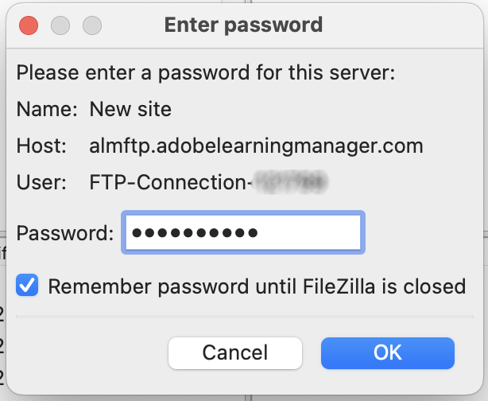

# Adobe FTP 관리자에서 전환

Adobe Learning Manager는 AWS 전송 패밀리의 SFTP 프로토콜을 사용하여 새 커넥터를 지원합니다.

오픈 소스 FTP 클라이언트를 Adobe FTP 관리자로 대체할 수 있습니다.

다음과 같은 일부 AWS 권장 FTP 클라이언트가 나열됩니다 [여기](https://docs.aws.amazon.com/transfer/latest/userguide/transfer-file.html):

* FileZilla (Windows, macOS 및 Linux)
* OpenSSH(macOS 및 Linux) - 참고: 이 클라이언트는 SSH(Secure Shell) SFTP(File Transfer Protocol)에 대해 활성화된 서버에서만 작동합니다.
* WinSCP (Microsoft Windows만 해당)
* Cyberduck (Windows, macOS 및 Linux)

## AWS 기반 FTP 커넥터 구성

통합 책임자에서 새 AWS 기반 FTP 커넥터를 구성해야 합니다.

*FTP 옵션을 선택합니다.*

연결되면 연결 세부 정보 페이지를 볼 수 있습니다.

*연결 세부 정보 페이지 보기*

세 가지 인증 옵션이 있습니다.

### 새 SSH 키를 생성하여 인증 만들기

시스템 자체에 SSH 키를 생성하려는 경우 그렇게 할 수 있습니다. SSH 키 생성을 클릭합니다.

개인 키가 컴퓨터에 다운로드되고 공개 키가 서비스에 저장됩니다. [연결]을 클릭하면 공개 및 개인 키를 인증으로 하는 FTP 사용자가 생성됩니다.

FTP 연결이 생성되었습니다.

### 기존 SSH 키를 사용하여 인증 만들기

SSH 키가 이미 있는 경우 **[!UICONTROL FTP 공개 키]** 을 클릭한 다음 연결을 클릭합니다.

*키 붙여넣기*

### 암호를 사용하여 기본 인증 만들기

기본 인증 메커니즘입니다. 첫 번째 옵션을 선택합니다. **[!UICONTROL 암호를 사용하여 기본 인증 만들기]**. 암호를 입력한 다음 **[!UICONTROL Connect]**.

이렇게 하면 연결이 생성됩니다.

## 다음 단계

### FTP 클라이언트 설정

다운로드한 키나 기존 키 또는 암호로 FTP 클라이언트(이전 섹션에서 권장됨)의 연결을 설정합니다.

### 샘플 테스트 내보내기

* FTP 클라이언트에서 ExaVault FTP의 위치를 새 FTP 위치로 변경합니다. 새 도메인은 입니다. `http://almftp.adobelearningmanager.com/`.
* IP를 허용 목록에 추가해야 합니다. `18.195.107.67`.
* 인증 후 외부 FTP 클라이언트 또는 자동화 스크립트를 사용하여 새 FTP 위치에서 샘플 파일 몇 개를 업로드하고 다운로드해야 합니다.
* 이전 위치에서 새 위치로 데이터를 전송해야 합니다.
* 커넥터의 데이터 보존 정책은 동일하게 유지됩니다. ExaVault는 공식 정책 외에도 일부 데이터 보존 정책도 지원했습니다. 이러한 데이터 보존 정책은 새 커넥터에서 사용할 수 없습니다. 커넥터가 공식적으로 지원되는 정책 이외의 데이터 보존을 사용하는지 확인하십시오.

### 마이그레이션 프로젝트는 어떻게 됩니까

| 상태 | 권장 사항 |
|---|---|
| 새 마이그레이션 | 이전 FTP에서 새 마이그레이션을 시작할 수 없습니다. 새 마이그레이션에는 새 FTP를 사용해야 합니다. 이에 대한 자세한 내용은 고객 성공 팀에 문의하십시오. |
| 마이그레이션 진행 중 | 스프린트 생성: 이전 FTP를 계속 사용할 수는 있지만 새 FTP를 사용하는 것이 좋습니다. 이동할 수 없는 기존 스프린트는 고객 성공 팀에 문의하십시오. |
| 종료된 마이그레이션 | 아무 작업도 없습니다. |

## Filezilla FTP 클라이언트를 사용하여 Adobe Learning Manager에 연결

1. 새 ALM FTP 커넥터에 연결합니다. &#39;연결&#39;을 클릭합니다.

   
   *새 ALM FTP 커넥터에 연결*

1. 암호를 통해 기본 인증을 통해 연결하려면 도메인 이름 및 FTP 사용자 이름을 입력한 다음 암호 유효성 검사 기준과 일치하는 암호를 설정하십시오. &#39;연결&#39;을 클릭합니다. 새 FTP 연결이 생성되고 SFTP 클라이언트를 통해 액세스할 수 있습니다.

   
   *암호를 통한 기본 인증 사용*

1. File Zilla와 같은 SFTP 클라이언트를 설치합니다. 파일 Zilla를 실행하고 왼쪽 상단 모서리의 사이트 관리자 열기 를 클릭합니다.

   
   *SFTP 클라이언트를 통해 연결*

1. 다음을 수행합니다. **[!UICONTROL 새 사이트]** 새 사이트를 만듭니다. 필요에 따라 사이트 이름을 바꿉니다.

   
   *사이트 만들기*

1. Connector 자격 증명 페이지에서 세부 정보를 매핑합니다.

   * 프로토콜을 &#39;SFTP - SSH 파일 전송 프로토콜&#39;로 선택합니다.
   * FTP 도메인으로 호스트
   * 로그온 유형을 &#39;암호 요청&#39;으로 지정
   * FTP 사용자 이름으로 사용자

1. &#39;연결&#39;을 클릭합니다.

   
   *자격 증명 입력*

   >[!NOTE]
   >
   >File Zilla 클라이언트에서 이 단계를 수행합니다.

1. 암호를 입력합니다.

   (선택 사항) 암호를 기억하려면 [암호 기억] 확인란을 선택합니다.

   
   *암호 입력*

   (선택 사항) **[!UICONTROL 항상 이 호스트 신뢰]** 호스트를 신뢰하는 확인란

1. [확인]을 클릭합니다.

   
   *호스트 키*

1. 맨 위에서 연결 상태 및 진행률을 확인합니다.

   왼쪽 반은 로컬 사이트이고 오른쪽 반은 원격 사이트입니다.

   파일을 로컬에서 원격으로 또는 그 반대로 이동하려면:

   * 파일을 드래그 앤 드롭할 수 있습니다.
   * 파일을 두 번 클릭합니다.

   
   *연결 상태 확인*

언제든지 인증 유형을 변경하고 업데이트할 수 있습니다.

다른 인증 방법은 SSH 키를 통한 것입니다.

기존 SSH 키를 사용하려면 텍스트 상자에 공개 키를 붙여넣으십시오. [연결/저장]을 클릭합니다.

새 SSH 키를 생성하려면 &#39;**[!UICONTROL SSH 키 생성]**&#39; 버튼. 개인 키가 다운로드됩니다. 다음을 수행합니다. **[!UICONTROL 연결/저장]**.

*SSH 키 생성*

세부 사항을 매핑합니다. 로그온 유형을 키 파일로 선택합니다. 개인 키 파일을 선택합니다.

다음을 수행합니다. **[!UICONTROL Connect]**.

## ExaVault가 사용되지 않으면 어떻게 됩니까?

ExaVault가 더 이상 사용되지 않으면 진행 중인 모든 기존 마이그레이션 프로젝트가 소스 위치인 새 FTP로 이전됩니다. 그런 다음 새 FTP 커넥터를 구성하고 마이그레이션 프로세스를 계속해야 합니다.

## 스프린트를 마이그레이션하는 Recommendations

마이그레이션 프로젝트를 생성할 때 Adobe은 이후 단계에서 Exavault에서 AWS으로 스프린트 마이그레이션을 방지하려면 새 AWS SFTP 커넥터를 사용하여 프로젝트를 생성하는 것이 좋습니다.

마이그레이션이 진행 중이면 Exavault를 데이터 소스로 사용하는 현재 스프린트를 닫습니다. AWS SFTP 연결을 만들고 설정을 테스트한 다음 고객 성공 팀에 문의하여 새 AWS SFTP 데이터 소스로 전환합니다. 전환 후 동일한 마이그레이션 프로젝트에서 새 스프린트를 생성합니다. 스프린트 폴더가 새 위치에 생성되며 마이그레이션 CSV를 업로드하여 활동을 계속할 수 있습니다.

**마이그레이션 프로젝트를 닫을 수 없는 경우**

* 강의 ID 매핑은 외부 레거시 시스템에서 Adobe Learning Manager로 마이그레이션된 강의의 현재 프로젝트에서 수행됩니다. 동일한 프로젝트에서 동일한 강의를 업데이트하려는 경우에만 수행할 수 있습니다. 프로젝트를 닫으면 프로젝트의 세부 정보를 수정할 수 없습니다.
* API 기반 마이그레이션 프로젝트의 경우 프로젝트를 닫으면 안 됩니다.
