# Adobe Learning Manager에서 예정된 변경 사항

<!-- >>[!IMPORTANT]
>
>The Adobe Learning Manager October 2025 release is now live. View [What's New](/help/migrated/whats-new.md) for more information on the latest features and enhancements. This page will be updated with the new features and enhancements for the next release. Stay tuned for more updates. -->

## 릴리스 개요

Adobe Learning Manager의 2026년 4월 릴리스에는 &quot;다음 모듈&quot; 레이블 및 전용 종료 버튼이 있는 Fluidic Player의 보다 명확한 탐색, 여러 팀이 수동 설정 없이 병렬 가상 클래스를 실행할 수 있는 여러 동시 Zoom 세션 지원, 피어 계정에 &quot;외부 작성자&quot; 대신 실제 작성자를 표시하여 공유 강의를 더 잘 보는 등 학습자를 위한 학습이 더 원활해지고, 관리자가 더 쉽게 관리되며 강사를 위한 더 유연한 다양한 개선 사항이 도입되었습니다. 또한 이번 업데이트에서는 학습자 API에 학습 객체 만료 날짜를 표시하여 LXP가 시간에 민감한 교육을 강조할 수 있도록 하고, 작업 지원 하나에 모든 언어 버전을 적용할 수 있도록 작업 지원에 다국어 지원을 추가하며, 책임자가 코호트 또는 시간 지정 프로그램에 유용한 시작/종료 창을 정의하여 모듈을 시작할 수 있는 시기를 제한할 수 있도록 합니다.

이제 LTI를 사용하는 외부 시스템에서 플레이어 언어를 자동으로 설정할 수 있어 학습자가 플랫폼 간 일관된 언어 경험을 제공할 수 있습니다. 또한 가중치가 적용된 채점, 다국어 질문 텍스트, 더 풍부한 피드백을 위한 검토자 의견(선택 사항)을 포함한 몇 가지 체크리스트 업그레이드가 제공됩니다. 이제 ALM은 SCORM 콘텐츠 내에서 제어되는 여러 퀴즈 시도를 캡처하고 각 시도를 L2 보고에서 완전히 보고합니다. 강사가 직접 세션 중 즉석 등록 및 출석 추적을 위한 QR 코드를 직접 생성할 수도 있으며, 통합 TOC, Captivate 수준 완료 틱, 신뢰할 수 있는 노트 내보내기로 콘텐츠가 보다 깔끔하게 재생됩니다. 전반적으로 이 릴리스는 명확성, 일관성, 다국어 준비, 관리자 효율성 및 더욱 유연한 교육 제공에 중점을 둡니다.

## Fluidic Player 탐색 - 다음 모듈의 이름 표시

### 개요

이 개선 사항은 Adobe Learning Manager 2025년 11월 릴리스에 이미 포함되어 있습니다.

플레이어의 &quot;다음&quot; 동작은 다음 모듈 또는 강의의 이름을 표시하고 학습자가 플레이어를 종료하려고 할 때 명시적으로 표시하여 클릭 시 발생하는 내용을 나타냅니다.

### 새로운 기능

플레이어의 **&quot;다음 모듈: {ModuleName}&quot; 레이블**

이제 Fluidic Player의 다음 아이콘 에는 강의의 다음 모듈 이름이 표시됩니다. 예를 들어 다음 모듈: 2과 - 시작하기.

이는 학습자가 같은 과정 내에서 한 모듈에서 다음 모듈로 이동하는 모든 경우에 적용됩니다.

**마지막 모듈에서 종료 동작 지우기**

학습자가 강의의 마지막 모듈에 있으면 새로운 종료 동작 버튼이 표시되어 플레이어를 닫고 강의 컨텍스트로 돌아온다는 것을 알 수 있습니다.

**모바일 및 PDF 콘텐츠에 대한 반응형 동작**

뷰포트가 작은 경우(예: ~320px 폭), PDF 컨트롤과 겹치지 않도록 다음 레이블을 단축하거나 숨겨 아이콘만 표시할 수 있습니다.

PDF 모듈의 경우 플레이어는 컨트롤을 별도의 줄로 조정하므로 탐색 레이블과 PDF 컨트롤이 서로 간섭하지 않습니다.

**업데이트된 관리자 > 브랜딩 > 플레이어 미리 보기**

이제 관리자 > 브랜딩의 플레이어 미리보기에 새로운 레이블이 반영됩니다(예: 다음 모듈: 2과. 그러면 관리자는 업데이트된 탐색 동작을 볼 수 있습니다.

### 주요 이점

**학습자를 위한 더 명확한 탐색**

학습자가 &#39;다음&#39;을 선택하면 어떻게 될지 더 이상 추측할 필요가 없습니다. 레이블은 모듈이든 강의든 다음에 올 내용을 명확하게 지정합니다. 이러한 모호성 감소는 특히 많은 학습자가 LMS 인터페이스에 익숙하지 않을 수 있는 대규모 고객 교육 대상자에게 망설임과 혼란을 완화하는 데 도움이 됩니다.

**높은 강의 완료율**

다음 단계(다음 모듈: {ModuleName})를 명확하게 입력하고 최종 모듈에 대해 뚜렷한 종료 동작을 추가하면 학습자가 과정을 포기하거나 마지막 완료 단계를 무시할 가능성이 줄어듭니다.

**여러 장치에서 예측 가능한 사용자 환경**

업데이트된 레이블은 데스크탑, 태블릿 및 모바일에서 다음 또는 이전 비헤이비어 및 아이콘에 맞춰 정렬됩니다. 레이아웃 제한은 모든 디바이스와 PDF 플로우에 적용되므로 컨트롤을 사용할 수 있고 액세스할 수 있습니다.

이는 Fluidic Player가 사용자 정의 학습 환경에 포함된 헤드리스 구현에 특히 중요합니다.

### 사용 사례

**고객 및 파트너 교육 포털(헤드리스 또는 AEM 통합)**

완전히 헤드리스 설정에서 Adobe Learning Manager을 사용하고 외부 마케팅 채널에서 학습자를 안내하는 계정. 해당 학습자:

* 비디오 컨텐츠를 긴 시퀀스로 사용하는 경우가 많습니다.

* 시스템이 다음 에피소드/모듈을 명확하게 나타내는 교육 과정 스타일의 경험을 기대하십시오.

이러한 환경에서 **다음 모듈:{ModuleName}** 레이블:

* 여정의 유도성을 강화합니다.

* 모듈 간 드롭오프를 최소화합니다.

**주문한 모듈이 있는 규정 준수 및 인증 과정**

규제 또는 규정 준수가 많은 시나리오에서:

* 학습자는 엄격한 모듈 순서를 완료해야 합니다.

* 작성자는 종종 건너뛰지 않도록 목차를 비활성화합니다.

여기, **다음 모듈 표시:{ModuleName}**:

* 학습자가 올바른 순서를 따르고 있는지 확인합니다.

* 다음 동작을 잘못 해석하여 일찍 종료할 가능성을 낮춥니다.

**강의가 서로 팔로우하는 학습 경로**

학습 경로 또는 그와 동등한 항목이 여러 과정을 연결합니다. 이는 대규모 대상자를 위한 교육과정 스타일의 시퀀스를 구축할 때 유용합니다.

**모바일 우선 사용**

휴대폰 또는 태블릿을 주로 사용하는 학습자의 경우:

* 업데이트된 레이블 및 반응형 비헤이비어는 아주 작은 닫기 아이콘이나 숨겨진 컨트롤에 의존하지 않고도 탐색을 이해할 수 있도록 합니다.

* 이는 모바일 장치에서 짧은 세션으로 콘텐츠에 액세스할 수 있는 고객 교육, Gig 직원 또는 일선 학습자에게 중요합니다.

## Zoom 커넥터 - 여러 개의 동시 Zoom 세션 생성

### 개요

이번 Zoom 커넥터 업그레이드로 Adobe Learning Manager에서 VILT(Virtual Instructor-Led Training)를 관리하는 방식이 크게 향상되었습니다. 이전에는 사용자가 한 번에 하나의 Zoom 세션만 만들 수 있었습니다. 새로운 업데이트를 통해 관리자와 작성자는 표준 통합을 사용하여 동시에 여러 Zoom 세션을 예약할 수 있습니다.

### 새로운 기능

#### 커넥터를 통해 여러 개의 동시 Zoom 세션 지원

* 이제 Zoom 커넥터를 사용하여 ALM에서 동일한 날짜/시간에 둘 이상의 VILT 세션을 생성할 수 있습니다.

* 예약 로직은 더 이상 계정/커넥터 레벨에서 &quot;한 번에 하나의 Zoom 회의&quot; 제약을 시행하지 않습니다.

* 관리자와 작성자는 해결 방법 없이 겹치는 VILT 세션(예: 지역별 강의실, 병렬 트랙 또는 여러 파트너 그룹에 대한 반복 세션)을 구성할 수 있습니다.

#### 회의는 강사의 Zoom ID(Zoom 수퍼 관리자 아님)를 사용하여 생성됩니다.

동시 모임을 안전하게 지원하기 위해 커넥터가 다음과 같이 업데이트되었습니다.

* 이제 Zoom 슈퍼 관리자 전자 메일 대신 강사의 전자 메일 주소를 사용하여 Zoom 회의가 생성됩니다.

* 각 강사의 Zoom 계정은 기존 Zoom 플랜의 한도에 따라 다른 강사와 병행하여 자체 회의를 진행할 수 있다.

**참고**:

* 회의 당 한 명의 강사만 계속 지원됩니다.

* 강사의 이메일이 나중에 Adobe Learning Manager에서 업데이트되면 기존 회의는 생성 시 사용한 원래 이메일과 연결된 상태로 유지됩니다.

#### 동시 세션에 대해 수동 확대/축소 URL을 더 이상 붙여넣지 않습니다.

이전에는 두 번째 또는 세 번째 Zoom 세션을 동시에 실행해야 했던 경우:

* 작성자는 ALM 외부에서 Zoom 회의를 수동으로 만든 다음 Zoom 조인 URL을 강의 인스턴스 구성에 붙여넣어야 했습니다.

* 이 기능은 오류가 발생하기 쉬우며 출석 추적과 같은 커넥터 기능의 이점을 얻지 못했습니다.

업데이트된 커넥터 사용:

* 모든 세션은 시간이 겹치더라도 Zoom 커넥터를 사용하여 ALM UI에서 직접 만들 수 있습니다.

* 세션 수명 주기(생성/취소)는 통합을 통해 중앙에서 계속 관리됩니다.

### 주요 이점

#### 규모에 따른 VILT 스케줄링 향상

이제 조직은 다음을 수행할 수 있습니다.

* 여러 Zoom 기반 가상 강의실을 동시에 실행(예: 가상 서밋에서의 병렬 트랙, 지역 집단 또는 별도의 파트너 교육 세션)

* 이전에 관리자가 세션을 직렬화하거나 수동 Zoom 관리에 의존하도록 했던 병목 현상을 방지하십시오.

#### 관리자 및 작성자 부담 감소

향상된 기능은 다음을 제거합니다.

* Adobe Learning Manager 외부에서 Zoom 회의를 수동으로 생성합니다.

* 겹치는 세션에 대해 Zoom URL을 각 강의 인스턴스에 복사 및 붙여넣기합니다.

* 잘못 구성된 링크, 잘못된 회의 첨부 또는 출석자 추적이 누락될 수 있습니다.

관리자와 작성자는 익숙한 워크플로우를 통해 Adobe Learning Manager에서 모든 확대/축소 세션을 관리할 수 있습니다.

#### 확대/축소 프로비저닝 및 강사 역할에 맞게 조정 향상

개별 강사 Zoom 계정에 회의를 묶어서:

* 각 강사는 자신의 Zoom 라이선스 한도 내에서 운영할 수 있다.

* 조직은 기존 Zoom 프로비저닝 모델(트레이너당 하나의 계정, BU당 하나의 계정 등)을 사용하면서도 Adobe Learning Manager과 완전히 통합할 수 있습니다.

* 모든 세션에 대해 공유 수퍼 관리자 Zoom 사용자를 사용하면 단일 지점 병목 현상을 방지할 수 있습니다.

### 사용 사례

#### 멀티트랙 가상 이벤트 및 정상회담

대규모 이벤트(예: 제품 부트캠프, 파트너 정상회담 또는 인증 주)를 실행하는 고객 교육 팀은 다음을 수행할 수 있습니다.

* 여러 트랙 또는 항목에 대해 동일한 시간 슬롯에서 여러 Zoom 기반 세션을 구성합니다.

* Adobe Learning Manager의 과정 및 학습 경로에 따라 모두 VILT 모듈로 관리할 수 있습니다.

* 커넥터가 모든 기본 Zoom 회의 생성을 처리하는 동안 학습자에게 통합된 환경을 제공합니다.

#### 글로벌 파트너 및 고객 교육

지역 전반에 걸쳐 고객과 파트너를 교육하는 조직은 다음을 수행할 수 있습니다.

* EMEA, APAC 및 미주에 대해 겹치는 시간에 별도의 확대/축소 세션을 실행하여 현지 근무 시간을 일치시킵니다.

* 추가 코호트에 대해 단일 글로벌 타임 슬롯이나 수동 확대/축소 설정을 강제로 수행하지 마십시오.

#### 내부 사용

내부 지원팀(영업, 지원 등)은 다음 작업을 수행할 수 있습니다.

* ALM에서 병렬 온보딩 세션 또는 역할 기반 브레이크아웃(예: 개발자, 관리자 및 비즈니스 관련자를 위한 별도의 Zoom 회의실)을 예약합니다.

* 관리되지 않는 Zoom 회의로 부분적으로 전환하는 대신 보고 및 규정 준수를 위해 ALM의 VILT 모델 내에 모든 세션을 유지합니다.

## 피어 계정에서 공유 강의의 원본 작성자 표시

### 개요

카탈로그를 통해 피어 계정으로 강의를 공유하면 Adobe Learning Manager에서는 현재 수신 계정의 학습자, 책임자 및 작성자 보기에서 작성자를 &#39;외부 작성자&#39;로 레이블 지정합니다. 따라서 특히 대기업의 경우 문제나 질문이 발생할 때 적절한 컨텐츠 소유자를 파악하고 연락하기가 어려워짐에 따라 학습자와 관리자에게 많은 문제가 발생할 수 있습니다.

향상된 기능을 통해 작성자 정보가 일반적인 자리 표시자로 대체되지 않고 피어 계정의 공유 강의에 대해 보존 및 표면화됩니다.

### 새로운 기능

피어 계정에서 공유 강의의 실제 작성자 이름 표시

외부 또는 피어 카탈로그를 통해 공유된 강의의 경우, 이제 원본 계정의 원본 작성자 이름이 &#39;외부 작성자&#39; 대신 수신 계정에 표시됩니다.

이는 다음 경우에 적용됩니다.

* 학습자 앱(강의 카드 또는 강의 세부 정보).

* 학습자로 미리 볼 때 책임자 및 작성자가 확인합니다.

### 주요 이점

#### 공유 콘텐츠에 대한 직접 소유자 표시

이제 피어 계정의 학습자와 관리자는 다음을 수행할 수 있습니다.

* 공유 카탈로그를 통해 획득한 경우에도 강의를 작성한 사람을 확인합니다.

* 일반적이고 도움이 되지 않는 &quot;외부 작성자&quot; 레이블은 사용하지 마세요.

#### 보다 일관된 다중 테넌트 및 피어 계정 환경

멀티 테넌트 또는 확장 기업 시나리오를 실행하는 고객의 경우:

* 계정 간에 일관된 작성자 브랜딩과 함께 동일한 강의가 표시됩니다.

* 학습자 경험은 기본 계정의 기대에 맞춰 조정됩니다(예: &#39;외부 작성자&#39; 대신 &#39;클라우드 아카데미 팀&#39; 참조).

### 사용 사례

#### 피어 계정을 보유한 대기업

엔터프라이즈는 다음과 함께 ALM을 사용합니다.

* 정식 과정을 소유한 기본 계정

* 공유 카탈로그를 통해 콘텐츠를 취득하는 피어 계정.

피어 계정의 학습자는 질문을 올바르게 라우팅하거나 개선 사항을 제시하는 강의를 작성한 기업 팀을 알아야 합니다.

향상된 기능:

* 이제 공유 강의가 피어 계정에 올바른 기업 작성자의 이름을 표시합니다.

* 학습자와 로컬 관리자가 연락해야 하는 사용자를 알고 있기 때문에 기업의 내부 지원 부하가 감소합니다.

#### 내부 다중 BU 공유

하나의 사업부에서 다른 사람들을 위해 학습을 선별하는 경우

* 소유 BU는 모든 소비 계정의 작성자 필드에서 식별할 수 있습니다.

* 로컬 L&amp;D 관리자는 강의가 로컬로 유지되는지 다른 BU에서 유지되는지 빠르게 확인하고 그에 따라 공동 작업을 수행할 수 있습니다.

## 학습자 API에 학습 개체 만료(자동 중지) 날짜 표시

### 개요

향상된 기능을 통해 Adobe Learning Manager의 학습자 대면 API를 통해 학습 개체(LO)의 자동 종료 날짜를 바로 사용할 수 있습니다. 강의, 학습 경로 또는 인증이 만료 또는 자동 종료 날짜로 구성된 경우 해당 정보는 이제 주요 학습자 끝점에서 반환하는 LO 데이터의 일부가 됩니다.

### 새로운 기능

#### 학습자 LO API의 새 만료/자동 중지 필드

* 학습자 LO API(예: 학습 개체를 학습자 경험 및 외부 플랫폼으로 반환하는 엔드포인트)에는 이제 LO 만료 날짜(해당 학습 개체에 대해 구성된 자동 중지 날짜)가 포함됩니다.

* 이 필드는 다음과 같은 응답에서 LO 엔티티의 일부로 반환됩니다.

   * 학습 개체(LO 세부 정보) 가져오기.

   * 학습자 홈, 카탈로그 및 검색 결과를 채우는 데 사용되는 LO 데이터입니다.

* 이 필드는 인스턴스 레벨에 이미 있는 기존 completionDeadline을 보완합니다. 새 필드는 특히 LO 수준의 자동 사용 중지 날짜입니다.

#### 검색 지원 학습자 경험 가용성

만료 날짜는 검색 지원 LO 표시의 일부로 표시되므로 이제 ALM 또는 외부 플랫폼이 사용하는 모든 곳에서 사용할 수 있습니다.

* API 또는

* 검색 기반 카탈로그 및 학습자 보기 구성을 위한 제안.

**범위 및 제외**

이 개선 사항은 학습자 API에만 적용됩니다.

### 주요 이점

#### 사용자 정의 LXP의 만료 인식 학습자 경험

대기업과 중기업의 경우, 이제 사용자 정의 LXP가 ALM에서 직접 LO 만료 정보를 얻을 수 있으므로 다음을 수행할 수 있습니다.

* 강의 카드 및 세부 정보 페이지에 &quot;만료 날짜: {date}&quot; 또는 &quot;곧 만료 예정&quot; 레이블을 표시합니다.

* 긴급한 의사소통이 더 명확하게 이루어지면 학습자는 은퇴를 앞둔 교육을 우선적으로 받게 됩니다.

이는 학습 객체가 정기적으로 새로 고쳐지고 이전 버전이 폐기되는 규정 준수 또는 시간 바운드 제품 교육에 특히 중요합니다.

#### 학습자가 지금 수강할 교육에 대한 더 나은 안내

LO 만료가 표시되면 학습자는 다음을 수행할 수 있습니다.

* 아직 유효한 강의와 곧 중단될 강의를 강조 표시합니다.

* 학습자가 가까운 시일 내에 더 이상 사용할 수 없거나 유효하지 않은 교육에 등록하지 않도록 도와주십시오.

#### 기존 완료 마감 시한 데이터와 일관성

이전에는 학습자 API에서 인스턴스 수준 완료 기한을 이미 표시했지만 LO 수준 자동 사용 중지 날짜는 표시되지 않았습니다. 이 변경 사항 적용:

다음과 같은 교육 요소를 사용할 수 있습니다.

* &quot;언제까지 이 인스턴스를 완료해야 합니까?&quot; (완료 기한).

* &quot;이 교육은 언제까지 제공됩니까?&quot; (자동 사용 중지/만료 날짜).

### 사용 사례

#### 엄격한 과정 수명주기 관리를 갖춘 글로벌 기업

정기적으로 강의를 중단하거나 교체하는 기업(예: 규정, 제품 또는 방법 업데이트)은 다음을 수행할 수 있습니다.

* 교육이 단계적으로 중단되는지 여부에 대해 학습자의 혼란을 피하십시오.

* 학습자를 최신 장수 제품으로 유도합니다.

이제 사용자 정의 포털 및 내부 도구가 학습자 API를 통해 ALM에서 직접 만료 날짜를 읽을 수 있습니다.

#### 외부 고객 또는 파트너 아카데미

고객 및 파트너 교육의 경우 마케팅 페이지와 포털에서 최신 교육을 강조하는 경우가 많습니다.

LO API에 만료 날짜가 있으면 빌더를 경험할 수 있습니다.

* 은퇴가 임박한 콘텐츠를 숨기거나 비강조합니다.

* &quot;완료할 수 있는 마지막 기회&quot; 캠페인 구축.

## 작업 지원에 대한 다국어 지원

### 개요

향상된 기능은 Adobe Learning Manager의 지역화 모델을 작업 지원으로 확장하여 작성자가 언어별로 다른 콘텐츠 파일을 단일 작업 지원에 첨부할 수 있도록 합니다. 작성자는 이제 각 언어별로 별도의 작업 지원을 만드는 대신 모든 지역화된 버전을 하나의 논리적 작업 지원으로 관리할 수 있습니다.

### 새로운 기능

#### 작업 지원에 대한 언어별 콘텐츠 업로드

작성자는 단일 작업 지원(예: 강의 및 기타 LO)에 지원되는 언어별로 다른 파일을 첨부할 수 있습니다.

이제 작업 지원 생성/편집 경험에서 다음을 지원합니다.

* 언어 선택

* 동일한 작업 지원 엔터티 내에서 해당 언어에 대한 언어별 파일을 업로드하는 중입니다.

#### 플레이어 및 학습자 UI에서 일관된 언어 처리

Fluidic Player가 업데이트되어 학습자가 작업 지원을 열 때 학습자 언어에 해당하는 콘텐츠 변형이 표시됩니다(사용 가능한 경우).

책임자 및 작성자는 작업 지원을 언어별로 별도의 항목이 아닌 언어 변형이 있는 단일 개체로 볼 수 있습니다.

### 주요 이점

#### 모든 언어를 위한 단일 작업 지원

작성자는 언어별로 별도의 작업 지원을 만들지 않아도 됩니다.

동일한 작업 지원의 모든 언어 변형(예: 절차, SOP, 체크리스트 PDF 또는 참조 안내서)을 한 곳에서 관리할 수 있습니다.

#### 글로벌 학습자를 위한 더 나은 환경

학습자가 선호하는 언어로 작업 지원을 자동으로 볼 수 있으며, 이는 다음과 같은 사항이 있음을 의미합니다.

* 열려는 버전에 대한 혼란이 줄어듭니다.

* 로케일이 맞지 않거나 오래된 복제본에 액세스할 위험이 줄어듭니다.

이 기능은 동일한 프로세스 또는 제품 문서를 여러 언어로 제공해야 하는 다국어 조직에서 특히 유용합니다.

### 사용 사례

#### 참조 내용의 전역 롤아웃

기업은 전 세계 학습자에게 다음과 같은 여러 언어로 작업 지원을 제공해야 합니다.

* 제품 참조 시트

* 체크리스트 처리

* 플레이북 지원

&quot;제품 빠른 시작 - EN&quot;, &quot;제품 빠른 시작 - DE&quot;, &quot;제품 빠른 시작 - JP&quot; 등과 같은 별도의 작업 지원을 생성하는 대신 하나의 작업 지원을 만들고 각 언어에 현지화된 파일을 첨부하며 언어 설정에 따라 ALM이 각 학습자에게 올바른 버전을 제공하도록 할 수 있습니다.

#### 여러 시장을 대상으로 하는 고객 또는 파트너 대상 문서

고객 및 파트너 아카데미의 경우 작업 지원에는 다음이 포함될 수 있습니다.

* 제품 커닝 시트

* 통합 안내서

* 지원 워크플로우

다중 언어 작업 지원 사용:

* 각 파트너는 언어별 항목 중에서 선택할 필요 없이 지역화된 버전을 볼 수 있습니다.

* 마케팅 및 지원 팀은 모든 로케일에서 주제당 하나의 작업 지원을 관리할 수 있습니다.

## 모듈 시작 시간에 대한 제한 설정

### 개요

이 향상된 기능을 통해 Adobe Learning Manager의 작성자와 관리자는 학습자가 모듈을 시작할 수 있는 시간 창을 정의할 수 있습니다. 구성된 시작/종료 창 외부에서 모듈은 강의 구조에 계속 표시되지만 학습자는 시작할 수 없습니다.

이러한 기능은 특정 컨텐츠를 사용할 수 있는 시기를 엄격하게 제어해야 하거나, 시간 경과 프로그램, 코호트 기반 교육, 시간에 민감한 연습 등 시작이 중지되어야 하는 사용자에게 매우 중요합니다.

### 새로운 기능

작성자는 이제 강의 모듈 수준에서 학습자가 해당 모듈을 실행할 수 있는 시기를 통제하는 시작 날짜/시간 및 종료 날짜/시간을 구성할 수 있습니다. 이 창 내에서 모듈은 평소와 같이 작동합니다. 시작 시간 이전 또는 종료 시간 이후에 학습자는 강의 개요에 모듈을 볼 수 있지만 시작할 수 없습니다.

구성은 과정 작성 사용자 인터페이스에 자가 진행식 콘텐츠, 퀴즈 또는 활동과 같은 특정 모듈 유형에 대한 추가 스케줄링 컨트롤로 나타납니다. 관리자는 이러한 컨트롤을 사용하여 단계적으로 열리는 모듈을 만들거나 정의된 기간 내에 콘텐츠를 소비해야 하는 프로그램에서 늦게 시작하는 것을 방지할 수 있습니다.

#### 주요 이점

주요 이점은 모듈에 액세스할 수 있는 시점을 제어하는 기능입니다. 교육 팀은 모듈 가용성과 새로운 제품 출시, 규정 기한 및 내부 프로그램과 같은 실제 이벤트를 동기화할 수 있습니다. 이렇게 하면 학습자가 이후 모듈에 액세스하기 전에 사전 요구 사항 콘텐츠를 완료하게 됩니다.

예를 들어 코호트 1은 2주차에만 모듈 2에 액세스할 수 있고, 모듈 3은 3주차까지 잠긴 상태로 유지되므로 콘텐츠를 수동으로 숨기거나 표시하지 않거나 별도의 강의 버전을 만들 필요가 없습니다.

이렇게 하면 학습자의 학습 환경이 향상됩니다. 기술적으로 액세스할 수 있지만 해당 시간에 진행해서는 안 되는(또는 이미 완료해야 하는) 모듈을 마주보는 대신, 학습자는 시작할 수 있도록 허용된 모듈이 의도된 일정에 명확하게 정렬되는 강의 구조를 볼 수 있습니다.

#### 사용 사례

* **코호트 기반 사용 프로그램**: 이 프로그램에서 매주 새 모듈의 잠금을 해제합니다. 1주차에 대한 콘텐츠는 즉시 사용할 수 있지만 2주차는 볼 수 있지만 지정된 날짜까지 시작할 수 없습니다. 3주차는 동일한 게이팅 과정을 따른다. 학습자는 전체 학습 경로를 볼 수 있지만, 각 단계를 실제로 시작할 수 있는 시기는 시스템에서 제어합니다.

* **시간 제한 제품 또는 캠페인 교육**: 마케팅 또는 제품 팀은 캠페인이 활성 상태이거나 특정 버전의 제품을 계속 사용할 수 있는 경우에만 액세스해야 하는 교육 모듈을 만들 수 있습니다. 이렇게 지정된 시작 창을 사용하면 학습자가 지정된 종료 시간 이후에 중단된 제품 버전에 대한 모듈을 시작하지 않도록 할 수 있습니다.

* **평가 또는 시험 환경**: 조직은 짧고 잘 정의된 기간에 대해 모듈(예: 시험)을 열 수 있습니다(예: &quot;지정된 날짜에 9:00~ 12:00 사이에 언제든지 시험을 시작할 수 있습니다&quot;). 학습자는 해당 기간 외에는 시험을 시작할 수 없으며, 이는 시간대와 집단 전체에 걸쳐 공정한 스케줄링을 지원합니다.

## 사용자 정의 LTI 매개 변수를 통해 플레이어 언어 제어

### 개요

이 향상된 기능을 통해 외부 플랫폼에서 LTI(Learning Tools Interoperability)를 사용하여 실행 시 Adobe Learning Manager 콘텐츠에 대한 언어를 지정할 수 있습니다. Fluidic Player에서 언어를 변경하는 학습자에 의존하는 대신 LTI 소비자는 사용자 정의 LTI 매개 변수를 통해 언어 코드를 전송할 수 있습니다. 그러면 Adobe Learning Manager에서 이 코드를 사용하여 적절한 언어 변형을 선택합니다.

### 새로운 기능

LTI 소비자 역할을 하는 외부 플랫폼은 이제 ALM 콘텐츠를 실행할 때 사용자 정의 언어 파라미터(및 관련 플레이어 설정)를 전달할 수 있다. ALM은 이 매개 변수를 읽고 다음을 수행합니다.

* 플레이어 언어를 적절하게 설정합니다.

* 다국어 콘텐츠가 구성된 경우 모듈의 해당 언어 변형을 실행합니다.

즉, 외부 플랫폼에서 프랑스어를 선택하는 처음 학습자가 ALM 내부의 어떤 조정도 수행하지 않고 프랑스어로 직접 ALM 플레이어와 모듈이 실행되는 것을 보게 됩니다.

이 개선은 또한 외부 플랫폼이 ALM을 헤드리스 콘텐츠 플레이어로 취급하는 시나리오도 수용합니다. 예를 들어 특정 사용자 인터페이스 설정을 조정하기 위해 추가 사용자 정의 매개 변수를 전송하여 탐색 요소와 목차(TOC)를 숨길 수 있습니다. 이러한 설정은 언어 매개 변수와 함께 작동하므로 외부 플랫폼에서 재생 및 추적에 ALM을 계속 사용하면서 부드럽고 브랜디드 경험을 제공할 수 있습니다.

### 주요 이점

* **여러 시스템에서 일관된 언어 경험**: 학습자가 외부 포털에서 언어를 선택하면 해당 선택이 ALM에 즉시 반영됩니다. 이렇게 하면 학습자가 포털과 강의 언어가 일치하지 않을 수 있습니다. 따라서 플레이어 내에서 언어 전환을 검색할 필요가 없습니다.

* **언어별 보고**: 해당 플랫폼에서 언어 선택은 ALM과 일치하여 분석 및 학습자 추적의 정확성을 향상시킵니다. 또한 이 정렬은 ALM의 자체 언어 컨트롤이 특정 강의의 Fluidic Player에서 의도적으로 비활성화되거나 숨겨지는 구성도 지원합니다. 이러한 경우, 외부 플랫폼은 언어에 대한 단일 진리의 원천으로서 역할을 한다.

### 사용 사례

* LTI 기반 통합을 활용하는 대기업이 주요 활용 사례로 꼽힌다. 학습자는 먼저 플랫폼에서 언어를 등록 및 선택합니다. 그런 다음 LTI를 통해 ALM 교육 세션을 시작합니다. 향상된 기능을 통해 학습자가 스페인어를 선택하면 ALM 모듈이 자동으로 스페인어로 열립니다. 즉, 학습자가 ALM에서 언어 설정을 조정할 필요가 없습니다. 더 나아가, 언어 기반 보고는 학습자가 ALM에서 보고 경험하는 것과 일관성을 유지한다.

* 또 다른 응용 프로그램은 고객 또는 파트너 포털 내에서 헤드리스 강의 환경을 제공하는 것입니다. 이 설정에서는 포털이 iframe을 사용하여 ALM 콘텐츠를 포함할 수 있지만 모든 탐색 및 언어 사용자 경험(UX)은 ALM 외부에서 관리됩니다. 포털은 사용자 정의 LTI 매개 변수를 활용하여 ALM 플레이어가 올바른 언어로 표시되도록 하고 불필요한 사용자 인터페이스 요소(목차 및 내비게이션 단추 등)가 숨겨지도록 할 수 있습니다. 이를 통해 학습자들은 단절된 도구의 집합보다는 하나의 응집력 있는 응용을 지각할 수 있다.

* 이는 다른 LMS나 학습 플랫폼을 사용하여 다국어로 대규모 교육을 실시하는 조직에 유용합니다. 학습자 프로필 관리, 로케일 선택, 카탈로그 프레젠테이션 등에 해당 플랫폼을 사용하는 것을 표준화할 수 있습니다. 한편, ALM은 각 LTI 출시 동안 외부 시스템에서 지정한 언어 환경 설정 및 사용자 상호 작용을 존중하는 안정적인 콘텐츠 및 추적 엔진 역할을 합니다.

## 강사 평가를 위한 체크리스트 질문 가중치

### 개요

개선 사항은 가중치 체크리스트를 도입해 교수자와 관리자가 각 체크리스트 문항을 동일하게 취급하지 않고 점수를 매긴 척도와 총점을 이용해 학습자를 평가할 수 있도록 했다. 목표는 문항에 대한 가중치 평가를 구현해 체크리스트 생성을 촉진하는 것으로, 하나의 체크리스트 내에서 서로 다른 행동이나 기술의 상대적 중요성을 반영할 수 있다.

### 새로운 기능

체크리스트는 다음 유형을 지원합니다.

1. 예/아니요
동작은 오늘과 동일하게 유지됩니다. 각 질문은 예/아니오이며 합격 기준은 &quot;예&quot; 응답 수를 기준으로 합니다.

2. 동일한 수준의 질문

   * 질문은 숫자 척도(기본적으로 0~10)로 채점됩니다. 여기서,

      * 스케일의 최대/최소 값은 체크리스트 수준에서 사용자 정의할 수 있습니다.

      * 이제 스케일은 0에서 시작할 수 있습니다(이전의 최소 점수는 1이었습니다).

   * 모든 문항이 동일한 최대 점수를 공유하므로 체크리스트는 각 문항에 대해 균일한 점수를 주는 척도로 작동합니다.

3. 다양한 두께의 질문

   * 각 문항은 고유한 최대 점수(가중치)를 가집니다.

   * 합격 기준은 체크리스트에서 학습자가 달성하는 가능한 총 점수의 비율에 따라 다릅니다(예: &quot;학습자가 사용 가능한 총 점수≥ 70%를 달성하는 경우 합격&quot;).

모든 체크리스트 유형의 경우:

* **검토자**(강사 또는 관리자)은 구성된 체크리스트 유형에 따라 학습자를 평가합니다.

   * 예/아니요 선택

   * 정의된 범위에서 점수를 선택합니다.

* **체크리스트** 보고서가 다른 가중치가 있는 질문의 경우 다음을 포함하도록 업데이트되었습니다.

   * 각 질문의 최대 점수입니다.

   * 해당 질문에 대한 각 학습자의 점수

이를 통해 의도한 가중치를 바탕으로 전체적인 성과와 질문별 성과를 분석할 수 있다.

### 주요 이점

* **더 풍부하고 현실적인 평가**: 강사는 관찰된 작업이나 실제적인 작업에 적합한 체크리스트 워크플로우를 사용하면서 중요한 동작에 더 많은 점수를 주고 사소한 동작에 더 적은 점수를 줌으로써 실제 우선 순위를 반영할 수 있습니다.

* **총 점수 기반 합격/불합격**: 평가는 임계값을 통과한 질문의 수뿐만 아니라 전체 백분율 점수를 기반으로 할 수 있으며 일반적인 역량 또는 등급 체계와 더 가깝게 정렬됩니다.

* **보고 개선**: 업데이트된 체크리스트 보고서를 통해 최대 점수와 질문당 달성된 점수를 표시하므로 프로그램 소유자와 품질 팀이 특정 취약점을 식별하고 교육 또는 평가 지침을 개선할 수 있습니다.

### 사용 사례

* **엔터프라이즈 기술 평가**: 엔지니어는 특정 진단 또는 커뮤니케이션 단계가 미용 또는 위험 수준이 낮은 단계보다 더 많은 비중을 차지해야 하는 실용적이고 시나리오 기반의 체크리스트를 통해 평가됩니다. 가중치 질문과 총 점수 합격 기준은 이러한 평가를 더욱 신뢰할 수 있고 실제 성과를 예측하게 한다.

* **안전 및 규정 준수 관찰**: 의료, 제조 또는 현장 서비스에서는 중요한 안전 단계에 최대 점수를 더 높게 부여할 수 있으므로, 안전상 중요한 조치를 누락하는 것이 사소한 절차 단계를 누락하는 것보다 총 점수에 더 큰 영향을 미치도록 합니다.

* **코칭 및 보정**: 보고서에서 질문당 최대 및 달성된 점수를 통해 관리자는 학습자가 부족한 부분을 정확하게 확인하고 강사를 보정하여 일관되게 점수를 매길 수 있습니다.

## 체크리스트 질문에 대한 다국어 지원

### 개요

이 개선에서는 체크리스트 질문에 대한 다국어 지원을 도입하여 검토자가 선호하는 언어로 체크리스트를 평가하고 점수를 매길 수 있도록 합니다. 이 기능은 작성자가 단일 체크리스트 모듈과 일관된 평가 프로세스를 유지하면서 지원되는 각 콘텐츠 언어에 대해 현지화된 체크리스트 질문을 만들 수 있으므로 다국어 지역 및 글로벌 배포에 특히 유용합니다.

Adobe Learning Manager에서 지금:

* 모든 학습자 대상 모듈(SCORM, PDF, HTML 등)을 다중 콘텐츠 언어로 제공할 수 있어 학습자가 원하는 언어를 선택할 수 있다.

* 체크리스트 모듈에서 검토자(강사/관리자)는 해당 체크리스트에 정의된 질문을 기반으로 학습자를 평가합니다.

### 새로운 기능

**제작**

* 이제 작성자는 강의 수준에서 선택한 모든 언어로 체크리스트 질문을 추가할 수 있습니다.

* 각 체크리스트에 대해:

   * 작성자는 강의가 있는 모든 콘텐츠 언어로 동등한 질문 텍스트를 제공해야 합니다.

   * 작성자는 각 질문의 의미가 여러 언어에 걸쳐 일관성을 유지하도록 하는 데 책임이 있다.

**검토 경험**

* 검토자는 선택한 콘텐츠 언어로 체크리스트 질문 및 평가 UI를 볼 수 있습니다.

* 질문이 한 언어로 평가되는 경우:

   * 평가(점수, 예/아니요, 상태)는 모든 언어에서 논리적으로 동일합니다. 언어별 체크리스트가 아닌 여러 언어 보기로 구성된 단일 체크리스트입니다.

**보고**

체크리스트 보고서에는 사용자의 컨텐츠 언어로 질문 텍스트가 표시됩니다.

* 각 언어로 보고서를 실행하는 책임자 또는 검토자는 해당 언어의 현지화된 질문 이름을 볼 수 있습니다.

* 기본 응답과 점수는 동일하게 유지됩니다. 질문 레이블만 번역됩니다.

### 주요 이점

* **더 나은 리뷰어 환경**: 리뷰어는 언어 장벽 없이 전적으로 자신의 언어로 작업하고 질문을 읽고 평가를 기록할 수 있습니다.

* **규제 및 정책 조정**: 언어 평등 요구 사항이 있는 지역(예: 벨기에의 네덜란드어/프랑스어)에서 체크리스트는 이제 다른 학습 자료와 동일한 표준을 충족하여 준수 위험을 줄일 수 있습니다.

* **일관된 평가 논리**: 텍스트가 현지화되지만 평가 및 점수는 모든 언어에 걸쳐 공유되므로 결과를 비교할 수 있으며 중앙에서 관리할 수 있습니다.

### 사용 사례

* 다국어로 운영되는 다국어 프랜차이즈는 단일 코스 및 체크리스트를 배포하는 동시에 각 지역에서 현지화된 리뷰어 경험을 제공할 수 있습니다.

* 로컬 강사가 있는 모든 글로벌 기업(예: EMEA, LATAM, APAC)은 검토자가 동일한 글로벌 체크리스트 디자인 및 보고를 공유하면서 현지 언어로 작업하도록 할 수 있습니다.

## 검토자를 위한 주석 달기 기능이 있는 체크리스트

### 개요

이번 개선에서는 체크리스트 평가를 위한 주석 달기 기능이 도입되어 강사 및 관리자 등 검토자들이 숫자 점수와 함께 질적 피드백을 제공할 수 있게 되었습니다. 이 피드백은 필요한 경우 학습자에게 표시되도록 할 수 있습니다.

멘토 피드백이 숫자 결과만큼 중요한 체크리스트 기반 평가를 지원하는 것이 목표입니다. 이는 특정 강점, 개선해야 할 영역 등을 강조하거나 주어진 점수에 대한 맥락을 제공하는 것을 포함한다.

현재 검토자는 다음을 수행할 수 있습니다.

* 질문별로 각 학습자의 체크리스트를 평가합니다.

* 결과를 보고 실패한 학습자를 다시 평가합니다.

항공 등 실제 상황에서 현장 교육 담당자는 현장 담당자와 공항 직원을 평가합니다. 마찬가지로 중소기업 내 강사와 멘토들도 체크리스트를 활용하여 직무 성과를 평가하는 경우가 많다. 그러나 이러한 체크리스트는 평가와 관련된 내러티브 피드백을 포착하기 위한 구조화된 섹션은 전형적으로 포함되지 않는다.

### 새로운 기능

#### 작성 옵션

작성자는 각 체크리스트를 다음과 같이 구성할 수 있습니다.

* 검토자의 댓글 달기 기능을 활성화 또는 비활성화합니다.

* 검토자의 이름을 댓글과 함께 학습자에게 표시할지 여부를 결정합니다.

이를 통해 조직은 문화 및 개인 정보 보호 요구 사항에 맞게 주석 가시성을 조정할 수 있습니다.

#### 검토자 경험

주석 달기가 활성화된 경우:

* 검토자(강사/관리자)는 체크리스트를 평가하는 동안 주석을 추가할 수 있습니다.

* 체크리스트 설정에 따라 학습자에게 댓글을 표시할지 여부를 선택할 수 있습니다.

학습자를 재평가하는 경우 최신 평가를 반영하도록 댓글을 업데이트하거나 변경할 수 있습니다.

#### 보고 및 알림

* 체크리스트 보고서에는 검토자의 발언에 대한 새 열이 표시되어 평가 중에 제공된 주석을 캡처합니다.

* 학습자는 체크리스트 평가가 발생할 때마다 알림(플랫폼 내 및 이메일)을 받습니다. 이러한 알림에는 다음이 포함됩니다.

   * 주석 및

   * 검토자의 이름(표시되는 경우).

이렇게 하면 학습자에게 피드백이 저장될 뿐만 아니라 능동적으로 표시됩니다.

### 주요 이점

* **더 풍부하고 코치와 같은 피드백**: 상황에 맞는 주석으로 숫자 점수를 보완하여 체크리스트를 준수뿐만 아니라 코칭에 더 효과적인 도구로 만듭니다.

* **추적 가능성 및 감사 가능성**: 조직은 누가, 언제, 무엇을 평가했는지 지속적으로 기록을 남깁니다. 이 기록은 규제된 환경과 고도의 역할에서 중요합니다.

* **학습자 참여 개선**: 학습자는 특정 평가와 연결된 명확한 지침을 받게 되므로 기대치와 후속 단계에 대한 이해도가 향상됩니다.

### 사용 사례

* 규제된 환경을 가진 조직은 현장에서 관찰되고 있는 직원에 대한 임상 판단이나 절차적 피드백을 문서화하는 데 댓글을 사용할 수 있다.

* 항공 및 지상 처리 조직은 운영 성능, 안전 관행 및 고객 대면 행동에 대한 세부 정보를 첨부할 수 있으며, 체크리스트를 구조화된 설명 도구로 바꿀 수 있습니다.

* 멘토링 및 SME 평가에서 강사는 점수에만 맞지 않는 미묘한 관찰을 포착할 수 있습니다. 예를 들어, &quot;에스컬레이션 처리 기능이 좋지만 시간 관리를 개선해야 합니다.&quot; 또는 &quot;문제 해결 흐름이 우수합니다. 문서 단계를 생략했습니다.&quot;

## 콘텐츠 수준 다중 시도 및 퀴즈 보고

### 개요

>[!IMPORTANT]
>
>이 기능은 계정에서 활성화한 후에만 사용할 수 있습니다. ALM 지원 또는 고객 지원 매니저에게 문의하십시오.


현재 ALM은 MQA(다중 퀴즈 시도) 기능을 통해 LMS 수준에서 여러 시도를 지원합니다.

* 작성자는 강의 레벨(강의의 모든 퀴즈 관련 모듈에 적용) 또는 모듈 레벨(퀴즈 모듈당)에서 시도를 구성할 수 있습니다.

* 시도 횟수는 다음과 같습니다.

   * 특정 숫자(예: 3번 시도) 또는

   * LMS 수준에서 제어되는 무한 시도.

* 학습자가 Fluidic Player를 통해 모듈을 소모한 다음 플레이어를 닫거나 모듈을 완료하면 해당 세션은 단일 LMS 시도로 처리됩니다.

* LMS의 각 시도는 L2 퀴즈 보고서에 새 행으로 캡처됩니다.

그러나 내용 파일 자체(예: Articulate SCORM 퀴즈)가 자체 다중 시도 논리를 구현하는 경우 ALM의 L2 퀴즈 보고서는 현재 이러한 내부 시도를 올바르게 구분하거나 추적하지 않습니다.

이 향상된 기능은 퀴즈에 대한 콘텐츠 수준 다중 시도 추적 기능을 도입하여 Adobe Learning Manager이 L2 퀴즈 보고서의 콘텐츠 자체 내에서 각 시도를 정확하게 캡처할 수 있도록 합니다. SCORM 아티큘레이트와 같은 콘텐츠 제작 도구가 퀴즈 시도를 독립적으로 관리하는 상황을 위해 설계되었습니다. 이 기능을 사용하면 LMS 수준 MQA(다중 퀴즈 시도) 설정에 따라 달라지지 않고 ALM 보고에 시도가 올바르게 반영됩니다.

### 새로운 기능

#### 콘텐츠 수준 시도에 대한 작성자 플래그

* 콘텐트 라이브러리로 콘텐트를 업로드할 때 작성자는 이제 특정 콘텐트 파일에 여러 번 시도 횟수가 있음을 표시할 수 있습니다.

* ALM이 내용 내에 정의된 시도를 사실의 소스로 처리하도록 하는 내용별 설정입니다.

#### 강의/모듈 동작

해당 콘텐츠를 강의에서 사용하는 경우:

* 이 모듈은 LMS MQA가 아닌 콘텐츠에서 시도 횟수를 가져옵니다.

* 학습자는 하나의 LMS 수준 시도만 볼 수 있습니다.

   * 강의 개요 및 모듈 보기에는 해당 모듈에 대한 LMS &quot;재시도&quot; 버튼이 표시되지 않습니다.

   * 시도 처리(예: 퀴즈 내에서 다시 시도)는 콘텐츠 자체에서 결정됩니다.

#### 보고

L2 퀴즈 보고서가 업데이트되어 각 콘텐츠 수준 시도를 별도의 시도 행으로 취급합니다.

* 콘텐츠에 구성된 각 내부 퀴즈 시도는 오늘날 LMS 수준 시도가 표시되는 방식과 같이 L2 퀴즈 보고서에 자체 행으로 표시됩니다.

* 각 행의 형식은 L2 보고의 기존 다중 시도 행과 동일하게 유지됩니다(동일한 열, 구조 및 의미).

* 일관된 보고 환경을 제공합니다.

   * 시도가 LMS MQA에 의해 제어되는지 또는 콘텐츠에 의해 제어되는지에 관계없이 L2 퀴즈 보고서는 시도당 하나의 행을 표시합니다.

#### 주요 이점

* LMS 수준의 MQA 구성을 강제로 상위로 설정하지 않고도 아티큘레이트와 같은 도구로 내부적으로 시도를 제어하는 SCORM 퀴즈에 대한 정확한 시도 기록.

* 보다 깔끔한 학습자 경험: 내용 제어 시도의 경우 학습자는 LMS 수준에서 단일 슬롯을 보고 LMS 재시도 컨트롤과 상호 작용할 필요가 없습니다. 모든 재시도는 이미 알고 있는 퀴즈 UI 내에서 처리됩니다.

* 유연한 아키텍처: 사용자는 콘텐츠가 작성된 방식과 시도를 관리하는 방식에 따라 ALM MQA 또는 콘텐츠 수준 시도 중 모듈별 비헤이비어를 구동해야 할지 선택할 수 있습니다.

* 일관된 보고 모델: L2 퀴즈 보고서의 다운스트림 소비자는 시도 로직의 출처에 관계없이 각 행을 &quot;단일 시도&quot;로 처리할 수 있습니다.

#### 사용 사례

* Articulate SCORM을 사용하는 조직은 SCORM 패키지 내에 자체 내장된 퀴즈 논리를 유지하면서 LMS 추가 구성 없이 ALM에서 정확한 시도 수준 보고를 수행할 수 있습니다.

* 공급업체에서 제공하는 SCORM 콘텐츠를 사용하는 조직은 LMS 수준 MQA를 사용하여 추가 시도 및 재시도 논리를 수정하거나 구현할 필요가 없습니다.

## 인스턴스 등록 및 세션 출석에 대한 강사 QR 코드

### 개요

이 개선은 강사가 다음에 대한 QR 코드를 직접 생성하는 기능을 추가합니다.

* 강의 인스턴스 등록

* 세션 출석 또는

* 등록 + 함께 참석

을 참조하십시오. 학습자가 물리적 또는 하이브리드 클래스룸에 입장하고 QR 코드를 사용하여 출석을 등록하고 기록하려면 빠른 셀프서비스 옵션이 필요한 상황을 위해 설계되었습니다.

### 새로운 기능

#### 강사 생성 QR 코드

* 강사는 다음에 대해 세션 수준에서 QR 코드를 생성할 수 있습니다.

   * 인스턴스에 등록: 학습자가 현재 세션을 포함하는 인스턴스에 등록할 수 있습니다.

   * 세션 출석 표시: 학습자는 세션 중/후에 스캔하여 해당 특정 세션의 출석을 기록합니다.

   * 인스턴스 등록 + 세션 출석 표시 : 아직 등록되지 않아 한 번에 출석을 표시해야 하는 워크인용 결합된 QR입니다.

* 강사는 시나리오(등록, 출석 또는 둘 다)에 따라 필요한 QR 코드를 내보낼 수 있습니다.

#### QR 코드 패키징

내보낸 QR 코드 PDF은 다음을 포함합니다.

* 강의 이름

* 인스턴스 이름

* 세션 이름

이렇게 하면 교수자와 코디네이터가 각 세션에 대해 올바른 QR 코드를 손쉽게 확인하고 인쇄할 수 있습니다.

### 주요 이점

* **강사 자율**: 강사는 더 이상 관리자가 QR 코드를 만들 때까지 기다릴 필요가 없습니다. 각 세션에 대해 직접 생성해 민첩성을 높이고 조정 오버헤드를 줄일 수 있습니다.

* **더 나은 교실 운영**: 워크인 또는 현장 방문자(현장 작업자, 현장 직원 또는 외부 참석자 등)의 경우 강사는 QR 코드를 사용하여 현장에서 등록과 출석을 관리할 수 있습니다.

* **관리자 작업 부하 감소**: 관리 팀은 모든 세션에 대한 일상적인 QR 코드 생성 요청을 처리하는 대신 구성 및 거버넌스에 집중할 수 있습니다.

### 사용 사례

* 대량의 현장 세션(예: 전문가용 제품 교육)을 실행하는 조직은 강사에게 한 번의 스캔으로 출석을 등록하고 표시하는 세션별 QR 코드를 인쇄할 수 있는 권한을 부여할 수 있습니다.

* 학습자가 현장에서 직접 또는 사전 등록 없이 세션에 참여하는 경우가 많은 소매, 제조 및 의료 교육에서는 &#39;등록 + 출석&#39; QR 코드를 문에 배치할 수 있습니다. 이를 통해 학습자는 휴대폰으로 등록 및 출석을 스스로 제출할 수 있습니다.

* 파트너 또는 고객을 위한 교육 이벤트를 통해 현장 트레이너는 새로운 QR 코드를 책임자와 상의할 필요 없이 회의실, 추가 세션 또는 추가 참석자의 변경 사항에 쉽게 적응할 수 있습니다.

## Captivate 및 ALM 플레이어 개선 사항

### 개요

이러한 향상된 기능은 특히 Captivate의 최근 아키텍처 변경에 따라 Adobe Learning Manager(ALM) 플레이어 내에서 Adobe Captivate 컨텐츠를 재생하는 경험을 개선합니다. 목표는 학습자가 ALM에서 기본적으로 Captivate 모듈에 참여하면서 탐색, 완료 추적 및 메모가 명확하고, 일관되며, 신뢰할 수 있도록 하는 것입니다.

### 새로운 기능

#### 통합 TOC 환경

* ALM TOC만 플레이어 왼쪽에 표시됩니다.

* ALM 내에서 모듈을 재생하면 Captivate의 자체 목차가 숨겨집니다.

* 이렇게 하면 중복이 제거되고, 탐색을 위한 단일 소스의 정보가 보장되며, 화면 공간을 확보할 수 있습니다.

#### 시각적 완료 피드백

* ALM TOC에는 슬라이드 수준의 완료를 나타내는 녹색 눈금 표시(또는 이와 동등한 시각적 신호)가 표시됩니다.

* 학습자가 Captivate 슬라이드를 진행하면 ALM TOC는 완료된 슬라이드를 반영하며 최신 강의 플레이어에 대한 학습자의 기대치에 맞춰 조정됩니다.

#### 상황별 진행률 제어

* 플레이어 컨트롤은 슬라이드 유형에 따라 달라집니다.

   * 비디오 슬라이드의 경우:

      * 비디오 재생을 반영하여 시간 진행률 표시줄을 표시합니다.

* 비디오가 아닌 슬라이드의 경우:

   * 작동하지 않는 시간 표시줄 대신 슬라이드 탐색 컨트롤(다음/이전 슬라이드 등)을 표시합니다.

      * 이렇게 하면 특정 슬라이드 유형에서 관련성이 없거나 작동하지 않는 컨트롤이 표시되지 않습니다.

#### 탐색 간소화

* 별도의 모듈 내비게이션 바(ALM)와 과정 내비게이션 바가 하나의 직관적인 바로 병합됩니다.

* 통합 탐색:

   * Captivate 모듈을 이동하는 것과 강의/모듈 수준으로 다시 이동하는 것을 명확히 구분합니다.

   * 용도가 겹치는 여러 막대로 인한 혼란을 줄입니다.

#### 신뢰할 수 있는 메모 연결

* 메모가 타임스탬프가 아닌 슬라이드 번호에 연결됩니다.

* 변경 사항:

   * 누락된 타임스탬프 또는 잘못된 타임스탬프로 인한 내보내기 오류를 수정합니다.

   * 메모와 메모가 속한 PDF 컨텍스트 간의 안정적인 매핑을 통해 메모를 슬라이드로 일관되게 내보낼 수 있습니다.

### 주요 이점

* 보다 깔끔한 단일 플레이어 경험: 학습자는 하나의 TOC와 하나의 내비게이션 모델과 상호 작용하여 혼란과 인지 부하를 줄입니다.

* 정확한 완료 및 진행 표시: 슬라이드 수준 틱 및 컨텍스트 컨트롤은 학습자가 현재 위치와 남은 내용을 이해하는 데 도움이 됩니다.

* 더욱 강력한 메모 작성 및 내보내기: 깨지기 쉬운 타임스탬프 대신 메모를 PDF에 묶음으로써 사용자는 슬라이드 기반의 Captivate 컨텐츠를 사용하더라도 신뢰할 수 있는 메모에서 슬라이드로 이동하는 워크플로를 되찾게 됩니다.

* 보존된 작성자 작업 과정: 작성자는 Captivate이 ALM에 직접 게시하는 간편성을 유지하는 반면 학습자는 추가 작성 부담 없이 현대적이고 통합된 재생 경험을 얻을 수 있습니다.

### 사용 사례

* 대화형 시뮬레이션에 Captivate을 사용하는 지원 프로그램은 콘텐츠를 ALM에 배포하여 학습자에게 탐색, 완료 추적 및 메모가 일관되게 작동하도록 할 수 있습니다.

* Captivate을 주요 내용 작성 도구로 사용하는 조직은 한 번의 클릭으로 게시를 유지 관리하고 학습자에게 혼란스러운 이중 TOC 및 기능 제어 문제를 방지할 수 있습니다.

* ALM의 Captivate 콘텐츠에서 내보낸 노트(코칭, 규정 준수 또는 기록용)를 사용하는 조직은 다음 정보를 이용할 수 있습니다.

   * 메모가 슬라이드에 올바르게 연결됩니다.

   * PDF이 예상대로 생성됩니다.

## 학습자 성적 증명서의 학습 소요 시간 계산 개선

### 개요

Adobe Learning Manager은 2026년 4월 릴리스를 통해 학습자 성적 증명서의 학습 시간을 계산하는 방법을 수정했습니다. 이전에는 학습자가 콘텐츠에 관여하지 않고 플레이어를 열어 놓은 경우 보고 로직으로 인해 시간이 부정확해져 차이가 발생할 수 있습니다. 새로운 방법은 이제 사용자 참여를 기반으로, 특히 탭에 포커스가 있는 경우와 사용자 활동이 있는 경우를 기반으로 활성 시간을 추적합니다. 이러한 변화는 더 정확한 데이터를 생성합니다.

이 업데이트는 보고서와 대시보드를 개선하여 관리자가 규정을 준수하고 학습자 진행률을 추적하는 데 도움을 줍니다. 릴리스 후 학습자 성적 증명서를 검토하여 개선 사항을 확인합니다.

업데이트된 계산 방법은 활성 탭 초점 및 최근 사용자 상호 작용과 같은 실제 참여에 초점을 맞추므로 다음 영역에서 시간 보고의 정확도가 향상됩니다.

* 학습자 성적 증명서(UI)
* 관리자 대시보드 메트릭
* 강의 등록 보고서
* API 및 커넥터

### 변경된 기능

이제 학습자 성적 증명서의 **학습 소요 시간** 열은 개선된 논리를 사용하여 시간을 더 정확하게 계산합니다. 이제 시스템은 단순히 플레이어 열기/닫기 시간을 추적하는 대신 사용자 참여를 기반으로 활성 기간과 유휴 기간을 구분합니다.

* **활성 시간**: 학습자가 활발하게 참여하는 시간입니다(예: 올바른 탭에서 스크롤 또는 비디오 시청 등의 작업 수행).
* **유휴 시간**: 학습자가 전혀 참여하지 않은 시간(예: 탭 전환, 10분 이상 활동 없음)이며 합계에서 제외됩니다.

이는 원래 논리를 유지하는 SCORM, Captivate 및 XAPI 모듈을 제외하고 대부분의 모듈 유형에 적용됩니다.

### 작동 방식

새 계산은 모듈 유형에 따라 다릅니다.

* **비디오 및 오디오 모듈**: 학습자가 다른 탭으로 전환하더라도 콘텐츠가 재생될 때 활성화됩니다. 재생 시간 추적에는 탭 포커스가 필요하지 않습니다.
* **정적 모듈(PDF, PPT, Excel 등)**: 탭에서 최근 10분 이내에 활동(마우스 이동, 스크롤, 클릭, 키보드 입력)을 수행하는 경우 활성화됩니다. 10분 동안 작업이 없으면 유휴 상태로 전환됩니다.
* **SCORM 및 Captivate**&#x200B;은(는) 원래 열기/닫기 논리를 유지합니다.
* **xAPI**&#x200B;에서는 이제 탭이 활성화된 경우에만 시간이 계산되는 탭 기반 활성 시간 감지를 사용합니다. AICC 콘텐츠 **은(는) 지원되지 않습니다**.
* **HTML, LTI 및 기타 콘텐츠**: 다를 수 있습니다. 학습자 성적 증명서의 정확성을 확인하십시오.

유휴 시간을 줄여 실제 참여 시간만 보고되도록 합니다.

### 요약 테이블

| **모듈 유형** | **활성 시간(계산됨)** | **유휴 시간(제외됨)** |
| --- | --- | --- |
| **비디오/오디오** | 재생 시간 | 시작되지 않음, 종료됨, 일시 중지됨 **\>10분** |
| **정적(PDF/PPT/DOC)** | 지난 **10분** 동안 활성 **및** 활동을 탭하세요. | 활동 없음 **\>10분**; 탭 비활성 |
| **SCORM** | 콘텐츠 런타임에서 보고한 시간 | 유휴 상태를 감지할 수 없습니다. |
| **Captivate** | 슬라이드 기반 타이밍 | 유휴 상태를 감지할 수 없습니다. |
| **xAPI** | 탭 활성 | 탭 비활성 |
| **HTML** | 탭이 활성화된 플레이어 열기 시간 | 탭 비활성 |
| **LTI 생산자/소비자** | LTI 콘텐츠가 ALM의 플레이어 내에서 재생되는 경우(즉, ALM이 생산자 역할을 하는 다른 LMS에 호스팅된 LTI 콘텐츠를 소비하는 경우), 이러한 시간 소요 로직이 적용됩니다.<br><br>그러나 LMS 외부에서 콘텐츠가 재생되는 경우(즉, 콘텐츠가 ALM에서 호스트되는 경우 ALM이 제작자이지만 외부 플레이어에서 재생되는 경우) 이 시간 계산 로직은 적용되지 않습니다.  <br>**참고**: LTI 소비자는 Adobe Learning Manager에서 지원되지 않습니다. | 탭 비활성 |

**참고**:

* **다시 방문 및 병렬 세션**: 위의 조건이 충족되면 활성 상태로 계산합니다.
* **모든 장치, 브라우저, 언어**: 포함됨; 동기화 후 오프라인 모바일 사용이 추가됩니다.

### 새 계산의 이점

* **정확한 보고**: 무인 플레이어의 부풀린 시간을 제거하여 사실적인 학습 지속 시간을 제공합니다.
* **준수 개선**: 필수 교육에 대한 정확한 추적을 지원합니다(예: 회사의 5시간 월별 요구 사항).
* **향상된 대시보드**: 이제 사용자 활동 그래프와 소요 시간이 실제 참여를 반영합니다.
* **학습자 인사이트**: 관리자가 진행 상태를 확인하고 문제가 해제된 학습자를 해결하는 데 도움을 줍니다.

### 보고 및 분석 영향

* **학습자 성적 증명서:** &quot;소요된 학습 시간&quot;은 이제 **실제 참여**&#x200B;를 반영합니다.
* **관리자 대시보드:** 시간(예: &quot;사용한 시간&quot; 타일, 추세)을 포함하는 메트릭은 유휴 시간이 이전에 부풀린 결과를 나타내는 시나리오에서 **더 낮지만 더 현실적인** 값을 표시합니다.
* **강의 등록 보고서:** 시간 관련 필드는 시작 후 **새 계산**&#x200B;을 채택합니다.
* **비교 가능성 참고:** 기록 데이터는 다시 계산되지 않으므로 출시일에 걸친 시계열 분석에는 **단계 변경**&#x200B;이 표시될 수 있습니다. 분석 도구에서 주석 또는 날짜별 세그먼트를 고려해 보십시오.

### API 및 커넥터

* 소요 시간을 보고하는 기존 끝점/필드에 대한 **스키마 변경 없음**.
* **필드 의미 체계**&#x200B;가 기능 시작 _후_ 세션에 대한 **활성 시간 계산**&#x200B;을 반영하도록 업데이트됩니다.
* **커넥터 및 내보내기**&#x200B;에서 시간이 소요되는 필드를 사용하면 앞으로 업데이트된 값이 자동으로 수신됩니다.

### 이전 버전과의 호환성 및 데이터 마이그레이션

* **기록 세션:**&#x200B;이(가) 다시 계산되지 않았습니다.
* **새 세션:** **새** 활성 시간 계산을 사용합니다.
* **혼합 기간:** 감사 또는 종단 보고의 경우 잘못 해석되지 않도록 **사전/사후 실행**&#x200B;을(를) 기준으로 분류합니다.

### 알려진 제한 사항

* **대화형 콘텐츠**(SCORM/Captivate)은 콘텐츠가 제공하는 타이밍에 계속 의존합니다. 콘텐츠 내의 유휴 탐지는 사용할 수 없습니다.
* **Iframe 기반 콘텐츠**(HTML/xAPI)은 세분화된 상호 작용 검색을 제한합니다. 대신 탭 포커스가 사용됩니다.

### 자주 묻는 질문

**이 업데이트로 기록 레코드가 변경됩니까?**

아니요. 변경 사항은 기능 실행 후 세션에만 적용됩니다.

**변경 내용을 확인하는 방법은 무엇입니까?**

최근 모듈에 대한 학습자 성적 증명서 확인, 예상 지속 시간과 비교

**모든 계정에 영향을 줍니까?**

예, 모든 Adobe Learning Manager 계정에 대한 글로벌 업데이트입니다.

**학습자가 조치를 취해야 합니까?**

아니요. 변경 사항은 학습자에게 자동으로 투명하게 적용됩니다.

**학습자가 콘텐츠를 열어 두면 어떻게 됩니까?**

이제 유휴 시간이 제외되어 초과 보고를 할 수 없습니다.

**탭이 비활성화되면 비디오/오디오 세션이 자동으로 일시 중지됩니까?**

아니요. 재생 비헤이비어는 변경되지 않습니다. 일시 정지된 시간이 10분 이상이거나 활발하게 재생되지 않을 때는 시간이 제외됩니다.

**오프라인 모바일 활동이 반영됩니까?**

예. 장치가 동기화되면 오프라인 사용이 포함됩니다.

**대시보드에 낮은 평균이 표시되면 어떻게 해야 합니까?**

이는 유휴 시간이 이전에 부풀려진 결과가 있었던 곳에서 예상된다. 대시보드에 주석을 달고 필요에 따라 대상을 조정합니다.

**필수 구성 요소가 있습니까?**

없음. 변경 사항은 자동으로 적용됩니다.


<!-- See this [article](/help/migrated/administrators/feature-summary/reports/learner-transcripts.md) for more information on Learner Transcript report.

The downloaded Learner Transcript report contains the new column: Mark Completed Date (UTC TimeZone).


_Learner Transcript report displays a new column in yellow highlighting individual completion dates for each user_

## Enhanced User Report with extended data fields

**Overview**

The User Report now includes additional fields to improve user tracking and organizational mapping.

**What's new**

* Internal User ID column: Provides unique internal identifiers for smooth user tracking across different systems and API endpoints.
* Manager Email column: Includes direct manager contact information for organizational hierarchy tracking.

**Key benefits**

* Simplified user identification and eliminates issues when mapping users across multiple systems.
* Supports downstream user management workflows through integration capabilities.
* Improved organizational mapping and better understanding of reporting relationships.
* Maintains organizational boundaries and prevents accidental cross-communication.

### User Report with the new column

See this [article](/help/migrated/administrators/feature-summary/reports.md#user-activity-dashboards) to learn how to download the User Report. 

The downloaded User Report file contains the new columns: Internal User ID and Manager Email.

 
_User Reports highlighting internal user IDs and manager email addresses to streamline user management_

## FTP User Report with Internal User ID support

**Overview**

The FTP-based User Report now includes Internal User ID support, providing a unified approach to data export and integration for headless implementations.

**What's new**

* User Reports are now available through [Custom FTP](/help/migrated/integration-admin/feature-summary/connectors.md#custom-ftp) alongside existing reports (Gamification Transcripts, Learner Transcripts, Trainings Report).
* The Internal User ID column is now consistent across all export methods (FTP, Jobs API, and UI).

**Key benefits**

* Simplified data management with a single source for all necessary reports.
* Better data consistency by ensuring uniform user identification across reporting periods.
* Automated workflow support by enabling bulk operations and analytics workflows with consistent identifiers.
The User Report downloaded from FTP folder contains the new column, Internal User ID.

## Include suspended users in Learner Transcripts

**Overview**

Organizations can now include suspended users (those with disabled external profiles) in Learner Transcripts, ensuring comprehensive historical learning data retention.

**What's new**

* Configurable suspended user visibility with an account-level flag to include suspended users in the Learner Transcripts.
* Historical data retention even after deactivation of suspended external profiles.

**Implementation requirements**

* Contact your Customer Success Manager (CSM) to enable the account-level flag.

>[!NOTE]
>
>This flag is disabled by default for existing accounts and must be explicitly requested for new accounts.

## Scoped announcement permissions for custom administrators

**Overview**

Custom administrators can now create announcements, but only for their assigned user groups or catalogs. This prevents unintended communication across organizational boundaries.

**What's new**

* Custom administrators can only create announcements for users within their assigned scope.
* Announcements can be scoped to specific user groups or catalogs.
* Full administrators maintain visibility and control over all announcements, including those created by scoped custom administrators.

**Key benefits**

* Targeted communication ensuring announcements reach only relevant audiences.
* Reduced information overload by preventing irrelevant notifications from reaching unintended users.
* Maintains organizational boundaries and prevents accidental cross-communication.

**Important considerations**

* If a custom administrator's scope changes, affected announcements display a warning icon and require individual scope resets.
* Each announcement must be updated individually when scope changes occur.
* The Notification Announcement report shows only learners within the custom administrator's assigned scope.

**Use cases**

* Franchise organizations where regional managers need to communicate only with their franchisees.
* Large organizations with regional or departmental administrators targeting announcements to their teams.

### Create announcement for the assigned scope

A custom administrator can create announcements limited to their assigned user groups and catalogs, ensuring messages reach the right audience and preventing unnecessary notifications.

To create an announcement for the assigned scope:

1. Log in to Adobe Learning Manager as an administrator.
2. Select **[!UICONTROL Announcement]** in the left navigation pane.
3. Select **[!UICONTROL Add]**. 
   
   
   _Announcements page in Adobe Learning Manager, where administrators can create and manage announcements for targeted user groups_

4. Select the **[!UICONTROL Announcement Type]** from the dropdown menu.
        a. **[!UICONTROL As Notification]**
        b. **[!UICONTROL As Masthead]**
        c. **[!UICONTROL As Recommendation]**
        d. **[!UICONTROL As Email]**
5. Select **[!UICONTROL As Masthead]**. 
6. Select the language and upload an image for the masthead. 
7. Optionally, add a URL for the action button. 
   
   
   _Create Announcement screen allowing administrators to set announcement type, upload attachments, and add action buttons_

    The assigned scope is pre-selected in the **[!UICONTROL Scope]** section and cannot be modified by administrators.
    
    >[!NOTE]
    >
    >**[!UICONTROL For Notification]** and **[!UICONTROL Email]** announcements, they can include additional user groups and catalogs if these overlap with their assigned scope.

8. Select **[!UICONTROL Save]**.

Only learners within the custom administrator's scope will be able to view the announcement. See this [article](/help/migrated/administrators/feature-summary/announcements.md) to learn how to create multiple types of announcements. 

### Reset the scope by Custom administrators

Custom administrators can reset the scope of their published announcements if an administrator has changed the scope of them. Once the scope is reset, the updated scope will be applied to the announcement, and only learners within the new scope will be able to see the announcement.

To reset the scope:

1. Log in to Adobe Learning Manager as a custom administrator.
2. Select **[!UICONTROL Announcement]** in the left navigation pane.
3. Select **[!UICONTROL Published]** tab.
4. Select any announcement and then select setting icon. 
5. Select **[!UICONTROL Edit]**. 

   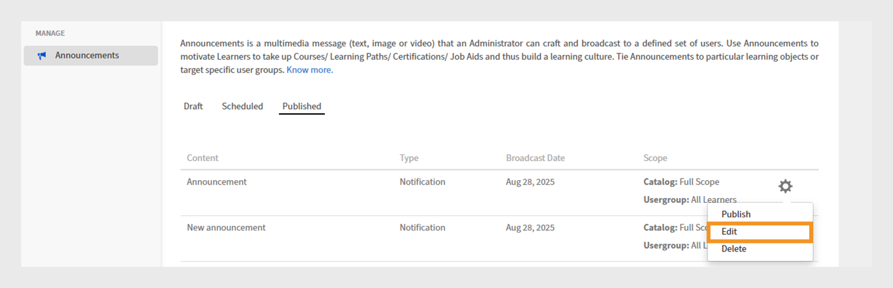
   _Announcement screen showing the published announcements with edit, publish and other options_

6. Select **Reset**. 

   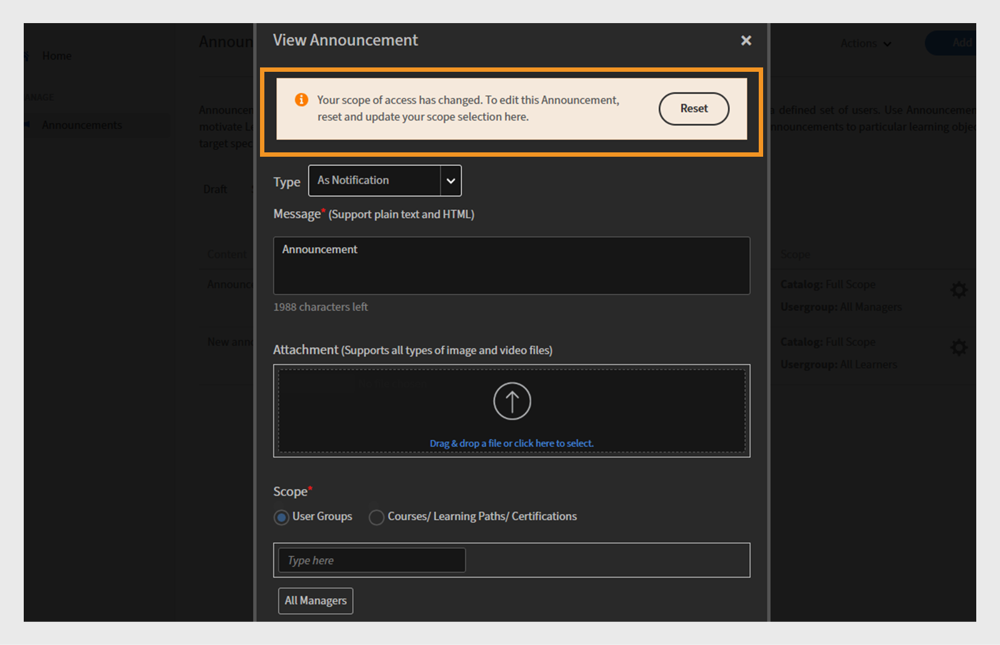
   _Announcement showing a scope change notification, with an option for custom administrators to reset and update the scope selection to reflect new access permissions_

The scope will be updated, and only users within the updated scope will be able to view the announcement.

### Edit the announcement through administrator UI

Administrators can view announcements created by custom administrators through their interface. They have the ability to edit these announcements only by modifying or removing the assigned scope. If scope changes are not made, administrators cannot make further edits to the announcement.

To edit the announcement through administrator UI:

1. Log in to Adobe Learning Manager as an administrator.
2. Select **[!UICONTROL Announcement]** in the left navigation pane.
3. Select **[!UICONTROL Published]** tab.
4. Select any announcement and then select setting icon.
5. Select **[!UICONTROL Edit]**. 

   
   _Announcement screen showing the published announcements with edit, publish and other options_

6. Select **[!UICONTROL Remove]**. 
   
   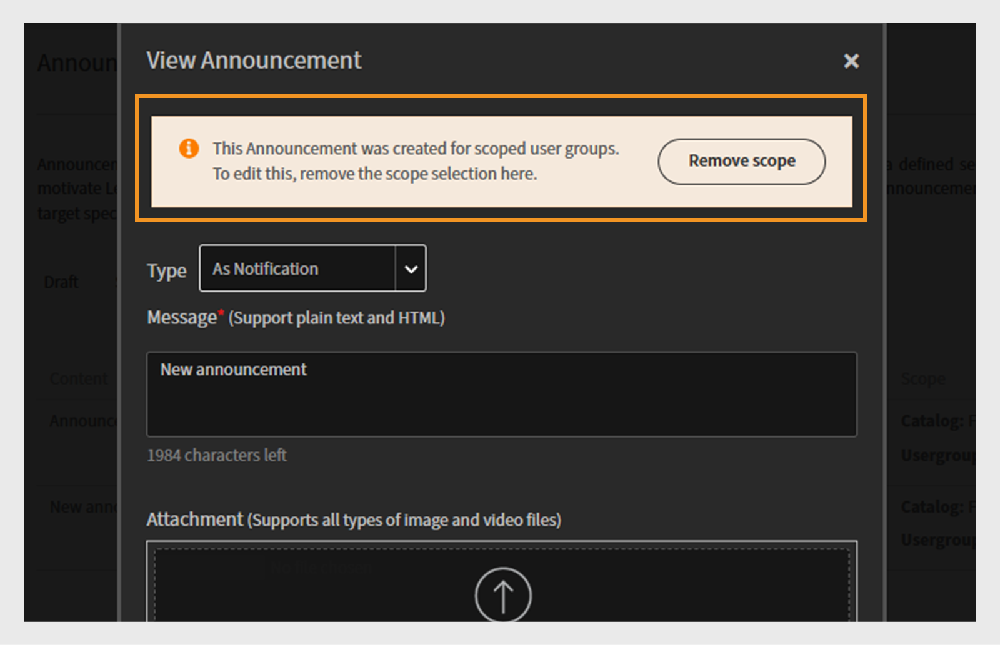
   _Announcement screen indicating that scope must be removed to allow administrators to edit announcements created for scoped user groups_

Administrator can edit the announcement after removing the scope.

## Tag users in social boards

**Overview**

Social learning boards now support user tagging functionality, enabling more targeted discussions and improved collaboration within learning communities. Learners can be tagged in social learning posts and comments through the learner app, APIs, and Adobe Learning Manager reference site.

**What's new**

* **@username tagging**: Users can tag other board members using the "@username" format.
* **Scope-restricted tagging**: Only users with access to the specific board can be tagged, ensuring privacy and relevance.
* **Multi-channel notifications**: Tagged users receive both in-app and email notifications with direct links to relevant posts or comments.

**Key features**

* Users outside the board's scope cannot be tagged, preventing unwanted notifications.
* If a tagged user is deleted from the system, their mention appears as "anonymous".
* Tagging user groups or "@all" is not permitted to prevent notification spam.

**Use cases**

* Healthcare professionals seeking input from specific colleagues on medical cases.
* Subject matter experts being consulted on specialized topics.
* Team discussions requiring input from specific stakeholders.
* Knowledge sharing sessions with targeted expert involvement.

### Tag users in social board posts

Learners can now tag specific board members in posts or comments using @username. Tagging is limited to members with access to that board.

To tag users in a social board:

1. Log in to Adobe Learning Manager as a learner. 
2. Select **[!UICONTROL Social Learning]** in the left navigation pane.
   
   
   _Enable collaborative learning by selecting Social Learning to access discussion boards, share insights, and tag users for interactive engagement_

3. Select **[!UICONTROL New Post]**.
   
   
   _Start a new discussion by selecting New Post in Social Learning to share knowledge with the tagged users_

4. Before tagging users, select the board from the **[!UICONTROL Post this to a Discussion Board]** option.

   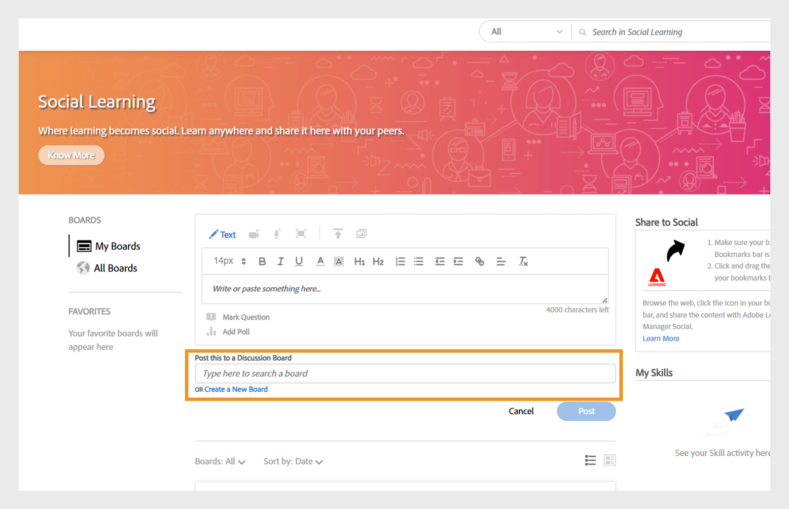
   _Select a discussion board to post and tag users, enabling targeted collaborative conversations in Social Learning_

5. Type your post details, then tag a user by entering the @ symbol followed by their name (for example, @andrew). When you type @ followed by the first three letters of the user's name, it displays a list of matching users.
 
   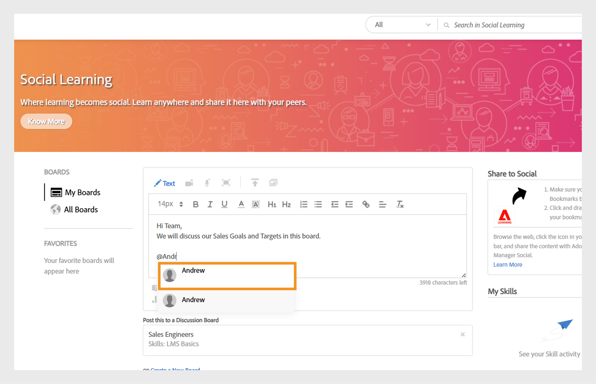
   _Tag users in your discussion post by typing @ followed by the username to enable targeted collaboration within Social Learning boards_

6. Select the desired user from the list.
7. Select **[!UICONTROL Post]**. 

The tagged users receive both in-app and email notifications with a direct link to the post, making discussions more targeted and collaborative.

### Tag users based on the board's scope

Scope-restricted tagging allows users to tag only those learners who have permission to access a specific board. This helps maintain privacy by preventing tagging of users outside the scope. 

If you try tagging learners who are outside the board's scope, no suggestions will appear, and you won't be able to tag them. Refer to this [article](/help/migrated/administrators/feature-summary/social-learning-configurations-as-an-admin.md) to learn more about Social Learning Scope. 

## Tag deleted users in comments

If a user who has been deleted is tagged in a Social Learning post, their name will show as Anonymous in the post. The comment and tag remain visible for context, but profile link or details are not shown.

 
_Social Learning post highlighting how a deleted user appears as Anonymous when tagged_

## Job Aids report with direct access links

**Overview**

The Job Aids report has been enhanced to include direct download links to job aids, streamlining content management and audit processes for administrators and authors.

**What's new**

* Job Aid Link column: Direct access to job aid files and external URLs from within the report.
* Role-based access control: Link accessibility depends on user roles and catalog permissions.
* Deleted job aids remain accessible if still linked to active courses.

**Key benefits**

* Direct file downloads and URL access from within the report.
* Eliminates manual effort in locating and downloading job aids for compliance or accessibility audits. 

**Use cases**

* Authors or administrators conduct regular accessibility audits on job aids, as required by large organizations.
* Any scenario where quick, role-based access to job aid files is needed for review or compliance.

### Job Aids Report with the new column

See this [article](/help/migrated/administrators/feature-summary/reports.md#job-aids-report) to learn how to download Job Aids Report.

The Job Aids Report can be downloaded from the Reports section and now includes direct download links for each job aid.

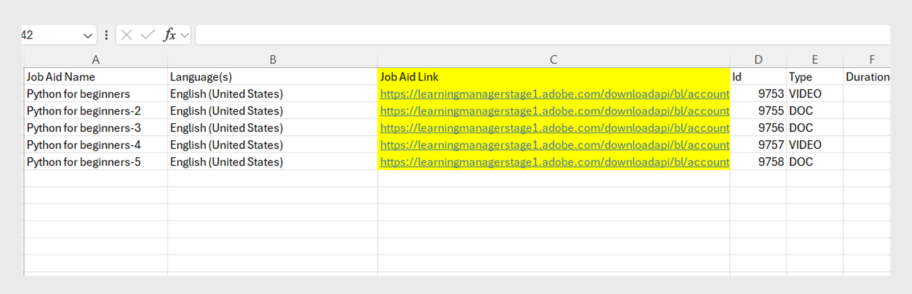 
_Job Aids Report displays direct download links, making it easy to access and download job aids in Adobe Learning Manager_

## API updates

### Learner API enhancements for quiz performance tracking

**Overview**

The `GET /loResourceGrades` API has been enhanced to provide detailed quiz performance data, enabling more sophisticated analytics and automated decision-making.

**What's new**

The API response now includes two additional fields:

* **[!UICONTROL highestScore]**: The best score achieved by a learner across all quiz attempts
* **[!UICONTROL maxScore]**: The total possible score for the quiz

**API response example**

```
{
    "links": {
        "self": "https://learningmanagerstage1.adobe.com/primeapi/v2/loResourceGrades/course:15067_30122_41715_1_3400468"
    },
    "data": {
        "id": "course:15067_30122_41715_1_3400468",
        "type": "learningObjectResourceGrade",
        "attributes": {
            "completed": false,
            "duration": 0,
            "hasPassed": false,
            "highestScore": 0,
            "maxScore": 0,. 
            "progressPercent": 0,
            "score": 0
        },
        "relationships": {
            "loResource": {
                "data": {
                    "id": "course:15067_30122_41715_1",
                    "type": "learningObjectResource"
                }
            }
        }
    }
}
```

In response, **course:15067_30122_41715_1_3400468** is the ID of the Learning Object resource grade for which the information is being requested. The `learningObjectResourceGrad`e id can be obtained from the `GET /enrollments/{id}` API.  

**Key benefits**

* Enables detailed quiz performance analysis for learning effectiveness measurement.
* Supports progression rules based on highest achievement rather than most recent attempts.
* Provides complete picture of learner quiz performance over time.

**How the API works**

1. A user attempts a quiz multiple times; each attempt is recorded.
2. The API provides both the highest score achieved and the maximum possible score for the quiz.
3. External systems can use this data to trigger automated actions, such as enrolling users in new courses based on their best performance.

**Use cases**

* Headless learning systems require automated enrollment decisions.
* Learning analytics platforms tracking learner achievement patterns.
* Compliance systems with performance-based progression requirements.

### Migration API enhancements

**Overview**
Adobe Learning Manager now supports the migration of various data objects into an account via the migration process. This process can be initiated via both APIs and the User Interface. When a migration fails, errors are available for download via the interface. These errors are useful in debugging migration errors and managing the migration runs. 

With this release, the error logs will also be available to download via the APIs for efficient, programmatic error tracking and debugging.

**API changes**

There is a new migration API, `runStatus`, which allows integration administrators to check the status of migration runs triggered via the API, something not possible in previous versions of Adobe Learning Manager. 

Additionally, `runStatus` API now provides a direct link to download error logs (CSV) for completed runs. Note that the link is valid for seven days only, and the logs are retained for one month.

The `startRun` API's response has been updated to include the migration project ID, sprint ID, and sprint run ID, which are required to query the new status endpoint. 

#### runStatus API

**Description**

Retrieves the status of an existing migration run.

**Endpoint**

```
GET /bulkimport/runStatus
```

**Parameters**

* **migrationProjectId**: (Required). A unique identifier for a migration project. A migration project is used to transfer data and content from an existing Learning Management System (LMS) to Adobe Learning Manager. Each migration project can consist of multiple sprints, which are smaller units of migration tasks.

* **sprintId**: (Required). A unique identifier for a sprint within a migration project. A sprint is a subset of migration tasks that includes specific learning items (e.g., courses, modules, learner records) to be migrated from an existing LMS to Adobe Learning Manager. Each sprint can be executed independently, allowing for phased migration.

* **sprintRunId**: (Required). A unique identifier used to track the execution of a specific sprint within a migration project. It's associated with the actual migration process for the items defined in a sprint. The sprintRunId helps in monitoring, troubleshooting, and managing the migration job.

**Response**

```
{
  "sprintId": 2510080,
  "sprintRunId": 2740845,
  "migrationProjectId": 2509173,
  "startTime": 1746524711052,
  "endTime": 1746524711052,
  [
    {
      "id": 2609923,
      "lastHeartbeatTime": 1746524711052,
      "objectName": "content",
      "jobState": "COMPLETED",
      "errorCsvLink": "",
      "errorLogLink": "migration/5830/2509173/2510080/2740845/content_err.csv",
      "sequenceNumber": 1
    },
    {
      "id": 2609922,
      "lastHeartbeatTime": 1746524713577,
      "objectName": "course",
      "jobState": "WAITING_IN_QUEUE",
      "errorCsvLink": "",
      "errorLogLink": null,
      "sequenceNumber": 2
    }
  ]
}
```

#### startRun API

The `startRun` API response was updated to include three additional fields- migrationProjectId, sprintId, and sprintRunId. These fields allow users to track and query the status of specific migration runs using the new runStatus API.

```
curl -X GET --header 'Accept: text/html' 'https://learningmanager.adobe.com/primeapi/v2/bulkimport/runStatus?migrationProjectId=001&sprintId=10001&sprintRunId=7'
```

Produces the following response. The response contains:

* migrationId
* sprintId
* sprintRunId

**Response**

```
{
  "status": "OK",
  "title": "BULKIMPORT_RUN_INITIATED_SUCCESSFULLY",
  "source": {
    "info": "Success",
    "migrationInfo": {
      "migrationProjectId": "001",
      "sprintId": "10001",
      "sprintRunId": "7"
    }
  }
}
```

### Social API changes (user tag, comments, and replies)

**Overview**

Adobe Learning Manager now supports @user tagging functionality in Social Learning boards, enabling learners to mention and notify peers within posts, comments, and replies. This feature enhances collaboration and content discovery across the platform.

This release introduces new API capabilities to support user mentions, including enhanced POST and GET endpoints, as well as a new search functionality for tagged users.

**API changes overview**

* Updated POST APIs for creating posts/comments/replies with user mentions
* Updated GET APIs with user mention data in responses

**Format of user mentions**

A user is mentioned using the format: @(user:userId)

#### Create post with mentions

**Endpoint**

```
POST /primeapi/v2/posts
```

**Description**

Create a new social learning post with user mentions.

**Request body**

```
{
  "data": {
    "type": "post",
    "attributes": {
      "boardId": 13282,
      "accountId": 11152,
      "text": "<p>This is a new post mentioning @[user:11257229]</p>",
      "createdByUserId": 11257228,
      "postType": "discussion"
    },
    "id": null
  }
}
```

**Response**

Standard post creation response with mention data included in the _userMentions_ relationship.

#### Create comment with mentions

**Endpoint**

```
POST /primeapi/v2/comments
```

**Description** 

Add a comment to a post with user mentions.

**Request body**

```
{
  "data": {
    "type": "comment",
    "attributes": {
      "postId": 20746,
      "accountId": 11152,
      "text": "<p>Test Comment @[user:11257229]</p>",
      "createdByUserId": 11257228,
      "commentLevel": 0
    },
    "id": null
  }
}
```

#### Create reply with mentions

**Endpoint**

```
POST /primeapi/v2/replies
```

**Description**

Reply to a comment with user mentions.

**Request body**

```
{
  "data": {
    "type": "reply",
    "attributes": {
      "postId": 20746,
      "accountId": 11152,
      "text": "<p>Thanks for the update @[user:11257229]</p>",
      "createdByUserId": 11257228,
      "commentLevel": 1,
      "parentCommentId": 55621
    },
    "id": null
  }
}
```

#### Retrieve posts with mentions

**Endpoint**

```
GET /primeapi/v2/posts/{id}
```

**Description**

Retrieve post details, including mentioned users.

**Response**

```
{
  "links": {
    "self": "https://learningmanager.adobe.com/primeapi/v2/posts/7522"
  },
  "data": {
    "id": "7522",
    "type": "post",
    "attributes": {
      "commentCount": 3,
      "dateCreated": "2025-06-10T11:33:29.000Z",
      "dateUpdated": "2025-06-25T14:52:04.000Z",
      "downVote": 0,
      "postingType": "DEFAULT",
      "richText": "<p>my updated fourth post @[user:14707776] second mention my first post</p>",
      "state": "ACTIVE",
      "text": "my updated fourth post @[user:14707776] second mention my first post",
      "upVote": 0,
      "viewsCount": 0
    },
    "relationships": {
      "createdBy": {
        "data": {
          "id": "14707776",
          "type": "user"
        }
      },
      "parent": {
        "data": {
          "id": "3971",
          "type": "board"
        }
      },
      "userMentions": {
        "data": [
          {
            "id": "14707776",
            "type": "user"
          }
        ]
      }
    }
  },
  "included": [
    {
      "id": "14707776",
      "type": "user",
      "attributes": {
        "avatarUrl": "https://cpcontents.adobe.com/public/images/default_user_avatar.svg",
        "binUserId": "45664b87-75a3-43ec-b0b7-5064958eac6f",
        "email": "user@example.com",
        "enrollOnClick": false,
        "fields": {
          "Location": "BLR"
        },
        "gamificationEnabled": true,
        "lastLoginDate": "2025-06-27T11:21:17.000Z",
        "name": "John Doe",
        "pointsEarned": 1690,
        "pointsRedeemed": 0,
        "preferredResolution": "AUTO",
        "profile": "admin",
        "roles": [
          "Learner",
          "Admin",
          "Author",
          "Instructor",
          "Integration Admin",
          "Manager"
        ],
        "state": "ACTIVE",
        "userType": "Internal"
      },
      "relationships": {
        "account": {
          "data": {
            "id": "9238",
            "type": "account"
          }
        }
      }
    }
  ]
}
```

### Social API changes (user search)

**Endpoint**

```
GET /primeapi/v2/users/search?q={searchTerm}&context=tagging
```

**Description**

Search for users available for tagging based on social scope settings.

**Request parameters**


* q (required): Search term (minimum 3 characters).
* context: Set to "tagging" to get users eligible for mentions.
* boardId (optional): Board ID to filter users based on access permissions.

**Response**

```
{
  "data": [
    {
      "id": "11257229",
      "type": "user",
      "attributes": {
        "name": "Jane Smith",
        "email": "jane.smith@example.com",
        "avatarUrl": "https://cpcontents.adobe.com/public/images/default_user_avatar.svg",
        "userType": "Internal",
        "state": "ACTIVE"
      }
    }
  ]
}
```

### Implementation guidelines

#### Character limits

* Posts: 4000-character limit applies, with each tagged user reducing available characters by a fixed amount.
* Comments: 1000-character limit.

#### Mention validation

* Users can only be tagged by username or email (not UUID).
* Internal users cannot tag external users and vice versa.
* Tagging availability follows existing social scope settings.
* Board permissions determine tagging eligibility (Public/Private).

#### Notifications

* Multiple mentions of the same user in one post result in a single notification.
* Original post owner receives notifications only when specifically tagged.

#### Error handling

* Invalid user IDs in mentions return validation errors.
* GDPR and soft-deleted users appear anonymous in tagged content.

### Language-based learner progress

Currently, learner progress is tracked only for the selected locale language, causing significant progress loss when switching languages/locales in the player. This limitation creates poor user experience where learners lose their learning progress when exploring content in different languages.

**Current issues**

* **Progress override**: The progress for each module in the player is tracked at both the user and module levels. This leads to a situation where a user's progress is overridden when they switch back to a previously used locale for the same module.
* **Progress reset**: For instance, if a learner achieves 75% progress in Locale A (English) and then switches to Locale B (Spanish), upon returning to Locale A, their progress resets to 0% instead of resuming from 75%.

To resolve these limitations, the API has been enhanced to support locale-specific progress tracking:

* **Locale-specific storage**: When a learner switches locales (for example, from Locale A to Locale B) within the player, the system now saves the progress state separately for each locale of the content.
* **Progress resumption**: When the user switches back to a previously used locale (from Locale B back to Locale A), the content resumes from where they left off in that specific locale.
* **Independent progress tracking**: Each locale maintains its own state of progress, allowing learners to explore content in multiple languages without losing their individual progress in each language.

#### API changes

The following APIs have been enhanced to support the new locale parameter:

* GET Player State API
* POST Player State API

#### GET Player State API

**Endpoint**

```
GET /primeapi/v2/users/{userId}/playerState
```

**Description**

Retrieves the current state of a learning object for a specific user and locale.

**Parameters**

|Parameter |Type |Location |Required |Description |
|---|---|---|---|---|
|userId |String |Path |Yes |Unique identifier of the user |
|loId |String |Query |Yes |Learning Object identifier in format lo:{id} |
|loResourceId |String |Query |Yes |Learning Object resource identifier in format course:{loId_loInstanceId_moduleId_moduleVersion}|
|csrf_token |String |Query |Yes |CSRF protection token |
|locale |String |Query |Optional |Locale identifier for language-specific progress (e.g., "en-US", "es-ES") |

**Example request**

```
GET /primeapi/v2/users/12345/playerState?loId=lo:67890&loResourceId=course:67890_1_mod123_v2&csrf_token=abc123&locale=en-US
```

**Response behavior**

* If the locale parameter is provided and a locale-specific state exists, the API returns the progress for that locale.
* If the locale parameter is provided but no locale-specific state exists, the API performs a fallback search for the default state.
* If the locale parameter is omitted, the API returns the default state (maintains backward compatibility).
* For headless requests where the locale is null, the API falls back to the default state lookup.

#### POST Player State API

**Endpoint**

POST /primeapi/v2/users/{userId}/playerState

**Description**

Updates or creates the current state of a learning object for a specific user and locale.

**Parameters**

|Parameter |Type |Location |Required |Description |
|---|---|---|---|---|
|userId |String |Path |Yes |Unique identifier of the user |
|loId |String |Query |Yes |Learning Object identifier in format lo:{id} |
|loResourceId |String |Query |Yes |Learning Object resource identifier in format course:{loId_loInstanceId_moduleId_moduleVersion} |
|csrf_token |String |Query |Yes |CSRF protection token |
|locale |String |Query |Optional |Locale identifier for language-sp|

**Request body**

The request body contains the Learning Object state data specific to the locale.

**Example request**

```
POST /primeapi/v2/users/12345/playerState?loId=lo:67890&loResourceId=course:67890_1_mod123_v2&csrf_token=abc123&locale=en-US
```

```
{
  "progress": 75,
  "completionStatus": "incomplete",
  "timeSpent": 1800,
  "lastAccessedPage": 5,
  // Additional state data
}
```

The API creates or updates the Learning Object state for the specified locale.

## Go1 integration enhancements

**Overview**

Go1 integration is enhanced to allow direct curation of Go1 courses for creating Learning Programs (LP) within Adobe Learning Manager. This update supports the inclusion of Go1 courses in recurring certifications and introduces a new version of the Go1 content hub experience, enabling more efficient course curation.

**What's new**

* Create and manage playlists directly within Go1 using AI chat assistance or manual selection.
* Include Go1 courses in recurring certification cycles with automatic progress reset.
* Upgraded content discovery interface for improved browsing and content curation.

**Key benefits**

* AI-assisted playlist creation significantly speeds content grouping and delivery.
* Enables use of Go1 content for recurring regulatory training requirements.
* Clear preview-and-purchase model supports informed content investment decisions.
* Improved discovery and curation tools for better content management.

**Important notes**

* All Go1 features require an active Go1 license.
* Previous free Go1 content will be decommissioned. Organizations must preview and purchase required content bundles.
* Administrators and authors can create and manage playlists; learners maintain view-only access.

**Use cases**

* Organizations requiring extensive external content libraries for comprehensive training programs.
* Compliance-focused training programs needing regular content updates and delivery cycles.
* Learning teams are seeking to reduce content curation overhead through AI assistance.

### Add Go1 playlist to a Learning Path

Administrators can create a learning path that includes a Go1 playlist, so learners can access selected third-party courses as part of their training.

To create a learning path:

1. Log in to Adobe Learning Manager as an administrator.
2. Select **[!UICONTROL Learning Paths]** in the left navigation pane. 
3. Select **[!UICONTROL Add]**. 

   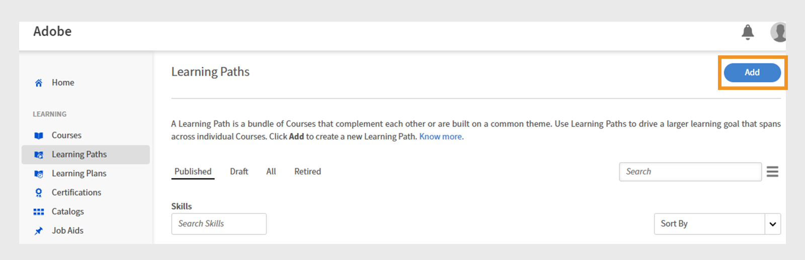
   _Select Add in the Learning Paths section to create and organize new structured training programs for your learners_

4. Type the required details and select **[!UICONTROL Save]**. See this [article](/help/migrated/administrators/feature-summary/learning-paths.md) for more information. 
5. Select **[!UICONTROL Add Go1 Courses]**.

   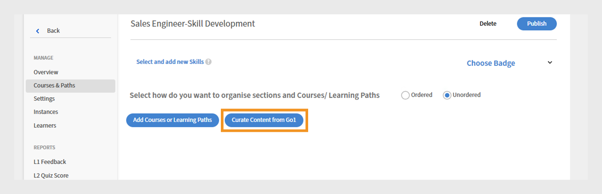
   _Add Go1 courses to your Sales Engineers Skill Development playlist to expand learning options with curated third-party content_

6. In the **[!UICONTROL Library]**, search for and select **[!UICONTROL Create playlist]** and choose from one of the following:
    a. **[!UICONTROL with AI]**: Create a playlist with the help of AI.
    b. **[!UICONTROL by myself]**: Create a playlist by manually adding courses to it. 

**Create a playlist with AI**

Administrators can type the playlist description in the AI prompt. The AI will curate the related courses and create a playlist based on the requirements. AI generates playlists by interpreting the learning goal or prompt provided by the user. When creating a playlist, admins can select to curate content 'with AI' which allows the system to use large language models to understand the specified learning objectives and content preferences like duration and type. The AI then searches the content library for relevant learning objects that match these criteria.

To create a playlist with AI:

1. Select **[!UICONTROL Create playlist]** and then select **[!UICONTROL with AI]**.
   
   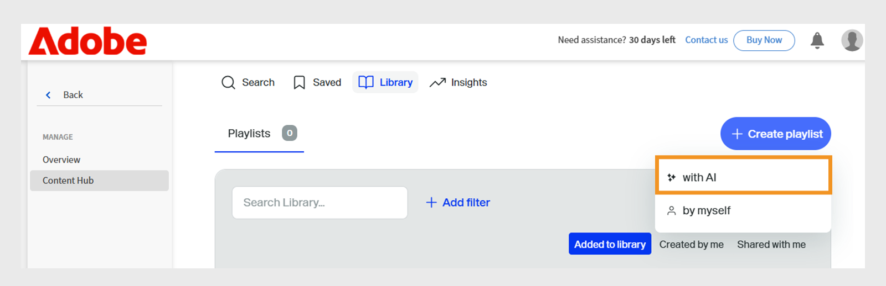
   _Create curated playlists with AI, which enables automated course recommendations tailored to learner needs_

2. Type a short description about your playlist in the **[!UICONTROL Enter your learning goal]** text field.
3. Select **[!UICONTROL Next]**. 
   
   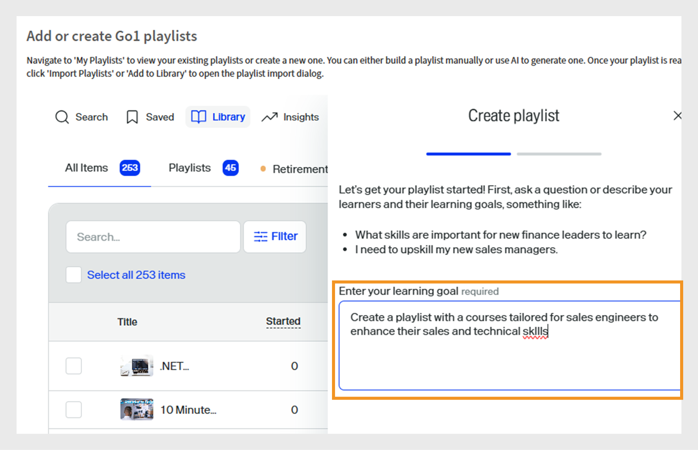
   _Type your learning goal to create a custom playlist, helping Adobe Learning Manager recommend targeted courses tailored to your learners' needs_

4. Choose the skills from the list.
   
   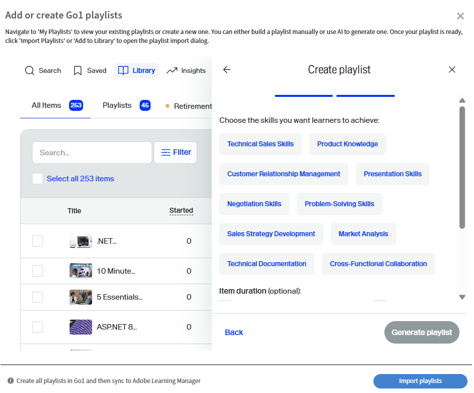
   _Choose the skills from the list to curate the courses for the Sales Engineer_
5. Select the course duration and type for your playlist.
6. Select **[!UICONTROL Generate playlist]**. The playlist is created with 10 courses, and administrators can use it to create a Learning Path.
   
   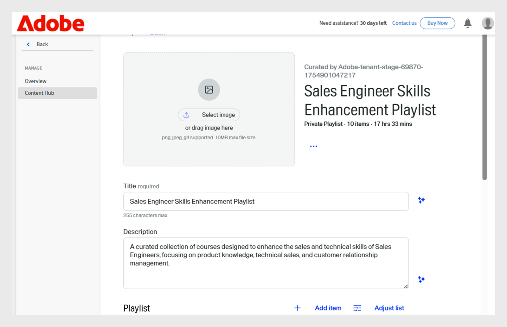
   _Review your curated Sales Engineer Skills Enhancement Playlist in Adobe Learning Manager_
7. Select **[!UICONTROL Add to Library]**.
8. Select **Yes** in the confirmation prompt.
9. Select the playlist from the **[!UICONTROL Select playlist to import prompt]**. 

   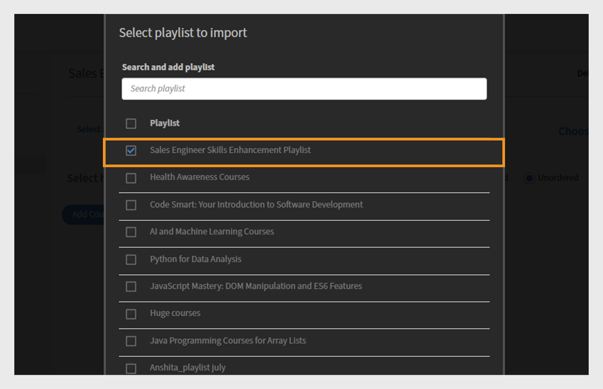
   _Select and import the Sales Engineer Skills Enhancement Playlist from the Go1 Library in Adobe Learning Manager_

10. Select **[!UICONTROL Add Playlists to Learning Path]** and then **[!UICONTROL Publish]**. 

The courses in the playlist will be added to the Learning Path. Administrators can then enroll learners, who can immediately begin taking the courses.

**Create a playlist manually**

Manually select courses that best match learners' requirements and curate additional relevant courses.

To create a playlist manually:

1. Select **[!UICONTROL Create playlist]** and then select **[!UICONTROL by myself]**.
   
   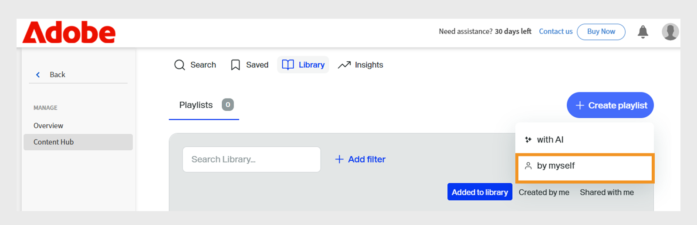
   _Manually create a playlist giving administrators full control to curate courses based on specific learner needs_

2. Type the title and description of your playlist.
 
   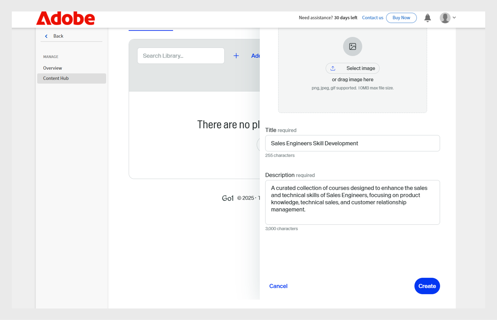
   _Add a title and description to your playlist in Adobe Learning Manager to clearly define its purpose and help guide learners toward targeted skill development_

3. Select **[!UICONTROL Create]**. 
4. Select **[!UICONTROL Add item]** to add the related courses. 
   
   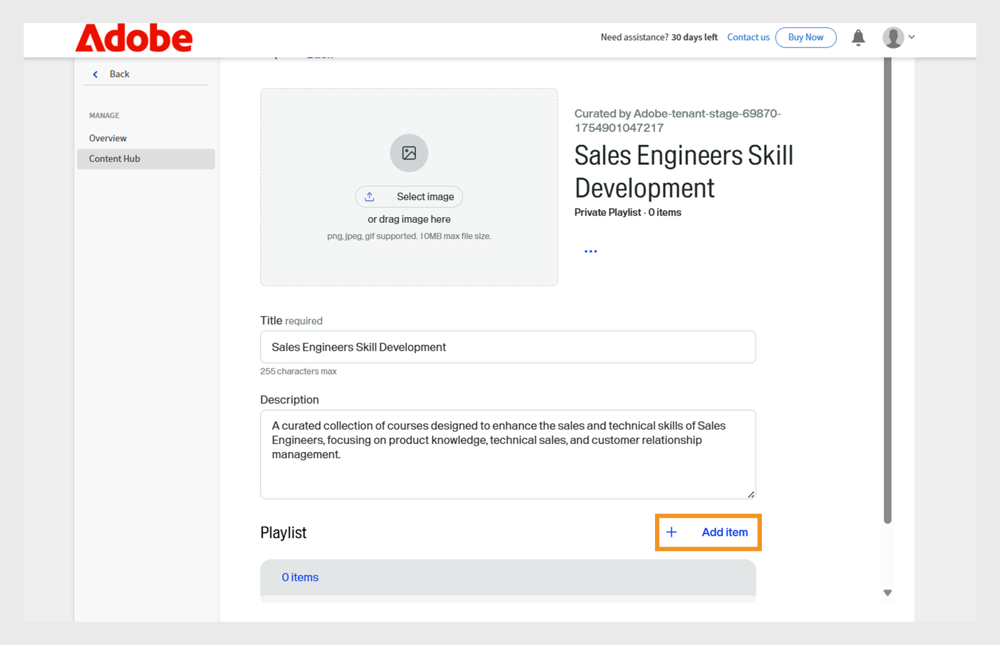
   _Add items to your Sales Engineers Skill Development playlist in Adobe Learning Manager to curate targeted courses_

5. Search and select the required courses. 

The playlist has been created with related courses, and administrators can use it to create a learning path. 

## Save player state progress for languages

**Overview**

The Fluidic Player now saves your progress separately for each language within a module. This means you can switch between languages and pick up exactly where you left off in each one, instead of losing your progress and starting over.

**Key benefits**

* Jump between languages and resume from your exact position in each one.
* Perfect for learners who need to access content in multiple languages during their learning journey.
* Complete the module in any language while maintaining progress in all languages you've accessed.

**Use cases**

* Global organizations with employees who speak multiple languages and may need to reference content in their native language and English.
* Compliance training where learners might start in one language but need to complete in another for certification purposes.
* Technical training programs where learners might understand concepts better in their native language but need English terminology for their work.

**Important notes**

* The Fluidic Player's language preference is retained within a session. If a learner changes the language and moves to another module, the new language is used for subsequent modules, as long as the player remains open.
* The grade (completion status) is still tracked at the module level, not per locale. The first locale in which the completion criteria are met will update the grade for the module. If a learner completes the module in one language and then switches to another, any further grade updates will be overwritten from the previous grade, but progress for each locale is still preserved.

## Custom roles import support in incremental user import

Adobe Learning Manager now supports custom role imports in the existing multi-incremental user import workflow (regular full user import + incremental enabled flow). This enhancement allows role.csv and user_role.csv files to be uploaded and processed incrementally, without requiring full data uploads each time.

Previously, role.csv and user_role.csv files could only be uploaded in full mode, meaning administrators had to include all previously added role definitions and assignments in every upload. With this new incremental support, only new or modified role data needs to be uploaded, reducing overheads and improving efficiency.

**What's new**

1. Incremental support for custom roles and role assignments:

    * role.csv  and  user_role.csv can now be processed incrementally in the multi-file incremental workflow.
    * No need to upload all existing role and user role data with every import.

2. Enhanced multi-incremental workflow implementation:

    * Create separate folders in FTP for each uploaded user import file.
    * Each folder contains:

        * The user import file- (File1.csv)
        * Corresponding role and role assignment files- (File1_role.csv, File1_user_role.csv)

    For example, user1.csv corresponds to user1_role.csv (custom roles) and user1_user_roles.csv (user-role mapping).

    **Example FTP structure before processing:**

    ```
    import/user/internal/  
         File1.csv  
         File2.csv  
        File3.csv  

    UserRole/  
        File1_role.csv  
        File1_user_role.csv  
        File2_role.csv  
        File2_user_role.csv  
        File3_role.csv  
        File3_user_role.csv  
    ```
 
3. Adobe Learning Manager also supports up to 20 incremental user CSVs and their corresponding custom roles CSVs, making it suitable for large-scale operations.

**Use cases**

* Global companies manage regional teams by uploading multiple incremental user files for each region (EU, America, Asia), allowing administrators to update users and assign new roles for each region in a single workflow.
* Large enterprises automate onboarding and permissions by regularly ingesting incremental user updates from HR systems. This supports seamless updates to user profiles and granular role assignments without manual intervention.

### New columns added to CSV files

Three new columns have been introduced to enhance the data captured in user, role, and user-role CSV exports/imports:

* **User Registration State (user.csv)**: Indicates the current registration status of the user.
* **Role State (role.csv)**: Indicates the current status of roles within the system.
* **User Role State (user_role.csv)**: Indicates the status of the user-role association. 

>[!NOTE]
>
>The above CSV changes apply only to the accounts that use incremental users.

Download the [sample CSVs](assets/sample-csv-Incremnetal.zip) here. 

## Reset recommendations in Salesforce app

**Overview**

Previously, learners using the Adobe Learning Manager Salesforce app could only select roles and recommendation preferences once. If their role changed, they were required to access the native Adobe Learning Manager app to update their profile and receive relevant course recommendations. This made the learning experience and contributed to lower engagement within the Salesforce environment.

**What's new**

Adobe Learning Manager now features a  **[!UICONTROL Reset Interests]** button within the Salesforce app. Learners can now reset their roles and learning preferences without needing to leave Salesforce or sign in into the native Adobe Learning Manager app. This enhancement streamlines access to personalized learning content, ensuring recommendations remain relevant as users' roles evolve.

**Use cases**

* Learners who change job roles, teams, or responsibilities can quickly reset their preferences to receive updated and relevant course recommendations all within the Salesforce app.
* By removing the need to switch to the native Adobe Learning Manager app, the learning journey is smoother, encouraging ongoing engagement and consumption of recommended content through Salesforce.
* Administrators benefit from higher rates of learning completion and better alignment between user roles and recommended content, without extra support or guidance on switching platforms.

### Reset interest in the Salesforce app

To reset the interests and recommendations from the Salesforce app:

1. Log in to Adobe Learning Manager app for Salesforce as a learner.
2. Select **[!UICONTROL Reset Interests]** option at the bottom.

The learner's recommendation or interest will be reset from the Adobe Learning Manager Salesforce app. 

## Create learning portals with Experience Builder

>[!IMPORTANT]
>
>We are excited to announce that Experience Builder, the innovative tool for creating customizable learning portals, will be available following the October 2025 release of Adobe Learning Manager.
>
>Stay tuned for more updates as we approach the release date. We look forward to seeing how you use Experience Builder to transform your learning portals.
>
>For any questions or additional information, contact your Customer Success Manager.

**Introduction**

Experience Builder is a no-code/low-code tool in Adobe Learning Manager that helps you create customized learning portals. It allows you to design branded, user-friendly learning portals without needing technical skills or extensive coding knowledge.
With Experience Builder, you can create new pages, menus, and widgets to deliver personalized learning experiences for your audience quickly and easily. With Experience Builder, you can quickly create new pages, menus, and widgets to deliver personalized learning experiences for your audience.

**Problem statement**

Before Experience Builder, organizations faced several challenges:

1. **Limited customization**: Portals had fixed designs with few options to reflect your brand. Administrators could only make basic changes, such as modifying headers, footers, or colors, which limited the ability to create unique experiences.
2. **Cost**: Building custom portals required expensive developers and long timelines, often taking 6 to 9 months to complete. This approach increased the total cost of ownership and delayed deployment.
3. **Generic experiences**: Everyone saw the same content, even if it wasn't relevant to their role or needs. This lack of personalization reduced learner engagement and satisfaction.
4. **Technical barriers**: Non-technical administrators struggled to create or update portals because they needed coding knowledge or external support.

Experience Builder solves these problems by providing a simple, no-code/low-code solution for creating personalized, branded portals.

It allows administrators to design portals that meet their organization's needs without relying on technical expertise or external developers.

**Key benefits**

**Easy customization**

* Design portals that match your brand with custom headers, footers, logos, and layouts.
* Use widgets to add dynamic content like courses, categories, and HTML elements.
* Create pages and menus tailored to specific audiences, ensuring learners see relevant content.

**No-code/low-code solution**

* Administrators can create and manage portals without coding knowledge, making it accessible to non-technical users.
* Drag-and-drop functionality simplifies the process of building pages and menus.

**Personalized learning**

* Configure pages and menus to display content relevant to specific user groups, such as sales teams, designers, or engineers.
* Use hidden pages to provide exclusive content accessible only through direct links.

**Global reach**

* Create multilingual pages to support learners around the world.
* Localize content to cater to diverse audiences and improve accessibility.

**Mobile-friendly**

* Learners can access content on any device, including phones and tablets.
* Preview pages in both desktop and mobile views to ensure a smooth experience.

**Real-world use cases**

**Branded portals**

* Create a learning portal that looks like your company's website, complete with logos, colors, and layouts.
* For example, a healthcare company can design a portal that matches its corporate branding while integrating learning content.

**Role-based learning**

* Build pages for specific roles, like engineers, sales teams, or designers.
* For instance, sales teams might see product training, while engineers access technical courses.

**Product training**

* Set up separate pages for different products, such as Photoshop, Illustrator, or other offerings.
* Each page can include widgets displaying courses, certifications, and resources related to the product.

**Employee and customer training**

* Use the portal for onboarding new employees, training external partners, or educating customers about your products.
* For example, a software company can create a portal for customer tutorials and troubleshooting guides.

**Localized content**

* Offer content in multiple languages for global learners.
* For instance, a multinational company can create pages in English, Spanish, and French to cater to its diverse workforce.

### Building blocks of Experience Builder

The main components and building blocks of Experience Builder are structured to provide flexibility, ease of use, and targeted learning experiences. Below is a detailed breakdown:

#### Pages

Pages are the foundation of building a learning portal in Experience Builder. Administrators can create new pages tailored to specific audiences or purposes. Additionally, administrators can:

* Create custom pages with flexible layouts (rows and columns).
* Add widgets to populate pages with content.
* Manage page lifecycle with draft and published states.
* Hide pages from menus while keeping them accessible via direct links.

For example, a page for sales training might include widgets displaying relevant courses, testimonials, and a calendar of upcoming sessions.

#### Menus

Menus organize pages into navigable structures for learners. Administrators can:

* Create custom menus to group pages for specific user groups.
* Add hierarchy and ordering to prioritize visibility for specific audiences.
* Include submenus for grouping related pages.

For example, a menu called Resources might include pages for eBooks, videos, and FAQs.

#### Widgets

Widgets allow administrators to add dynamic content and functionality to pages. The following widgets are available:

* Calendar
* Categories
* Compliance Status
* Courses & Paths
* Content Box
* Gamification
* HTML
* Iframe
* My Learning
* Social Learning

For example, a page might include a Courses & Paths widget to display recommended courses and a Calendar widget for upcoming training sessions.

#### Branding tools

Experience Builder provides tools to customize the appearance of the portal. Administrators can:

* Customize headers, footers, and layouts to match corporate branding.
* Use CSS and JavaScript for advanced styling.

For example, a healthcare company might use branding tools to create a portal that matches their corporate website's look and feel.

### Get started with Experience Builder

A software company wants to build a training portal for its customers. The portal will have pages for different products like Photoshop and Illustrator, organized in menus. It will include widgets that show courses, certifications, and upcoming training sessions.

#### Create a page

To create a page in Adobe Learning Manager:

1. Log in to Adobe Learning Manager as an administrator. 
2. Select **[!UICONTROL Branding]** in the left navigation pane. 
3. Select **[!UICONTROL Custom Pages]**.
4. Select **[!UICONTROL Create page]**.

   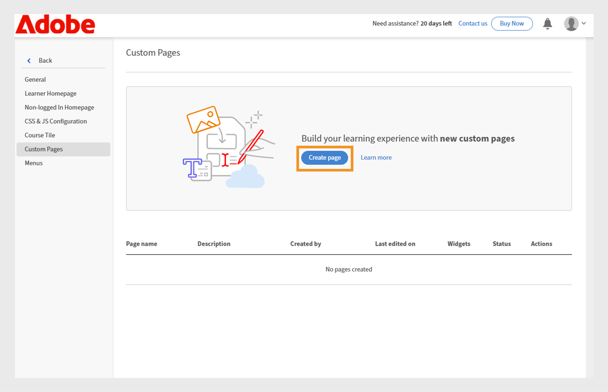
   _Custom Pages screen showing the Create page option to design new custom learning experiences_

5. Type the **[!UICONTROL Page name]** (for example, Photoshop training).
6. Type the **[!UICONTROL Page description]** (for example, Learn how to use Photoshop effectively). 
7. Select the page type from the following:

    * **[!UICONTROL Build using ALM widgets]**: Administrator can create a page using the existing Adobe Learning Manager widgets.
    * **[!UICONTROL External page]**: The administrator can add a URL for the external page. If you select the page type as external, add the URL in the Page URL text field.

8. Select the **[!UICONTROL Change icon]** to change the page's icon.
 
   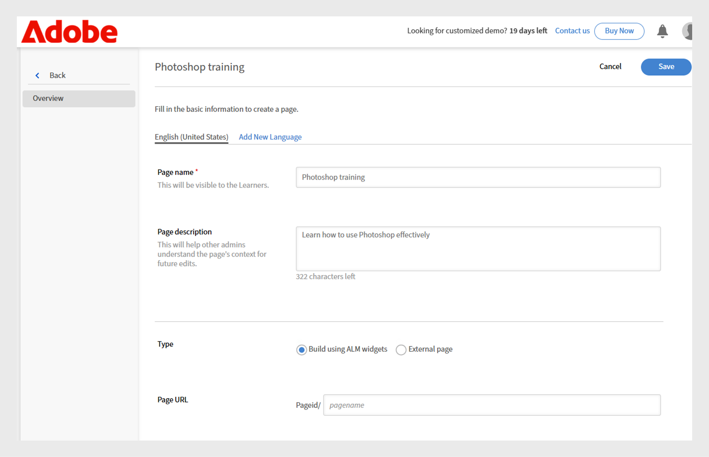
   _Courses page creation screen displaying options to type the page name, description, type, and icon for a customized learner page_
9. Select **[!UICONTROL Add New Language]** to add the default language for the page. 
10. Select **[!UICONTROL Save]**. 

The page has been created and saved as a draft in the Custom Pages section. Administrators can edit and design the drafted pages using the widgets. 

#### Design page in Experience Builder

Adobe Learning Manager enables administrators to design pages tailored to their requirements using customizable widgets.
To design the page in Experience Builder:

1. Log in to Adobe Learning Manager as an administrator. 
2. Select **[!UICONTROL Branding]** in the left navigation pane. 
3. Select **[!UICONTROL Custom Pages]** and then select the required page. 
4. Select **[!UICONTROL Page Design]**.  
5. Select **[!UICONTROL Edit]**. 
 
   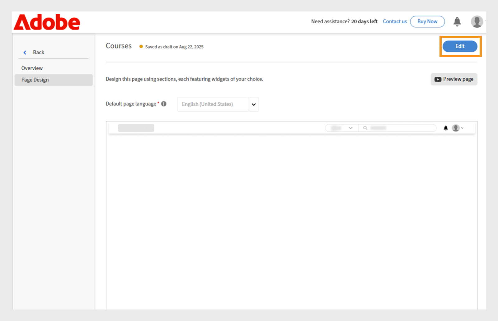
   _Edit mode allows administrators to design course pages by organizing sections and adding widgets in their preferred language_

6. Choose the options from **[!UICONTROL Select section layout]** dropdown.
7. Select a section from the following based on the number and size of the widgets you want to add in the section:

    * **[!UICONTROL 1 column-Full section width]**: Content spans the entire section width for maximum space.
    * **[!UICONTROL 2 columns-1/2 section width each]**: Two equal-width columns split the section evenly.
    * **[!UICONTROL 2 columns-2/3 and 1/3 section width respectively]**: Main content takes two-thirds, side content one-third.
    * **[!UICONTROL 2 columns-1/3 and 2/3 section width respectively]**: Side content takes one-third, main content two-thirds.
    * **[!UICONTROL 3 columns-1/3 section width each]**: Three equal-width columns divide the section into thirds.
 
   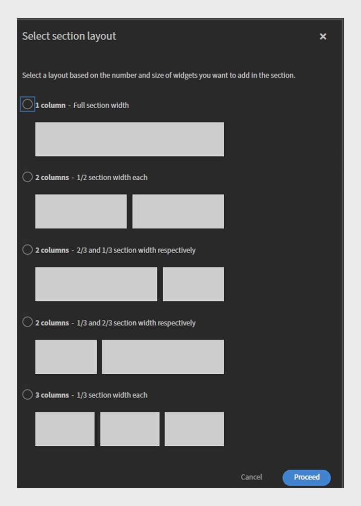
   _Section layout selection dialog allows administrators to choose single or multi-column widget arrangements for custom page design_

8. Select **[!UICONTROL Proceed]**.
9. Select **[!UICONTROL Add widget]**.
 
   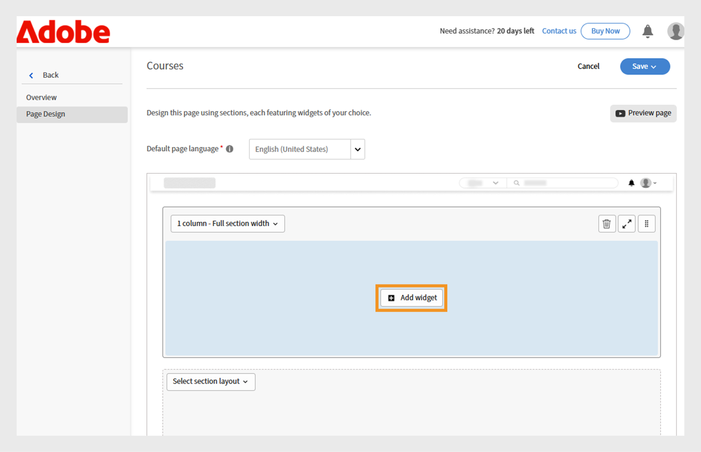
   _The page design screen allows administrators to select and add widgets to customize their course pages_

10. Choose the required widget and then select **[!UICONTROL Proceed]**. 
11. Configure the widget and select **[!UICONTROL Add widget]**. See this [section](#add-and-configure-widgets) for adding and configuring the widgets.
12. Select **[!UICONTROL Save]** and choose from the following options:

    * **[!UICONTROL Save as Draft]**: The page will be saved as a draft. The administrator can edit the page later.
    * **[!UICONTROL Save & Publish]**: The page will be published, and the administrator can add this page to the Menu. 
   
   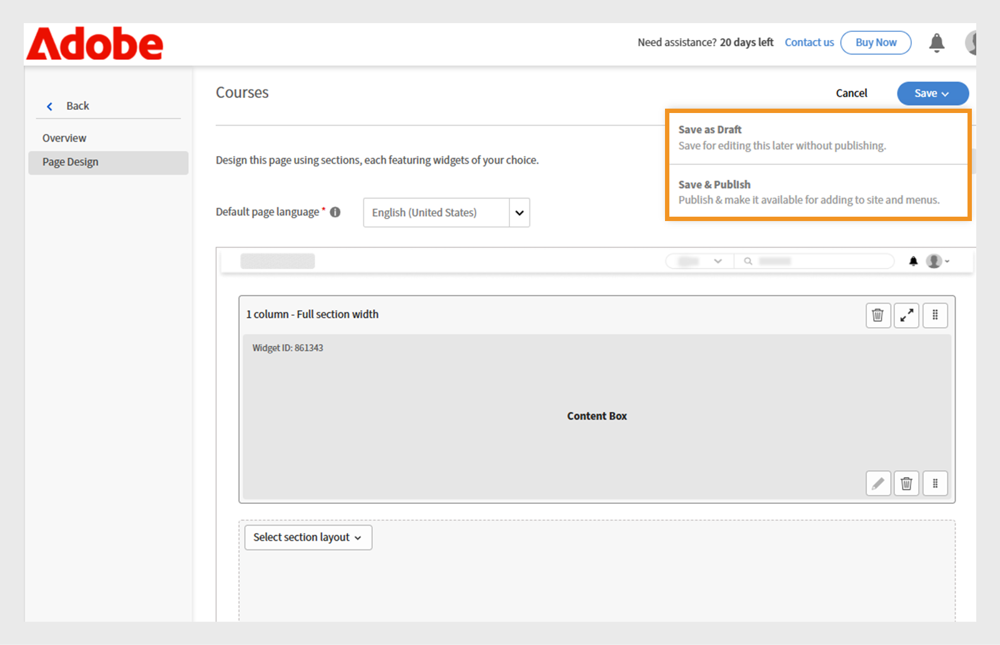
   _Save options allow administrators to choose between saving a page as a draft for future editing or publishing it for learner access_

The page can be saved as a draft or published. Administrators can edit drafts before publishing and can also update and republish published pages.

#### Add and configure widgets

**Calendar widget**

This widget visually presents courses and schedules in calendar format. It supports filters by catalog, enrollment status, location, product, and role. The responsive design adapts to various grid sizes.

To configure the Calendar widget:

1. Follow steps 1-9 from the [Design page in Experience Builder](#design-page-in-experience-builder). 
2. Select **[!UICONTROL Calendar]** and then select **[!UICONTROL Proceed]**.
 
   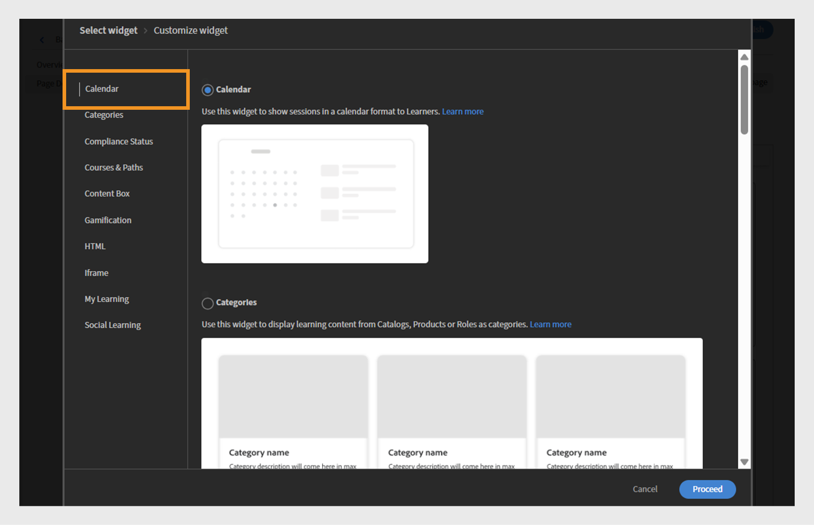
   _Widget selection screen highlighting the Calendar widget option to display training sessions in a calendar_

3. Type a **[!UICONTROL Widget title]** and **[!UICONTROL Widget description]**.
 
   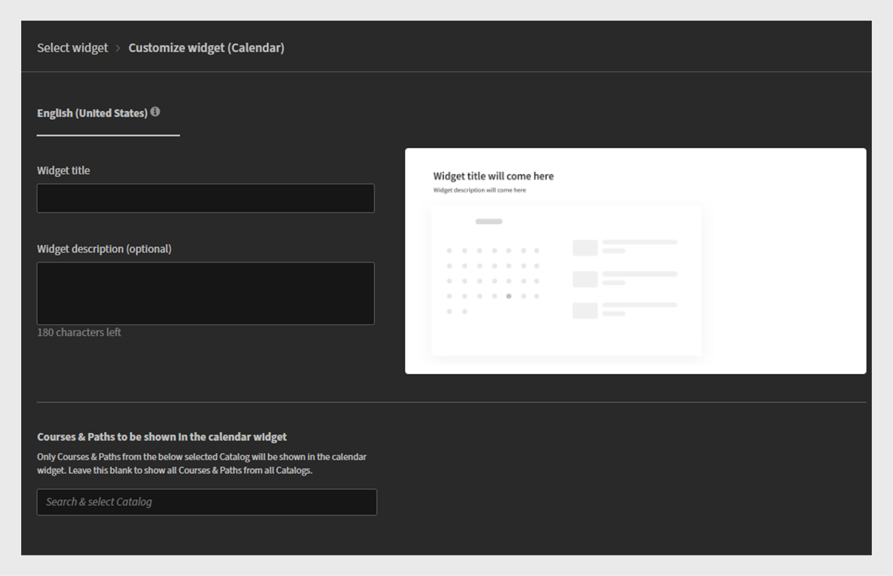
   _Calendar widget customization screen, where administrators can set the widget title, description, and select catalogs_

4. Select a catalog by searching to display its courses and learning paths within the **[!UICONTROL Calendar]** widget.
5. Select **[!UICONTROL Add Widget]**.

The Calendar widget will be added to the page. Administrator can add other widgets and publish the page.

**Categories widget**

This widget displays categories (e.g., roles, catalogs) as tiles, leading to filtered views or specific pages.

To configure the Categories widget:

1. Follow steps 1-9 from the [Design page in Experience Builder](#design-page-in-experience-builder).  
2. Select **[!UICONTROL Categories]** and then select **[!UICONTROL Proceed]**. 
 
   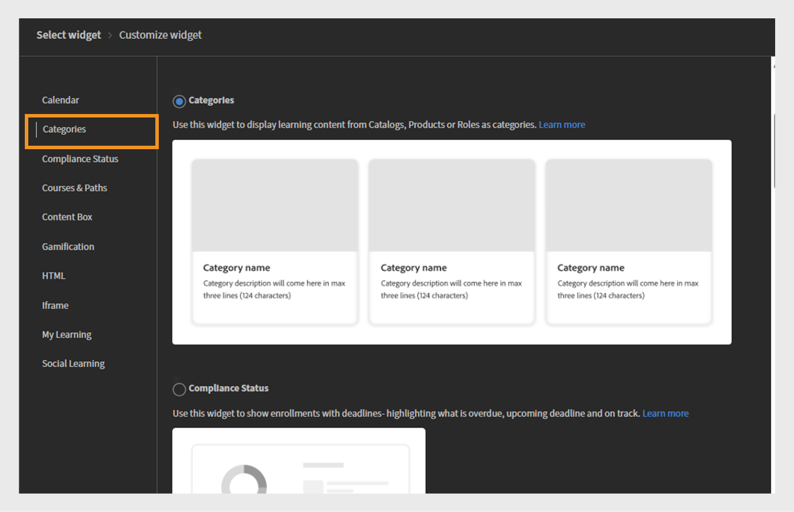
   _Widget selection screen highlighting the Categories widget option to organize learning content by catalog, product, or role for easy navigation_

3. Select the details to display on the category cards:

    * **[!UICONTROL Category Image]**
    * **[!UICONTROL Category Description]**

4. Type a **[!UICONTROL Widget title]** and **[!UICONTROL Widget description]**.
5. Search for and choose a catalog from the **[!UICONTROL Category source]**.
 
   
   _Configure Categories widget options to set widget title and description, and select the category source_

6. Select **[!UICONTROL Add Widget]**.

The Categories widget will be added to the page. Administrators can add other widgets and publish the page.

**Compliance widget**

This widget supports filtering similar to a calendar, but is focused on compliance-related learning objects. It allows learners to modify or remove compliance label filters dynamically.

To configure the Compliance widget:

1. Follow steps 1-9 from the [Design page in Experience Builder](#design-page-in-experience-builder).  
2. Select **[!UICONTROL Compliance Status]** and then select **[!UICONTROL Proceed]**.
 
   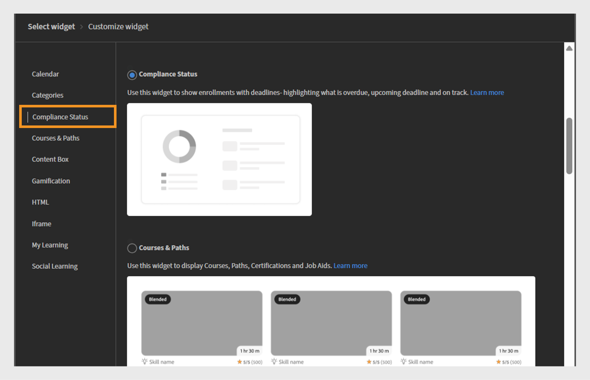
   _Widget selection screen highlighting the Compliance Status widget used to display learner enrollments with deadlines and status indicators_

3. Type a **[!UICONTROL Widget title]** and **[!UICONTROL Widget description]**.
 
   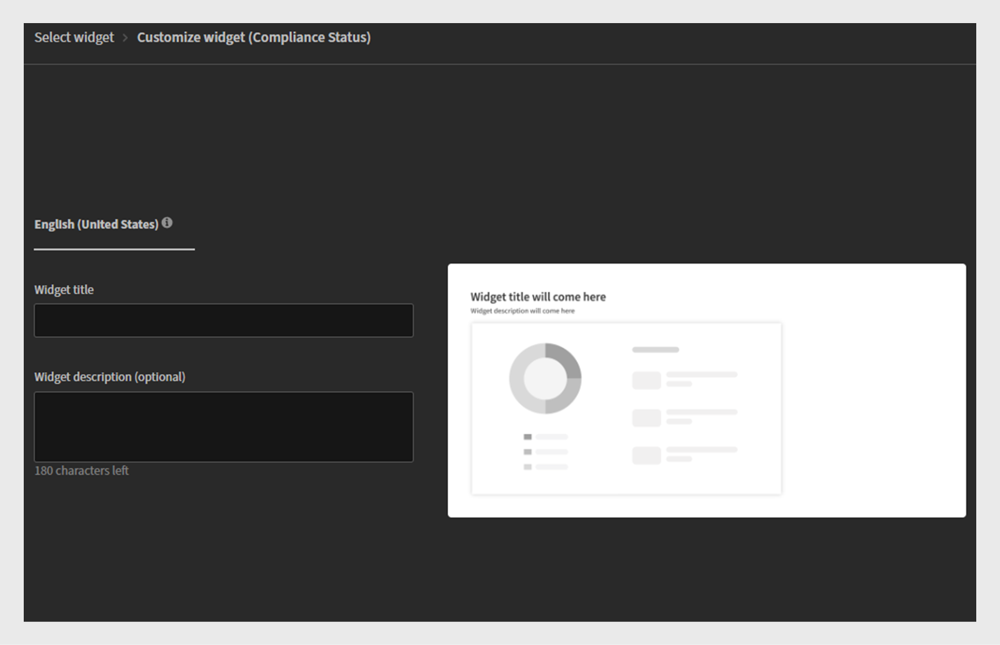
   _Compliance Status widget screen, where administrators can set the widget title and description to display enrollment deadlines and status for learners_

4. Select **[!UICONTROL Add widget]**.

The Compliance status widget will be added to the page. Administrators can add other widgets and publish the page.

**Courses and paths widget**

This widget displays a strip of course or path tiles, customizable to show different details. 

To configure the Courses and Paths widget:

1. Follow steps 1-9 from the [Design page in Experience Builder](#design-page-in-experience-builder). 
2. Select **[!UICONTROL Courses & Paths]**.
 
   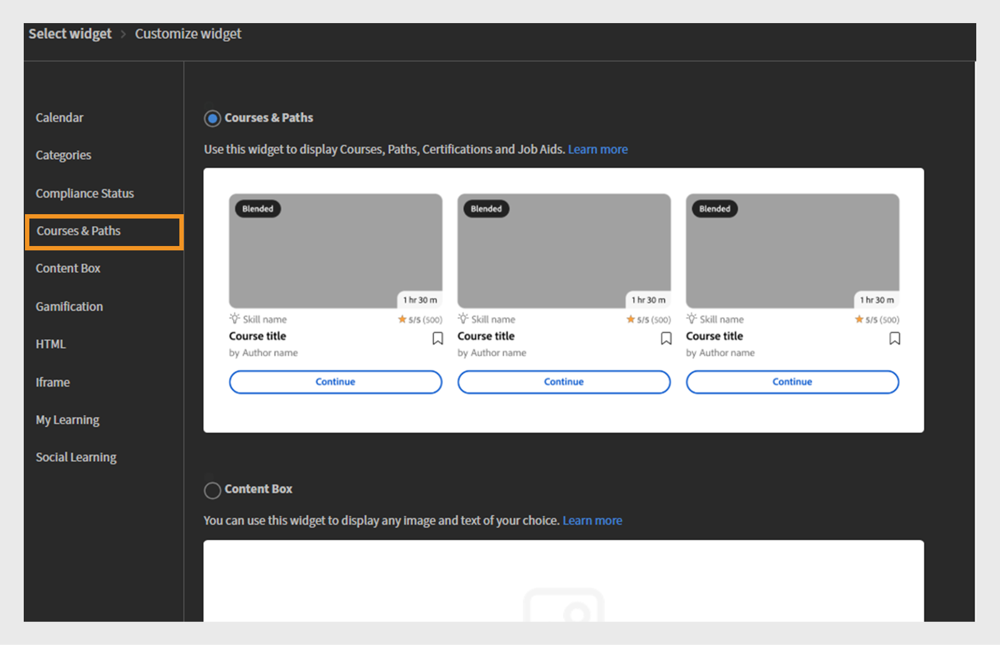
   _Widget selection screen highlighting the Courses & Paths widget for displaying courses, learning paths, certifications, and job aids as interactive cards for learners_

3. Select **[!UICONTROL Proceed]**. 
4. Type **[!UICONTROL Widget title]** and **[!UICONTROL Widget description]**. 
5. Select the catalogs or manually choose up to 25 courses to display.
    
   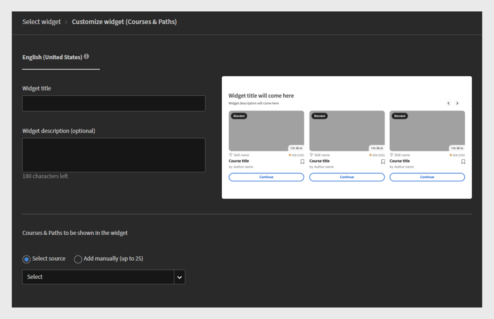
   _Courses & Paths widget where administrators set the widget title, description, and select courses or learning paths to display as interactive cards_

6. Select **[!UICONTROL Add widget]**. 

The Courses & Paths widget will be added to the page. Administrators can add other widgets and publish the page.

**Content Box widget**

This widget allows creating sections with titles, descriptions, images, and CTAs. 

To configure Content Box widget:

1. Follow steps 1-9 from the [Design page in Experience Builder](#design-page-in-experience-builder).
2. Select **[!UICONTROL Content Box]** and then select **[!UICONTROL Proceed]**. 
 
   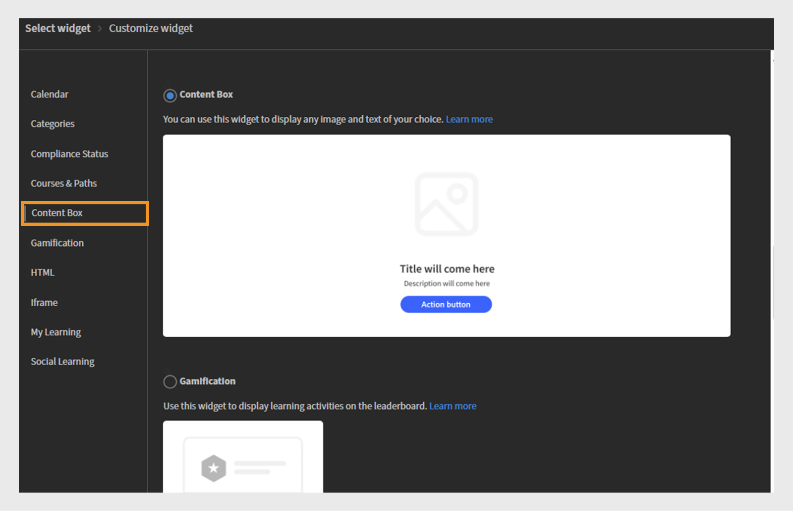
   _Widget selection screen highlighting the Content Box widget for displaying custom images, text, and action buttons to enhance learner engagement_

3. Type the **[!UICONTROL Title]** and **[!UICONTROL Description]**.
4. Type the text into the **[!UICONTROL Action button label]** and provide a link. 
5. Select any of the options for Background fill:

    * **[!UICONTROL Color]**: Select the color from the color picker or type the color code in the text field.
    * **[!UICONTROL Image]**: Browse and upload a picture.

6. Adjust the box height using the **[!UICONTROL Content box height]** option. 
7. Select the text formatting options.
 
   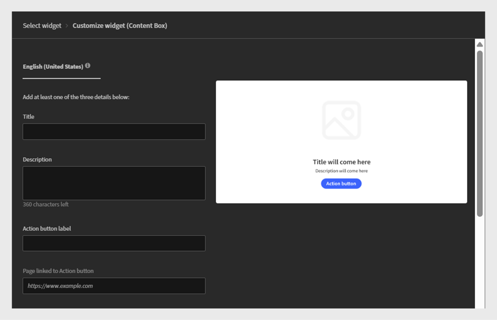
   _Content Box widget customization screen, where administrators can enter a title, description, action button label, and link_

8. Select **[!UICONTROL Add widgets]**. 

The Content Box widget will be added to the page. Administrators can add other widgets and publish the page.

**Gamification widget**

This widget shows gamification and points earned by learners in a leaderboard format. It has been updated for Experience Builder with a name, description, and localization customization.

To configure the Gamification widget:

1. Follow steps 1-9 from the [Design page in Experience Builder](#design-page-in-experience-builder).
2. Select **[!UICONTROL Gamification]** and then select **[!UICONTROL Proceed]**. 
 
   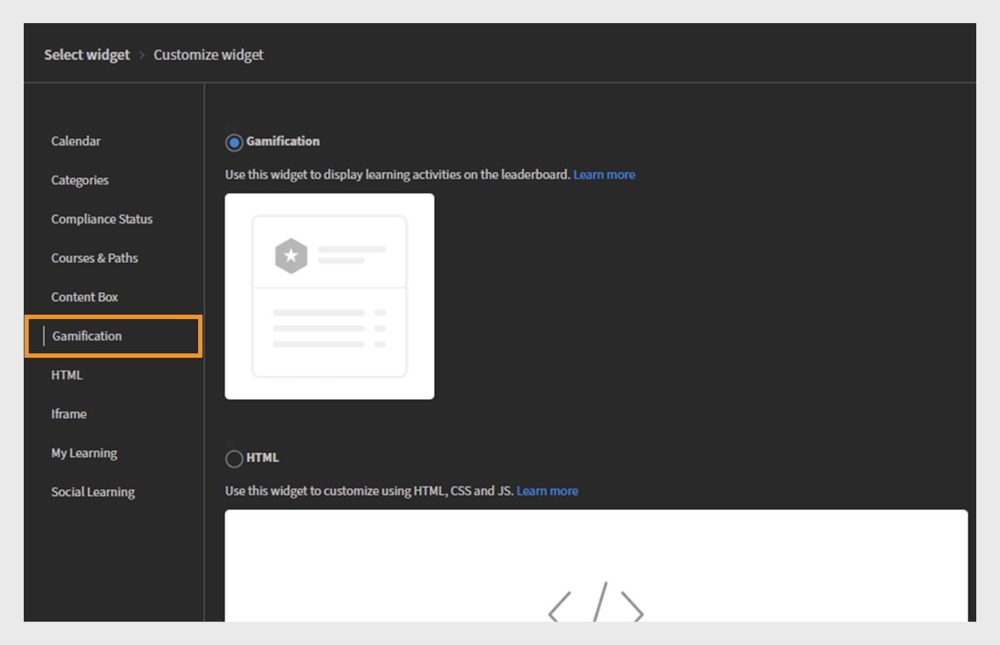
   _Widget selection screen highlighting the Gamification widget used to display learning activities and achievements on the leaderboard_

3. Type the **[!UICONTROL Widget title]** and **[!UICONTROL Widget description]**. 
4. Select **[!UICONTROL Add widgets]**. 

The Gamification widget will be added to the page. Administrators can add other widgets and publish the page.

**HTML widget**

This widget allows custom HTML, CSS, and JS code to be embedded, providing flexibility for static content like testimonials. 

To configure the HTML widget:

1. Follow steps 1-9 from the [Design page in Experience Builder](#design-page-in-experience-builder).
2. Select **[!UICONTROL HTML]** and then select **[!UICONTROL Proceed]**. 
 
   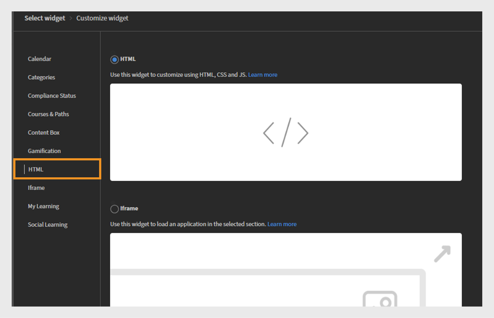
   _Widget selection screen highlighting the HTML widget for customizing pages using HTML, CSS, and JavaScript code_

3. Type your **[!UICONTROL HTML]**, **[!UICONTROL CSS]**, and **[!UICONTROL JavaScript]** code in the respective fields. 
4. Select **[!UICONTROL Add widget]**. 

The HTML widget will be added to the page. Administrators can add other widgets and publish the page.

**IFrame widget**

This widget allows embedding external web applications or webpages directly within the page. Includes options to name, describe, and localize the iframe content.

To configure the Iframe widget:

1. Follow steps 1-9 from the [Design page in Experience Builder](#design-page-in-experience-builder).
2. Select **[!UICONTROL Iframe]** and then select **[!UICONTROL Proceed]**. 
 
   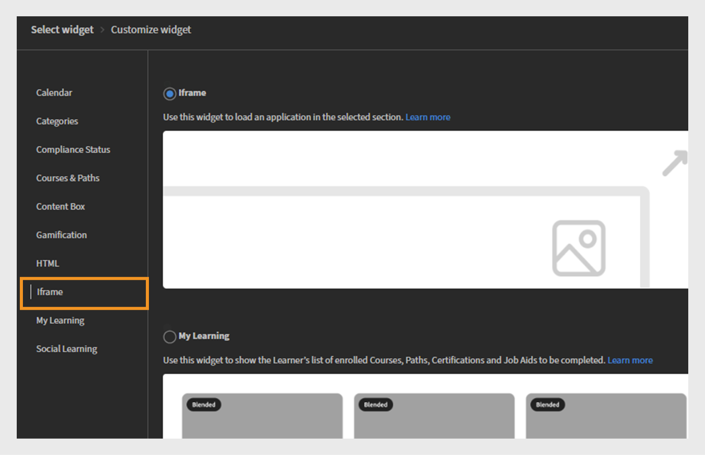
   _Widget selection screen highlighting the Iframe widget for embedding external applications or web pages within a selected section_

3. Type the URL in the **[!UICONTROL Page linked to Action button]** option.
4. Adjust the Iframe height using the **[!UICONTROL Iframe height]** option.     
 
   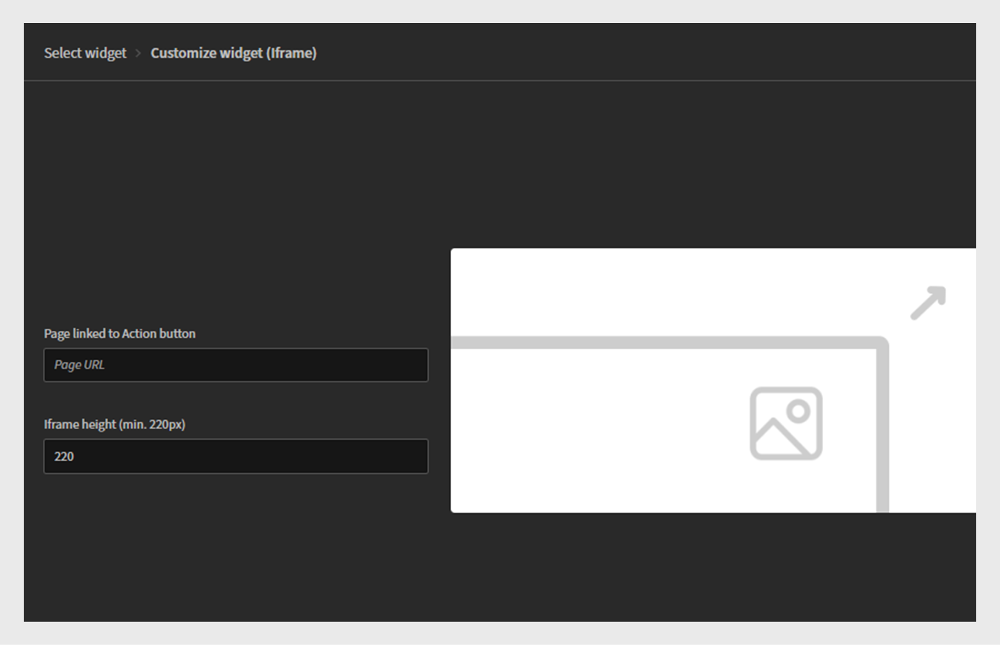
   _Iframe widget customization screen, where administrators can enter a page URL and specify iframe height to embed external content_

5. Select **[!UICONTROL Add widget]**. 

The Iframe widget will be added to the page. Administrators can add other widgets and publish the page.

**My Learning widget**

This widget is similar to the Courses and Paths widget, but filters content specifically for each learner, showing their personalized set of enrolled learning objects.

To configure the My Learning widget:

1. Follow steps 1-9 from the [Design page in Experience Builder](#design-page-in-experience-builder). 
2. Select **[!UICONTROL My Learning]** and then select **[!UICONTROL Proceed]**. 
 
   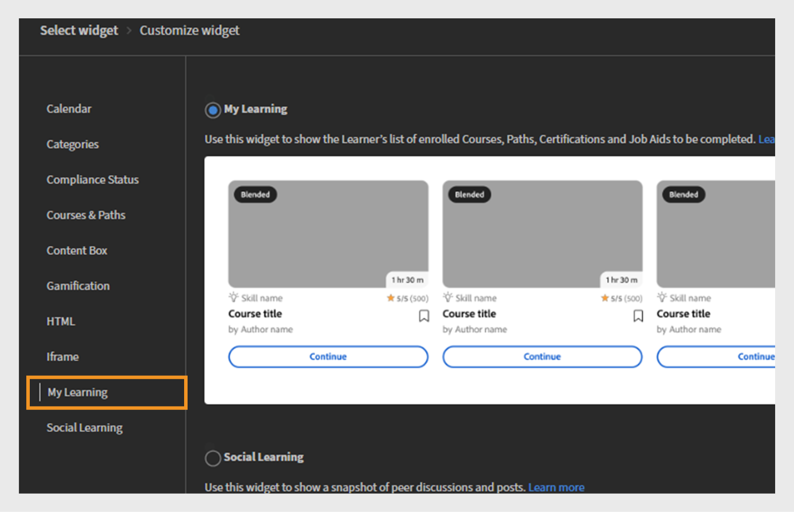
   _Widget selection screen, highlighting the My Learning widget used to display the learner's personalized list of enrolled courses_

3. Type the **[!UICONTROL Widget title]** and **[!UICONTROL Widget description]**.
4. Select **[!UICONTROL Add widget]**.

My Learning widget will be added to the page. Administrators can add other widgets and publish the page.

**Social Learning widget**

This widget enables social collaboration functionalities such as posts, comments, and user tagging within the platform. It is enhanced for Experience Builder with customization options, including name and localization.

To configure the Social Learning widget:

1. Follow steps 1-9 from the [Design page in Experience Builder](#design-page-in-experience-builder). 
2. Select **[!UICONTROL Social Learning]** and then select **[!UICONTROL Proceed]**. 
 
   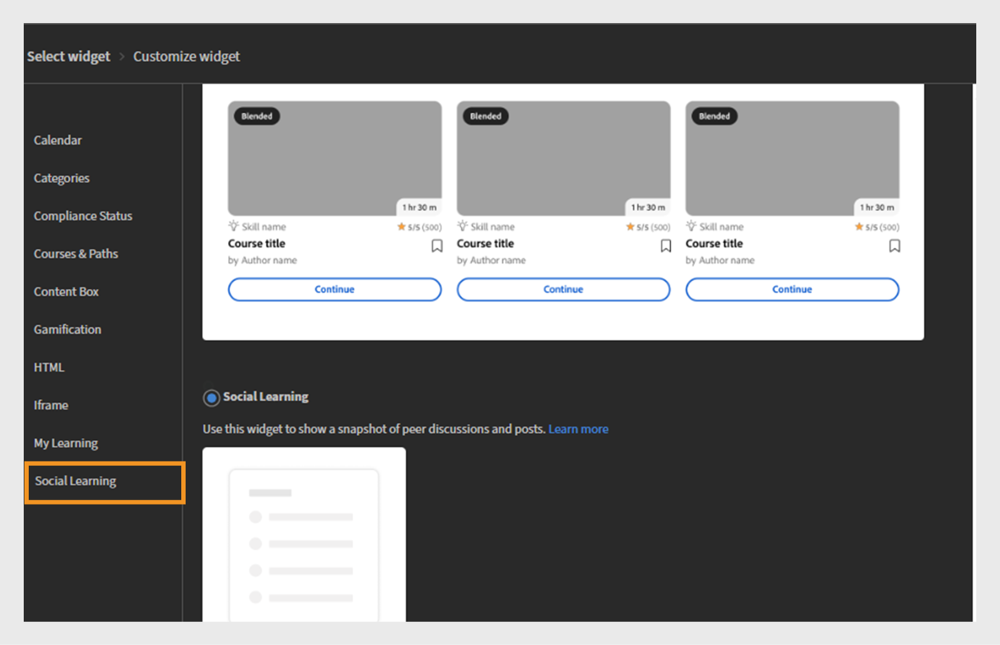 
   _Widget selection screen highlighting the Social Learning widget for displaying a posts to encourage collaboration and engagement_

3. Type the **[!UICONTROL Widget title]** and **[!UICONTROL Widget description]**.
4. Select **[!UICONTROL Add widget]**. 

The Social Learning widget will be added to the page. Administrators can add other widgets and publish the page.

#### Organize pages into a menu

Menus help organize and link pages in Experience Builder, making it easy for learners to navigate your learning portal. Administrators can create menus, add pages to them, and customize which menus are shown to specific audiences. 

**Create a menu**

To create a menu:

1. Log in to Adobe Learning Manager as an administrator.
2. Select **[!UICONTROL Branding]** in the left navigation pane.
3. Select **[!UICONTROL Menu]** and then select **[!UICONTROL Create]**.
 
   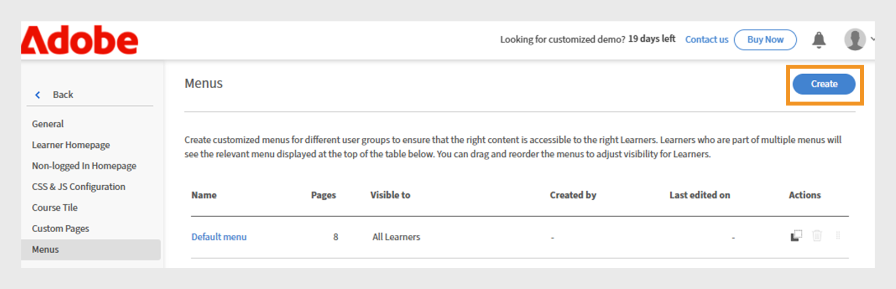
   _Menu screen showing options to view, organize, and create customized menus for different learner groups_

4. Type the **[!UICONTROL Menu name]** (for example, Product Training) and select the user group in the **[!UICONTROL Visible to]** option.
   
   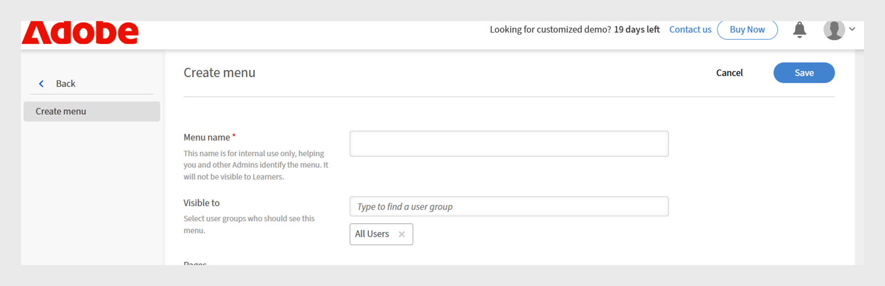
   _Create menu screen, where administrators can enter a menu name for internal use and specify user groups to control menu visibility_

5. Choose the custom page from the **[!UICONTROL Select pages]** option. 
 
   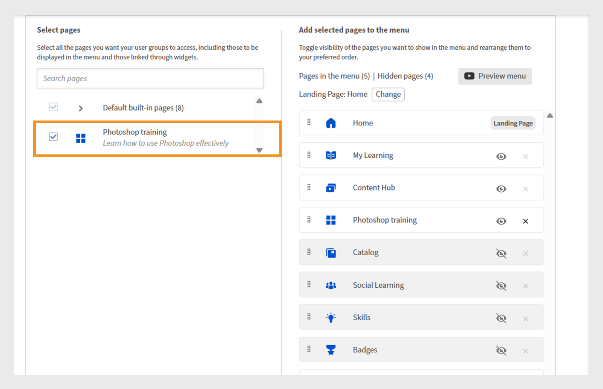
   _Page selection screen, highlighting the option to include the custom page for user groups and customize the menu order_

6. Select **[!UICONTROL Preview menu]** to view the menu before saving it. 
7. Select **[!UICONTROL Save]**.

The created menu will be visible for the selected learners. They can access the custom pages through their Learner UI. 
 
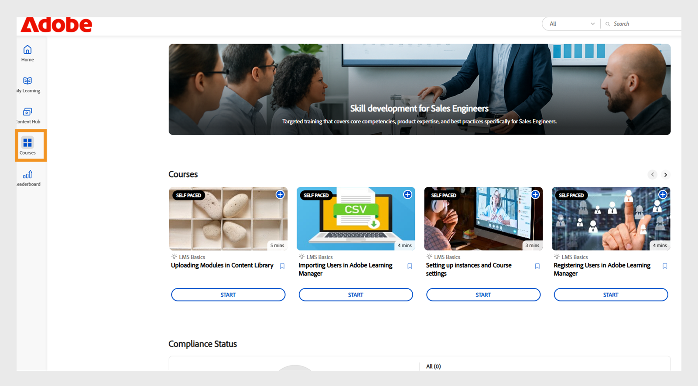
_Learner UI displaying the custom page with featured training modules and easy navigation from the sidebar menu_

#### Manage pages lifecycle

Administrators can use the Custom Pages section to edit, delete, and duplicate the pages.

**Edit the page**

To edit the custom pages:

1. Log in to Adobe Learning Manager as an administrator.
2. Select **[!UICONTROL Branding]** in the left navigation pane.
3. Select **[!UICONTROL Custom Pages]**.
4. Select the required page and then select **[!UICONTROL Edit]**. 
5. Select **[!UICONTROL Save]**.

The page will be updated with the changes. 

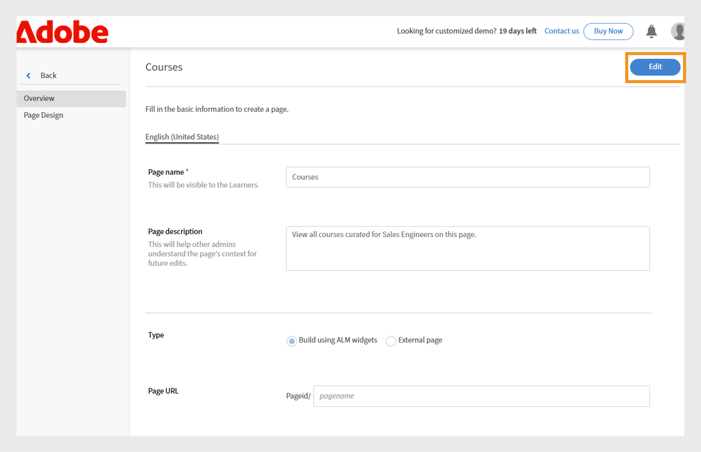
_Edit the custom page, allowing administrators to update the page name, description, and type_

**Delete the page**

To delete the page:

1. Log in to Adobe Learning Manager as an administrator.
2. Select **[!UICONTROL Branding]** in the left navigation pane.
3. Select **[!UICONTROL Custom Pages]**.
4. Select the required page.
5. Select **[!UICONTROL Action]** and then select **[!UICONTROL Delete]**. 
 
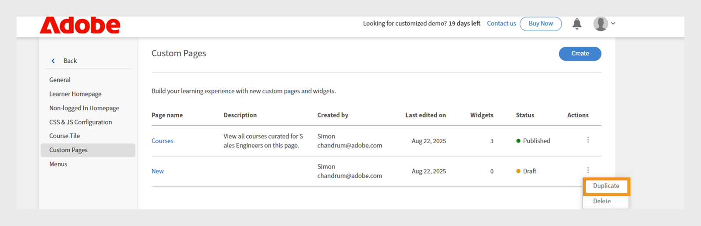
_Custom Pages screen displaying options to delete custom pages created for product training_

**Duplicate the page**

To duplicate the page:

1. Log in to Adobe Learning Manager as an administrator.
2. Select **[!UICONTROL Branding]** in the left navigation pane.
3. Select **[!UICONTROL Custom Pages]**.
4. Select the required page.
5. Select **[!UICONTROL Action]** and then select **[!UICONTROL Duplicate]**. 
 

_Custom Pages screen displaying options to duplicate the custom pages created for product training_

#### Preview the pages

To preview the pages:

1. Log in to Adobe Learning Manager as an administrator.
2. Select **[!UICONTROL Branding]** in the left navigation pane.
3. Select **[!UICONTROL Custom Pages]**.
4. Select the required page and then select **[!UICONTROL Page Design]**
5. Select **[!UICONTROL Edit]** and then select **[!UICONTROL Preview page]** to view the portal's preview. 

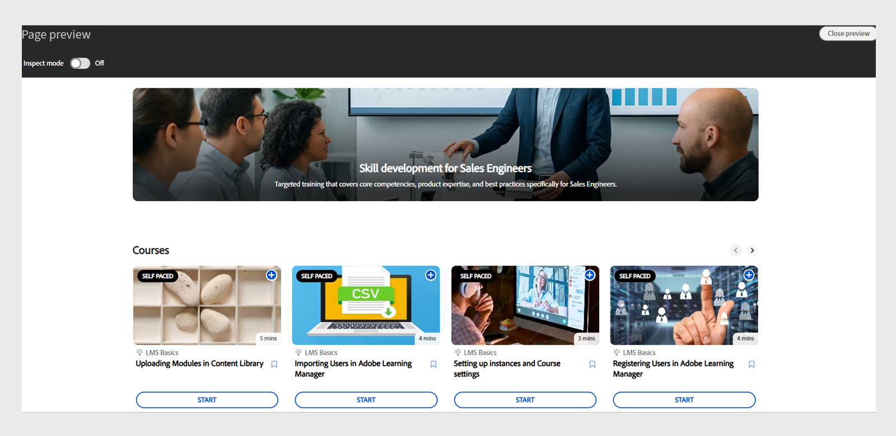
_Page preview showing a custom page layout with a banner, featured courses_

#### Localize the pages

When an admin adds multiple languages to the custom pages, add the widget details for each language in the corresponding language tab next to the default language tab.

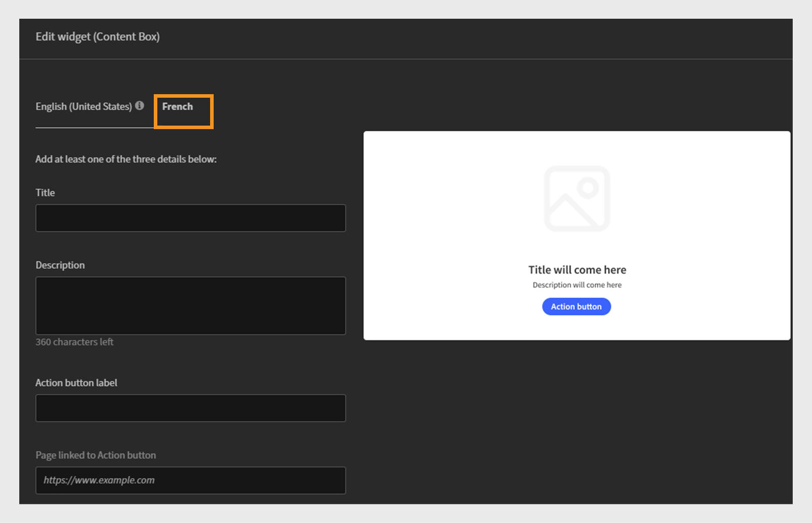 
_Administrators can add widget details for additional languages, such as French, alongside the default language_

#### Set up hidden pages

The hide pages option allows administrators to keep the Learner UI clean by showing fewer pages. Administrators can hide pages from the menu so learners don't see them in learner UI, but learners can still reach those pages in other ways. For example, the Catalog page can be hidden from the menu but accessed through other navigation paths.
 
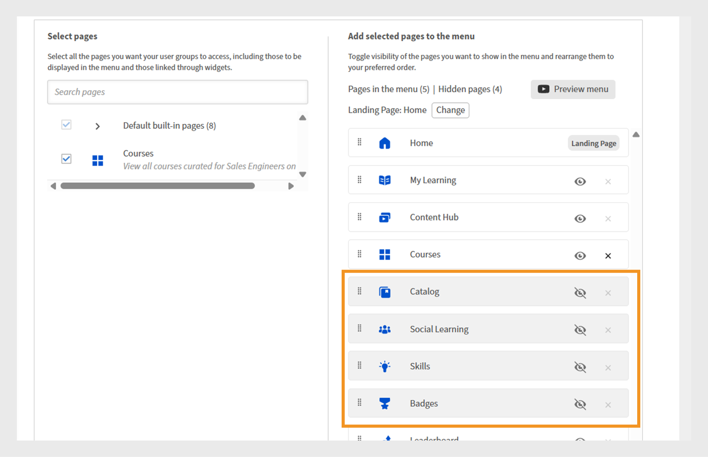
_Menu configuration screen showing hidden pages such as Catalog, Social Learning, Skills, and Badges_ -->


<!-- We're excited to share several important updates coming to Adobe Learning Manager with the upcoming releases. These enhancements aim to streamline admin workflows, improve data reporting accuracy, and strengthen role-based controls.

These changes are designed to reduce manual effort, support automation, and improve governance across training operations.

## Capture instructor-marked completions in Learner Transcript

### Audience  

Administrator and automation owners 

### Overview 

In Adobe Learning Manager, when using incremental Learner Transcripts (LT) for automation workflows, instructor-marked completions made after the session date are not captured. The completion timestamp reflects the original session end time (not the time the instructor marked the completion). Since these updates fall outside the one-day change window used for incremental LT generation, as a result, learners' attendance and completion data are excluded from reports, leading to inaccurate or incomplete downstream reporting and potential compliance gaps. 

### What has changed 

Learner Transcript (LT) reports include completions marked by instructors after the session date. This ensures that any delayed attendance marking is correctly reflected in the transcript export. 

Attendance states like "Attended with pass/fail" will appear automatically in incremental LT exports. 

### What's new 

* New column: Mark Completed Date (UTC TimeZone). 
* Completion Source is available at module level. 
* Compatible with connector-based or job API-generated LT reports. 

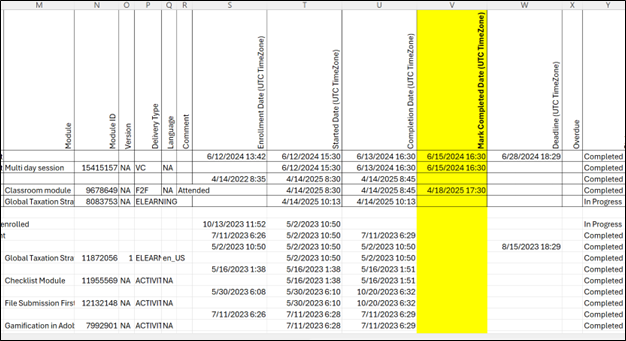

**Action required**

* If your automation depends on column positions, ensure logic accounts for the new column. 
* If using column names, no changes are required. 
* Retrofitted completions (manual imports) are not included. 

## Download links in Job Aids report

### Audience 

Administrator, custom administrator, and automation owners 

### Overview 

The Job Aids report includes a direct download link for each job aid, allowing quick access from the report itself. 

### What's new  

A new column, **[!UICONTROL Job Aid Link]**, has been added to the third position in the report. It links directly to the job aid if it's a file or shows the external URL provided by the author. 

Users with access (admin/authors and custom roles) can download the job aid using this link. 

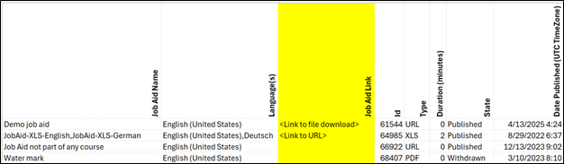 

### Action required 

* Review automated workflows using Job Aids reports (using Jobs API). 
* If the script is based on column position, update scripts accordingly. 
* No action is needed if using column names. 

## Internal User ID and Manager Email columns added to User Report

### Audience 

Administrators (and custom administrators) using the **[!UICONTROL User Report]** (**[!UICONTROL Admin]** > **[!UICONTROL Users]** > **[!UICONTROL Internal]** > **[!UICONTROL Export User data]**) downloaded from the administrator User Interface. 

### Overview 

To assist in user identification and integration workflows, two columns, **[!UICONTROL Internal User ID]** and **[!UICONTROL Manager Email]** have been added to the User report, exported via the User Interface. 

### What's new 

The User report includes a user's internal user ID and their manager's email address, to map them uniquely across different tools or API endpoints. 

### Action required 

* If using this report in automated flows, then this newly added column should be taken care of in automation.  
* No changes are needed if workflows are not impacted. 

## Scoped announcement permissions for custom administrators

### Audience 

Custom administrators 

### Overview 

Custom administrators can create announcements only for the user groups or catalogs within their defined scope. 

### What's new 

* Scoping rules allow custom administrators to create announcements for specific user groups or catalogs only. 
* When defining a custom role, administrators can assign announcement permissions with scope on user groups or catalogs. 
* Custom administrators are limited to creating announcements within their given scope. 
* The notification announcement report for custom administrators will display learners only within their assigned scope. 

### Action required 

* The format of the report will remain unchanged. If custom administrators download it from the User Interface, the content of the report will be subject to their scope. 
* No modifications are necessary if this report is not utilized in any automated or downstream workflow.

See the [Release notes](https://experienceleague.adobe.com/ko/docs/learning-manager/using/introduction/release-notes) article for a cumulative list of new features and changes to Adobe Learning Manager.-->
