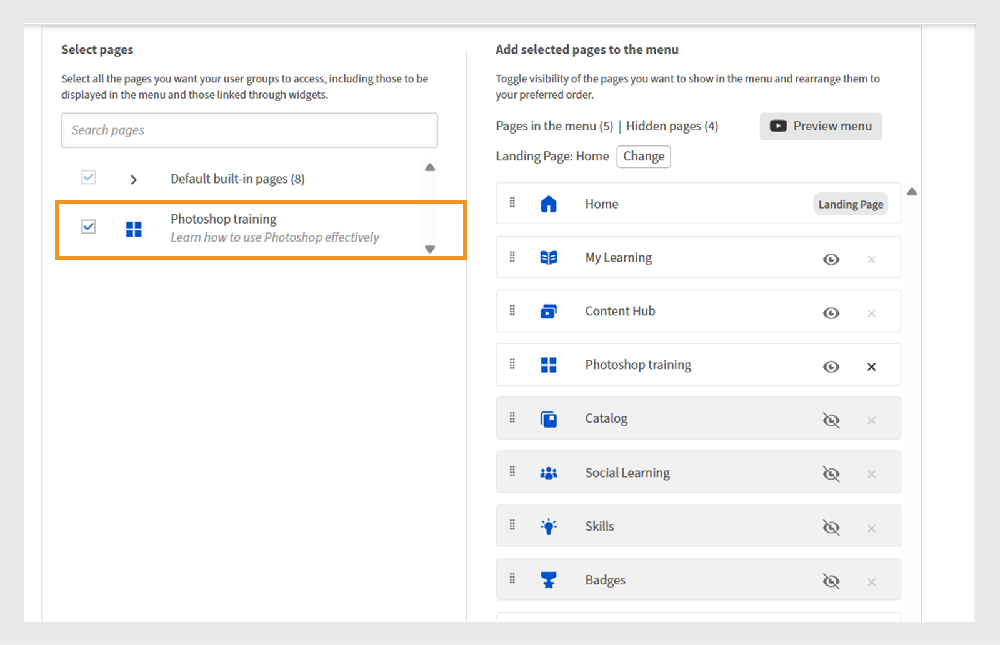
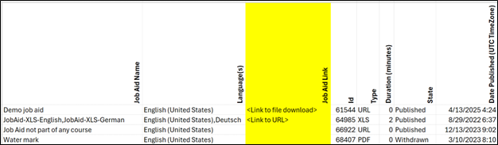

# Adobe Learning Manager 2025년 10월 릴리스의 새로운 기능

>[!IMPORTANT]
>
>설명된 기능은 미정이며 변경될 수 있습니다. 자세한 정보와 확인은 지정된 고객 성공 관리자에게 문의하십시오. 문제가 발생하면 고객 지원 팀([learningmanagersupport@adobe.com](mailto:learningmanagersupport@adobe.com))에 문의하십시오.

## 릴리스 개요

Adobe Learning Manager의 2025년 10월 릴리스에는 보고 정확도를 개선하고 통합 기능을 확장하며 책임자, 작성자 및 학습자의 학습 환경을 개선하기 위해 고안된 중요한 개선 사항이 도입되었습니다. 주요 개선 사항으로는 강사 표시 완료 내용을 정확하게 캡처하는 향상된 학습자 성적 증명서, 추가 식별 필드가 있는 확장된 사용자 보고서, 직접 다운로드 링크가 있는 작업 지원 보고서 등이 있습니다.

또한 이 릴리스에서는 사용자 정의 책임자를 위한 범위 지정 공지 권한, 소셜 학습 보드의 사용자 태그 지정 기능, 다양한 로케일에서 학습자 진행률을 유지하는 언어 기반 진행률 추적 기능을 소개합니다. 추가 기능으로는 AI 지원 플레이리스트 생성을 통한 Go1 통합 개선 사항, 증분 가져오기 지원을 통한 사용자 정의 역할 관리 개선, 퀴즈 성능 추적 및 마이그레이션 상태 모니터링 개선을 위한 API 개선 등이 있습니다.

## 학습자 성적 증명서에 강사 표시 완료

**개요**

변동분 학습자 성적 증명서에는 세션 날짜 이후에 출석이 기록되더라도 강사 표시 완료 내용이 캡처됩니다.
이 개선은 원래 세션 날짜 이후에 출석이 기록된 경우 이전에 강사로 표시된 완료가 누락된 증분 학습자 성적 증명서의 중요한 차이를 해결합니다.

증분 학습자 성적 증명서는 전체 기록 데이터 덤프를 제공하지 않고 지정된 기간 내에 발생하는 변경 사항(예: 완료 또는 진행 업데이트)만 캡처하는 예약된 보고서입니다. 자동화, 대시보드, 통합 등에 공통적으로 사용되므로 매번 전체 성적 증명서를 처리하지 않고도 최근 학습 활동을 효율적으로 추적할 수 있습니다.

**새로운 기능**

* **완료 날짜(UTC 시간대) 표시 열**: 강사가 세션 또는 모듈을 완료 상태로 표시할 정확한 날짜와 시간을 캡처하는 새 타임스탬프 열입니다.
* **향상된 완료 소스 추적**: 완료가 기록된 특정 강사 및 모듈(예: &quot;강의실&quot;)을 추적합니다.

이렇게 변경하면 세션 날짜 이후에 표시된 완료가 증분 학습자 성적 증명서에 정확하게 반영됩니다.

**주요 이점**

* 출석 표시와 관계없이 모든 완료 내용을 증분 보고서에 캡처합니다.
* 규정 준수 및 보고에 대한 명확한 감사 추적을 제공합니다.
* 규정 요건을 충족하는 자동화 및 대시보드 지원

**사용 사례**

* 강사가 실제 세션 이후에 출석일로 표시할 수 있는 강의실 세션이 있는 조직.
* 규정 준수 또는 보고를 위해 증분 학습자 성적 증명서를 사용하는 자동화된 시스템 또는 대시보드

### 새 열이 있는 학습자 성적 증명서

학습자 성적 증명서를 다운로드하는 방법을 알아보려면 이 [문서](/help/migrated/administrators/feature-summary/learner-transcripts.md)를 참조하십시오.

다운로드한 학습자 성적 증명서 보고서에는 새 열([완료 날짜 표시] (UTC 시간대))이 포함됩니다.


_학습자 성적 증명서 보고서에 각 사용자의 개별 완료 날짜를 강조하는 새 열이 노란색으로 표시됩니다_

## 확장 데이터 필드가 있는 향상된 사용자 보고서

**개요**

이제 사용자 보고서에는 사용자 추적 및 조직 매핑을 개선하는 추가 필드가 포함됩니다.

**새로운 기능**

* 내부 사용자 ID 열: 다른 시스템 및 API 엔드포인트에서 원활한 사용자 추적을 위한 고유한 내부 식별자를 제공합니다.
* 관리자 전자 메일 열: 조직 계층 구조 추적을 위한 직접 관리자 연락처 정보를 포함합니다.

**주요 이점**

* 사용자 식별이 간단해지고 여러 시스템에서 사용자를 매핑할 때 발생하는 문제가 사라집니다.
* 통합 기능을 통해 다운스트림 사용자 관리 워크플로우를 지원합니다.
* 조직 매핑 향상 및 보고 관계 이해 향상
* 조직의 경계를 유지하고 우발적인 교차 통신을 방지합니다.

**중요 고려 사항**

* 사용자 정의 책임자의 범위가 변경되면 영향을 받는 공지사항에 경고 아이콘이 표시되며 개별 범위를 재설정해야 합니다.
* 범위가 변경될 경우 각 공지를 개별적으로 업데이트해야 합니다.
* 알림 공지 보고서에는 사용자 정의 책임자가 지정한 범위 내의 학습자만 표시됩니다.

### 새 열이 있는 사용자 보고서

사용자 보고서를 다운로드하는 방법을 알아보려면 이 [문서](/help/migrated/administrators/feature-summary/reports.md#user-activity-dashboards)를 참조하십시오.

다운로드한 사용자 보고서 파일에는 내부 사용자 ID 및 관리자 전자 메일과 같은 새 열이 포함됩니다.


_사용자 관리를 간소화하기 위해 내부 사용자 ID와 관리자 전자 메일 주소를 강조하는 사용자 보고서_

## 내부 사용자 ID를 지원하는 FTP 사용자 보고서

**개요**

이제 FTP 기반 사용자 보고서에는 내부 사용자 ID 지원이 포함되어 헤드리스 구현을 위한 데이터 내보내기 및 통합에 대한 통합된 접근 방식을 제공합니다.

**새로운 기능**

* 이제 기존 보고서(게임화 성적 증명서, 학습자 성적 증명서, 교육 보고서)와 함께 [사용자 정의 FTP](/help/migrated/integration-admin/feature-summary/connectors.md#custom-ftp)를 통해 사용자 보고서를 사용할 수 있습니다.
* 이제 내부 사용자 ID 열이 모든 내보내기 방법(FTP, 작업 API 및 UI)에서 일관됩니다.

**주요 이점**

* 필요한 모든 보고서를 하나의 소스로 관리할 수 있어 데이터 관리 작업이 간소화되었습니다.
* 보고 기간 동안 사용자를 일관되게 식별하여 데이터 일관성을 향상시킵니다.
* 식별자가 일관된 대량 작업 및 분석 워크플로우를 활성화하여 자동화된 워크플로우 지원을 제공합니다.
FTP 폴더에서 다운로드한 사용자 보고서에는 새 열인 내부 사용자 ID가 포함됩니다.

## 학습자 성적 증명서에 일시 중단된 사용자 포함

**개요**

이제 조직은 학습자 성적 증명서에 일시 중단된 사용자(외부 프로필이 비활성화된 사용자)를 포함하여 포괄적인 기록 학습 데이터 보존을 보장할 수 있습니다.

**새로운 기능**

* 계정 수준 플래그로 일시 중단된 사용자 가시성을 구성 가능하여 학습자 성적 증명서에 일시 중단된 사용자를 포함합니다.
* 일시 중단된 외부 프로필의 비활성화 후에도 기록 데이터 보존

**구현 요구 사항**

* 계정 수준 플래그를 활성화하려면 CSM(Customer Success Manager)에 문의하십시오.

>[!NOTE]
>
>이 플래그는 기존 계정에 대해 기본적으로 비활성화되어 있으며 새 계정에 대해 명시적으로 요청해야 합니다.

## 사용자 정의 관리자에 대한 범위 공지 권한

**개요**

이제 사용자 정의 책임자는 할당된 사용자 그룹 또는 카탈로그에 대해서만 공지를 만들 수 있습니다. 이를 통해 조직 경계를 넘나드는 의도치 않은 커뮤니케이션이 발생하지 않도록 한다.

**새로운 기능**

* 사용자 정의 책임자는 할당된 범위 내의 사용자에게만 공지를 만들 수 있습니다.
* 공지 범위는 특정 사용자 그룹 또는 카탈로그로 지정할 수 있습니다.
* 전체 관리자는 범위가 지정된 사용자 정의 관리자가 작성한 공지를 포함하여 모든 공지를 파악하고 제어합니다.

**주요 이점**

* 대상 커뮤니케이션을 통해 공지가 관련 대상자에게만 전달되도록 합니다.
* 관련성이 없는 알림이 의도하지 않은 사용자에게 도달하지 않도록 하여 정보 과부하를 줄였습니다.
* 조직의 경계를 유지하고 우발적인 교차 통신을 방지합니다.

**중요 고려 사항**

* 사용자 정의 책임자의 범위가 변경되면 영향을 받는 공지사항에 경고 아이콘이 표시되며 개별 범위를 재설정해야 합니다.
* 범위가 변경될 경우 각 공지를 개별적으로 업데이트해야 합니다.
* 알림 공지 보고서에는 사용자 정의 책임자가 지정한 범위 내의 학습자만 표시됩니다.

**사용 사례**

* 지역 관리자들이 가맹점주들과만 소통해야 하는 가맹단체.
* 지역별 또는 부서별 책임자가 해당 팀에 보내는 공지 사항을 대상으로 하는 대규모 조직

### 할당된 범위에 대한 알림 만들기

사용자 정의 관리자는 할당된 사용자 그룹 및 카탈로그로 제한하여 메시지가 올바른 대상자에게 도달하도록 하고 불필요한 알림을 방지합니다.

할당된 범위에 대한 공지를 만들려면 다음을 수행하십시오.

1. 관리자 권한으로 Adobe Learning Manager에 로그인합니다.
2. 왼쪽 탐색 창에서 **[!UICONTROL 공지]**&#x200B;를 선택합니다.
3. **[!UICONTROL 추가]**&#x200B;를 선택합니다.

   
   관리자가 대상 사용자 그룹에 대한 공지를 만들고 관리할 수 있는 Adobe Learning Manager의 _공지 페이지_

4. 드롭다운 메뉴에서 **[!UICONTROL 공지 유형]**&#x200B;을 선택합니다.
a. **[!UICONTROL 알림으로]**
b. **[!UICONTROL 발행인란으로]**
c. **[!UICONTROL 권장 사항]**
d. **[!UICONTROL 전자 메일로]**
5. **[!UICONTROL 발행인란으로]**&#x200B;를 선택합니다.
6. 언어를 선택하고 발행인란의 이미지를 업로드합니다.
7. 필요한 경우 작업 버튼에 대한 URL을 추가합니다.

   
   _공지 작성 화면을 통해 관리자가 공지 유형을 설정하고, 첨부 파일을 업로드하고, 작업 버튼을 추가할 수 있습니다._

   할당된 범위는 **[!UICONTROL 범위]** 섹션에서 미리 선택되어 있으며 관리자가 수정할 수 없습니다.

   >[!NOTE]
   >
   >**[!UICONTROL 알림]** 및 **[!UICONTROL 전자 메일]** 공지의 경우, 할당된 범위와 겹치는 경우 추가 사용자 그룹 및 카탈로그를 포함할 수 있습니다.

8. **[!UICONTROL 저장]**&#x200B;을 선택합니다.

사용자 정의 책임자 범위에 있는 학습자만 공지를 볼 수 있습니다. 여러 유형의 공지를 만드는 방법은 이 [문서](/help/migrated/administrators/feature-summary/announcements.md)를 참조하세요.

### 사용자 지정 관리자가 범위 재설정

책임자가 공지 범위를 변경한 경우 사용자 정의 책임자는 게시된 공지의 범위를 재설정할 수 있습니다. 범위가 재설정되고 나면 업데이트된 범위가 공지에 적용되며 새 범위에 있는 학습자만 공지를 볼 수 있습니다.

범위를 재설정하려면 다음을 수행하십시오.

1. 사용자 정의 관리자로 Adobe Learning Manager에 로그인합니다.
2. 왼쪽 탐색 창에서 **[!UICONTROL 공지]**&#x200B;를 선택합니다.
3. **[!UICONTROL 게시]** 탭을 선택합니다.
4. 공지를 선택한 다음 설정 아이콘을 선택합니다.
5. **[!UICONTROL 편집]**&#x200B;을 선택합니다.

   
   _편집, 게시 및 기타 옵션이 있는 게시된 공지를 보여 주는 공지 화면_

6. **다시 설정**&#x200B;을 선택합니다.

   
   _사용자 지정 관리자가 새 액세스 권한을 반영하도록 범위 선택을 다시 설정하고 업데이트할 수 있는 옵션과 함께 범위 변경 알림을 표시하는 알림_

범위가 업데이트되며 업데이트된 범위 내의 사용자만 공지를 볼 수 있습니다.

### 관리자 UI를 통해 공지 편집

관리자는 인터페이스를 통해 사용자 정의 관리자가 작성한 공지를 볼 수 있습니다. 할당된 범위를 수정하거나 제거하여 공지만 편집할 수 있습니다. 범위 변경이 이루어지지 않으면 관리자가 공지를 추가로 편집할 수 없습니다.

관리자 UI를 통해 공지를 편집하려면 다음을 수행합니다.

1. 관리자 권한으로 Adobe Learning Manager에 로그인합니다.
2. 왼쪽 탐색 창에서 **[!UICONTROL 공지]**&#x200B;를 선택합니다.
3. **[!UICONTROL 게시]** 탭을 선택합니다.
4. 공지를 선택한 다음 설정 아이콘을 선택합니다.
5. **[!UICONTROL 편집]**&#x200B;을 선택합니다.

   
   _편집, 게시 및 기타 옵션이 있는 게시된 공지를 보여 주는 공지 화면_

6. **[!UICONTROL 제거]**&#x200B;를 선택합니다.

   
   _범위를 지정한 사용자 그룹에 대해 만든 공지를 관리자가 편집할 수 있도록 범위를 제거해야 함을 나타내는 공지 화면_

관리자는 범위를 제거한 후 공지를 편집할 수 있습니다.

## 소셜 게시판의 사용자 태그 지정

**개요**

이제 소셜 학습 보드는 사용자 태그 지정 기능을 지원하여 보다 타겟팅된 토론과 학습 커뮤니티 내 공동 작업 향상을 지원합니다. 학습자 앱, API 및 Adobe Learning Manager 참조 사이트를 통해 소셜 학습 게시물과 댓글에 학습자를 태그할 수 있습니다.

**새로운 기능**

* **@username 태그 지정**: 사용자는 &quot;@username&quot; 형식을 사용하여 다른 게시판 구성원에 태그를 지정할 수 있습니다.
* **범위 제한 태그 지정**: 특정 보드에 대한 액세스 권한이 있는 사용자만 태그를 지정할 수 있으므로 개인 정보와 관련성이 보장됩니다.
* **다중 채널 알림**: 태그가 있는 사용자는 관련 게시물 또는 댓글에 대한 직접 링크가 포함된 인앱 및 이메일 알림을 모두 받습니다.

**주요 기능**

* 게시판의 범위를 벗어나는 사용자는 태그를 지정할 수 없으므로 원치 않는 알림을 방지할 수 있습니다.
* 태그가 있는 사용자가 시스템에서 삭제되면 해당 언급은 &quot;익명&quot;으로 표시됩니다.
* 알림 스팸을 방지하기 위해 사용자 그룹 또는 &quot;@all&quot;에 태그를 지정하는 것은 허용되지 않습니다.

**사용 사례**

* 의료 사례에 대한 특정 동료의 의견을 찾는 의료 전문가.
* 주제별 전문가가 전문 주제에 대해 컨설팅을 받고 있다.
* 특정 이해 관계자의 입력이 필요한 팀 토론
* 전문가 참여가 목표인 지식 공유 세션

### 소셜 게시판의 사용자 태그 지정

학습자는 이제 @username을 사용하여 게시물 또는 댓글의 특정 게시판 멤버에 태그를 지정할 수 있습니다. 태그는 해당 보드에 대한 액세스 권한이 있는 멤버로 제한됩니다.

소셜 게시판의 사용자에 태그를 지정하려면

1. 학습자로 Adobe Learning Manager에 로그인합니다.
2. 왼쪽 탐색 창에서 **[!UICONTROL 소셜 학습]**&#x200B;을 선택합니다.

   
   _소셜 학습을 선택하여 토론 게시판에 액세스하고, 통찰력을 공유하고, 대화식 참여를 위해 사용자에 태그를 지정하여 공동 학습을 활성화합니다_

3. **[!UICONTROL 새 게시물]**&#x200B;을 선택합니다.

   
   _태그가 지정된 사용자와 지식을 공유하려면 소셜 학습에서 새 게시물을 선택하여 새 토론을 시작하십시오_

4. 사용자에게 태그를 지정하기 전에 **[!UICONTROL 토론 게시판에 게시]** 옵션에서 게시판을 선택합니다.

   
   _토론 게시판을 선택하여 사용자를 게시하고 태그를 지정하여 소셜 학습에서 지정된 공동 작업 대화를 활성화합니다_

5. 게시물 세부 정보를 입력한 다음 @ 기호 뒤에 해당 이름(예: @andrew)을 입력하여 사용자에 태그를 지정합니다. 사용자 이름의 처음 세 글자 다음에 @ 를 입력하면 일치하는 사용자 목록이 표시됩니다.

   
   _소셜 학습 게시판 내에서 지정된 공동 작업을 활성화하려면 @ 다음에 사용자 이름을 입력하여 토론 게시물의 사용자에 태그를 지정합니다_

6. 목록에서 원하는 사용자를 선택합니다.
7. **[!UICONTROL 게시물]**&#x200B;을 선택합니다.

태그가 지정된 사용자는 게시물에 대한 직접 링크가 포함된 앱 내 및 이메일 알림을 모두 수신하게 되므로 더욱 타겟팅되고 공동 작업이 가능합니다.

### 보드의 범위에 따라 사용자 태그 지정

범위 제한 태그 지정은 사용자가 특정 보드에 액세스할 수 있는 권한이 있는 학습자만 태그를 지정할 수 있도록 합니다. 범위를 벗어난 사용자의 태그 지정을 방지하여 개인 정보를 유지하는 데 도움이 됩니다.

게시판의 범위 밖에 있는 학습자에게 태그를 지정하려고 하면 제안이 표시되지 않으며 이러한 제안에 태그를 지정할 수 없습니다. 소셜 학습 범위에 대한 자세한 내용은 이 [문서](/help/migrated/administrators/feature-summary/social-learning-configurations-as-an-admin.md)를 참조하세요.

## 주석에 삭제된 사용자 태그 지정

삭제된 사용자가 소셜 학습 게시물에 태그되면 해당 게시물에는 이름이 익명으로 표시됩니다. 댓글 및 태그는 컨텍스트에 대해 계속 표시되지만 프로필 링크 또는 세부 정보는 표시되지 않습니다.


_태그가 지정되었을 때 삭제된 사용자가 익명으로 표시되는 방식을 강조하는 소셜 학습 게시물_

## 직접 액세스 링크가 있는 작업 지원 보고서

**개요**

작업 지원 보고서는 작업 지원에 대한 직접 다운로드 링크를 포함하도록 개선되어, 관리자 및 작성자를 위한 콘텐츠 관리 및 감사 프로세스를 간소화했습니다.

**새로운 기능**

* 작업 지원 링크 열: 보고서 내에서 작업 지원 파일 및 외부 URL에 직접 액세스합니다.
* 역할 기반 액세스 제어: 링크 액세스 가능성은 사용자 역할 및 카탈로그 권한에 따라 다릅니다.
* 활성 강의에 계속 연결된 경우 삭제된 작업 지원에 계속 액세스할 수 있습니다.

**주요 이점**

* 보고서 내에서 직접 파일 다운로드 및 URL 액세스.
* 규정 준수 또는 접근성 감사를 위해 작업 지원 자료를 찾아서 다운로드하는 수작업을 없앱니다.

**사용 사례**

* 작성자 또는 책임자는 대규모 조직에서 요구하는 대로 작업 지원에 대해 정기적인 접근성 감사를 수행합니다.
* 검토 또는 규정 준수를 위해 작업 지원 파일에 대한 빠른 역할 기반 액세스가 필요한 시나리오입니다.

### 새 열이 있는 작업 지원 보고서

작업 지원 보고서를 다운로드하는 방법은 이 [문서](/help/migrated/administrators/feature-summary/reports.md#job-aids-report)를 참조하세요.

작업 지원 보고서는 보고서 섹션에서 다운로드할 수 있으며 이제 각 작업 지원에 대한 직접 다운로드 링크를 포함합니다.


_작업 지원 보고서에는 직접 다운로드 링크가 표시되므로 Adobe Learning Manager에서 작업 지원에 쉽게 액세스하고 다운로드할 수 있습니다._

## API 업데이트

### 퀴즈 성능 추적을 위한 학습자 API 개선 사항

**개요**

`GET /loResourceGrades` API가 향상되어 자세한 퀴즈 성능 데이터를 제공하여 보다 정교한 분석 및 자동화된 의사 결정을 가능하게 합니다.

**새로운 기능**

이제 API 응답에는 두 개의 추가 필드가 포함됩니다.

* **[!UICONTROL 최고 점수]**: 학습자가 모든 퀴즈 시도 시 획득한 최고 점수입니다
* **[!UICONTROL maxScore]**: 퀴즈에 가능한 총 점수입니다

**API 응답 예**

```
{
    "links": {
        "self": "https://learningmanagerstage1.adobe.com/primeapi/v2/loResourceGrades/course:15067_30122_41715_1_3400468"
    },
    "data": {
        "id": "course:15067_30122_41715_1_3400468",
        "type": "learningObjectResourceGrade",
        "attributes": {
            "completed": false,
            "duration": 0,
            "hasPassed": false,
            "highestScore": 0,
            "maxScore": 0,. 
            "progressPercent": 0,
            "score": 0
        },
        "relationships": {
            "loResource": {
                "data": {
                    "id": "course:15067_30122_41715_1",
                    "type": "learningObjectResource"
                }
            }
        }
    }
}
```

이에 대한 응답으로 **강의:15067_30122_41715_1_3400468**&#x200B;는 정보를 요청하고 있는 학습 개체 리소스 등급의 ID입니다. `learningObjectResourceGrad`e ID는 `GET /enrollments/{id}` API에서 가져올 수 있습니다.

**주요 이점**

* 학습 효과 측정을 위한 자세한 퀴즈 성능 분석을 사용합니다.
* 가장 최근 시도보다는 가장 높은 성취를 기준으로 진행 규칙을 지원합니다.
* 시간 경과에 따른 학습자 퀴즈 수행의 전체 그림을 제공합니다.

**API 작동 방식**

1. 사용자가 퀴즈를 여러 번 시도하면 각 시도가 기록됩니다.
2. API는 퀴즈에 대해 달성한 최고 점수와 가능한 최대 점수를 모두 제공합니다.
3. 외부 시스템은 이 데이터를 사용하여 최상의 성능을 기반으로 사용자를 새 강의에 등록하는 등의 자동화된 작업을 트리거할 수 있습니다.

**사용 사례**

* 헤드리스 학습 시스템은 자동화된 등록 결정을 필요로 합니다.
* 학습자 성취 패턴을 추적하는 학습 분석 플랫폼.
* 성능 기반 진행 요구 사항을 충족하는 규정 준수 시스템

### 마이그레이션 API 개선 사항

**개요**
이제 Adobe Learning Manager은 마이그레이션 프로세스를 통해 다양한 데이터 개체를 계정으로 마이그레이션할 수 있도록 지원합니다. 이 프로세스는 API 및 사용자 인터페이스를 통해 시작할 수 있습니다. 마이그레이션이 실패하면 인터페이스를 통해 오류를 다운로드할 수 있습니다. 이러한 오류는 마이그레이션 오류를 디버깅하고 마이그레이션 실행을 관리하는 데 유용합니다.

이번 릴리스에서는 효율적이고 프로그램적인 오류 추적 및 디버깅을 위해 오류 로그를 API를 통해 다운로드할 수도 있습니다.

**API 변경 내용**

통합 관리자가 API를 통해 트리거된 마이그레이션 실행의 상태를 확인할 수 있는 새로운 마이그레이션 API `runStatus`이(가) 있습니다. 이전 버전의 Adobe Learning Manager에서는 가능하지 않습니다.

또한 `runStatus` API에서는 이제 완료된 실행에 대한 오류 로그(CSV)를 다운로드할 수 있는 직접 링크를 제공합니다. 링크는 7일 동안만 유효하며 로그는 1개월 동안 보관됩니다.

새 상태 끝점을 쿼리하는 데 필요한 마이그레이션 프로젝트 ID, 스프린트 ID 및 스프린트 실행 ID를 포함하도록 `startRun` API의 응답이 업데이트되었습니다.

#### runStatus API

**설명**

기존 마이그레이션 실행의 상태를 검색합니다.

**엔드 포인트**

```
GET /bulkimport/runStatus
```

**매개 변수**

* **migrationProjectId**: (필수). 마이그레이션 프로젝트의 고유 식별자입니다. 마이그레이션 프로젝트는 기존 LMS(교육 관리 시스템)에서 Adobe Learning Manager으로 데이터와 콘텐츠를 전송하는 데 사용됩니다. 각 마이그레이션 프로젝트는 마이그레이션 작업 단위의 작은 스프린트인 다중 스프린트로 구성될 수 있습니다.

* **sprintId**: (필수). 마이그레이션 프로젝트 내 스프린트의 고유 식별자입니다. 스프린트는 기존 LMS에서 Adobe Learning Manager으로 마이그레이션할 특정 학습 항목(예: 강의, 모듈, 학습자 기록)이 포함된 마이그레이션 작업의 하위 집합입니다. 각 스프린트는 독립적으로 실행될 수 있어 단계적인 마이그레이션이 가능합니다.

* **sprintRunId**:(필수). 마이그레이션 프로젝트 내에서 특정 스프린트의 실행을 추적하는 데 사용되는 고유 식별자입니다. 스프린트에 정의된 항목의 실제 마이그레이션 프로세스와 연결됩니다. sprintRunId는 마이그레이션 작업을 모니터링, 문제 해결 및 관리하는 데 유용합니다.

**응답**

```
{
  "sprintId": 2510080,
  "sprintRunId": 2740845,
  "migrationProjectId": 2509173,
  "startTime": 1746524711052,
  "endTime": 1746524711052,
  [
    {
      "id": 2609923,
      "lastHeartbeatTime": 1746524711052,
      "objectName": "content",
      "jobState": "COMPLETED",
      "errorCsvLink": "",
      "errorLogLink": "migration/5830/2509173/2510080/2740845/content_err.csv",
      "sequenceNumber": 1
    },
    {
      "id": 2609922,
      "lastHeartbeatTime": 1746524713577,
      "objectName": "course",
      "jobState": "WAITING_IN_QUEUE",
      "errorCsvLink": "",
      "errorLogLink": null,
      "sequenceNumber": 2
    }
  ]
}
```

#### startRun API

`startRun` API 응답이 3개의 추가 필드(migrationProjectId, sprintId 및 sprintRunId)를 포함하도록 업데이트되었습니다. 이러한 필드를 통해 사용자는 새 runStatus API를 사용하여 특정 마이그레이션 실행의 상태를 추적하고 쿼리할 수 있습니다.

```
curl -X GET --header 'Accept: text/html' 'https://learningmanager.adobe.com/primeapi/v2/bulkimport/runStatus?migrationProjectId=001&sprintId=10001&sprintRunId=7'
```

다음 응답을 생성합니다. 응답에는 다음이 포함됩니다.

* migrationId
* sprintId
* sprintRunId

**응답**

```
{
  "status": "OK",
  "title": "BULKIMPORT_RUN_INITIATED_SUCCESSFULLY",
  "source": {
    "info": "Success",
    "migrationInfo": {
      "migrationProjectId": "001",
      "sprintId": "10001",
      "sprintRunId": "7"
    }
  }
}
```

### 소셜 API 변경 사항(사용자 태그, 댓글 및 답글)

**개요**

이제 Adobe Learning Manager은 소셜 학습 게시판의 @user 태그 지정 기능을 지원하여 학습자가 게시물, 댓글 및 답글 내에서 동료에게 언급하고 알릴 수 있습니다. 이 기능은 플랫폼 전체에서 공동 작업 및 콘텐츠 검색을 향상시킵니다.

이 릴리스에서는 향상된 POST 및 GET 끝점을 포함하여 사용자 멘션을 지원하는 새로운 API 기능과 태그 있는 사용자를 위한 새로운 검색 기능을 소개합니다.

**API 변경 개요**

* 사용자 언급으로 게시물/댓글/답글을 작성하기 위한 업데이트된 POST API
* 응답에서 사용자 언급 데이터로 업데이트된 GET API

**사용자 멘션 형식**

@(user:userId) 형식을 사용하여 사용자가 언급되었습니다.

#### 멘션으로 게시물 만들기

**엔드 포인트**

```
POST /primeapi/v2/posts
```

**설명**

사용자 언급으로 새 소셜 학습 게시물을 만듭니다.

**요청 본문**

```
{
  "data": {
    "type": "post",
    "attributes": {
      "boardId": 13282,
      "accountId": 11152,
      "text": "<p>This is a new post mentioning @[user:11257229]</p>",
      "createdByUserId": 11257228,
      "postType": "discussion"
    },
    "id": null
  }
}
```

**응답**

_userMentions_ 관계에 포함된 언급 데이터가 있는 표준 게시물 생성 응답입니다.

#### 멘션을 포함한 주석 만들기

**엔드 포인트**

```
POST /primeapi/v2/comments
```

**설명**

사용자 언급이 있는 게시물에 댓글을 추가하세요.

**요청 본문**

```
{
  "data": {
    "type": "comment",
    "attributes": {
      "postId": 20746,
      "accountId": 11152,
      "text": "<p>Test Comment @[user:11257229]</p>",
      "createdByUserId": 11257228,
      "commentLevel": 0
    },
    "id": null
  }
}
```

#### 멘션을 포함한 답글 만들기

**엔드 포인트**

```
POST /primeapi/v2/replies
```

**설명**

사용자 언급이 있는 댓글에 회신합니다.

**요청 본문**

```
{
  "data": {
    "type": "reply",
    "attributes": {
      "postId": 20746,
      "accountId": 11152,
      "text": "<p>Thanks for the update @[user:11257229]</p>",
      "createdByUserId": 11257228,
      "commentLevel": 1,
      "parentCommentId": 55621
    },
    "id": null
  }
}
```

#### 언급이 있는 게시물 검색

**엔드 포인트**

```
GET /primeapi/v2/posts/{id}
```

**설명**

언급된 사용자를 포함하여 게시물 세부 정보를 검색합니다.

**응답**

```
{
  "links": {
    "self": "https://learningmanager.adobe.com/primeapi/v2/posts/7522"
  },
  "data": {
    "id": "7522",
    "type": "post",
    "attributes": {
      "commentCount": 3,
      "dateCreated": "2025-06-10T11:33:29.000Z",
      "dateUpdated": "2025-06-25T14:52:04.000Z",
      "downVote": 0,
      "postingType": "DEFAULT",
      "richText": "<p>my updated fourth post @[user:14707776] second mention my first post</p>",
      "state": "ACTIVE",
      "text": "my updated fourth post @[user:14707776] second mention my first post",
      "upVote": 0,
      "viewsCount": 0
    },
    "relationships": {
      "createdBy": {
        "data": {
          "id": "14707776",
          "type": "user"
        }
      },
      "parent": {
        "data": {
          "id": "3971",
          "type": "board"
        }
      },
      "userMentions": {
        "data": [
          {
            "id": "14707776",
            "type": "user"
          }
        ]
      }
    }
  },
  "included": [
    {
      "id": "14707776",
      "type": "user",
      "attributes": {
        "avatarUrl": "https://cpcontents.adobe.com/public/images/default_user_avatar.svg",
        "binUserId": "45664b87-75a3-43ec-b0b7-5064958eac6f",
        "email": "user@example.com",
        "enrollOnClick": false,
        "fields": {
          "Location": "BLR"
        },
        "gamificationEnabled": true,
        "lastLoginDate": "2025-06-27T11:21:17.000Z",
        "name": "John Doe",
        "pointsEarned": 1690,
        "pointsRedeemed": 0,
        "preferredResolution": "AUTO",
        "profile": "admin",
        "roles": [
          "Learner",
          "Admin",
          "Author",
          "Instructor",
          "Integration Admin",
          "Manager"
        ],
        "state": "ACTIVE",
        "userType": "Internal"
      },
      "relationships": {
        "account": {
          "data": {
            "id": "9238",
            "type": "account"
          }
        }
      }
    }
  ]
}
```

### 소셜 API 변경 사항(사용자 검색)

**엔드 포인트**

```
GET /primeapi/v2/users/search?q={searchTerm}&context=tagging
```

**설명**

소셜 범위 설정에 따라 태그를 지정할 수 있는 사용자를 검색합니다.

**매개 변수 요청**


* q(필수): 검색어(최소 3자).
* 컨텍스트: 사용자가 언급에 적격하도록 하려면 &quot;태그 지정&quot;으로 설정합니다.
* boardId(선택 사항): 액세스 권한에 따라 사용자를 필터링하는 보드 ID입니다.

**응답**

```
{
  "data": [
    {
      "id": "11257229",
      "type": "user",
      "attributes": {
        "name": "Jane Smith",
        "email": "jane.smith@example.com",
        "avatarUrl": "https://cpcontents.adobe.com/public/images/default_user_avatar.svg",
        "userType": "Internal",
        "state": "ACTIVE"
      }
    }
  ]
}
```

### 구현 지침

#### 문자 수 제한

* 게시물: 4000자 제한이 적용되며, 각각의 태그가 있는 사용자는 사용 가능한 문자를 고정된 양만큼 줄입니다.
* 주석: 1000자 제한.

#### 언급 유효성 검사

* 사용자는 사용자 이름 또는 이메일(UUID가 아님)로만 태그를 지정할 수 있습니다.
* 내부 사용자는 외부 사용자에 태그를 지정할 수 없으며 그 반대의 경우도 마찬가지입니다.
* 태그 지정 가용성은 기존 소셜 범위 설정을 따릅니다.
* 게시판 권한에 따라 태그 지정 자격(공개/비공개)이 결정됩니다.

#### 알림

* 하나의 게시물에서 동일한 사용자에 대한 여러 언급은 단일 알림을 생성합니다.
* 원래 게시물 소유자는 특별히 태그가 지정된 경우에만 알림을 받습니다.

#### 오류 처리

* 언급에 잘못된 사용자 ID가 유효성 검사 오류를 반환합니다.
* GDPR 및 소프트 삭제 된 사용자는 태그가 지정된 콘텐츠에 익명으로 나타납니다.

### 언어 기반 학습자 진행률

현재 학습자 진행률은 선택한 로케일 언어에 대해서만 추적되므로 플레이어에서 언어/로케일을 전환할 때 진행률이 크게 손실됩니다. 이러한 제한 사항으로 인해 학습자가 다른 언어로 콘텐츠를 탐색할 때 학습 진도를 잃을 수 있는 사용자 경험이 부족합니다.

**현재 문제**

* **진행률 재정의**: 플레이어의 각 모듈에 대한 진행률은 사용자 및 모듈 수준 모두에서 추적됩니다. 이렇게 하면 사용자가 동일한 모듈에 대해 이전에 사용한 로케일로 다시 전환할 때 사용자 진행률이 무시되는 상황이 발생합니다.
* **진행률 다시 설정**: 예를 들어 학습자가 로캘 A(영어)에서 75% 진행률을 달성하고 로캘 B(스페인어)로 전환하면 로캘 A로 돌아가면 진행률이 75%에서 다시 시작되지 않고 0%로 다시 설정됩니다.

이러한 제한 사항을 해결하기 위해 API가 로케일별 진행률 추적을 지원하도록 개선되었습니다.

* **로케일별 스토리지**: 학습자가 플레이어 내에서 로케일(예: 로케일 A에서 로케일 B)을 전환하면 이제 시스템에서 콘텐츠의 로케일별로 진행 상태를 저장합니다.
* **진행 재개**: 사용자가 이전에 사용한 로케일로 다시 전환하면(로케일 B에서 로케일 A로 다시 전환) 해당 특정 로케일에서 중단된 위치에서 콘텐츠가 다시 시작됩니다.
* **독립 진행률 추적**: 각 로케일은 고유한 진행 상태를 유지하므로 학습자가 각 언어의 개별 진행률을 잃지 않고 여러 언어로 콘텐츠를 탐색할 수 있습니다.

#### API 변경 사항

다음 API가 새 로케일 매개 변수를 지원하도록 개선되었습니다.

* GET 플레이어 상태 API
* POST 플레이어 상태 API

#### GET 플레이어 상태 API

**엔드 포인트**

```
GET /primeapi/v2/users/{userId}/playerState
```

**설명**

특정 사용자 및 로케일에 대한 학습 객체의 현재 상태를 검색합니다.

**매개 변수**

| 매개 변수 | 유형 | 위치 | 필수 | 설명 |
|---|---|---|---|---|
| userId | 문자열 | 패스 | 예 | 사용자의 고유 식별자 |
| loId | 문자열 | 쿼리 | 예 | 학습 개체 식별자 형식 lo:{id} |
| 학습 객체 리소스 ID | 문자열 | 쿼리 | 예 | 형식 과정의 학습 개체 리소스 식별자:{loId_loInstanceId_moduleId_moduleVersion} |
| csrf_token | 문자열 | 쿼리 | 예 | CSRF 보호 토큰 |
| locale | 문자열 | 쿼리 | 선택 사항 | 언어별 진행률에 대한 로케일 식별자(예: &quot;en-US&quot;, &quot;es-ES&quot;) |

**요청 예시**

```
GET /primeapi/v2/users/12345/playerState?loId=lo:67890&loResourceId=course:67890_1_mod123_v2&csrf_token=abc123&locale=en-US
```

**응답 동작**

* locale 매개 변수가 제공되고 로케일별 상태가 존재하는 경우 API는 해당 로케일에 대한 진행률을 반환합니다.
* locale 매개 변수가 제공되었지만 로케일별 상태가 없으면 API에서 기본 상태에 대한 대체 검색을 수행합니다.
* locale 매개 변수를 생략하면 API는 이전 버전과의 호환성을 유지하면서 기본 상태를 반환합니다.
* 로케일이 null인 헤드리스 요청의 경우 API는 기본 상태 조회로 돌아갑니다.

#### POST 플레이어 상태 API

**엔드 포인트**

POST /primeapi/v2/users/{userId}/playerState

**설명**

특정 사용자 및 로케일에 대한 학습 객체의 현재 상태를 업데이트하거나 만듭니다.

**매개 변수**

| 매개 변수 | 유형 | 위치 | 필수 | 설명 |
|---|---|---|---|---|
| userId | 문자열 | 패스 | 예 | 사용자의 고유 식별자 |
| loId | 문자열 | 쿼리 | 예 | 학습 개체 식별자 형식 lo:{id} |
| 학습 객체 리소스 ID | 문자열 | 쿼리 | 예 | 형식 과정의 학습 개체 리소스 식별자:{loId_loInstanceId_moduleId_moduleVersion} |
| csrf_token | 문자열 | 쿼리 | 예 | CSRF 보호 토큰 |
| locale | 문자열 | 쿼리 | 선택 사항 | language-sp의 로케일 식별자 |

**요청 본문**

요청 본문에는 로케일과 관련된 학습 객체 상태 데이터가 포함되어 있습니다.

**요청 예시**

```
POST /primeapi/v2/users/12345/playerState?loId=lo:67890&loResourceId=course:67890_1_mod123_v2&csrf_token=abc123&locale=en-US
```

```
{
  "progress": 75,
  "completionStatus": "incomplete",
  "timeSpent": 1800,
  "lastAccessedPage": 5,
  // Additional state data
}
```

API는 지정된 로케일에 대한 학습 객체 상태를 생성하거나 업데이트합니다.

## Go1 통합 개선 사항

**개요**

Go1 통합이 향상되어 Adobe Learning Manager 내에서 학습 프로그램(LP) 생성을 위한 Go1 강의를 직접 큐레이션할 수 있습니다. 이 업데이트는 반복 인증에 Go1 강의를 포함할 수 있으며 Go1 콘텐츠 허브 경험의 새로운 버전을 도입하여 강의 큐레이션을 보다 효율적으로 수행할 수 있습니다.

**새로운 기능**

* AI 채팅 지원이나 수동 선택을 사용하여 Go1 내에서 직접 플레이리스트를 만들고 관리합니다.
* 자동 진행률이 재설정된 반복 인증 주기에 Go1 강의를 포함합니다.
* 향상된 탐색 및 콘텐츠 큐레이션을 위한 업그레이드된 콘텐츠 검색 인터페이스.

**주요 이점**

* AI 지원 플레이리스트 작성으로 콘텐츠 그룹화 및 게재 속도가 훨씬 빨라집니다.
* 반복적인 규정 교육 요구 사항에 대해 Go1 컨텐츠를 사용할 수 있습니다.
* 명확한 미리보기 및 구매 모델은 정보에 근거한 컨텐츠 투자 결정을 지원합니다.
* 향상된 컨텐츠 관리를 위한 검색 및 큐레이션 툴

**중요 참고 사항**

* 모든 Go1 기능에는 활성 Go1 라이선스가 필요합니다.
* 이전의 무료 Go1 콘텐츠는 사용이 중단됩니다. 조직은 필요한 콘텐츠 번들을 미리 보고 구매해야 합니다.
* 관리자와 작성자는 재생 목록을 만들고 관리할 수 있으며 학습자는 보기 전용 액세스 권한을 유지합니다.

**사용 사례**

* 포괄적인 교육 프로그램을 위해 광범위한 외부 콘텐츠 라이브러리가 필요한 조직
* 정기적인 컨텐츠 업데이트 및 제공 주기를 필요로 하는 규정 준수에 중점을 둔 교육 프로그램
* 학습 팀은 AI 지원을 통해 콘텐츠 큐레이션 오버헤드를 줄이는 방법을 모색하고 있습니다.

### 학습 경로에 Go1 플레이리스트 추가

책임자는 Go1 플레이리스트가 포함된 학습 경로를 생성하여 학습자가 교육의 일부로 선택한 서드파티 강의에 액세스할 수 있도록 할 수 있습니다.

학습 경로를 생성하려면 다음을 수행합니다.

1. 관리자 권한으로 Adobe Learning Manager에 로그인합니다.
2. 왼쪽 탐색 창에서 **[!UICONTROL 학습 경로]**&#x200B;를 선택합니다.
3. **[!UICONTROL 추가]**&#x200B;를 선택합니다.

   
   _학습 경로 섹션에서 추가를 선택하여 학습자를 위한 구조화된 새 교육 프로그램을 만들고 구성하십시오_

4. 필요한 세부 정보를 입력하고 **[!UICONTROL 저장]**&#x200B;을 선택합니다. 자세한 내용은 이 [문서](/help/migrated/administrators/feature-summary/learning-paths.md)를 참조하세요.
5. **[!UICONTROL Go1 과정 추가]**&#x200B;를 선택합니다.

   
   _영업 엔지니어의 기술 개발 플레이리스트에 Go1 강의를 추가하여 선별된 서드파티 콘텐츠로 학습 옵션을 확장하세요._

6. **[!UICONTROL 라이브러리]**&#x200B;에서 **[!UICONTROL 재생 목록 만들기]**&#x200B;를 검색하고 선택한 후 다음 중 하나를 선택하십시오.
a. **[!UICONTROL AI로]**: AI를 사용하여 재생 목록을 만듭니다.
b. **[!UICONTROL 직접]**: 강의를 수동으로 추가하여 재생 목록을 만듭니다.

**AI로 재생 목록 만들기**

책임자는 AI 프롬프트에 재생 목록 설명을 입력할 수 있습니다. AI가 관련 강의를 큐레이션하고 요구 사항에 따라 플레이리스트를 만듭니다. AI는 사용자가 제공한 학습 목표나 프롬프트를 해석해 플레이리스트를 생성한다. 재생 목록을 만들 때 관리자는 &#39;AI로&#39; 콘텐츠를 큐레이션하도록 선택할 수 있으며, 이를 통해 시스템은 대규모 언어 모델을 사용하여 지정된 학습 목표와 기간 및 유형과 같은 콘텐츠 환경 설정을 이해할 수 있습니다. 그런 다음 AI는 콘텐츠 라이브러리에서 이러한 조건과 일치하는 관련 학습 개체를 검색합니다.

AI로 플레이리스트를 만들려면 다음을 수행하십시오.

1. **[!UICONTROL 재생 목록 만들기]**&#x200B;를 선택한 다음 **[!UICONTROL AI로]**&#x200B;를 선택합니다.

   
   _AI를 사용하여 큐레이트된 플레이리스트를 만들어 학습자의 요구 사항에 맞게 조정된 자동화된 강의 추천_

2. **[!UICONTROL 학습 목표 입력]** 텍스트 필드에 재생 목록에 대한 간단한 설명을 입력합니다.
3. **[!UICONTROL 다음]**&#x200B;을 선택합니다.

   
   _학습 목표를 입력하여 사용자 정의 재생 목록을 만들면 Adobe Learning Manager에서 학습자의 요구 사항에 맞는 강의를 추천할 수 있습니다_

4. 목록에서 스킬을 선택합니다.

   
   _목록에서 기술을 선택하여 영업 엔지니어의 강의를 큐레이션합니다_
5. 강의 지속 기간을 선택하고 재생 목록을 입력합니다.
6. **[!UICONTROL 재생 목록 생성]**&#x200B;을 선택합니다. 플레이리스트는 10개의 강의로 생성되며 책임자는 이를 사용하여 학습 경로를 생성할 수 있습니다.

   
   _Adobe Learning Manager에서 큐레이트된 영업 엔지니어 스킬 향상 플레이리스트 검토_
7. **[!UICONTROL 라이브러리에 추가]**&#x200B;를 선택합니다.
8. 확인 프롬프트에서 **예**&#x200B;를 선택합니다.
9. **[!UICONTROL 가져올 재생 목록 선택]**&#x200B;에서 재생 목록을 선택하십시오.

   
   _Adobe Learning Manager의 Go1 라이브러리에서 영업 엔지니어 스킬 향상 재생 목록을 선택하고 가져오기_

10. **[!UICONTROL 학습 경로에 재생 목록 추가]**&#x200B;를 선택한 다음 **[!UICONTROL Publish]**&#x200B;를 선택합니다.

재생 목록에 있는 강의가 학습 경로에 추가됩니다. 그러면 책임자는 즉시 강의 수강을 시작할 수 있는 학습자를 등록할 수 있습니다.

**재생 목록 수동 만들기**

학습자의 요구 사항에 가장 적합한 강의를 수동으로 선택하고 관련 있는 추가 강의를 큐레이션합니다.

재생 목록을 수동으로 만들려면 다음을 수행하십시오.

1. **[!UICONTROL 재생 목록 만들기]**&#x200B;를 선택한 다음 **[!UICONTROL 직접 선택]**&#x200B;하세요.

   
   _관리자가 특정 학습자 요구 사항에 따라 강의를 큐레이션할 수 있는 모든 권한을 제공하는 재생 목록을 수동으로 만듭니다_

2. 재생 목록의 제목과 설명을 입력합니다.

   
   _Adobe Learning Manager에서 재생 목록에 제목과 설명을 추가하여 목적을 명확하게 정의하고 학습자의 대상 기술 개발을 안내합니다_

3. **[!UICONTROL 만들기]**&#x200B;를 선택합니다.
4. **[!UICONTROL 항목 추가]**&#x200B;를 선택하여 관련 강의를 추가합니다.

   
   _대상 강의를 큐레이션하기 위해 Adobe Learning Manager의 영업 엔지니어 기술 개발 플레이리스트에 항목 추가_

5. 필수 강의를 검색하고 선택합니다.

재생 목록은 관련 강의로 생성되었으며 책임자는 이를 사용하여 학습 경로를 생성할 수 있습니다.

## 언어에 대한 플레이어 상태 진행률 저장

**개요**

이제 Fluidic Player는 모듈 내의 각 언어별로 진행률을 저장합니다. 즉, 진행률을 잃고 다시 시작하는 대신 언어 간에 전환하고 각 언어에서 중단한 부분을 정확하게 선택할 수 있습니다.

**주요 이점**

* 언어 사이를 건너뛰고 각 언어의 정확한 위치에서 다시 시작합니다.
* 학습 과정 중에 다국어 콘텐츠에 액세스해야 하는 학습자에게 적합합니다.
* 액세스한 모든 언어의 진행률을 유지하면서 모든 언어로 모듈을 완료합니다.

**사용 사례**

* 다국어를 구사하는 직원이 있는 글로벌 조직으로, 해당 직원의 모국어 및 영어로 된 콘텐츠를 참조해야 할 수 있습니다.
* 학습자가 한 언어로 시작하지만 인증 목적으로 다른 언어로 완료해야 하는 규정 준수 교육.
* 학습자가 모국어에서 개념을 더 잘 이해할 수 있지만 작업에 영어 용어가 필요한 기술 교육 프로그램.

**중요 참고 사항**

* Fluidic Player의 언어 환경 설정은 세션 내에서 유지됩니다. 학습자가 언어를 변경하고 다른 모듈로 이동하는 경우 플레이어가 열려 있는 한 새로운 언어가 후속 모듈에 사용됩니다.
* 등급(완료 상태)은 여전히 로케일이 아닌 모듈 수준에서 추적됩니다. 완료 조건이 충족되는 첫 번째 로케일은 모듈의 등급을 업데이트합니다. 학습자가 한 언어로 모듈을 완료한 다음 다른 언어로 전환하는 경우 이전 학년에서 추가 등급 업데이트를 덮어쓰지만 각 로케일의 진행률은 유지됩니다.

## 증분 사용자 가져오기에서 사용자 정의 역할 가져오기 지원

이제 Adobe Learning Manager이 기존 다중 증분 사용자 가져오기 워크플로우(일반 전체 사용자 가져오기 + 증분 사용 플로우)에서 사용자 정의 역할 가져오기를 지원합니다. 향상된 기능을 통해 role.csv 및 user_role.csv 파일을 업로드하고 매번 전체 데이터를 업로드할 필요 없이 점진적으로 처리할 수 있습니다.

이전에는 role.csv 및 user_role.csv 파일을 전체 모드로만 업로드할 수 있었습니다. 즉, 관리자는 모든 업로드에 이전에 추가된 모든 역할 정의 및 할당을 포함시켜야 했습니다. 이 새로운 증가분 지원에서는 새 역할 데이터나 수정된 역할 데이터만 업로드하면 되므로 오버헤드가 줄어들고 효율성이 향상됩니다.

**새로운 기능**

1. 사용자 정의 역할 및 역할 할당에 대한 증분 지원:

   * 이제 다중 파일 증분 워크플로우에서 role.csv 및 user_role.csv를 증분 방식으로 처리할 수 있습니다.
   * 가져올 때마다 기존의 모든 역할 및 사용자 역할 데이터를 업로드할 필요가 없습니다.

2. 향상된 다중 증분 워크플로우 구현:

   * 업로드된 각 사용자 가져오기 파일에 대해 FTP에 별도의 폴더를 만듭니다.
   * 각 폴더에는 다음이 포함됩니다.

      * 사용자 가져오기 파일- (File1.csv)
      * 해당 역할 및 역할 할당 파일- (File1_role.csv, File1_user_role.csv)

   예를 들어, user1.csv 는 user1_role.csv (사용자 정의 역할) 및 user1_user_roles.csv (사용자 역할 매핑)에 해당합니다.

   **처리 전 FTP 구조 예:**

   ```
   import/user/internal/  
        File1.csv  
        File2.csv  
       File3.csv  
   
   UserRole/  
       File1_role.csv  
       File1_user_role.csv  
       File2_role.csv  
       File2_user_role.csv  
       File3_role.csv  
       File3_user_role.csv  
   ```

3. Adobe Learning Manager은 최대 20개의 증분 사용자 CSV와 해당 사용자 정의 역할 CSV도 지원하므로 대규모 작업에 적합합니다.

**사용 사례**

* 글로벌 회사는 각 지역(EU, 미국, 아시아)에 대해 여러 증분 사용자 파일을 업로드하여 관리자가 단일 워크플로우로 사용자를 업데이트하고 각 지역에 새 역할을 할당할 수 있도록 하여 지역 팀을 관리합니다.
* 대기업은 HR 시스템에서 증분 사용자 업데이트를 정기적으로 인제스트하여 온보딩 및 권한을 자동화합니다. 이는 수동 개입 없이 사용자 프로필에 대한 원활한 업데이트 및 세분화된 역할 할당을 지원합니다.

### CSV 파일에 새 열 추가

사용자, 역할 및 사용자 역할 CSV 내보내기/가져오기에 캡처된 데이터를 향상하기 위해 세 개의 새로운 열이 도입되었습니다.

* **사용자 등록 상태(user.csv)**: 사용자의 현재 등록 상태를 나타냅니다.
* **역할 상태(role.csv)**: 시스템 내 역할의 현재 상태를 나타냅니다.
* **사용자 역할 상태(user_role.csv)**: 사용자-역할 연결의 상태를 나타냅니다.

여기서 [샘플 CSV](assets/sample-csv-Incremnetal.zip)를 다운로드합니다.


## Salesforce 앱의 권장 사항 재설정

**개요**

이전에는 Adobe Learning Manager Salesforce 앱을 사용하는 학습자가 역할 및 추천 환경 설정을 한 번만 선택할 수 있었습니다. 역할이 변경된 경우, 기본 Adobe Learning Manager 앱에 액세스하여 프로필을 업데이트하고 관련 강의 추천을 받아야 합니다. 이를 통해 학습 환경이 개선되고 Salesforce 환경 내 참여도를 낮추는 데 기여했습니다.

**새로운 기능**

이제 Adobe Learning Manager은 Salesforce 앱 내에서 **[!UICONTROL 관심 항목 재설정]** 단추를 제공합니다. 학습자는 이제 Salesforce를 종료하거나 기본 Adobe Learning Manager 앱에 로그인할 필요 없이 자신의 역할과 학습 환경 설정을 재설정할 수 있습니다. 이 향상된 기능을 통해 개인화된 학습 콘텐츠에 대한 액세스를 간소화하여 사용자의 역할이 발전함에 따라 권장 사항이 관련성을 유지하도록 합니다.

**사용 사례**

* 직무, 팀 또는 책임을 변경하는 학습자는 Salesforce 앱 내에서 환경 설정을 빠르게 재설정하여 업데이트되고 관련 있는 강의 추천을 모두 받을 수 있습니다.
* 기본 Adobe Learning Manager 앱으로 전환할 필요가 없으므로 학습 과정이 보다 원활해지고 Salesforce를 통해 지속적인 참여와 추천 콘텐츠 소비를 촉진할 수 있습니다.
* 관리자는 플랫폼 전환에 대한 추가 지원이나 지침 없이 더 높은 학습 완료율과 사용자 역할 및 권장 콘텐츠 간 더 나은 정렬을 활용할 수 있습니다.

### Salesforce 앱의 관심 항목 재설정

Salesforce 앱의 관심 사항 및 권장 사항을 재설정하려면:

1. 학습자로 Salesforce용 Adobe Learning Manager 앱에 로그인합니다.
2. 하단의 **[!UICONTROL 관심 항목 재설정]** 옵션을 선택합니다.

학습자의 권장 사항 또는 관심은 Adobe Learning Manager Salesforce 앱에서 재설정됩니다.

## Experience Builder를 사용하여 학습 포털 만들기

>[!IMPORTANT]
>
>맞춤형 학습 포털을 만드는 혁신적인 도구인 Experience Builder가 Adobe Learning Manager 2025년 10월 릴리스에 이어 출시될 예정임을 알려 드리게 되어 기쁩니다.
>
>출시일에 가까워지면 추가 업데이트를 기다려주십시오. Experience Builder를 사용하여 학습 포털을 혁신하는 방법을 알아보겠습니다.
>
>질문이나 추가 정보가 필요한 경우 고객 성공 관리자에게 문의하십시오.

**소개**

Experience Builder는 맞춤화된 학습 포털을 만드는 데 도움이 되는 Adobe Learning Manager의 코드 없는/코드 낮은 도구입니다. 기술 기술이나 광범위한 코딩 지식 없이도 브랜드가 지정된 사용자 친화적인 학습 포털을 디자인할 수 있습니다.
Experience Builder를 사용하여 새 페이지, 메뉴 및 위젯을 만들어 시청자에게 개인화된 학습 경험을 빠르고 쉽게 제공할 수 있습니다. Experience Builder를 사용하면 새 페이지, 메뉴 및 위젯을 빠르게 생성하여 대상에 대한 개인화된 학습 경험을 제공할 수 있습니다.

**문제 진술**

Experience Builder를 사용하기 전에 조직은 다음과 같은 몇 가지 문제에 직면했습니다.

1. **제한된 사용자 지정**: 포털에는 브랜드를 반영하는 옵션이 거의 없는 고정 디자인이 있었습니다. 관리자는 머리글, 바닥글 또는 색상 수정과 같은 기본 변경만 수행할 수 있으므로 고유한 경험을 만드는 기능이 제한되었습니다.
2. **비용**: 사용자 지정 포털을 만들려면 비싼 개발자와 긴 타임라인이 필요했으며 완료하는 데 6~9개월이 걸리는 경우가 많습니다. 이러한 접근 방식을 통해 TCO( 총 소유 비용 ) 를 늘리고 구축 시기를 늦출 수 있었습니다.
3. **일반적인 경험**: 역할이나 요구 사항과 관련이 없는 경우에도 모든 사용자가 동일한 콘텐츠를 보았습니다. 이러한 개인화의 부족은 학습자의 참여와 만족을 떨어뜨렸다.
4. **기술 장벽**: 비기술 관리자는 코딩 지식이나 외부 지원이 필요하여 포털을 만들거나 업데이트하는 데 어려움을 겪었습니다.

Experience Builder는 맞춤화된 브랜드 포털을 만들기 위한 간단한 노 코드/로우 코드 솔루션을 제공하여 이러한 문제를 해결합니다.

관리자가 기술 전문성이나 외부 개발자에 의존하지 않고 조직의 요구 사항을 충족하는 포털을 설계할 수 있도록 한다.

**주요 이점**

**쉬운 사용자 지정**

* 사용자 정의 머리글, 바닥글, 로고 및 레이아웃으로 브랜드에 맞는 포털을 디자인합니다.
* 위젯을 사용하여 강의, 범주 및 HTML 요소와 같은 동적 콘텐츠를 추가하세요.
* 특정 대상에게 맞는 페이지와 메뉴를 만들어 학습자가 관련 콘텐츠를 볼 수 있도록 합니다.

**노 코드/로우 코드 솔루션**

* 관리자는 코딩 지식 없이 포털을 만들고 관리할 수 있으므로 기술 전문가가 아닌 사용자도 액세스할 수 있습니다.
* 끌어서 놓기 기능을 통해 페이지와 메뉴를 작성하는 프로세스를 간소화할 수 있습니다.

**개인 맞춤화된 학습**

* 영업팀, 디자이너 또는 엔지니어와 같은 특정 사용자 그룹과 관련된 콘텐츠를 표시하도록 페이지 및 메뉴를 구성합니다.
* 숨겨진 페이지를 사용하여 직접 링크를 통해서만 액세스할 수 있는 전용 콘텐츠를 제공합니다.

**전 세계 도달**

* 전 세계 학습자를 지원하는 다국어 페이지를 만듭니다.
* 콘텐츠를 로컬라이제이션하여 다양한 잠재고객에게 제공하고 접근성을 개선합니다.

**모바일 친화적**

* 학습자는 휴대폰, 태블릿을 포함한 모든 기기에서 콘텐츠에 액세스할 수 있습니다.
* 데스크탑 보기와 모바일 보기 모두에서 페이지를 미리 보기하여 원활한 경험을 제공합니다.

**실제 사용 사례**

**브랜디드 포털**

* 로고, 색상 및 레이아웃이 모두 들어 있는 회사 웹 사이트처럼 보이는 학습 포털을 만듭니다.
* 예를 들어 의료 회사는 학습 콘텐츠를 통합하면서 기업 브랜딩에 맞는 포털을 설계할 수 있습니다.

**역할 기반 학습**

* 엔지니어, 영업팀 또는 디자이너 등 특정 역할에 대한 페이지를 작성합니다.
* 예를 들어, 영업 팀은 제품 교육을 받고 엔지니어는 기술 과정에 액세스합니다.

**제품 교육**

* Photoshop, Illustrator 또는 기타 서비스 등 제품마다 별도의 페이지를 설정합니다.
* 각 페이지에는 제품과 관련된 강의, 인증 및 리소스를 표시하는 위젯이 포함될 수 있습니다.

**직원 및 고객 교육**

* 포털을 사용하여 신입 사원에 대한 온보딩, 외부 파트너 교육 또는 고객에게 제품에 대한 교육을 수행할 수 있습니다.
* 예를 들어 소프트웨어 회사는 고객 자습서 및 문제 해결 안내서를 위한 포털을 만들 수 있습니다.

**지역화된 콘텐츠**

* 글로벌 학습자를 위해 다국어 콘텐츠를 제공합니다.
* 예를 들어 다국적 기업은 다양한 인력을 위해 영어, 스페인어, 프랑스어로 페이지를 만들 수 있습니다.

### Experience Builder 구성 요소

Experience Builder의 주요 구성 요소와 구성 요소는 유연성, 사용 편의성 및 대상 학습 경험을 제공하도록 구성됩니다. 다음은 세부 분석입니다.

#### 페이지

페이지는 Experience Builder에서 학습 포털을 구축하는 토대입니다. 책임자는 특정 대상 그룹 또는 용도에 맞는 새 페이지를 만들 수 있습니다. 또한 관리자는 다음을 수행할 수 있습니다.

* 유연한 레이아웃(행과 열)으로 사용자 정의 페이지를 만듭니다.
* 위젯을 추가하여 페이지를 콘텐츠로 채웁니다.
* 초안 및 게시됨 상태로 페이지 수명 주기를 관리합니다.
* 직접 링크를 통해 액세스할 수 있는 상태로 유지하면서 메뉴에서 페이지를 숨깁니다.

예를 들어 영업 교육 페이지에는 관련 강의, 추천서 및 예정된 세션 달력을 표시하는 위젯이 포함될 수 있습니다.

#### 메뉴

메뉴에서는 학습자용 탐색 가능한 구조로 페이지를 구성합니다. 관리자는 다음을 수행할 수 있습니다.

* 사용자 정의 메뉴를 만들어 특정 사용자 그룹의 페이지를 그룹화합니다.
* 계층 구조 및 순서를 추가하여 특정 대상에 대한 가시성의 우선 순위를 지정합니다.
* 관련 페이지를 그룹화하기 위한 하위 메뉴를 포함합니다.

예를 들어, 리소스 라는 메뉴에는 eBook, 비디오 및 FAQ에 대한 페이지가 포함될 수 있습니다.

#### 위젯

관리자는 위젯을 사용하여 동적 콘텐츠 및 기능을 페이지에 추가할 수 있습니다. 다음 위젯을 사용할 수 있습니다.

* 달력
* 카테고리
* 준수 상태
* 강의 및 경로
* 콘텐트 상자
* 게임화
* HTML
* Iframe
* 내 학습
* 소셜 학습

예를 들어, 페이지에는 추천 강의를 표시하는 강의 및 경로 위젯과 예정된 교육 세션에 사용하는 달력 위젯이 포함될 수 있습니다.

#### 브랜딩 도구

Experience Builder는 포털의 모양을 사용자 정의할 수 있는 도구를 제공합니다. 관리자는 다음을 수행할 수 있습니다.

* 기업 브랜딩에 맞게 머리글, 바닥글 및 레이아웃을 맞춤화합니다.
* 고급 스타일 지정에 CSS 및 JavaScript 사용

예를 들어 의료 회사는 브랜딩 도구를 사용하여 회사 웹 사이트의 모양과 느낌에 맞는 포털을 만들 수 있습니다.

### Experience Builder 시작하기

소프트웨어 회사는 고객을 위한 교육 포털을 구축하고자 합니다. 포털에는 Photoshop 및 Illustrator과 같은 다양한 제품에 대한 페이지가 메뉴로 구성되어 있습니다. 여기에는 강의, 인증 및 예정된 교육 세션을 표시하는 위젯이 포함됩니다.

#### 페이지 만들기

Adobe Learning Manager에서 페이지를 만들려면 다음을 수행하십시오.

1. 관리자 권한으로 Adobe Learning Manager에 로그인합니다.
2. 왼쪽 탐색 창에서 **[!UICONTROL 브랜딩]**&#x200B;을 선택합니다.
3. **[!UICONTROL 사용자 지정 페이지]**&#x200B;를 선택합니다.
4. **[!UICONTROL 페이지 만들기]**&#x200B;를 선택합니다.

   
   새 사용자 지정 학습 환경을 디자인하는 페이지 만들기 옵션이 표시된 _사용자 지정 페이지 화면_

5. **[!UICONTROL 페이지 이름]**&#x200B;을 입력하십시오(예: Photoshop 교육).
6. **[!UICONTROL 페이지 설명]**&#x200B;을 입력합니다(예: Photoshop을 효과적으로 사용하는 방법 알아보기).
7. 다음에서 페이지 유형을 선택합니다.

   * **[!UICONTROL ALM 위젯을 사용하여 빌드]**: 관리자는 기존 Adobe Learning Manager 위젯을 사용하여 페이지를 만들 수 있습니다.
   * **[!UICONTROL 외부 페이지]**: 관리자가 외부 페이지의 URL을 추가할 수 있습니다. 페이지 유형을 외부 유형으로 선택하는 경우, 페이지 URL 텍스트 필드에 URL을 추가합니다.

8. **[!UICONTROL 아이콘 변경]**&#x200B;을 선택하여 페이지의 아이콘을 변경합니다.

   
   사용자 지정된 학습자 페이지의 페이지 이름, 설명, 유형 및 아이콘을 입력하는 옵션을 표시하는 _강의 페이지 생성 화면_
9. **[!UICONTROL 새 언어 추가]**&#x200B;를 선택하여 페이지의 기본 언어를 추가합니다.
10. **[!UICONTROL 저장]**&#x200B;을 선택합니다.

페이지가 만들어지고 [사용자 정의 페이지] 섹션에 초안으로 저장됩니다. 관리자는 위젯을 사용하여 초안 페이지를 편집하고 디자인할 수 있습니다.

Illustrator과 같은 다른 제품의 페이지를 만들려면 동일한 단계를 따르십시오.

#### Experience Builder의 디자인 페이지

Adobe Learning Manager을 사용하면 관리자가 사용자 정의 가능한 위젯을 사용하여 요구 사항에 맞게 페이지를 디자인할 수 있습니다.
Experience Builder에서 페이지를 디자인하는 방법은 다음과 같습니다.

1. 관리자 권한으로 Adobe Learning Manager에 로그인합니다.
2. 왼쪽 탐색 창에서 **[!UICONTROL 브랜딩]**&#x200B;을 선택합니다.
3. **[!UICONTROL 사용자 지정 페이지]**&#x200B;를 선택한 다음 필요한 페이지를 선택합니다.
4. **[!UICONTROL 페이지 디자인]**&#x200B;을 선택합니다.
5. **[!UICONTROL 편집]**&#x200B;을 선택합니다.

   
   _편집 모드를 사용하면 관리자가 섹션을 구성하고 원하는 언어로 위젯을 추가하여 강의 페이지를 디자인할 수 있습니다._

6. **[!UICONTROL 섹션 레이아웃 선택]** 드롭다운에서 옵션을 선택합니다.
7. 섹션에 추가하려는 위젯의 수와 크기에 따라 다음에서 섹션을 선택합니다.

   * **[!UICONTROL 1 열-전체 섹션 너비]**: 콘텐츠가 최대 공간에 대한 전체 섹션 너비에 걸쳐 있습니다.
   * **[!UICONTROL 2열 - 섹션 너비 1/2개씩]**: 동일한 너비의 두 열이 섹션을 균등하게 분할합니다.
   * **[!UICONTROL 2열-2/3 및 1/3 섹션 폭]**: 메인 콘텐츠는 3분의 2, 사이드 콘텐츠는 3분의 1을 차지합니다.
   * **[!UICONTROL 2열-1/3 및 2/3 섹션 폭]**: 측면 콘텐츠는 3분의 1이고, 주요 콘텐츠는 3분의 2입니다.
   * **[!UICONTROL 3열-1/3섹션 너비 각각]**: 3개의 동일한 너비의 열이 섹션을 3등분으로 나눕니다.

   
   _섹션 레이아웃 선택 대화 상자를 사용하면 관리자가 사용자 지정 페이지 디자인을 위한 단일 열 또는 다중 열 위젯 배열을 선택할 수 있습니다._

8. **[!UICONTROL 진행]**&#x200B;을 선택합니다.
9. **[!UICONTROL 위젯 추가]**&#x200B;를 선택합니다.

   
   _페이지 디자인 화면에서 관리자가 위젯을 선택하고 추가하여 강의 페이지를 사용자 지정할 수 있습니다_

10. 필요한 위젯을 선택한 다음 **[!UICONTROL 계속]**&#x200B;을 선택합니다.
11. 위젯을 구성하고 **[!UICONTROL 위젯 추가]**&#x200B;를 선택합니다. 위젯을 추가하고 구성하려면 이 [섹션](#add-and-configure-widgets)을(를) 참조하십시오.
12. **[!UICONTROL 저장]**&#x200B;을 선택하고 다음 옵션 중 하나를 선택합니다.

   * **[!UICONTROL 초안으로 저장]**: 페이지가 초안으로 저장됩니다. 관리자는 나중에 페이지를 편집할 수 있습니다.
   * **[!UICONTROL 저장 및 Publish]**: 페이지가 게시되고 관리자가 이 페이지를 메뉴에 추가할 수 있습니다.


_저장 옵션을 사용하면 관리자가 페이지를 나중에 편집할 수 있도록 초안으로 저장하거나 학습자 액세스를 위해 게시할 것인지 선택할 수 있습니다._

페이지를 초안으로 저장하거나 게시할 수 있습니다. 관리자는 게시하기 전에 초안을 편집할 수 있으며 게시된 페이지를 업데이트하고 다시 게시할 수도 있습니다.

#### 위젯 추가 및 구성

**일정 위젯**

이 위젯은 강의와 일정을 달력 형식으로 시각적으로 표시합니다. 카탈로그, 등록 상태, 위치, 제품 및 역할별 필터를 지원합니다. 반응형 디자인은 다양한 격자 크기에 맞게 조정됩니다.

달력 위젯을 구성하려면 다음을 수행합니다.

1. [Experience Builder의 디자인 페이지](#design-page-in-experience-builder)에서 1~9단계를 수행합니다.
2. **[!UICONTROL 일정]**&#x200B;을 선택한 다음 **[!UICONTROL 진행]**&#x200B;을 선택합니다.

   
   _일정에서 교육 세션을 표시하기 위한 달력 위젯 옵션을 강조하는 위젯 선택 화면_

3. **[!UICONTROL 위젯 제목]** 및 **[!UICONTROL 위젯 설명]**&#x200B;을 입력합니다.

   
   관리자가 위젯 제목과 설명을 설정하고 카탈로그를 선택할 수 있는 _달력 위젯 사용자 지정 화면_

4. **[!UICONTROL 달력]** 위젯 내에서 카탈로그의 강의 및 학습 경로를 표시하도록 검색하여 선택합니다.
5. **[!UICONTROL 위젯 추가]**&#x200B;를 선택합니다.

달력 위젯이 페이지에 추가됩니다. 책임자가 다른 위젯을 추가하고 페이지를 게시할 수 있습니다.

**범주 위젯**

이 위젯은 범주(예: 역할, 카탈로그)를 타일로 표시하여 필터링된 보기 또는 특정 페이지로 안내합니다.

범주 위젯을 구성하려면 다음을 수행합니다.

1. [Experience Builder의 디자인 페이지](#design-page-in-experience-builder)에서 1~9단계를 수행합니다.
2. **[!UICONTROL 범주]**&#x200B;를 선택한 다음 **[!UICONTROL 진행]**&#x200B;을 선택하십시오.

   
   _쉽게 탐색할 수 있도록 카탈로그, 제품 또는 역할별로 학습 콘텐츠를 구성하는 범주 위젯 옵션을 강조하는 위젯 선택 화면_

3. 범주 카드에 표시할 세부 정보를 선택합니다.

   * **[!UICONTROL 범주 이미지]**
   * **[!UICONTROL 범주 설명]**

4. **[!UICONTROL 위젯 제목]** 및 **[!UICONTROL 위젯 설명]**&#x200B;을 입력합니다.
5. **[!UICONTROL 범주 원본]**&#x200B;에서 카탈로그를 검색하고 선택합니다.

   
   _범주 위젯 옵션을 구성하여 위젯 제목과 설명을 설정하고 범주 소스를 선택합니다_

6. **[!UICONTROL 위젯 추가]**&#x200B;를 선택합니다.

범주 위젯이 페이지에 추가됩니다. 책임자는 다른 위젯을 추가하고 페이지를 게시할 수 있습니다.

**준수 위젯**

이 위젯은 캘린더와 유사한 필터링을 지원하지만 규정 준수 관련 학습 객체에 중점을 두고 있습니다. 이 기능을 통해 학습자는 준수 레이블 필터를 동적으로 수정하거나 제거할 수 있습니다.

준수 위젯을 구성하려면 다음을 수행합니다.

1. [Experience Builder의 디자인 페이지](#design-page-in-experience-builder)에서 1~9단계를 수행합니다.
2. **[!UICONTROL 준수 상태]**&#x200B;를 선택한 다음 **[!UICONTROL 진행]**&#x200B;을 선택하십시오.

   
   _기한 및 상태 표시기로 학습자 등록을 표시하는 데 사용되는 준수 상태 위젯을 강조하는 위젯 선택 화면_

3. **[!UICONTROL 위젯 제목]** 및 **[!UICONTROL 위젯 설명]**&#x200B;을 입력합니다.

   
   _준수 상태 위젯 화면에서 관리자는 위젯 제목과 설명을 설정하여 학습자의 등록 마감일과 상태를 표시할 수 있습니다_

4. **[!UICONTROL 위젯 추가]**&#x200B;를 선택합니다.

준수 상태 위젯이 페이지에 추가됩니다. 책임자는 다른 위젯을 추가하고 페이지를 게시할 수 있습니다.

**강의 및 경로 위젯**

이 위젯은 다양한 세부 정보를 표시하도록 사용자 정의할 수 있는 코스 또는 패스 타일 스트립을 표시합니다.

강의 및 경로 위젯을 구성하려면 다음을 수행합니다.

1. [Experience Builder의 디자인 페이지](#design-page-in-experience-builder)에서 1~9단계를 수행합니다.
2. **[!UICONTROL 과정 및 경로]**&#x200B;를 선택합니다.

   
   _강의, 학습 경로, 인증, 작업 지원을 학습자용 대화형 카드로 표시하기 위한 강의 및 경로 위젯을 강조하는 위젯 선택 화면_

3. **[!UICONTROL 진행]**&#x200B;을 선택합니다.
4. **[!UICONTROL 위젯 제목]** 및 **[!UICONTROL 위젯 설명]**&#x200B;을 입력합니다.
5. 카탈로그를 선택하거나 표시할 최대 25개의 강의를 수동으로 선택합니다.

   
   _관리자가 위젯 제목, 설명을 설정하고 대화형 카드로 표시할 강의 또는 학습 경로를 선택하는 과정 및 경로 위젯_

6. **[!UICONTROL 위젯 추가]**&#x200B;를 선택합니다.

강의 및 경로 위젯이 페이지에 추가됩니다. 책임자는 다른 위젯을 추가하고 페이지를 게시할 수 있습니다.

**콘텐츠 상자 위젯**

이 위젯을 사용하면 제목, 설명, 이미지 및 CTA가 있는 섹션을 만들 수 있습니다.

Content Box 위젯을 구성하려면 다음을 수행합니다.

1. [Experience Builder의 디자인 페이지](#design-page-in-experience-builder)에서 1~9단계를 수행합니다.
2. **[!UICONTROL 콘텐츠 상자]**&#x200B;를 선택한 다음 **[!UICONTROL 진행]**&#x200B;을 선택합니다.

   
   _학습자 참여를 향상시키기 위해 사용자 지정 이미지, 텍스트 및 동작 단추를 표시하기 위한 콘텐츠 상자 위젯을 강조하는 위젯 선택 화면_

3. **[!UICONTROL 제목]** 및 **[!UICONTROL 설명]**&#x200B;을 입력하십시오.
4. **[!UICONTROL 작업 단추 레이블]**&#x200B;에 텍스트를 입력하고 링크를 제공합니다.
5. 배경 채우기 옵션 중 하나를 선택합니다.

   * **[!UICONTROL 색상]**: 색상 피커에서 색상을 선택하거나 텍스트 필드에 색상 코드를 입력합니다.
   * **[!UICONTROL 이미지]**: 사진을 찾아 업로드합니다.

6. **[!UICONTROL 콘텐츠 상자 높이]** 옵션을 사용하여 상자 높이를 조정합니다.
7. 텍스트 서식 옵션을 선택합니다.

   
   관리자가 제목, 설명, 동작 단추 레이블 및 링크를 입력할 수 있는 _콘텐츠 상자 위젯 사용자 지정 화면_

8. **[!UICONTROL 위젯 추가]**&#x200B;를 선택합니다.

콘텐츠 상자 위젯이 페이지에 추가됩니다. 책임자는 다른 위젯을 추가하고 페이지를 게시할 수 있습니다.

**게임화 위젯**

이 위젯은 학습자가 학습한 게임화와 점수를 순위표 형식으로 표시합니다. 이름, 설명, 지역화 사용자 정의로 Experience Builder용으로 업데이트되었습니다.

게임화 위젯을 구성하려면 다음을 수행합니다.

1. [Experience Builder의 디자인 페이지](#design-page-in-experience-builder)에서 1~9단계를 수행합니다.
2. **[!UICONTROL 게임화]**&#x200B;를 선택한 다음 **[!UICONTROL 진행]**&#x200B;을 선택합니다.

   
   순위표에 학습 활동과 성과를 표시하는 데 사용되는 게임화 위젯을 강조하는 _위젯 선택 화면_

3. **[!UICONTROL 위젯 제목]** 및 **[!UICONTROL 위젯 설명]**&#x200B;을 입력합니다.
4. **[!UICONTROL 위젯 추가]**&#x200B;를 선택합니다.

게임화 위젯이 페이지에 추가됩니다. 책임자는 다른 위젯을 추가하고 페이지를 게시할 수 있습니다.

**HTML 위젯**

이 위젯을 사용하면 사용자 정의 HTML, CSS 및 JS 코드를 포함할 수 있으며, 리테일과 같은 정적 콘텐츠에 대해 유연성을 제공합니다.

HTML 위젯을 구성하려면 다음을 수행합니다.

1. [Experience Builder의 디자인 페이지](#design-page-in-experience-builder)에서 1~9단계를 수행합니다.
2. **[!UICONTROL HTML]**&#x200B;을 선택한 다음 **[!UICONTROL 진행]**&#x200B;을 선택합니다.

   
   HTML, CSS 및 JavaScript 코드를 사용하여 HTML을 사용자 정의하기 위한 페이지 위젯을 강조하는 _위젯 선택 화면_

3. 각 필드에 **[!UICONTROL HTML]**, **[!UICONTROL CSS]** 및 **[!UICONTROL JavaScript]** 코드를 입력합니다.
4. **[!UICONTROL 위젯 추가]**&#x200B;를 선택합니다.

HTML 위젯이 페이지에 추가됩니다. 책임자는 다른 위젯을 추가하고 페이지를 게시할 수 있습니다.

**IFrame 위젯**

이 위젯을 사용하면 외부 웹 응용 프로그램이나 웹 페이지를 페이지 내에 직접 포함할 수 있습니다. iframe 내용의 이름을 지정하고, 설명하고, 지역화하는 옵션이 포함되어 있습니다.

Iframe 위젯을 구성하려면:

1. [Experience Builder의 디자인 페이지](#design-page-in-experience-builder)에서 1~9단계를 수행합니다.
2. **[!UICONTROL Iframe]**&#x200B;을 선택한 다음 **[!UICONTROL 진행]**&#x200B;을 선택합니다.

   
   _선택한 섹션 내에 외부 응용 프로그램 또는 웹 페이지를 포함하기 위한 Iframe 위젯을 강조하는 위젯 선택 화면_

3. **[!UICONTROL 작업 단추에 연결된 페이지]** 옵션에 URL을 입력하십시오.
4. **[!UICONTROL Iframe 높이]** 옵션을 사용하여 Iframe 높이를 조정합니다.

   
   _Iframe 위젯 사용자 지정 화면에서 관리자는 페이지 URL을 입력하고 iframe 높이를 지정하여 외부 콘텐츠를 포함할 수 있습니다._

5. **[!UICONTROL 위젯 추가]**&#x200B;를 선택합니다.

Iframe 위젯이 페이지에 추가됩니다. 책임자는 다른 위젯을 추가하고 페이지를 게시할 수 있습니다.

**내 학습 위젯**

이 위젯은 강의 및 경로 위젯과 비슷하지만 각 학습자에 대한 콘텐트를 필터링하여 개인화된 등록 학습 객체 세트를 표시합니다.

내 학습 위젯을 구성하려면 다음과 같이 하십시오.

1. [Experience Builder의 디자인 페이지](#design-page-in-experience-builder)에서 1~9단계를 수행합니다.
2. **[!UICONTROL 내 학습]**&#x200B;을 선택한 다음 **[!UICONTROL 진행]**&#x200B;을 선택합니다.

   
   _위젯 선택 화면, 학습자가 등록한 강의의 개인화된 목록을 표시하는 데 사용되는 내 학습 위젯을 강조 표시_

3. **[!UICONTROL 위젯 제목]** 및 **[!UICONTROL 위젯 설명]**&#x200B;을 입력합니다.
4. **[!UICONTROL 위젯 추가]**&#x200B;를 선택합니다.

내 학습 위젯이 페이지에 추가됩니다. 책임자는 다른 위젯을 추가하고 페이지를 게시할 수 있습니다.

**소셜 학습 위젯**

이 위젯을 사용하면 플랫폼 내에서 게시물, 댓글 및 사용자 태그와 같은 소셜 공동 작업 기능을 사용할 수 있습니다. 이름 및 지역화를 포함한 사용자 정의 옵션이 있는 Experience Builder용으로 향상되었습니다.

소셜 학습 위젯을 구성하려면 다음을 수행합니다.

1. [Experience Builder의 디자인 페이지](#design-page-in-experience-builder)에서 1~9단계를 수행합니다.
2. **[!UICONTROL 소셜 학습]**&#x200B;을 선택한 다음 **[!UICONTROL 진행]**&#x200B;을 선택합니다.

   
   공동 작업 및 참여를 장려하는 게시물을 표시하기 위한 소셜 학습 위젯을 강조하는 _위젯 선택 화면_

3. **[!UICONTROL 위젯 제목]** 및 **[!UICONTROL 위젯 설명]**&#x200B;을 입력합니다.
4. **[!UICONTROL 위젯 추가]**&#x200B;를 선택합니다.

소셜 학습 위젯이 페이지에 추가됩니다. 책임자는 다른 위젯을 추가하고 페이지를 게시할 수 있습니다.

#### 페이지를 메뉴로 구성

메뉴는 Experience Builder에서 페이지를 구성하고 연결하는 데 도움이 되므로 학습자가 학습 포털을 쉽게 탐색할 수 있습니다. 관리자는 메뉴를 만들고, 여기에 페이지를 추가하고, 특정 대상자에게 표시되는 메뉴를 사용자 정의할 수 있습니다.

**메뉴 만들기**

메뉴를 만들려면 다음을 수행하십시오.

1. 관리자 권한으로 Adobe Learning Manager에 로그인합니다.
2. 왼쪽 탐색 창에서 **[!UICONTROL 브랜딩]**&#x200B;을 선택합니다.
3. **[!UICONTROL 메뉴]**&#x200B;를 선택한 다음 **[!UICONTROL 만들기]**&#x200B;를 선택합니다.

   
   _다양한 학습자 그룹에 대한 사용자 지정 메뉴를 보고, 구성하고, 만드는 옵션을 보여주는 메뉴 화면_

4. **[!UICONTROL 메뉴 이름]**(예: 제품 교육)을 입력하고 **[!UICONTROL 표시 대상]** 옵션에서 사용자 그룹을 선택합니다.

   
   _메뉴 만들기 화면을 만듭니다. 여기에서 관리자는 내부용으로 메뉴 이름을 입력하고 메뉴 가시성을 제어할 사용자 그룹을 지정할 수 있습니다._

5. **[!UICONTROL 페이지 선택]** 옵션에서 사용자 지정 페이지를 선택합니다.

   
   _페이지 선택 화면, 사용자 그룹에 대한 사용자 지정 페이지를 포함하고 메뉴 순서를 사용자 지정하는 옵션 강조 표시_

6. 저장하기 전에 메뉴를 보려면 **[!UICONTROL 미리 보기 메뉴]**&#x200B;를 선택하세요.
7. **[!UICONTROL 저장]**&#x200B;을 선택합니다.

선택한 학습자에 대해 작성된 메뉴가 표시됩니다. 학습자 UI를 통해 사용자 정의 페이지에 액세스할 수 있습니다.


_추천 교육 모듈이 있는 사용자 정의 페이지를 표시하는 학습자 UI와 사이드바 메뉴에서 쉬운 탐색_

#### 페이지 수명 주기 관리

관리자는 [사용자 정의 페이지] 섹션을 사용하여 페이지를 편집, 삭제 및 복제할 수 있습니다.

**페이지 편집**

사용자 정의 페이지를 편집하려면 다음과 같이 하십시오.

1. 관리자 권한으로 Adobe Learning Manager에 로그인합니다.
2. 왼쪽 탐색 창에서 **[!UICONTROL 브랜딩]**&#x200B;을 선택합니다.
3. **[!UICONTROL 사용자 지정 페이지]**&#x200B;를 선택합니다.
4. 필요한 페이지를 선택한 다음 **[!UICONTROL 편집]**&#x200B;을 선택합니다.
5. **[!UICONTROL 저장]**&#x200B;을 선택합니다.

페이지가 변경 사항으로 업데이트됩니다.


_사용자 정의 페이지를 편집하여 관리자가 페이지 이름, 설명 및 유형을 업데이트할 수 있도록 허용_

**페이지 삭제**

페이지를 삭제하려면 다음을 수행하십시오.

1. 관리자 권한으로 Adobe Learning Manager에 로그인합니다.
2. 왼쪽 탐색 창에서 **[!UICONTROL 브랜딩]**&#x200B;을 선택합니다.
3. **[!UICONTROL 사용자 지정 페이지]**&#x200B;를 선택합니다.
4. 필요한 페이지를 선택합니다.
5. **[!UICONTROL 동작]**&#x200B;을 선택한 다음 **[!UICONTROL 삭제]**&#x200B;를 선택합니다.


_제품 교육용으로 만든 사용자 정의 페이지를 삭제하는 옵션을 표시하는 사용자 정의 페이지 화면_

**페이지 복제**

페이지 복제 방법:

1. 관리자 권한으로 Adobe Learning Manager에 로그인합니다.
2. 왼쪽 탐색 창에서 **[!UICONTROL 브랜딩]**&#x200B;을 선택합니다.
3. **[!UICONTROL 사용자 지정 페이지]**&#x200B;를 선택합니다.
4. 필요한 페이지를 선택합니다.
5. **[!UICONTROL 동작]**&#x200B;을 선택한 다음 **[!UICONTROL 복제]**&#x200B;을 선택합니다.


_제품 교육용으로 만들어진 사용자 정의 페이지를 복제하는 옵션을 표시하는 사용자 정의 페이지 화면_

#### 페이지 미리보기

페이지를 미리 보려면:

1. 관리자 권한으로 Adobe Learning Manager에 로그인합니다.
2. 왼쪽 탐색 창에서 **[!UICONTROL 브랜딩]**&#x200B;을 선택합니다.
3. **[!UICONTROL 사용자 지정 페이지]**&#x200B;를 선택합니다.
4. 필요한 페이지를 선택한 다음 **[!UICONTROL 페이지 디자인]**&#x200B;을 선택합니다.
5. **[!UICONTROL 편집]**&#x200B;을 선택한 다음 **[!UICONTROL 미리 보기 페이지]**&#x200B;를 선택하여 포털의 미리 보기를 봅니다.


_배너, 추천 코스가 있는 사용자 정의 페이지 레이아웃을 표시하는 페이지 미리보기_

#### 페이지 지역화

책임자가 사용자 정의 페이지에 여러 언어를 추가하는 경우 기본 언어 탭 옆에 있는 해당 언어 탭에서 각 언어에 대한 위젯 세부 정보를 추가합니다.


_관리자는 기본 언어와 함께 프랑스어와 같은 추가 언어에 대한 위젯 세부 정보를 추가할 수 있습니다._

#### 숨겨진 페이지 설정

페이지 숨기기 옵션을 사용하면 책임자가 더 적은 수의 페이지를 표시하여 학습자 UI를 깔끔하게 유지할 수 있습니다. 책임자는 학습자가 학습자 UI에서 페이지를 볼 수 없도록 메뉴에서 페이지를 숨길 수 있지만 학습자는 여전히 다른 방식으로 해당 페이지에 접속할 수 있습니다. 예를 들어, 카탈로그 페이지는 메뉴에서 숨길 수 있지만 다른 탐색 경로를 통해 액세스할 수 있습니다.


_카탈로그, 소셜 학습, 스킬 및 배지와 같은 숨겨진 페이지를 표시하는 메뉴 구성 화면_


<!-- We're excited to share several important updates coming to Adobe Learning Manager with the upcoming releases. These enhancements aim to streamline admin workflows, improve data reporting accuracy, and strengthen role-based controls.

These changes are designed to reduce manual effort, support automation, and improve governance across training operations.

## Capture instructor-marked completions in Learner Transcript

### Audience  

Administrator and automation owners 

### Overview 

In Adobe Learning Manager, when using incremental Learner Transcripts (LT) for automation workflows, instructor-marked completions made after the session date are not captured. The completion timestamp reflects the original session end time (not the time the instructor marked the completion). Since these updates fall outside the one-day change window used for incremental LT generation, as a result, learners' attendance and completion data are excluded from reports, leading to inaccurate or incomplete downstream reporting and potential compliance gaps. 

### What has changed 

Learner Transcript (LT) reports include completions marked by instructors after the session date. This ensures that any delayed attendance marking is correctly reflected in the transcript export. 

Attendance states like "Attended with pass/fail" will appear automatically in incremental LT exports. 

### What's new 

* New column: Mark Completed Date (UTC TimeZone). 
* Completion Source is available at module level. 
* Compatible with connector-based or job API-generated LT reports. 


**Action required**

* If your automation depends on column positions, ensure logic accounts for the new column. 
* If using column names, no changes are required. 
* Retrofitted completions (manual imports) are not included. 

## Download links in Job Aids report

### Audience 

Administrator, custom administrator, and automation owners 

### Overview 

The Job Aids report includes a direct download link for each job aid, allowing quick access from the report itself. 

### What's new  

A new column, **[!UICONTROL Job Aid Link]**, has been added to the third position in the report. It links directly to the job aid if it's a file or shows the external URL provided by the author. 

Users with access (admin/authors and custom roles) can download the job aid using this link. 

 

### Action required 

* Review automated workflows using Job Aids reports (using Jobs API). 
* If the script is based on column position, update scripts accordingly. 
* No action is needed if using column names. 

## Internal User ID and Manager Email columns added to User Report

### Audience 

Administrators (and custom administrators) using the **[!UICONTROL User Report]** (**[!UICONTROL Admin]** > **[!UICONTROL Users]** > **[!UICONTROL Internal]** > **[!UICONTROL Export User data]**) downloaded from the administrator User Interface. 

### Overview 

To assist in user identification and integration workflows, two columns, **[!UICONTROL Internal User ID]** and **[!UICONTROL Manager Email]** have been added to the User report, exported via the User Interface. 

### What's new 

The User report includes a user's internal user ID and their manager's email address, to map them uniquely across different tools or API endpoints. 

### Action required 

* If using this report in automated flows, then this newly added column should be taken care of in automation.  
* No changes are needed if workflows are not impacted. 

## Scoped announcement permissions for custom administrators

### Audience 

Custom administrators 

### Overview 

Custom administrators can create announcements only for the user groups or catalogs within their defined scope. 

### What's new 

* Scoping rules allow custom administrators to create announcements for specific user groups or catalogs only. 
* When defining a custom role, administrators can assign announcement permissions with scope on user groups or catalogs. 
* Custom administrators are limited to creating announcements within their given scope. 
* The notification announcement report for custom administrators will display learners only within their assigned scope. 

### Action required 

* The format of the report will remain unchanged. If custom administrators download it from the User Interface, the content of the report will be subject to their scope. 
* No modifications are necessary if this report is not utilized in any automated or downstream workflow.

See the [Release notes](https://experienceleague.adobe.com/en/docs/learning-manager/using/introduction/release-notes) article for a cumulative list of new features and changes to Adobe Learning Manager.-->
