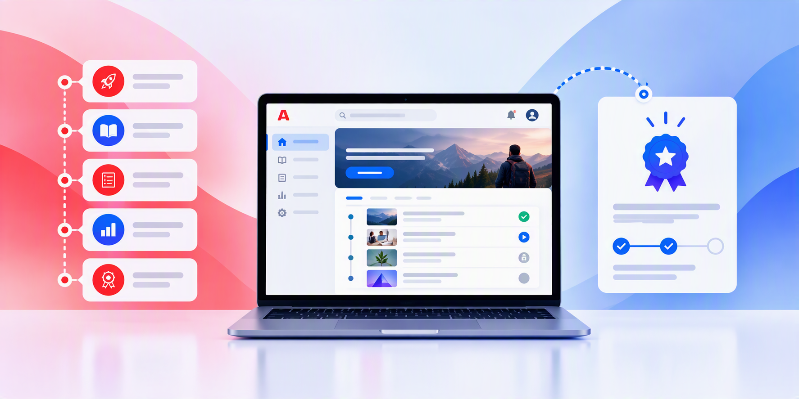

# Adobe Learning Manager 설명서

확장 가능한 학습자 경험, 규정 준수 교육 및 스킬 기반 개발을 위한 엔터프라이즈 LMS 안내선으로 바로 이동하려면 역할을 선택하십시오. 큐레이트된 Adobe Learning Manager 아카데미 과정 및 가이드된 학습 경로로 실질적인 제품 기술을 연마하십시오.

## 내 역할로 시작 {#roles}

달성해야 하는 내용과 일치하는 작업 과정 및 개념으로 바로 이동하십시오.

    

        

            

                <figure class="image x-is-16by9">
                    
                </figure>
            

            

                

                    

                        <a href="/help/migrated/administrators/feature-summary/getting-started-admin.md" target="_blank" rel="referrer" title="책임자">책임자</a>
                    

                    
계정, 사용자, 액세스 및 학습 경로를 구성합니다.

                

                <a href="/help/migrated/administrators/feature-summary/getting-started-admin.md" target="_blank" rel="referrer" class="spectrum-Button spectrum-Button--fill spectrum-Button--accent spectrum-Button--sizeM" style="align-self: flex-start; margin-top: 1rem;">
                    자세히 알아보기
                </a>
            

        

    

    

        

            

                <figure class="image x-is-16by9">
                    
                </figure>
            

            

                

                    

                        <a href="/help/migrated/authors/feature-summary/getting-started-author.md" target="_blank" rel="referrer" title="작성자">작성자</a>
                    

                    
강의, 인증, 콘텐츠 및 학습 경로를 생성합니다.

                

                <a href="/help/migrated/authors/feature-summary/getting-started-author.md" target="_blank" rel="referrer" class="spectrum-Button spectrum-Button--fill spectrum-Button--accent spectrum-Button--sizeM" style="align-self: flex-start; margin-top: 1rem;">
                    자세히 알아보기
                </a>
            

        

    

    

        

            

                <figure class="image x-is-16by9">
                    
                </figure>
            

            

                

                    

                        <a href="/help/migrated/learners/feature-summary/getting-started-learner.md" target="_blank" rel="referrer" title="Prime에서">학습자</a>
                    

                    
할당된 학습 내용을 탐색하고, 수강하고, 추적합니다.

                

                <a href="/help/migrated/learners/feature-summary/getting-started-learner.md" target="_blank" rel="referrer" class="spectrum-Button spectrum-Button--fill spectrum-Button--accent spectrum-Button--sizeM" style="align-self: flex-start; margin-top: 1rem;">
                    자세히 알아보기
                </a>
            

        

    

    

        

            

                <figure class="image x-is-16by9">
                    
                </figure>
            

            

                

                    

                        <a href="/help/migrated/managers/feature-summary/getting-started-manager.md" target="_blank" rel="referrer" title="관리자">관리자</a>
                    

                    
학습을 할당하고 팀 진행률을 모니터링합니다.

                

                <a href="/help/migrated/managers/feature-summary/getting-started-manager.md" target="_blank" rel="referrer" class="spectrum-Button spectrum-Button--fill spectrum-Button--accent spectrum-Button--sizeM" style="align-self: flex-start; margin-top: 1rem;">
                    자세히 알아보기
                </a>
            

        

    

    

        

            

                <figure class="image x-is-16by9">
                    
                </figure>
            

            

                

                    

                        <a href="/help/migrated/integration-admin/feature-summary/connectors.md" target="_blank" rel="referrer" title="통합 관리자">통합 관리자</a>
                    

                    
시스템, API, 데이터 및 워크플로우를 연결합니다.

                

                <a href="/help/migrated/integration-admin/feature-summary/connectors.md" target="_blank" rel="referrer" class="spectrum-Button spectrum-Button--fill spectrum-Button--accent spectrum-Button--sizeM" style="align-self: flex-start; margin-top: 1rem;">
                    자세히 알아보기
                </a>
            

        

    

## 책임자로서 학습 여정 시작

Adobe Learning Manager을 구성하고 관리하는 데 필요한 스킬을 쌓습니다.

            

                <figure class="image x-is-16by9">
                    
                </figure>
            

            

                

                    

                        <a href="https://content.adobelearningmanageracademy.com/app/learner?accountId=98632&amp;sdid=N7FDRBP4&amp;mv=partner#/learningProgram/168917" target="_blank" rel="referrer" title="강의 및 콘텐츠 관리">과정 및 콘텐츠 관리</a>
                    

                    
이 학습 여정을 통해 학습 콘텐츠를 효과적으로 생성, 구성 및 관리하는 방법을 알아봅니다.

                

                <a href="https://content.adobelearningmanageracademy.com/app/learner?accountId=98632&amp;sdid=N7FDRBP4&amp;mv=partner#/learningProgram/168917" target="_blank" rel="referrer" class="spectrum-Button spectrum-Button--fill spectrum-Button--accent spectrum-Button--sizeM" style="align-self: flex-start; margin-top: 1rem;">
                    학습 경로 열기
                </a>
            

        

        

            

                <figure class="image x-is-16by9">
                    
                </figure>
            

            

                

                    

                        <a href="https://content.adobelearningmanageracademy.com/app/learner?accountId=98632&amp;sdid=NC5FR6Y3&amp;mv=partner#/learningProgram/168919" target="_blank" rel="referrer" title="포털 및 경험">포털 및 환경</a>
                    

                    
Experience Builder를 사용하여 맞춤형 브랜디드 포털과 매력적인 공용 홈페이지를 구축하는 방법을 알아봅니다.

                

                <a href="https://content.adobelearningmanageracademy.com/app/learner?accountId=98632&amp;sdid=NC5FR6Y3&amp;mv=partner#/learningProgram/168919" target="_blank" rel="referrer" class="spectrum-Button spectrum-Button--fill spectrum-Button--accent spectrum-Button--sizeM" style="align-self: flex-start; margin-top: 1rem;">
                    학습 경로 열기
                </a>
            

        

        

            

                <figure class="image x-is-16by9">
                    
                </figure>
            

            

                

                    

                        <a href="https://content.adobelearningmanageracademy.com/app/learner?accountId=98632&amp;sdid=NGWGR372&amp;mv=partner#/learningProgram/168920" target="_blank" rel="referrer" title="관리 및 액세스">관리 및 액세스</a>
                    

                    
역할 구조, 권한 관리 및 거버넌스 프레임워크를 설정하는 방법에 대해 알아봅니다.

                

                <a href="https://content.adobelearningmanageracademy.com/app/learner?accountId=98632&amp;sdid=NGWGR372&amp;mv=partner#/learningProgram/168920" target="_blank" rel="referrer" class="spectrum-Button spectrum-Button--fill spectrum-Button--accent spectrum-Button--sizeM" style="align-self: flex-start; margin-top: 1rem;">
                    학습 경로 열기
                </a>
            

        

        

            

                <figure class="image x-is-16by9">
                    
                </figure>
            

            

                

                    

                        <a href="https://content.adobelearningmanageracademy.com/app/learner?accountId=98632&amp;sdid=NLMHQYH1&amp;mv=partner#/learningProgram/168921" target="_blank" rel="referrer" title="인식 및 규정 준수">인식 및 준수</a>
                    

                    
준수 인증을 설정하고, 사용자 정의 인증서를 디자인하고, 학습자의 성과를 기념하는 배지를 만드는 방법에 대해 알아봅니다.

                

                <a href="https://content.adobelearningmanageracademy.com/app/learner?accountId=98632&amp;sdid=NLMHQYH1&amp;mv=partner#/learningProgram/168921" target="_blank" rel="referrer" class="spectrum-Button spectrum-Button--fill spectrum-Button--accent spectrum-Button--sizeM" style="align-self: flex-start; margin-top: 1rem;">
                    학습 경로 열기
                </a>
            

        

        

            

                <figure class="image x-is-16by9">
                    
                </figure>
            

            

                

                    

                        <a href="https://content.adobelearningmanageracademy.com/app/learner?accountId=98632&amp;sdid=NQCJQTQZ&amp;mv=partner#/learningProgram/168918" target="_blank" rel="referrer" title="학습 경험 여정">학습 경험 여정</a>
                    

                    
학습 계획을 통해 강의를 구조화된 경로로 정렬하고 등록을 자동화하는 방법에 대해 알아봅니다.

                

                <a href="https://content.adobelearningmanageracademy.com/app/learner?accountId=98632&amp;sdid=NQCJQTQZ&amp;mv=partner#/learningProgram/168918" target="_blank" rel="referrer" class="spectrum-Button spectrum-Button--fill spectrum-Button--accent spectrum-Button--sizeM" style="align-self: flex-start; margin-top: 1rem;">
                    학습 경로 열기
                </a>
            

        

        

            

                <figure class="image x-is-16by9">
                    
                </figure>
            

            

                

                    

                        <a href="https://content.adobelearningmanageracademy.com/app/learner?accountId=98632&amp;sdid=NV3KQPZY&amp;mv=partner#/learningProgram/168922" target="_blank" rel="referrer" title="보고 및 분석">보고 및 분석</a>
                    

                    
리더쉽을 위해 대시보드를 사용하고 보고서를 작성하는 방법에 대해 알아보십시오.

                

                <a href="https://content.adobelearningmanageracademy.com/app/learner?accountId=98632&amp;sdid=NV3KQPZY&amp;mv=partner#/learningProgram/168922" target="_blank" rel="referrer" class="spectrum-Button spectrum-Button--fill spectrum-Button--accent spectrum-Button--sizeM" style="align-self: flex-start; margin-top: 1rem;">
                    학습 경로 열기
                </a>
            

        

주요 기능에 대한 집중 강의를 선택하거나 안내 학습 경로를 따릅니다. 아카데미 링크는 새 탭에서 열리며, 로그인해야 할 수 있습니다.

    <a href="https://cdn.content.adobelearningmanageracademy.com/?sdid=PC1PQ72T&amp;mv=partner"
       target="_blank"
       rel="referrer"
       class="spectrum-Button spectrum-Button--outline spectrum-Button--primary spectrum-Button--sizeM" style="align-self: flex-start; margin-top: 1rem;">
        
            ALM 아카데미 살펴보기
        
    </a>

## Adobe Learning Manager 살펴보기

새로운 기능을 탐색하고, 주요 기능을 탐색하고, 기술을 연마하세요.

<table style="table-layout:fixed">
 <tbody>

<tr style="border: 0;">
   <td>

<strong>새로운 기능 확인</strong>
    

    
최신 기능 과 릴리스 업데이트를 살펴보세요.

                

                    <strong>
                        <a href="/help/migrated/whats-new.md">자세히 알아보기</a>
                    </strong>
                

                

                    <strong>
                        <a href="/help/migrated/authors/feature-summary/content-composer/content-composer-help.md">콘텐츠 컴포저(Beta)</a>
                    </strong>
    

</td>
   <td>&lt;img src="./help/assets/overview/explore-ai-new.png" alt="새로운 기능 확인" style="width: 100%; aspect-ratio: 16 / 9; object-fit: cover;"

                    <strong>Insights 에이전트(Beta)</strong> 
                    <a href="/help/migrated/administrators/feature-summary/insights-agent.md">자세히 알아보기</a> &amp;vert; <a href="https://content.adobelearningmanageracademy.com/app/learner?accountId=98632&amp;sdid=MQH8RTM8&amp;mv=partner#/course/17286964">과정 실행</a>

                    <strong>학습 경로 에이전트(Beta)</strong> 
                    <a href="/help/migrated/learners/feature-summary/learning-path-agent.md">자세히 알아보기</a> &amp;vert; <a href="https://content.adobelearningmanageracademy.com/app/learner?accountId=98632&amp;sdid=MLR7RYC9&amp;mv=partner#/course/17286956">과정 실행</a>

                    <strong>라이브 허브(Beta)</strong> 
                    <a href="/help/migrated/getting-started-with-live-hub/getting-started-live-hub.md">자세히 알아보기</a> &amp;vert; <a href="https://content.adobelearningmanageracademy.com/app/learner?accountId=98632&amp;sdid=MV79RPW7&amp;mv=partner#/course/17286962">과정 실행</a>

</td>
   <td>&lt;img src="./help/assets/overview/learning-experience-new.png" alt="새로운 기능 확인" style="width: 100%; aspect-ratio: 16 / 9; object-fit: cover;"
   

                    <strong>Experience Builder</strong> 
                    <a href="/help/migrated/administrators/feature-summary/experience-builder/overview.md">자세히 알아보기</a> &amp;vert; <a href="https://content.adobelearningmanageracademy.com/app/learner?accountId=98632#/course/17286967">과정 실행</a>
    

    

                    <strong>Report Builder</strong> 
                    <a href="/help/migrated/administrators/feature-summary/alm-report-builder.md">자세히 알아보기</a> &amp;vert; <a href="https://content.adobelearningmanageracademy.com/app/learner?accountId=98632&amp;sdid=MYYBRL56&amp;mv=partner#/course/17286960">과정 실행</a>
    

                    <strong>전자 메일 작성기</strong> 
                    <a href="/help/migrated/administrators/feature-summary/email-builder.md">자세히 알아보기</a> &amp;vert; <a href="https://content.adobelearningmanageracademy.com/app/learner?accountId=98632&amp;sdid=N3PCRGF5&amp;mv=partner#/course/17286967">과정 실행</a>
    

    </td>
  </tr>

</tbody>
</table>

ALM을 사용하여 매력적인 학습 경험을 만들고, 관리하고, 제공하는 방법을 알아보십시오. 지금 개인 맞춤화된 데모를 신청하세요.

    <a href="https://business.adobe.com/resources/demo/adobe-learning-manager-lms.html?sdid=P79NQBSV&amp;mv=partner#make-personalized-learning-the-new-normal"
       target="_blank"
       rel="referrer"
       class="spectrum-Button spectrum-Button--outline spectrum-Button--primary spectrum-Button--sizeM" style="align-self: flex-start; margin-top: 1rem;">
        
            회원가입
        
    </a>

## 추가 리소스 {#additional-resources}

- [릴리스 정보](/help/migrated/release-note/release-notes.md)
- [커뮤니티에 질문](https://community.adobe.com/adobe-learning-manager-466)
- [피드백 보내기](https://github.com/AdobeDocs/learning-manager.en/issues)
