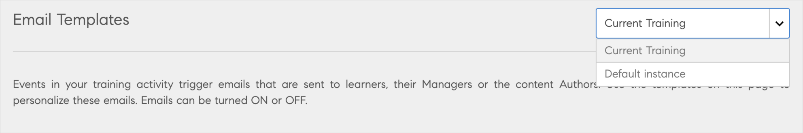
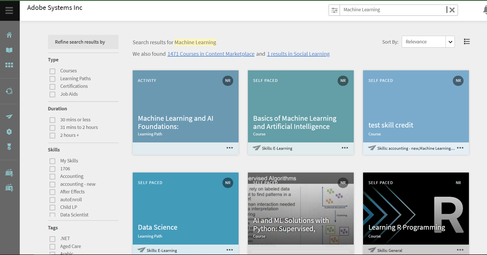

# 이 릴리스(2022년 11월)의 새로운 기능

<!--
IN-PROGRESS

<https://helpx.adobe.com/learning-manager/whats-new-nov-2022.html>
-->

## SSO 다중 로그인 구성

Adobe Learning Manager는 현재 내부 사용자와 외부 사용자에게 각기 한 가지 로그인 방식을 지원하고 있습니다. 이로 인해 동일한 계정을 보유한 직원, 고객 및 채널 파트너가 존재하는 경우 제약이 따릅니다.

Adobe 플랫폼에 로그인하는 여러 유형의 사용자 그룹을 지원하기 위해 Learning Manager는 이제 다중 SSO 구성을 통해 내부 및 외부 사용자에게 여러 가지 로그인 방식을 지원할 수 있습니다.

자세한 내용은 다음을 참조하세요. [SSO 다중 로그인](/help/migrated/administrators/feature-summary/multiple-sso-logins.md).

## 임시 방문 기능 지원

이제 Adobe Learning Manager 기본 포털에서 로그인하지 않고도 교육 포털에 액세스할 수 있는 방식이 지원됩니다.

이제 학습자가 교육 사이트를 방문하여 액세스하고, 제공되는 다양한 강의와 콘텐츠를 확인하며, 강의 내용을 열람할 수 있습니다.

이 기능을 사용하면 학습자가 로그인하지 않고도 다양한 강의를 탐색할 수 있는 고객 대면 학습 포털을 보다 쉽게 제작할 수 있습니다.

자세한 내용은 다음을 참조하세요. [학습자용 임시 방문 모드](/help/migrated/administrators/feature-summary/non-logged-in-experience-learners.md).

## 교육 개요 페이지 개선 사항

이제 교육 개요 페이지에서 업데이트된 UI가 지원되므로 학습자는 한층 더 편리하게 강의를 수강할 수 있습니다.

기타 향상된 기능은 다음과 같습니다.

* 교육에 책갈피 표시
* 관련 강의 추천.
* 강의 및 학습 경로에 대한 학습 경로 정보
* 클릭 가능한 작성자 이름
* 더 쉬운 탐색을 위한 탐색 경로

## 교육 개요 페이지 개선 사항

이제 교육 개요 페이지에서 업데이트된 UI가 지원되므로 학습자는 한층 더 편리하게 강의를 수강할 수 있습니다.

기타 향상된 기능은 다음과 같습니다.

* 교육에 책갈피 표시
* 관련 강의 추천.
* 강의 및 학습 경로에 대한 학습 경로 정보
* 클릭 가능한 작성자 이름
* 더 쉬운 탐색을 위한 탐색 경로

## 작성자 프로필 페이지

작성자 프로필 페이지에 특정 작성자가 만든 교육 내용이 모두 표시됩니다.

학습자는 작성자별 정보와 해당 작성자가 작성한 모든 교육 내용을 쉽게 찾을 수 있습니다.

## 책갈피 표시된 교육

학습자는 강의 타일 또는 개요 페이지에서 강의를 저장(&#39;저장&#39; 단추 사용)하거나 해당 강의에 책갈피를 표시할 수 있습니다. 책갈피를 표시한 모든 강의는 학습자 홈페이지에서 수강할 수 있습니다.

## 플레이어 사용자 정의

이번 릴리스에서는 강의의 브랜딩 요구 사항에 맞게 Fluidic Player를 사용자 정의할 수 있습니다.

콘텐츠 요구 사항에 따라 다양한 플레이어 설정 및 옵션을 표시하거나 숨기고, 콘텐츠 유형에 따라 학습자에게 제어 권한을 부여할 수 있습니다. 이 변경 사항은 기본 및 헤드리스 구현 환경에 모두 적용할 수 있습니다.

변경할 수 있는 다양한 옵션은 다음과 같습니다.

* 목차 전환
* 노트
* 언어
* 속도
* 캡션
* 볼륨
* 재생 컨트롤

## 학습자 및 관리자의 대리 로그인

관리자는 대리 로그인 세션을 시작하여 학습자 및 관리자 계정을 보유한 사용자 대신 로그인할 수 있습니다.

자세한 내용은 다음을 참조하세요. [학습자 및 관리자의 대리 로그인](/help/migrated/administrators/feature-summary/impersonation-learner-manager.md).

## 기타 향상된 기능

### 전자 메일 감사 로그

이제 관리자는 전자 메일 감사 추적 보고서를 통해 시스템에서 보낸 모든 전자 메일 로그에 액세스할 수 있습니다.

이 로그는 지난 30일 동안 전송된 전자 메일과 관련된 모든 데이터를 캡처하고 매일 새로 고쳐집니다. 또한 보고서에는 전달된 상태, 보낸 사람, 받는 사람, 제목, 콘텐츠 메타데이터 등의 정보가 포함됩니다.

보고서 > 사용자 정의 보고서 > Excel 보고서 > 전자 메일 보고서에서 보고서를 다운로드합니다. 보고서를 다운로드할 수 있는 알림이 나타납니다.

이 보고서는 다음 필드로 구성되어 있습니다.

* 전자 메일 트리거 시간(UTC 시간대)
* 마지막 이벤트 상태 시간(UTC 시간대)
* 배달 상태
* 수신자 전자 메일
* 전송자 사용자 ID
* 전자 메일 제목
* 엔터티 유형
* 엔티티 이름
* 엔터티 ID

### 대기자 명단에 등록된 학습자 알림

새 인스턴스를 추가한 작성자는 대기자 명단에 있는 학습자에게 새로 추가된 인스턴스를 알려주는 전자 메일을 발송할 수 있습니다. 학습자는 변경 사항에 대한 전자 메일을 받습니다.

### 인스턴스 레벨 전자 메일 템플릿

각 교육 인스턴스에 대한 전자 메일을 사용자 정의할 수 있습니다.

작성자 또는 책임자가 새 인스턴스를 추가하도록 허용된 경우 개별 인스턴스의 템플릿을 편집할 수 있습니다.

예를 들어 강의 대상 유형이 다른 경우 그에 따라 전자 메일 템플릿을 변경할 수 있습니다.



템플릿의 우선 순위는 다음과 같습니다.

1. 인스턴스 레벨 템플릿
2. 교육 레벨 템플릿
3. 계정 수준 템플릿

### 학습자로부터 받은 과제물에 강사 의견 추가

이제 강사는 학습자로부터 받은 과제물에 의견을 추가할 수 있습니다. 강사가 제출을 승인하면 학습자는 전자 메일 알림 및 앱 내 알림(활성화된 경우)을 받습니다. 제출 관련 의견은 책임자와 학습자 모두의 학습자 성적 증명서에 표시됩니다.

### 검색 관련 개선 사항

학습자의 최근 검색 기록이 표시되므로 이전의 모든 검색 내역을 확인할 수 있습니다.

이제 모든 공식 및 비공식 학습(소셜 학습)에서 검색 결과가 동일하게 표시됩니다. 그 결과에는 교육, 소셜 학습, 콘텐츠 마켓플레이스 일치 항목이 포함됩니다.

검색은 보다 집중적이고 대상화되어 있으며, 검색 결과를 공식 학습, 소셜 학습 및 콘텐츠 마켓플레이스 세 곳에서 볼 수 있습니다.



#### 구문 기반 검색

이번 Adobe Learning Manager 릴리스에서는 자동 완성 검색을 구문 기반 검색으로 대체했습니다.

#### 최근 검색

학습자는 현재 세션에서만 최근 검색을 볼 수 있습니다.

### 콘텐츠 마켓플레이스 무료 강의 카탈로그

이제 엄선한 고품질 무료 강의 50개의 카탈로그 세트를 학습자용 콘텐츠 마켓플레이스에서 즉시 수강할 수 있습니다.

### 인도네시아어 지원

인도네시아어가 학습자 및 관리자 앱의 인터페이스 언어로 추가되었습니다.

### 작성자 필수 입력 필드

강의를 생성할 때 작성자 필드는 필수입니다.

### 콘텐츠 마켓플레이스 변경 사항

* 새로 만든 평가판 계정을 사용하면 콘텐츠 마켓플레이스에서 무료 강의 50개의 새 카탈로그가 나열되며 무료 강의를 즉시 수강할 수 있습니다.
* 이제 학습자에게 검색 결과 개수를 확인하고 콘텐츠 마켓플레이스로 리디렉션할 수 있는 링크가 표시됩니다.

### 모바일 몰입형 변경 사항

이번 릴리스에서 모바일 몰입형 웹 사용자는 아래 나열된 작업을 수행할 수 있습니다.

* 만들기 - 투표 게시물
* 게시물 편집 - 모든 유형, RTE
* 전자 상거래 워크플로우
* 모듈 미리보기: 모바일 몰입형 웹에서 학습자의 모듈 미리보기 기능이 제공됩니다. 이번 변화 덕분에 학습자는 강의에 등록하기 전에 모듈을 미리 볼 수 있습니다.
* URL 복사.
* 게시판을 삭제합니다.

### 줌 커넥터 변경 사항

JWT 유형의 앱 지원이 2023년 6월부로 중단됩니다. 서버-서버 OAuth 인증 앱이나 OAuth 인증 앱을 만들어 JWT 앱의 기능을 대체하시길 권장합니다.

### 게임화 보고서

이 릴리스에서는 게임화가 활성화된 다양한 강의를 표시하는 보고서에 액세스할 수 있습니다.

### CSV를 통해 언어 환경 설정 가져오기

CSV를 가져올 때 CSV에는 인터페이스 언어, 콘텐츠 언어 및 시간대가 필드로 포함됩니다.

책임자는 위와 동일한 필드가 포함된 보고서를 내보낼 수도 있습니다.

* 인터페이스 언어
* 콘텐츠 언어
* 표준 시간대

책임자 외에도 사용자 지정 책임자가 이 보고서를 내보낼 수도 있습니다.


#### 로컬라이제이션에 미치는 영향

* 열 이름은 로컬라이제이션할 수 없으며 그대로 두어야 합니다(인터페이스 언어, 콘텐츠 언어, 시간대).
* 로케일 코드는 대소문자를 구분하지 않습니다.
* 국가 코드를 제공하는 데는 제한이 없지만 언어 코드만 지정할 수 있습니다. 예를 들어 &#39;it_IT&#39; 및 &#39;it&#39; 모두 유효합니다.
* 잘못된 로케일 코드로 인해 보고서가 일치하지 않는 경우 CSV 처리는 계속되며 CSV의 다른 기록에 영향을 주지 않습니다. 잘못된 로케일 사용자의 로케일 환경 설정은 업데이트되지 않습니다. 나머지 데이터가 업데이트됩니다.

## API 변경 사항 및 개선 사항

### VC 커넥터

관리자 이메일 ID를 사용하여 VC 커넥터를 구성하려는 관리자에게는 다음 권한이 있어야 합니다.

* 회의 만들기
* 회의 업데이트
* 출석 보고서 가져오기

강사가 VC 회의를 생성하거나 업데이트하려면 예정된 회의 종료 시각으로부터 30분 안에 회의를 종료해야 합니다.

### 책갈피 표시

교육 개요 페이지에서 강의에 책갈피를 표시하는 데 사용할 수 있는 다음 API가 추가되었습니다.

* 모든 책갈피 가져오기: `primeapi/v2/bookmarks`
* 책갈피 만들기: `primeapi/v2/learningObjects/{id}/bookmark`
* 책갈피 삭제: `primeapi/v2/learningObjects/{id}/bookmark`

### 마이그레이션을 통한 다중 로케일 메타데이터 및 콘텐츠 지원

이제 플랫폼에서 지원되는 모든 유형의 교육(강의, 학습 경로, 모듈, 수료증, 작업 지원)을 다룬 CSV 파일로 다국어 마이그레이션을 진행할 수 있습니다. 여기에는 새로운 언어용으로 추가된 열이 사용됩니다.

#### 사전 요구 사항

통합 책임자로 마이그레이션 프로젝트를 만든 다음 migrationProjectId를 ALM 지원팀과 공유하면 백엔드에서 다중 로케일 플래그를 활성화할 수 있습니다.

#### 다중 로케일 마이그레이션 개체의 범위

* 모듈
* 강의
* 모듈 버전
* 인증
* 학습 프로그램
* 작업 지원
* 작업 지원 버전

#### CSV 사양

Adobe Learning Manager는 다중 로케일 사용 마이그레이션을 위한 일련의 표준 CSV 사양을 제공합니다. 마이그레이션 프로세스를 시작하기 전에 CSV 사양을 살펴보는 것이 좋습니다. 조직의 통합 책임자는 기존의 데이터 형식을 분석하고 매핑하여 Learning Manager에서 제공한 CSV 템플릿 항목에 일치시킵니다.

#### 다중 로케일 지원 변경 사항

* module_version 열은 module_version.csv 및 course_module.csv에서 지원되지 않습니다.
* 동일한 실행에서 module_version을 업데이트할 수 없습니다(동일한 실행에서 모듈은 동일한 모듈이 있는 두 버전으로 마이그레이션할 수 없음).
* 콘텐츠 또는 메타데이터 업데이트는 module_version.csv의 모듈 버전 업데이트로 간주됩니다.
* job_aid_version.csv를 통한 Job_Aid_Version 업데이트를 지원할 수 없음

### 인증 토큰 및 쿠키 취소

헤드리스 LMS 응용 프로그램은 처음 로그인하면 refresh_token을 가져옵니다. refresh_token은 클라이언트 응용 프로그램이 API를 호출하는 데 필요한 access_token을 생성하는 데 사용됩니다. 이와 유사하게 콘텐츠를 재생하면 OAuth 엔드 포인트가 쿠키를 생성하는데, 쿠키 생성 목적은 해당 파일에서 호출하는 여러 콘텐츠 파일 및 API 호출과 관련된 재생을 관리하는 데 있습니다. oauth에서 생성한 쿠키의 유효 기간은 access_token과 동일하게 7일입니다. 일단 쿠키가 생성되면 일반적인 웹 응용 프로그램 로그아웃과 달리 삭제할 방법이 없습니다. Oauth 쿠키와 웹 응용 프로그램 쿠키는 서로 다른 쿠키이며 서로를 인식하지 못합니다.

따라서 refresh_token, 쿠키 및 쿠키와 새로 고침 토큰을 모두 취소하여 쿠키를 삭제할 수 있는 새로운 엔드포인트가 도입되었습니다.

**세부 사항**

**끝점**

`POST oauth/o/revoke`

**쿼리 매개 변수**

* `cookie=true|false` - 쿠키를 취소해야 함을 나타냅니다.
* `refresh_token=true|false` - 새로 고침을 나타냅니다

**요청 본문**

refresh_token 또는 (refresh_token과 쿠키)을 취소하는 데 필요한 본문

```
{
      "client_id": <>,
      "client_secret": <>,
      "refresh_token": <>
}
Body required for revoking oauth cookie only
{
      "access_token": <>
}
```

### 공개된 API

이번 릴리스에서는 몇 가지 API를 공개했습니다.

| API | 유형 | 설명 |
|---|---|---|
| /social/search | GET | 소셜에서 검색합니다. |
| /announcations | GET | 학습자에게 할당된 발행인란의 공지사항에 관한 자세한 정보를 가져옵니다. |
| /announcements/`{id}` | GET | 학습자에게 할당된 발행인란의 공지사항에 관한 자세한 정보를 가져옵니다. |
| /learningObject/`{id}`/loResources/{loResourcesId} | GET | 파일로 제출해야 하는 resourceType &#39;Activity&#39;의 loResource에 관한 파일의 URL을 업로드합니다. |
| /jobAid/`{jobAidId}`/jobAidDownload | GET | 작업 지원 다운로드 보고서를 설정합니다. |
| /bulkimport/startrun | POST | 일괄 가져오기를 실행합니다. |
| /bulkimport/cansync | GET | 일괄 가져오기를 동기화합니다. |
| /search | GET | DELETEMEBOB |
| /uploadInfo | GET | 콘텐츠 업데이트 관련 정보를 가져옵니다. |
| /uploadSigner | GET | to_sign 콘텐츠의 서명을 가져옵니다. |
| /avatar | POST | 학습자의 아바타 이미지를 새 이미지로 업데이트합니다. |
| /avatar | DELETE | 학습자의 아바타 이미지를 삭제합니다. |

### Salesforce 앱

대상 **상위 LO 무시** 모든 강의, 학습 프로그램, 수료증을 동시에 표시하려면 Salesforce 앱에서 해당 옵션을 활성화해야 합니다.

### 플레이어 사용자 정의를 위한 API

이 릴리스에서는 플레이어를 사용자 정의할 수 있는 API를 제공했습니다. 다음을 수행할 수 있습니다.

* 플레이어 시작 또는 로드
* 특정 모듈로 이동합니다.
* 목차 전환
* 언어를 변경합니다.
* 플레이어 닫기
* 재생, 일시 정지, 앞으로, 뒤로, 탐색, 볼륨 변경 또는 속도 변경
* 플레이어에서 발생하는 이벤트 캡처

### 학습자의 대기자 명단 위치 표시

GET /등록/{id}/waitlistPosition LO API 아래의 API는 지정된 등록에 대한 사용자의 대기자 명단 위치를 검색합니다.

### 외부 인증 완료일 제출

/primeapi/v2/learningObjects/certification:xxxxx API에는 &#39;completionDateSameAsApprovalDate&#39; 속성이 있어 인증서에 학습자에 대해 &#39;인증 완료 날짜&#39;가 활성화되어 있거나 true/false 플래그와 함께 활성화되지 않았음을 나타냅니다.

### LO 미리보기 데이터 가져오기

GET /preview/learningObjects/{id} 학습 객체에 대한 미리보기 정보를 가져오기 위해 API가 추가되었습니다.

### 프로필 내에서 외부 사용자 이동

대상 `PUT primeapi/v2/externalProfiles/{currentep}/users/{userid}?` 호출은 새 externalProfile id를 지정하여 사용자를 다른 외부 프로필로 이동하는 데 도움이 됩니다.

### 외부 프로필에 사용자 추가

대상 `POST /externalProfiles/{id}/users` 외부 사용자를 외부 프로필에 추가합니다.

## 릴리스 정보

현재 및 이전 릴리스의 Learning Manager 웹 앱 및 장치 앱과 관련된 정보는 [릴리스 정보](/help/migrated/release-note/release-notes.md).

## 버그 수정

이 업데이트에서 수정된 버그를 보려면 [수정된 버그 목록](release-note/release-notes.md#bugs-fixed-in-this-release).

## 시스템 요구 사항

[Learning Manager 시스템 요구 사항](/help/migrated/system-requirements.md)
