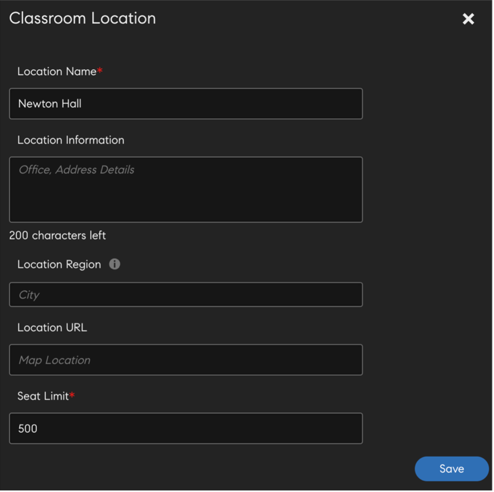
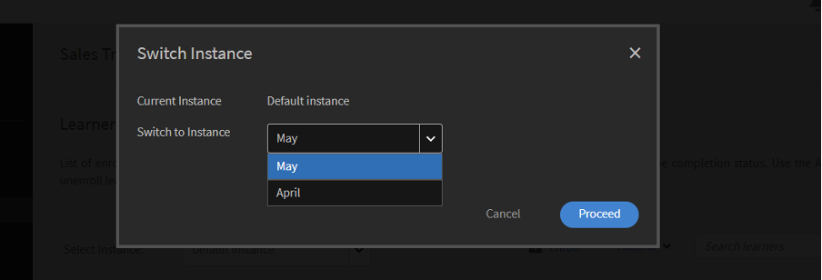

# 이 릴리스(2023년 4월)의 새로운 기능

## Microsoft Teams을 위한 Adobe Learning Manager 앱

Microsoft Teams의 새로운 Adobe Learning Manager 앱은 업무 흐름의 학습을 촉진하고 소셜 학습을 활성화하기 위해 설계되었습니다. 학습자는 브라우저로 전환할 필요 없이 Microsoft Teams 플랫폼 내에서 학습 콘텐츠에 액세스할 수 있습니다. MS Teams용 Adobe Learning Manager 앱 베타 릴리스는 CSAM에 문의하십시오.

자세한 내용은 다음을 참조하세요. [Microsoft Teams을 위한 Adobe Learning Manager 앱](/help/migrated/adobe-learning-manager-app-microsoft-teams.md).

## ILT(강사 주도 교육) 경험 개선 사항

ILT(Instructor Led Training) 경험에 대한 몇 가지 개선 사항이 적용되었습니다. 향상된 주요 기능으로는 위치를 기반으로 세션을 필터링하는 기능, 진행 상황을 잃지 않고 인스턴스를 전환하는 기능(VILT), 예약 세션의 충돌을 관리하는 새로운 &#39;예약 도우미&#39;, 강사에게 &#39;스킬&#39;을 첨부하는 기능, 스킬을 기반으로 강사를 선택하는 기능 등이 있습니다.

### 변경된 사항

* 책임자 앱의 스킬 페이지에는 스킬 강사 매핑을 업로드할 수 있는 옵션이 있습니다.
* 스킬 페이지에는 강사라는 새 열이 있습니다. 스킬에 대한 강사 수가 열에 표시됩니다. 강사 열에서 번호를 클릭하면 스킬에 할당된 강사 수를 보여 주는 팝업으로 리디렉션됩니다.

자세한 내용은 다음을 참조하세요. [강사에게 스킬 할당](/help/migrated/administrators/feature-summary/skills-levels.md#assign-skills-to-instructors).


### 일정 도우미

강사 및 강의실 또는 가상 강의실 예약 충돌을 관리합니다. 강사를 강의에 할당하기 전에 강사가 이용할 수 있는 시간과 날짜를 알고 싶다면 일정 관리 도우미 를 사용합니다.

작성자, 책임자 및 사용자 정의 책임자/작성자는 일정 도우미 를 사용할 수 있습니다.

자세한 내용은 다음을 참조하세요. [일정 도우미](/help/migrated/authors/feature-summary/courses.md#scheduling-assistant).

## 새 Adobe Learning Manager 모바일 앱

학습자가 이동 중에도 학습 서비스를 원활하게 이용할 수 있도록 해 주는 Android 및 iOS용 새로운 Adobe Learning Manager 모바일 앱입니다. 이 앱을 사용하면 학습자가 모바일 장치에서 교육을 수료하고 나중에 데스크탑에서 다시 시작할 수 있습니다. 모바일 앱은 알림, 파일 업로드, 간편한 책갈피 작성 및 학습 콘텐츠 공유, 소셜 학습 등을 지원하며 학습자에게 추가적인 유연성을 제공하고 Just-In-Time 학습을 지원합니다.


Google Play 스토어 및 Apple App Store에서 모바일을 다운로드합니다. 이전 버전의 앱 사용자에게는 새 앱을 다운로드하고 설치하라는 메시지가 표시됩니다.

이번 릴리스에서 앱은 다음 기능을 지원합니다.

새 모바일 앱은 이번 릴리스에서 다음과 같은 주요 기능을 지원합니다.

* 검색 입력 상자에 학습자의 최근 검색과 조직의 인기 검색 표시를 포함한 향상된 검색입니다.
* 학습자 성적 증명서를 다운로드할 수 있습니다.
* 즉석 알림 센터 - 앱 내에서 학습자에게 알림으로 중요한 업데이트를 제공합니다
* 카탈로그/내 학습 페이지에서 학습 개체를 정렬하고 필터링하는 기능
* 학습 개체(LO)에 책갈피를 추가하는 기능 - 책갈피가 추가된 LO는 학습자 홈페이지의 &#39;내가 저장&#39; 섹션에서 사용할 수 있습니다.
* 향상된 LP 지원
* 모바일 인터페이스 언어를 Adobe Learning Manager 지원 언어로 변경할 수 있습니다.
* 외부 인증, CR/VC 세션 및 활동 모듈의 파일 업로드 지원
* 앱 내에서 L1 강의 피드백을 제출할 수 있습니다.
* 딥 링크 지원
* 소셜 학습 지원.
* 배지 지원.
* 외부 사용자 로그인 지원

**이 릴리스에서 지원되지 않는 기능**

* 모바일 앱 내에서 강의를 수강하는 경우 강의의 퀴즈 모듈에 대한 다중 시도 지원.
* 검색 범위를 지정하기 위한 강의 메타데이터, 태그 및 스킬과 같은 검색 매개 변수를 지정할 수 있는 검색 옵션입니다.
* 모바일 앱에서 사용자에게 팝업으로 표시되는 관리자 지원 사용자 정의 알림.
* 앱의 스킬 페이지에서 스킬을 추가할 수 없습니다.
* 오프라인 상태에서 강의 수강.

자세한 내용은 다음을 참조하세요. [Adobe Learning Manager 모바일 앱](/help/migrated/learners/feature-summary/ipad-android-tablet-users.md).

## QR 코드 스캔 앱을 사용하여 Learning Manager QR 코드 스캔

Adobe 이제 Learning Manager는 기본 카메라 앱의 도움으로 QR 코드를 스캔하는 앱을 다운로드할 필요 없이 사용자가 보다 직관적인 QR 코드 스캔 방법을 지원합니다.

ALM 앱의 메뉴를 사용하여 QR 코드를 스캔할 수 있는 이전 워크플로우를 지원하기 위해 이 릴리스에서는 새 워크플로우로 전환하는 방법에 대한 정보를 제공했습니다.

QR 코드 기반 워크플로우 개선 사항으로, 이 릴리스 이전에 생성된 이전 QR 코드는 더 이상 지원되지 않습니다. 따라서 이 릴리스 이후 수행될 강의실 또는 VC 세션용 이전 버전의 Learning Manager로 QR 코드를 생성한 경우 새 QR 코드를 생성해야 합니다.

### 권장 사항 공지 개선 사항

이번 릴리스에서는 학습자의 관련 강의를 표시하기 위해 학습자가 속한 사용자 그룹에 따라 추천 스트립을 조직에서 추천으로 업데이트했습니다.

책임자는 학습자의 프로필을 기반으로 특정 강의나 교육을 학습자에게 제공할 수 있습니다. 그러면 학습자는 자신이 속한 프로필을 기반으로 강의를 검색할 수 있습니다.

**변경된 사항**

공지 페이지에는 학습자에게 이 강의나 교육이 권장된 이유를 보여주는 옵션이 있습니다.


### NEw 관리자 설정

관리자에게 설정 > 필터 패널 표시에 있는 그룹 이라는 새로운 옵션이 제공됩니다. 그룹이 활성화되면 학습자 홈페이지의 그룹 필터가 표시됩니다. 그러면 학습자는 사용자 그룹을 기반으로 강의를 표시하도록 선택할 수 있습니다.

|   | 옵션이 활성화된 경우 | 이 옵션이 비활성화된 경우 |
|--- |--- |--- |
| 그룹 옵션이 활성화됨 | <ul><li> 사용자 그룹을 카탈로그 페이지에 대한 링크와 함께 타일에 표시합니다.</li><li> 사용자 그룹이 카탈로그 필터에 표시됩니다.</li></ul> | <ul><li>사용자 그룹의 이름이 타일에 표시되지 않습니다.</li><li>사용자 그룹이 카탈로그 필터에 나열되지 않습니다.</li></ul> |
| 그룹 옵션이 비활성화됨 | <ul><li>강의 타일에 사용자 그룹의 이름을 일반 텍스트로 표시합니다.</li><li>사용자 그룹이 카탈로그 필터에 나열되지 않습니다.</li></ul> | <ul><li>강의 타일에는 텍스트 또는 사용자 그룹의 이름이 표시되지 않습니다.</li><li>사용자 그룹이 카탈로그 필터에 나열되지 않습니다.</li></ul> |

**작동 방식**

책임자는 모든 사용자 그룹에 대한 과정을 추가하여 공지를 만들고 게시합니다.

학습자가 보는 것은 홈페이지 추천 강좌가 있는 스트립과 타일에 강좌에 대한 링크입니다.


학습자가 링크 또는 카탈로그로 이동 버튼을 클릭하면 학습자가 강의 카탈로그 페이지로 리디렉션됩니다. 그런 다음 학습자는 카탈로그 및 내 학습 페이지의 사용자 그룹을 기반으로 필터링할 사용자 그룹 목록을 볼 수 있습니다.


## 위치를 사용하여 세션 검색

### 강의실 위치 관리

학습자가 위치를 기준으로 캘린더에서 세션을 필터링하는 경우가 있습니다. 강의실 위치 대화 상자나 CSV 파일을 사용하여 위치를 추가한 후 학습자는 필터링할 수 있습니다.



자세한 내용은 다음을 참조하세요. [강의실 위치 추가](/help/migrated/administrators/feature-summary/settings.md#classroom-locations).

### 달력 위젯

학습자는 위치에 따라 자신에게 할당된 세션을 필터링할 수 있습니다. 달력 위젯으로 이동하여 [세션 필터링]을 선택하고 위치를 선택합니다.


또한 강의를 생성하는 동안 작성자가 위치를 추가하는 경우 이제 교육 위치가 강의 개요 페이지에 표시됩니다.

### 책임자

책임자는 학습자가 위치에 따라 강의를 필터링할 수 있는지 여부를 제어할 수 있습니다. 설정 > 일반에서 교육 위치를 활성화하거나 비활성화합니다.

자세한 내용은 다음을 참조하세요. [관리자 설정](/help/migrated/administrators/feature-summary/settings.md).

## 체험판 환경 변경 사항

체험판 계정이 생성되면 콘텐츠 마켓플레이스에서 지체 없이 강의를 사용할 수 있습니다.

## 챗봇

챗봇을 사용하여 상담원 또는 여러 상담원과 채팅합니다. 체험판 계정의 관리자 및 사용자 정의 관리자만 이 기능을 사용할 수 있습니다.

채팅봇은 다음을 수행합니다.

* 메시지를 통해 환영합니다.
* 제품 정보 또는 제품 데모용 옵션을 제공합니다.
* 라이브 상담사에게 채팅을 전환합니다.
* 채팅 기록을 보존합니다.


## 관찰 체크리스트 개선 사항

작성자는 이제 관리자와 저장소/위치 관리자를 검사 목록의 검토자로 선택할 수 있습니다. 관리자 및 스토어/위치 관리자 가 검토자로 선택된 경우 강사 역할로 전환하지 않고도 팀의 체크리스트를 보고 완료할 수도 있습니다. 강사는 체크리스트를 계속 검토합니다. 등록 체크리스트에 대한 새로운 &quot;검토 체크리스트&quot; 알림이 인스턴스의 검토자(강사/관리자)에게 전송됩니다.

관리자가 체크리스트 모듈에 검토자로 추가되면 관리자 앱에서 체크리스트를 검토할 수 있습니다. 강사는 예상대로 점검표에 대한 검토를 계속해야 합니다.

자세한 내용은 다음을 참조하세요. [관찰 체크리스트](/help/migrated/authors/feature-summary/courses.md#observation-checklist).

## 기타 향상된 기능

### 학습자 검색

또한 검색 결과는 다음과 같이 분류됩니다.

* 사용자에 의한 최근 검색
* 조직의 인기 검색

학습자를 위한 검색 기능도 개선되었습니다. 학습자는 이제 큰따옴표 &quot;...&quot;, 더하기 &quot;+&quot; 및 빼기 &quot;-&quot; 연산자를 사용하여 더 빠르게 관련 결과를 찾고 Google 검색과 유사한 경험을 할 수 있습니다.

* 큰따옴표(&quot;...&quot;)를 사용하여 정확한 구문 또는 단어가 포함된 강의를 검색합니다. 예를 들어 &quot;data science&quot;를 입력하면 data science 구문으로 시작하는 과정이 반환됩니다.
* + 연산자를 사용하여 특정 구문 또는 단어가 포함된 결과만 표시되게 합니다. 예를들어, 컴퓨터 프로그래밍 +python은 &quot;python&quot;이라는 단어가 포함된 컴퓨터 프로그래밍 과정만 표시합니다.
* - 연산자를 사용하여 특정 구문 또는 단어가 포함되지 않은 결과만 표시되도록 합니다. 예를들어 컴퓨터 프로그래밍 -python은 &quot;python&quot;이라는 단어가 포함된 것을 제외한 모든 컴퓨터 프로그래밍 과정을 표시합니다.

### 학습 객체에 대해 충돌하는 팝업

학습자에게 충돌하는 세션이 있는 경우 개요 페이지에 등록 팝업이 표시됩니다. 카탈로그 페이지나 개요 페이지에서 등록했는데 학습자의 세션이 이미 충돌하는 경우 세션 세부 정보가 충돌하는 팝업 메시지가 표시됩니다. 학습자가 충돌하는 세션이 있더라도 새 세션에 등록할 수 있습니다.


이 메시지는 단순한 경고에 불과합니다. 강의에 계속 등록할 수 있습니다.

### 새 템플릿

등록 취소로 인해 세션 취소라는 새 이메일 템플릿을 추가했습니다. 사용자가 교육에서 등록이 취소되면 취소 이메일을 받습니다.

### 강의의 새로운 가격 기능

관리자는 이제 관리자 설정 > 기본 정보 섹션에서 계정의 통화를 설정할 수 있습니다. 관리자는 기호와 ISO 통화 코드(예: USD, GBP) 모두를 지정할 수 있습니다. 모든 새 계정의 기본값은 $입니다. 해당 변경 사항은 학습자가 아닌 앱에만 적용됩니다. 책임자는 학습자로 강의를 미리 볼 때 변경 사항을 확인할 수 있습니다. 통화 기호는 학습자 성적 증명서 및 교육 보고서에도 나타납니다.

자세한 내용은 다음을 참조하세요. [관리자 설정](/help/migrated/administrators/feature-summary/settings.md).

### 인스턴스 전환

특정 강의 인스턴스에 등록된 학습자는 이용 가능한 모든 강의 인스턴스 목록을 보고 더 적합한 다른 인스턴스로 전환할 수 있습니다. 전환의 이유는 학습자가 이전 인스턴스에 참석하지 않았거나 새로운 인스턴스에 대한 세션 시간이 더 적절하거나 다른 것일 수 있습니다.

과정의 일부로 학습자가 진행한 모든 진행사항, 학습자 퀴즈 점수 등은 새 인스턴스로 이월됩니다. 이 기능은 주로 강의실 및 혼합 강의에 사용되지만, 자가 진행식 강의를 포함한 모든 유형의 강의를 지원합니다.

[모든 인스턴스 보기] 옵션은 [인스턴스 전환] 설정과 관계없이 나타납니다. 강의 인스턴스가 두 개 이상 있는 경우 학습자는 이제 모든 인스턴스를 볼 수 있는 옵션을 확인할 수 있습니다.

인스턴스 전환 옵션이 활성화된 경우 학습자는 강의를 완료할 때까지 다양한 인스턴스로 전환할 수 있습니다. 옵션이 비활성화된 경우 학습자가 인스턴스를 볼 수 있지만 강의에 등록할 수 없습니다.

학습자가 **모든 인스턴스 보기**, 학습자는 모든 강의 인스턴스를 볼 수 있습니다.


책임자는 학습자용 인스턴스를 전환할 수 있습니다.




학습자 또는 책임자 앱에서 강의 인스턴스가 완료될 때까지 인스턴스를 전환할 수 없습니다.

작성자는 강의를 생성하는 동안 &#39;인스턴스 전환&#39;을 활성화하거나 비활성화할 수 있습니다. 인스턴스 전환은 무료 강의에서만 사용할 수 있습니다.

자세한 내용은 다음을 참조하세요. [인스턴스 구성](/help/migrated/authors/feature-summary/courses.md).

**학습자**

학습자는 대기자 명단 강의 인스턴스에서 다른 인스턴스로 전환할 수 있습니다. 또한 학습 경로 또는 인증에서 강의 인스턴스를 전환할 수도 있습니다.

강의 페이지에서 학습 경로 또는 인증에 등록한 후 인스턴스 보기를 클릭한 다음 인스턴스를 전환할 수 있습니다.

>[!NOTE]
>
>관리자가 지정한 등록 유형에 대해 인스턴스 전환 구성이 지원되지 않습니다.
>
>Flex LP에서 인스턴스를 전환하는 경우 진행률이 다른 인스턴스로 전달됩니다.

### 사용자 감사 추적

사용자 감사 추적 보고서는 &quot;인스턴스&quot;에서 &quot;인스턴스&quot;로, 시간, 날짜 등으로 인스턴스를 전환한 학습자에 대한 정보를 캡처합니다.


자세한 내용은 다음을 참조하세요. [사용자 감사 추적 보고서](/help/migrated/administrators/feature-summary/reports.md#useraudittrailreports).

### 강사 활용 보고서

이 보고서는 강사가 할당된 세션을 가르치는 데 매일 소요된 시간(분)을 캡처합니다. 보고서는 선택한 시작일로부터 3개월 동안 다운로드할 수 있습니다.

자세한 내용은 다음을 참조하세요. [강사 활용률 보고서](/help/migrated/administrators/feature-summary/reports.md#instructor-utilization-report).


### 작업 지원 보고서

계정에 있는 작업 지원과 언어, 유형, 기간, 작성자, 태그 등 작업 지원에 대한 다양한 정보를 추적하는 새 보고서입니다.

자세한 내용은 다음을 참조하세요. [작업 지원 등록 보고서](/help/migrated/administrators/feature-summary/reports.md).

### 특정 강의 인스턴스에 등록된 학습자에게 보낼 대상 임시 전자 메일

책임자 및 작성자는 특정 강의 인스턴스에 등록된 학습자에게 대상 특별 전자 메일 알림을 보낼 수 있습니다. 강의 및 학습 프로그램에 인스턴스 레벨 이메일 전송 옵션이 추가되었습니다.


*인스턴스 수준 이메일 보내기*

공지 작성 대화 상자에서 이메일 및 교육 유형으로 인스턴스와 함께 옵션이 기본적으로 선택됩니다. 제목을 지정하고 메시지를 입력한 다음 [저장]을 클릭합니다.

자세한 내용은 다음을 참조하세요. [인스턴스 레벨 이메일](/help/migrated/administrators/feature-summary/courses.md#send-instance-level-emails).

### 책임자의 공지를 통해 학습자에게 발송되는 대상 임시 이메일

책임자의 경우 새로운 유형의 알림(&quot;전자 메일로&quot;)이 추가되었습니다. 선택한 사용자 그룹의 학습자 또는 특정 교육에 등록된 학습자에게 대상 임시 전자 메일을 보내는 데 사용할 수 있습니다.

사용자 정의 책임자 및 작성자도 필요한 액세스 권한이 있는 경우 인스턴스 수준에서 이 옵션을 볼 수 있습니다.

자세한 내용은 다음을 참조하세요. [공지](/help/migrated/administrators/feature-summary/announcements.md#as-email).

### 새 전자 메일 템플릿

이번 릴리스에서는 스킵 레벨 관리자용 이메일 템플릿을 추가했습니다. 이러한 템플릿은 관리자가 강의, 학습 경로 또는 인증 기한이 누락된 2차 수준 보고서에 대한 전자 메일을 받을 때 사용됩니다. 또한 2단계 보고서가 강의, 학습 경로 또는 인증 완료 기한에 도달하면 이메일을 수신하게 됩니다.

* 강의 완료를 위한 레벨 에스컬레이션 건너뛰기 - 기한 이전
* 강의 기한 경과 시 레벨 에스컬레이션 건너뛰기
* 학습 과정 이수를 위한 레벨 에스컬레이션 건너뛰기 - 기한 이전
* 학습 과정 기한 경과 시 레벨 에스컬레이션 건너뛰기
* 인증 완료를 위한 레벨 에스컬레이션 건너뛰기 - 기한 이전
* 인증 기한이 경과된 경우 레벨 에스컬레이션 건너뛰기

이 옵션은 기본적으로 활성화됩니다.

## 이 릴리스의 API 변경 사항

### 새 보고서

작업 API에 새 속성인 jobType이 추가되었습니다. 특성은 다음 값을 허용합니다.

* **generateInstructorUtilisationReport**: 강사의 활용률 보고서를 반환합니다.
* **generateJobAidMetadataReport**: 작업 지원 보고서의 메타데이터를 반환합니다.

**끝점**: POST /primeapi/v2/jobs

generateJobAidMetadataReport 요청:

```javascript {line-numbers="true"}
{ 
    "data": { 
        "type": "job", 
            "attributes": { 
                "description": "description of your choice", 
                "jobType": "generateJobAidMetadataReport" 
            } 
    }
} 
```

generateJobAidMetadataReport 응답:

```javascript {line-numbers="true"}
{ 
  "links": { 
    "self": "https://learningmanagerstage1.adobe.com/primeapi/v2/jobs" 
  }, 
  "data": { 
    "id": "31126", 
    "type": "job", 
    "attributes": { 
      "dateCreated": "2023-02-28T18:36:48.000Z", 
      "description": "description of your choice", 
      "jobType": "generateJobAidMetadataReport", 
      "status": { 
        "code": "Submitted" 
      } 
    } 
  } 
} 
```

generateInstructorUtilisationReport 요청:

```javascript {line-numbers="true"}
{
    "data": { 
        "type": "job", 
            "attributes": { 
                "description": "description of your choice", 
                "jobType": "generateInstructorUtilisationReport", 
                "payload": { 
                    "year": "2023", 
                    "month": "2" 
                } 
            } 
    } 
}
```

generateInstructorUtilisationReport 응답:

```javascript {line-numbers="true"}
{ 
  "links": { 
    "self": "https://learningmanagerstage1.adobe.com/primeapi/v2/jobs" 
  }, 
  "data": { 
    "id": "31130", 
    "type": "job", 
    "attributes": { 
      "dateCreated": "2023-02-28T18:43:43.000Z", 
      "description": "description of your choice", 
      "jobType": "generateInstructorUtilisationReport", 
      "payload": { 
        "month": "2", 
        "year": "2023" 
      }, 
      "status": { 
        "code": "Submitted" 
      } 
    } 
} 
} 
```

자세한 내용은 [API 참조 문서](https://captivateprime.adobe.com/docs/primeapi/v2/).

### 학습자 인스턴스 전환

등록 학습자 API를 사용하면 사용 가능한 모든 인스턴스에 액세스하고 강의의 다른 인스턴스로 전환할 수 있습니다. 새 인스턴스는 이전 과정의 모든 속성을 상속합니다.

정보를 요청하는 새 쿼리 매개 변수인 enrollmentID를 추가했습니다.

>[!NOTE]
>
>본문은 다음 시나리오에만 필요합니다.
>
>1. 유연한 학습 계획
>1. 강의 인스턴스 전환

### 계정

응답에는 새 특성 currencyCode가 포함됩니다.

**끝점**: GET /primeapi/v2/account

### 강사를 위한 스킬 및 스킬 레벨 연관

강사의 스킬 전문성을 캡처하는 새로운 기능을 도입했습니다. 즉, 각 강사의 전문성이 유지되며 검색 및 필터링과 같은 다운스트림 작업에 사용할 수 있습니다.

다음 속성이 추가되었습니다.

* instructorSkills
* instructorSkillLevel

**끝점**: GET /primeapi/v2/account /&lt;account_id>/instructorskill/search

### ILT 변경 사항

| 설명 | 새 매개 변수/응답 | 끝점 |
|--- |--- |--- |
| 모든 도시 나열 | filter.cityName=true/false | GET /primeapi/v2/data |
| 도시 검색 및 필터링 | filter.cityName=city_name<br>쉼표로 구분된 도시 목록도 지원합니다. |
| GET /primeapi/v2/search |
| 회의실 세부 정보 반환 | include=room | GET /primeapi/v2/users/`<id>`/calendar |
| 도시를 필터링하는 학습 개체 | filter.cityName=city_name <br> 또한 쉼표로 구분된 도시 목록을 지원합니다. | GET /primeapi/v2/learningObjects |
| 도시 패널 추가 | 응답에는 새 특성 filterPanelSetting=true/false가 포함됩니다. | GET /primeapi/v2/account |

### 충돌이 있는 학습자 세션

인스턴스에 대해 충돌하는 모든 세션 목록을 검색합니다.

다음 필드가 추가되었습니다.

* loID
* 로그 인스턴스 ID

**끝점**: `GET /primeapi/v2/learningObjects/{loId}/instances/loInstanceId/conflictingSessions?page[offset]=0&page[limit]=10`

### VC의 강의실

VC 강의에 대한 위치 기반 검색을 실행합니다. VC 강의를 생성하는 동안 제공되는 자유형 위치를 나타내기 위해 리소스 모델에 새로운 속성 roomLocation이 있습니다.

다음과 같이 변경되었습니다.

**LO**

learningObjects API에 대한 새로운 쿼리 매개 변수 filter.loFormat=Virtual Classroom.

**끝점**: GET /primeapi/v2/learningObjects

**달력**

달력 API에 대한 새 쿼리 매개 변수 filter.allSessions=false입니다. 매개 변수의 기본값은 false입니다. true이면 API가 학습자의 모든 달력 세션을 반환합니다.

**끝점**: `GET /primeapi/v2/users/<id>/calendar?filter.allSessions=false`

### 학습자 검색 기록

**검색**

새 쿼리 매개 변수인 persistSearchHistory입니다. 기본값은 true이며 검색 제안에 대한 쿼리가 유지됩니다.

**끝점**: GET /primeapi/v2/search?persistSearchHistory=true

**제안 사항**

새 쿼리 매개 변수, suggestionType입니다. 사용할 수 있는 값은 다음과 같습니다.

* learnerHistory(기본값)
* accountHistory

**끝점**: GET /primeapi/v2/search/suggestions/?suggestionType=learnerHistory

### 사용자 그룹 필터링

학습 객체 및 검색 API는 지정된 필터를 통해 사용자 그룹에 속하는 모든 학습 객체를 가져올 수 있는 필터를 제공합니다. API에서는 필터를 쉼표로 구분된 목록으로 지원합니다.

제공된 사용자 그룹 필터에 속하는 모든 LO를 가져올 수 있는 새로운 필터 filter.lo.announcementGroups가 제공됩니다.

이는 유연성을 위해 쉼표로 구분된 다중 값 목록일 수 있으며 처리는 여러 그룹 간의 &quot;OR&quot; 연산을 기반으로 합니다. 즉, 지정된 사용자 그룹에 속하는 모든 LO를 가져옵니다.

### 사용자 정의 그룹

API를 통해 사용자 정의 그룹에 외부 사용자를 추가하거나 사용자 정의 그룹에서 외부 사용자를 제거할 수 있습니다.

**POST**

POST /userGroups/{id}/users

**본문**

```javascript {line-numbers="true"}
"data": [ 
     { 
           "type": "user",  
           "id": "{id}"   
     }  
]  
```

**DELETE**

DELETE /userGroups/{id}/users

**본문**

```javascript {line-numbers="true"}
"data": [  
     {  
          "type": "user",  
           "id": "11218291"  
     }  
]   
```

### 학습자 앱에서 로그인을 위한 공지 사용자 그룹 필터링

* GET /users/{userId}/userGroups API에는 부울 값(true/false)을 사용하는 새 매개 변수인 filter.announcatedGroupsOnly가 있습니다. 이는 책임자가 발표하는 사용자 그룹만 필터링합니다. 이 매개 변수의 기본값은 false입니다.
* GET /learningObjects API에는 결과를 필터링하기 위해 공지 그룹 ID를 수락하는 새 매개 변수인 filter.announcatedGroups가 있습니다.
* GET /search API에는 결과를 필터링하기 위한 공지 그룹 ID를 수락하는 새 매개 변수인 filter.announcatedGroups가 있습니다.

아래 예제 응답:

```javascript {line-numbers="true"}
{
  "links": {
    "self": "https://learningmanagerstage1.adobe.com/primeapi/v2/recommendations?page[offset]=0&page[limit]=10&strip=1&filter.recType=announcement&filter.loTypes=course"
  },
  "data": [
    {
      "id": "course:5836866_10855885_recommendation",
      "type": "recommendation",
      "attributes": {
        "reason": [
          "Based on your Group - UGforAnnouncement"
        ],
        "reasonModel": [
          {
            "modelId": 1781592,
            "modelType": "userGroup",
            "modelValues": {
              "group_name": "UGforAnnouncement"
            },
            "template": "Based on your Group - {{group_name}}"
          }
        ]
      },
      "relationships": {
        "learningObject": {
          "data": {
            "id": "course:5836866",
            "type": "learningObject"
          }
        }
      }
    },
    {
      "id": "course:7013328_10855885_recommendation",
      "type": "recommendation",
      "attributes": {
        "reason": [
          "Based on your Group - All Learners"
        ],
        "reasonModel": [
          {
            "modelId": 1410724,
            "modelType": "userGroup",
            "modelValues": {
              "group_name": "All Learners"
            },
            "template": "Based on your Group - {{group_name}}"
          }
        ]
      },
      "relationships": {
        "learningObject": {
          "data": {
            "id": "course:7013328",
            "type": "learningObject"
          }
        }
      }
    },
    {
      "id": "course:6408989_10855885_recommendation",
      "type": "recommendation",
      "attributes": {},
      "relationships": {
        "learningObject": {
          "data": {
            "id": "course:6408989",
            "type": "learningObject"
          }
        }
      }
    },
    {
      "id": "course:6409761_10855885_recommendation",
      "type": "recommendation",
      "attributes": {},
      "relationships": {
        "learningObject": {
          "data": {
            "id": "course:6409761",
            "type": "learningObject"
          }
        }
      }
    },
    {
      "id": "course:6979586_10855885_recommendation",
      "type": "recommendation",
      "attributes": {},
      "relationships": {
        "learningObject": {
          "data": {
            "id": "course:6979586",
            "type": "learningObject"
          }
        }
      }
    }
  ]
}
```

## 릴리스 정보

현재 및 이전 릴리스의 Learning Manager 웹 앱 및 장치 앱과 관련된 정보는 [릴리스 정보](/help/migrated/release-note/release-notes.md).

## 버그 수정

이 업데이트에서 수정된 버그를 보려면 [수정된 버그 목록](release-note/release-notes.md#bugs-fixed-in-this-release).

## 시스템 요구 사항

[Learning Manager 시스템 요구 사항](/help/migrated/system-requirements.md)
