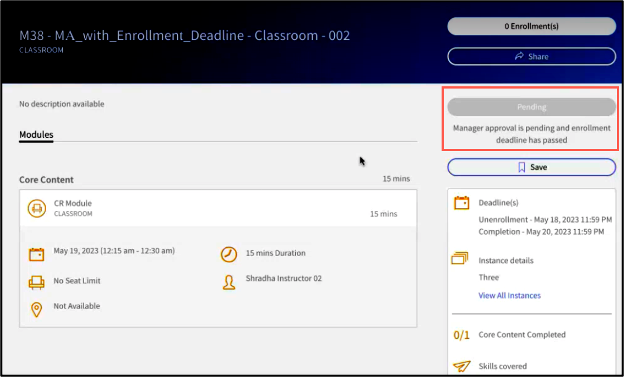

# 이 릴리스(2023년 7월)의 새로운 기능

## 향상된 권장 사항

Adobe Learning Manager는 새롭고 개선된 강의 추천 시스템을 도입했습니다. 이 추천 기능은 AI 알고리즘과 제품, 역할, 레벨 등 사용자의 관심사를 활용해 개인화된 콘텐츠 추천을 제공한다.

자세한 내용은 다음을 참조하세요. [Adobe Learning Manager의 Recommendations](recommendations-adobe-learning-manager.md).

## 다중 등록

이번 Adobe Learning Manager 릴리스에서는 학습자가 하나 이상의 다른 기간에 둘 이상의 강의 인스턴스에 등록할 수 있는 학습자용 다중 등록을 소개합니다.

자세한 내용은 다음을 참조하세요. [복수 등록](/help/migrated/authors/feature-summary/courses.md).

### 모바일 앱 또는 몰입형 앱에 다중 등록

학습자는 모바일 앱/몰입형 앱에서 여러 인스턴스에 등록할 수 없습니다. 모바일 앱 및 몰입형 모바일 웹에서는 다중 등록이 지원되지 않습니다.

>[!NOTE]
>
>다중 등록을 활성화하면 각 강의의 학습자 성적 증명서 보고서에 여러 행이 추가됩니다(각 인스턴스에 대해 하나의 행).
>
>강의당 하나의 행만 예상하도록 보고 자동화를 설정한 경우 다중 등록 기능을 활성화하기 전에 보고 자동화에 필요한 조정을 수행해야 합니다.

### 다중 등록 인스턴스에서 배지 형식

다중 등록 인스턴스에서 배지를 지원하기 위해 배지 형식을 다음으로 변경합니다. `userId_badgeId_COURSE_courseId_courseInstanceId`.

### 헤드리스 모드를 사용하여 다중 등록에서 플레이어 실행

이번 릴리스에서는 헤드리스 플레이어와의 통신에 사용되는 라이브러리를 변경했습니다.

다중 등록에서는 개체 내에 래핑된 인수를 전달해야 합니다.

```
{{startplayer(argument_object) ,
where
argument_object=
{ loId = <loId>, accountId = <accountId>, userId =<userId>, accessToken = <accessToken>, domId = <elementId>, onModuleLoaded = fn(), isMultiEnrolled=<boolean>, instanceId=<instanceId> }
}}
```

## exavault 커넥터 사용 중단

이 릴리스의 Adobe Learning Manager에는 AWS 전송 패밀리의 SFTP 프로토콜을 사용하는 새 커넥터가 포함됩니다.

이 변경으로 인해 새 사용자가 더 이상 사용할 수 없는 ExaVault 커넥터도 대체됩니다. 모든 오픈 소스 FTP 클라이언트를 ExaVault의 대체품으로 사용할 수 있습니다. 자세한 내용은 다음을 참조하세요. [Adobe FTP 관리자에서 전환](transition-from-ftp-manager.md).

## 강의실 및 가상 세션에 대한 Outlook 미리 알림

학습자의 Outlook 일정에 추가된 Adobe Learning Manager에서 만든 강의실 및 가상 강의실 세션은 이제 Outlook의 미리 알림을 일관되게 지원합니다(Outlook의 회의 미리 알림과 유사).

## 강의에 스킬 할당 개선 사항

작성자를 위한 스킬 할당 워크플로우가 개선되었습니다. 이제 강의 설정 페이지의 스킬 제안 목록에 자동 검색 기능이 포함됩니다. 이제 작성자는 처음 몇 글자를 입력하여 스킬을 검색할 수 있고, 입력된 내용에 따라 스킬 드롭다운 목록에 제안이 표시됩니다. 이 기능을 통해 작성자는 강의 스킬을 찾고 할당하기 위해 전체 목록을 스크롤할 필요가 없습니다.

## 관리자가 승인한 강의 워크플로우 개선

이제 관리자가 승인한 강의는 관리자와 학습자 모두에게 적절한 오류 정보를 제공합니다.



관리자는 이제 강의 등록 요청을 승인할 수 없는 경우 정보(예: 등록 기한이 경과됨)가 포함된 관련 오류 메시지를 볼 수 있습니다. 학습자에게 오류 및 수정 작업이 표시됩니다.

## 새 학습 계획 보고서

관리자/사용자 정의 관리자는 이제 계정의 모든 학습 계획 목록 및 상태, 해당 사용자 그룹, 트리거 정보, 학습 계획에 포함된 강의/학습 경로 및 알림 메시지 정보와 같은 메타데이터를 내보낼 수 있습니다.

## 예정된 폐기 인스턴스를 추적하기 위한 보고서

교육 보고서에는 강의 또는 학습 경로에 있는 인스턴스의 완료 마감 기한을 표시하는 추가 열이 포함되어 있어 관리자와 작성자가 어떤 인스턴스가 중단되는지 알고 필요한 조치를 취할 수 있습니다.

## 학습자의 강의 등급 캡처 개선 사항

사용자가 강의의 마지막 모듈을 완료하면 강의의 평가 등급을 캡처하는 팝업이 표시됩니다.


## 전자 메일 템플릿 사용자 정의

Learning Manager의 전자 메일 템플릿에는 이제 완전히 편집 가능한 섹션이 포함되어 있어 메시징 및 브랜딩 환경 설정에 따라 전자 메일 커뮤니케이션을 사용자 정의할 수 있는 뛰어난 유연성을 제공합니다.

자세한 내용은 다음을 참조하세요. [전자 메일 템플릿 사용자 정의](/help/migrated/administrators/feature-summary/email-templates.md#flexibility-in-customizing-the-templates).

## 예약 도우미 개선 사항

강의실 또는 가상 세션의 강사 선택 프로세스를 미세 조정합니다. 사용자 그룹 필터가 예약 도우미의 강사 필드에 추가되었습니다. 이제 작성자는 &#39;강사 스킬&#39; 및 위치, 언어, 지정 등과 같은 추가 매개 변수를 기반으로 강사를 필터링할 수 있습니다.

자세한 내용은 다음을 참조하세요. [예약 도우미의 사용자 그룹 필터](/help/migrated/authors/feature-summary/courses.md#user-group-filter).

## 학습 객체 중단 워크플로우의 개선 사항

작성자는 이제 **자동 사용 중지** 강의 날짜. 이렇게 하면 시간이 지남에 따라 카탈로그가 부풀어 오르는 것을 방지할 수 있으며, 강의를 돌아가서 수동으로 중단할 필요가 있습니다.

책임자는 계정 수준에서 &#39;중단된&#39; 학습 개체에 대한 액세스 특성을 결정할 수도 있습니다.

교육 보고서에는 새 열이 포함됩니다. **자동 처분 날짜**&#x200B;을 눌러 각 학습 객체의 종료 날짜를 표시합니다(설정된 경우).

## 작성자별 카탈로그 레이블 값

이제 작성자는 강의를 작성하거나 편집하는 동안 카탈로그 레이블에 대한 값을 추가할 수 있습니다. 관리자는 계정 수준에서 이 기능을 활성화할 수 있습니다. 작성자가 새 카탈로그 레이블 값을 추가하면 자동 완성 검색의 일부가 됩니다.


## 책임자, 작성자 및 관리자 역할을 위한 강의 검색 개선

관리자, 작성자, 관리자 역할에 대한 검색 기능이 개선되었습니다. 이제 제목을 키워드로 검색할 수 있습니다. 이는 강의, 학습 경로 및 인증에 적용됩니다.

## 마이그레이션 실패에 대한 알림

통합 관리자는 마이그레이션 중 또는 PowerBI, FTP, Box 등과 같은 데이터 커넥터를 사용하는 동안 가져오기 또는 내보내기 작업에 실패한 경우 이메일을 통해 알림을 받습니다.

## API를 통한 다중 관리자 구성

다중 관리자 구성을 지원하기 위해 관리되는 Office API 집합에 새 API가 추가되었습니다.

## 등록 API 개선 사항

대규모 일괄 등록을 지원하고 최적화하도록 등록 API가 개선되었습니다.

## 모바일 앱 - 오프라인 콘텐츠 보기

학습자는 오프라인 모드에서 콘텐츠를 다운로드하고 사용할 수 있습니다. 중첩되고 유연한 학습 경로는 오프라인으로 볼 수 없습니다.

*이번 릴리스에서는 영어 콘텐츠에 대해서만 오프라인 콘텐츠 보기가 지원됩니다.*

## 액세스 가능성

화면 판독기의 가독성을 최적화하기 위한 개선 사항을 포함하여 접근성을 높이기 위해 여러 개선 사항이 구현되었습니다.

## 모바일 앱 지원

다음 주요 릴리스에서는 Adobe Learning Manager 모바일 앱이 세 개의 최신 모바일 OS 버전만 지원합니다.

## linkedIn의 콘텐츠

LinkedIn 콘텐츠가 Safari 브라우저의 몰입형 앱에서 예상대로 로드되지 않습니다. 해결 방법은 다음과 같습니다.

1. 장치에서 **[!UICONTROL 설정]** > **[!UICONTROL Safari]**.
1. 사용 안 함 **사이트 간 추적 방지**.
1. 사용 안 함 **모든 쿠키 차단**.
1. 몰입형 앱에 로그인합니다.
1. 콘텐츠를 재생합니다.
1. 팝업을 허용합니다.

## 기타 향상된 기능

### MS Teams에서 인스턴스 전환

학습자는 완료 시까지 다른 강의 인스턴스로 전환하고 강의 진행률을 유지할 수 있습니다.

### MS Teams의 다중 등록 지원

학습자는 이전 인스턴스의 완료 상태에 관계없이 다른 강의 인스턴스에 등록할 수 있습니다. 그렇게 하면 학습자가 동일한 강의의 여러 인스턴스에 등록하게 됩니다.

### 강의 노트는 MS Teams의 다중 등록을 지원합니다

강의 메모는 다중 등록을 지원하는 강의 인스턴스 레벨에서 사용할 수 있습니다.

## API 변경 사항

API 변경 사항에 대한 자세한 내용은 다음을 참조하십시오. [Adobe Learning Manager API 참조](https://captivateprime.adobe.com/docs/primeapi/v2/).

### 새로운 권장 사항에 대한 API 지원

**GET /account**

prlRecommendation이 활성화되어 있는지 여부를 반환합니다.

**요청**

`https://learningmanagerstage1.adobe.com/primeapi/v2/account`

**GET /data?filter.recommendationCriteria=product**

제품/항목 목록을 반환합니다. 결과는 모든 제품이 학습자에게 표시되는지 아니면 카탈로그가 제품/주제에 표시되는지 확인하는 계정 설정에 따라 다릅니다.

**요청**

`https://learningmanagerqe.adobe.com/primeapi/v2/data?filter.recommendationCriteria=product&filter.showAllRecommenda`

**`GET /data?filter.recommendationCriteria=role`**

권장 역할 목록을 반환합니다.

**요청**

`https://learningmanagerqe.adobe.com/primeapi/v2/data?filter.recommendationCriteria=role&filter.showAllRecommendationCriteria=false`

**`GET /data?filter.recommendationCriteria=level`**

권장 역할 목록을 반환합니다.

**요청**

`https://learningmanagerqe.adobe.com/primeapi/v2/data?filter.recommendationCriteria=level&filter.showAllRecommendationCriteria=false`

**POST /search/query**

검색에는 쿼리에 제품 및 역할 매개 변수도 포함됩니다. 쿼리와 본문은 변경되지 않습니다. 새 정렬 옵션을 추가합니다.

**요청**

`https://learningmanagerstage1.adobe.com/primeapi/v2/search/query?...`

**GET /learningObjects**

PRL 추천이 라이브인 경우 학습 개체 모델이 작성자 태그 추천을 반환합니다.

**요청 URL**

`https://learningmanagerstage1.adobe.com/primeapi/v2/learningObjects?sort=recommendationScore&filter.recommendationProducts=...&filter.recommendationRoles=...&filter.excludeIgnoredRecommendations=true`

POST /learningObjects/query

다음 특성은 쿼리 호출 본문에서 지원됩니다.

```javascript {line-numbers="true"}
{
  "filter.announcedGroups": [
    "string"
  ],
  "filter.bookmarks": true,
  "filter.catalogIds": [
    "string"
  ],
  "filter.cityName": [
    "string"
  ],
  "filter.duration.range": [
    "string"
  ],
  "filter.effectiveModifiedDate.fromDate": "string",
  "filter.effectiveModifiedDate.toDate": "string",
  "filter.excludeIgnoredRecommendations": true,
  "filter.ignoreEnhancedLP": true,
  "filter.ignoreHigherOrderLOEnrollment": true,
  "filter.lang.subLOs": true,
  "filter.lang.twoLetterCode": true,
  "filter.learnerState": [
    "string"
  ],
  "filter.loFormat": [
    "string"
  ],
  "filter.loTypes": [
    "string"
  ],
  "filter.price": "string",
  "filter.priceRange": [
    "string"
  ],
  "filter.recommendationLevels": [
    "string"
  ],
  "filter.skill.level": [
    "string"
  ],
  "filter.skillName": [
    "string"
  ],
  "filter.tagName": [
    "string"
  ],
  "language": [
    "string"
  ],
  "preferredSortPartitionOrder": [
    "string"
  ],
  "showLoContentSource": true,
  "useCache": true,
  "filter.recommendationProducts": [
    {
      "levels": [
        "string"
      ],
      "name": "string"
    }
  ],
  "filter.recommendationRoles": [
    {
      "levels": [
        "string"
      ],
      "name": "string"
    }
  ]
}
```

**GET /recommendationProducts**

recommendationProduct Id로 PRL 제품을 검색합니다.

**요청 URL**

`https://learningmanagerstage1.adobe.com/primeapi/v2/recommendationProducts`

GET /recommendationRoles

recommendationProduct Id로 PRL 제품을 검색합니다. (학습 객체)의 표시 역할만 반환됩니다.

**요청 URL**

`https://learningmanagerstage1.adobe.com/primeapi/v2/prlRecommendations/roles`

`POST /users/{id}/recommendationPreferences`

PRL 권장 설정 생성/다시 생성(재정의) 샘플 페이로드:

```javascript {line-numbers="true"}
{
    "data": {
        "id": "userRecommendationPreferences:14755328",
        "type": "userRecommendationPreferences",
        "attributes": {
            "products": [
                {
                    "id": "recommendationProduct:1",
                    "dateCreated": "2023-05-07T20:00:00.000Z"
                },
                {
                    "id": "recommendationProduct:37",
                    "dateCreated": "2023-05-07T21:00:00.000Z"
                }
            ],
            "roles": [
                {
                    "id": "recommendationRole:23",
                    "dateCreated": "2023-05-07'T'21:00:00.000'Z'"
                },
                {
                    "id": "recommendationRole:1",
                    "dateCreated": "2023-05-07'T'20:01:00.000'Z'"
                },
                {
                    "id": "recommendationRole:2",
                    "dateCreated": "2023-05-07'T'19:02:00.000'Z'"
                },
                 {
                    "id": "recommendationRole:3",
                    "dateCreated": "2023-05-07'T'18:02:00.000'Z'"
                },
                {
                    "id": "recommendationRole:20",
                    "dateCreated": "2023-05-07'T'17:02:00.000'Z'",
                    "levels": [
                        "INTERMEDIATE"
                    ]
                }
            ]
        }
    }
}
```

**`GET /users/{id}/recommendationPreferences`**

**요청 URL**

`https://learningmanagerstage1.adobe.com/primeapi/v2//users/123/recommendationPreferences`

**`DELETE /users/{id}/recommendationPreferences`**

제품 또는 역할에 대한 PRL 권장 사용자 환경설정을 삭제합니다.

**요청 URL**

`https://learningmanagerstage1.adobe.com/primeapi/v2/users/123/recommendationPreferences?ids=recommendationRole:123,recommendationRole:234`

매개 변수:

Ids = 삭제할 ID 목록

**PATCH /users/{id}/recommendationPreferences**

부분 추가/업데이트. 샘플 페이로드:

```javascript {line-numbers="true"}
{
  "data": {
    "id": "userRecommendationPreferences:<USER_ID>",
    "type": "userRecommendationPreferences",
    "attributes": {
      "roles": [
        {
          "id": "recommendationRole:123",
          "type": "recommendationRole",
          "attributes": {
            "levels": [
              "INTERMEDIATE"
            ]
          }
        },
        {
          "id": "recommendationRole:123",
          "type": "recommendationRole",
          "attributes": {
            "levels": [
              "ADVANCED"
            ]
          }
        }
      ]
    }
  }
}
```

**POST /recommendationPreferences/learningObjects/{id}/ignore**

차단된 권장 사항에 LO를 추가합니다.

**요청 URL**

`https://learningmanagerstage1.adobe.com/primeapi/v2/recommendationPreferences/learningObjects/{id}/ignored`

**`DELETE /recommendationPreferences/learningObjects/{id}/ignore`**

차단된 권장 사항에서 LO를 삭제합니다.

**요청 URL**

`https://learningmanagerstage1.adobe.com/primeapi/v2/recommendationPreferences/learningObjects/{id}/ignored`

**`GET /users/{id}/recommendationStrips`**

prl 권장 사항을 표시하는 데 사용할 모든 스트립을 검색합니다.

### API에 대한 다중 등록 지원

**GET /primeapi/v2/account**

두 개의 새로운 속성이 추가되었습니다.

* instanceSwitchEnable
* 다중 등록 사용

**GET /users/{userId}/userNotification**

새 메타데이터 특성의 알림에 강의 인스턴스 ID가 추가되었습니다.

**GET /learningObjects**

등록 관계에는 기본 등록, 즉 첫 번째 등록 또는 첫 번째 완료만 표시됩니다.

**`GET /learningObjects/{id}`**

등록 관계에는 기본 등록, 즉 첫 번째 등록 또는 첫 번째 완료만 표시됩니다.

**`GET /learningObjects/{loId}/instances/{loInstanceId}`**

LO 인스턴스 모델에 새 관계가 추가되었습니다.

**`GET /enrollments/{id}`**

여러 등록 강의의 등록을 검색합니다.

**`DELETE /enrollments/{id}`**

특정 학습 객체 인스턴스에서 등록 취소

**POST/등록**

다른 인스턴스에서 등록을 지원합니다.

**GET/등록**

학습 개체에 대한 기본 등록에 대해서만 등록을 가져옵니다.

**`GET /learningObjects/{id}/note`**

강의 노트 목록을 검색합니다.

**`GET /learningObjects/{lo_id}/instances/{loi_id}/note`**

강의 및 인스턴스에 대한 참고 목록을 검색합니다.

**`GET /learningObjects/{id}/resources/{loResourceId}/note`**

강의의 리소스에 대한 참고 목록을 검색합니다.

**`POST /learningObjects/{id}/resources/{loResourceId}/note`**

강의의 모듈에 특정 강의의 메모를 추가합니다.

**`DELETE /learningObjects/{id}/resources/{loResourceId}/note/{noteId}`**

특정 인스턴스(loResource Id의 일부)에 대해 지정된 모듈에서 특정 메모를 삭제합니다.

**`GET /learningObjects/{id}/resources/{loResourceId}/note/{noteId}`**

지정된 인스턴스(loResourceId의 일부)에 대한 강의의 모듈에서 특정 메모를 검색합니다.

**`PATCH /learningObjects/{id}/resources/{loResourceId}/note/{noteId}`**

특정 인스턴스(loResource Id의 일부)에 대해 지정된 모듈의 특정 메모를 업데이트합니다.

**관리자 API 변경 사항**

* GET /users/{id}/등록
* POST /users/{id}/등록
* DELETE /users/{id}/enrollments/{enrollmentId}
* PATCH /users/{id}/enrollments/{enrollmentId}

### 끝점에 대한 필드 강제 적용

제품 및 역할은 적용된 경우에만 로드됩니다.

예제 요청

* GET `https://learningmanagerstage1.adobe.com/primeapi/v2/learningObjects/course%3A7418798?enforcedFields[learningObject]=products`
* GET `https://learningmanagerstage1.adobe.com/primeapi/v2/users/11255638/userBadges?include=model&page[offset]=0&page[limit]=10&sort=dateAchieved&enforcedFields[learningObject]=products,roles`

### 구현 간 API 변경 내용 검색(영어 로케일)

어간 생성은 한 단어를 그 어근 형태로 줄이는 과정이다. 이렇게 하면 검색 중에 단어의 변형이 일치하게 됩니다. 예를 들어, 걷기와 걷기는 걷기라는 동일한 뿌리 단어로 구성될 수 있습니다. 한 단어에서 검색하면 두 단어 중 하나가 다른 단어와 일치합니다.

이 릴리스에서는 en_US, en_AU, en_GB 변형과 같은 영어 로케일에 대한 형태분석을 추가했습니다.

검색 결과에서 스테밍이 필요한 경우 스테밍된 속성에 언급됩니다. 기본적으로 False로 설정됩니다.

### V1 끝점 제거

이 릴리스에서는 V1 API의 작동이 중단됩니다. 자세한 내용은 [개발자 설명서](/help/migrated/integration-admin/feature-summary/developer-manual.md).

### 강의 등록 또는 등록 취소 알림

이 릴리스에서는 새 메타데이터 특성의 알림을 통해 강의 인스턴스 ID를 지원합니다.

### L1 피드백 지원

학습자가 다중 등록 기능의 각 인스턴스 레벨에서 피드백을 제공할 수 있습니다.

**API:** `POST /enrollments/{id}/l1Feedback`

### LO 적용 필드 목록

이 릴리스에서는 sections, prequisiteConstraints, prerequisiteLOs, subLOs, supplementaryResources, supplementaryLOs, instances, catalogLabels를 learningObject로 명시적으로 보내야 합니다.

예를 들면 다음과 같습니다.

`enforcedFields[learningObject]=prerequisiteLOs,instances`

### 다음 릴리스에 대한 사용 중단 알림

* 학습자 API에 대한 재정의 플래그
* highlightResults=false의 기본값을 변경하겠습니다. 또한 snippetType=courseName의 기본값을 변경하겠습니다.
* 검색 끝점에서 matchType=bool이 더 이상 사용되지 않습니다.
* autoCompleteMode는 [사용되지 않음] 태그를 지정하고 autoCompleteMode =false와 동일한 기능을 제공하기 위해 Match라는 matchType이 추가되었습니다.

### 다중 등록이 있는 배지 ID 형식

다중 등록 인스턴스 배지를 지원하기 위해 강의 배지 형식을 `userId_badgeId_COURSE_courseId to userId_badgeId_COURSE_courseId_courseInstanceId` 배지를 고유하게 식별합니다.

## 릴리스 정보

현재 및 이전 릴리스의 Learning Manager 웹 앱 및 장치 앱과 관련된 정보는 [릴리스 정보](/help/migrated/release-note/release-notes.md).

## 이 릴리스의 알려진 문제 또는 제한 사항

이 릴리스의 제한 사항은 다음과 같습니다.

### 모바일 앱에서 오프라인 콘텐츠 보기

다음은 앱에서 오프라인 콘텐츠를 보는 동안 지원되지 않습니다.

* Flex 과정, 학습 계획 또는 인증.
* 향상된 강의, 학습 계획 또는 인증.
* 다중 퀴즈 활성 강의, 학습 계획 또는 인증.
* Harvard Manage Mentor, Content Marketplace, GetAbstract 또는 LinkedIn 과정, 학습 계획 또는 인증.
* 전제 조건이 활성화된 학습 계획 및 인증서
* 중단된 강의, 학습 계획 또는 인증
* 기한이 만료된 강의, 학습 계획 또는 인증.
* 외부 인증서.
* 전자상거래 지원 과정, 학습 계획 또는 인증.

오프라인 동기화에 문제가 있는 학습 경로, 강의 또는 인증은 다음과 같습니다.

* 모든 학습 경로.
* 모든 내부 인증서.
* POST 호출이 있는 콘텐츠.

### Recommendations

다음은 새 추천 시스템의 제품/역할/수준에 대해 지원되지 않습니다.

* Adobe Experience Manager, Teams, SFDC 및 임시 방문 모드.
* 모바일 앱은 권장 페이지에서 제품 및 역할 편집을 지원하지 않습니다.
* 마이그레이션하는 동안에는 매핑을 사용할 수 없습니다.
* linkedIn, 콘텐츠 마켓플레이스 및 기타 외부 강의, 학습 계획 또는 인증에 자동 태그 지정.
* 라이브 후 스킬 기반 또는 클래식으로 돌아갑니다.
* 학습자 앱의 제품 및 역할 검색 메뉴.
* 책임자 앱에서 강의, 학습 계획 또는 인증, 사용자의 일괄 매핑

## 시스템 요구 사항

[Learning Manager 시스템 요구 사항](/help/migrated/system-requirements.md)
