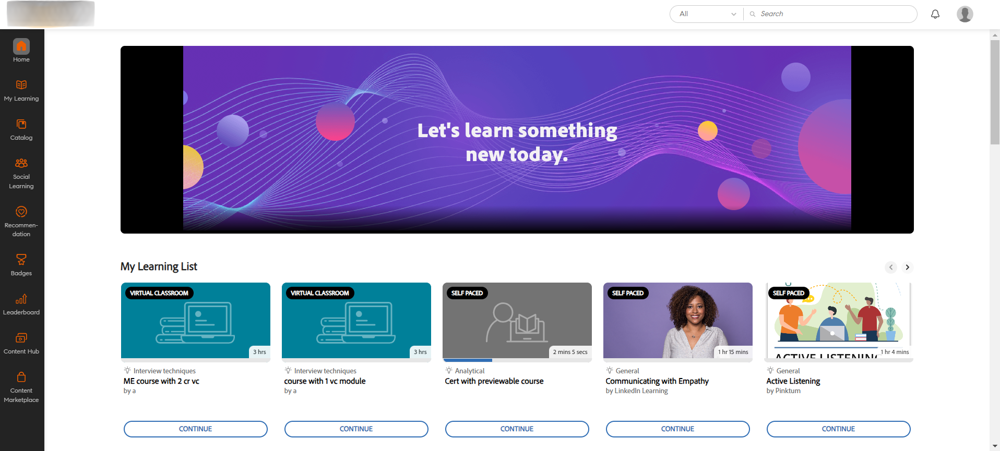

# 새로운 기능 요약 {#new-features-summary}

Adobe Learning Manager 2024년 7월 릴리스의 새로운 기능 및 개선 사항에 대해 알아봅니다.

>[!NOTE]
>
>이 릴리스의 새로운 기능에 대해 자세히 알아보려면 이 [웨비나](https://nam04.safelinks.protection.outlook.com/?url=https%3A%2F%2Flearningmanager.adobe.com%2Fapp%2Flearner%3FaccountId%3D98632%23%2Fcourse%2F10078152&amp;data=05%7C02%7Cchandrum%40adobe.com%7C90e588d31b994e6a5f4e08dcb87f26a8%7Cfa7b1b5a7b34438794aed2c178decee1%7C0%7C0%7C638588103494535076%7CUnknown%7CTWFpbGZsb3d8eyJWIjoiMC4wLjAwMDAiLCJQIjoiV2luMzIiLCJBTiI6Ik1haWwiLCJXVCI6Mn0%3D%7C0%7C%7C%7C&amp;sdata=dNyxQl3IQjEtfGCMnhlfek4Piz%2BPGFfuUss53M8mFK8%3D&amp;reserved=0)를 확인하세요.

## 준수 대시보드의 개선 사항

### 준수 대시보드란 무엇입니까? {#whatiscompliancedashboard}

**Adobe Learning Manager**&#x200B;의 **[!UICONTROL 준수 대시보드]**&#x200B;를 통해 관리자는 학습 목표를 향한 학습자의 진행 상태를 모니터링하고 모니터링할 수 있습니다. 팀원이 마감 시간을 준수하고 학습 프로세스를 계속 진행하는지 확인할 수 있으므로 규정 준수가 보장됩니다. 책임자는 준수 대시보드를 설정하고 관리자와 공유할 수 있습니다.

책임자 앱에서 준수 대시보드에 액세스하려면 **[!UICONTROL 보고서]** > **[!UICONTROL 학습 요약]** > **[!UICONTROL 준수 대시보드]**&#x200B;를 선택합니다.

### 릴리스에서 변경되는 내용

관리자 및 관리자는 개선된 준수 대시보드를 통해 특정 범주(예: 영업, 마케팅 및 법률)와 관련된 준수 유형 강의, 학습 경로 또는 인증을 볼 수 있습니다. 관리자는 사용자 정의 준수 강의를 특정 범주로 분류할 수 있습니다. 사용자 정의 준수 범주는 카탈로그 레이블로 구동됩니다.  책임자는 강의 대시보드를 만들고 관리자와 공유할 수 있습니다. 그러면 관리자는 해당 인스턴스에서 동일한 대시보드를 볼 수 있습니다. 또한 준수 대시보드 및 준수 이메일 알림의 사용자 인터페이스가 개선되었습니다.


#### 워크플로

다음은 향상된 준수 대시보드를 사용하는 단계입니다.

| 역할 | 작업 | 추가 정보 |
|---|---|---|
| 책임자 | 사용자 정의 준수 레이블 만들기 | 자세한 내용은 이 문서 [사용자 지정 준수 레이블 만들기](/help/migrated/administrators/feature-summary/reports.md#compliance-dashboard)를 참조하십시오. |
| 작성자 | 강의에 레이블 추가 | 자세한 내용은 이 문서 [강의/학습 경로/인증에 준수 레이블 추가](/help/migrated/authors/feature-summary/courses.md#add-compliance-labels-to-courselearning-pathcertification)를 참조하십시오. |
| 책임자 | 준수 과정으로 대시보드를 만들고 관리자와 공유 | 자세한 내용은 이 문서 [준수 대시보드 만들기 및 공유](/help/migrated/administrators/feature-summary/reports.md#create-and-share-a-compliance-dashboard)를 참조하십시오. |
| 관리자 | 준수 대시보드 보기 | 자세한 내용은 이 문서 [준수 상태](/help/migrated/managers/feature-summary/manager-dashboard.md#compliance-status)를 참조하세요. |

## 학습자 사용자 인터페이스 개선

>[!IMPORTANT]
>
>새로운 학습자 UI가 단계적으로 출시될 예정입니다.

**학습자 UI**&#x200B;가 보다 우아하고 현대적인 디자인으로 업데이트되었습니다. **[!UICONTROL 학습자 홈]**, **[!UICONTROL 내 학습]**, **[!UICONTROL 카탈로그]** 및 **[!UICONTROL 강의 개요]** 랜딩 페이지가 새롭고 현대적으로 표시됩니다. 강의 카드에는 세부 사항을 현대적으로 표시하기 위한 새로운 디자인도 있습니다. 강의 카드 위에 마우스를 놓으면 강의 설명 및 게시 날짜가 표시됩니다.

>[!NOTE]
>
>개선된 사용자 인터페이스는 몰입형 레이아웃에만 적용됩니다. 이러한 변경 사항은 아직 모바일 웹 또는 앱에서 지원되지 않으며 향후 릴리스에서 업데이트될 예정입니다.


_이전 사용자 인터페이스_


_새 사용자 인터페이스_

### 이 릴리스에서 변경되는 내용

**모양과 느낌 현대화**

새로워진 비주얼 요소는 최신 디자인 트렌드와 맞춰져 제품이 직관적이고 매력적으로 보입니다. 여기에는 새로운 발행인란, 사이드 패널 및 최신 모양의 위젯이 포함됩니다.

**향상된 사용자 환경**

학습자는 이제 통합 환경을 제공하는 홈페이지 , 카탈로그, 내 학습 및 강의 개요 페이지에서 유사한 카드 보기를 볼 수 있습니다.

자세한 내용은 [학습자 홈페이지](/help/migrated/learners/feature-summary/learner-home-page.md)를 참조하세요.

**강의 게시 날짜 변경**

이러한 향상된 기능을 통해 Adobe Learning Manager으로 가져온 LinkedIn 및 Go1 강의의 게시 날짜는 LinkedIn 및 Go1의 실제 게시 날짜가 됩니다. 사용자 인터페이스에서도 LinkedIn 및 Go1 과정에 대한 실제 게시 날짜를 볼 수 있습니다. 자세한 내용은 [강의 카드](/help/migrated/learners/feature-summary/learner-home-page.md#course-cards)를 참조하세요.

## 임시 방문 모드 업데이트

임시 방문 모드에서는 로그인하지 않은 고객을 위한 실시간 경험을 만들 수 있습니다. 이는 마케팅 캠페인의 랜딩 페이지로, 등록을 권장하는 데 충분한 정보를 제공합니다.

### 이 릴리스에서 변경되는 내용

고객은 프리미엄 플랜을 구매하여 고도로 확장 가능한 임시 방문 경험을 구축할 수 있습니다. [교육 데이터 액세스](/help/migrated/integration-admin/feature-summary/connectors.md#training-data-access)에서 제공하는 이 기록되지 않은 환경은 Adobe Learning Manager API를 사용하여 인원 제한, 사용 인원, 대기자 명단 제한 및 대기자 명단 수에 대한 실시간 데이터를 제공합니다. 고객은 이러한 API를 사용하여 로그인하지 않은 학습자 검색 및 필터링 기능과 전체 강의 요약을 제공할 수 있습니다. API에 대한 자세한 내용은 이 문서 [로그인하지 않은 API](/help/migrated/integration-admin/feature-summary/non-logged-in-apis.md)를 참조하십시오.

>[!NOTE]
>
>프리미엄 플랜을 구매하려면 지원 팀 또는 CSAM에 문의하십시오.

## 다중 SKU(Stock Keeping Unit) 지원

학습자는 이제 여러 강의, 학습 경로 또는 인증을 장바구니에 추가하고 함께 구매할 수 있습니다.

### 릴리스에서 변경되는 내용

이전에는 학습자가 한 번에 하나의 강의만 구매할 수 있었습니다. 이번 **Adobe Learning Manager** 릴리스에서는 카트를 사용하여 여러 강의, 학습 경로 또는 인증을 한 번에 구매할 수 있습니다.

이 기능은 학습자 앱(기존 UI, 새로운 학습자 UI 및 모바일 몰입형 앱)에서만 사용할 수 있습니다.

[ALM의 다중 항목 카트 보기](/help/migrated/learners/feature-summary/multi-item-cart.md)

## Fluidic Player에서 HTML5 컨텐츠 지원

**Adobe Learning Manager**&#x200B;에서는 이제 HTML 5 콘텐츠를 .zip 파일로 콘텐츠 라이브러리에 업로드하는 것을 지원합니다. 업로드되면 이러한 파일은 강의의 모듈로 포함될 수 있습니다. 또한 작성자는 자가 진행식 HTML 5 모듈의 완료 기준을 정의하여 학습자가 표시한 완료 또는 시작 시 자동 완료를 활성화할 수 있습니다.

### 이 릴리스에서 변경되는 내용

이제 Adobe Learning Manager은 자가 진행식 과정에서 HTML 5 지원 콘텐츠를 지원합니다. 작성자는 HTML5 콘텐츠를 .zip 파일로 자가 진행식 콘텐츠에 추가할 수 있습니다. 학습자는 Fluidic Player에서 HTML5 콘텐트를 볼 수 있습니다. 새로운 기능으로 이제 학습자는 Fluidic Player에서 직접 자기 진행식 강의로 강의를 완료로 표시할 수 있습니다. 자세한 내용은 [콘텐츠 라이브러리에서 HTML5 파일 형식 추가](/help/migrated/authors/feature-summary/content-library.md#add-html5-file-type-in-the-content-library)를 참조하십시오.

새로운 개선 사항을 통해 작성자가 완료 조건을 새 옵션 **[!UICONTROL 콘텐츠 시작 시]**&#x200B;로 설정한 경우 외부 링크가 있는 강의는 URL을 방문할 때 자동으로 완료로 표시됩니다. 새 옵션 **[!UICONTROL 완료 조건]**&#x200B;이(가) 활동 모듈 페이지에 추가되어 작성자가 외부 링크의 완료 조건을 설정할 수 있습니다. 자세한 내용은 [활동 모듈의 HTML 링크 추가](/help/migrated/authors/feature-summary/courses.md#add-html-link-in-the-activity-module)를 참조하세요.


_완료 조건 옵션-활동 모듈_

## 모바일 앱에서의 강의 지연 푸시 알림

학습자는 강의 기한을 놓칠 때마다 푸시 알림을 받습니다. 이 새로운 기능 향상을 통해 학습자는 이제 24시간 동안 알림 메시지를 다시 졸이거나, 다음 주에 받은 각각의 지연 알림 메시지에 대해 알림을 받을 수 있습니다. 이는 기한 경과 알림에만 적용됩니다. [푸시 알림 예약](/help/migrated/learners/feature-summary/user-notifications.md#schedule-the-push-notification) 보기

## 이 릴리스의 API 변경 사항

### API 검색

검색 API에는 다음과 같은 변경 사항이 포함됩니다.

학습자는 ```GET /search``` API를 사용하여 카탈로그 필터 내에서 태그를 검색할 수 있습니다. 학습자는 ```filter.loTypes``` 매개 변수의 값으로 ```tag```을(를) 선택하여 태그를 검색할 수 있습니다.

**샘플 컬**

```
curl -X GET --header 'Accept: application/vnd.api+json' --header 'Authorization: oauth <oauth_token>' 'https://example.com/primeapi/v2/search?page[limit]=10&query=Business&autoCompleteMode=true&filter.loTypes=tag&sort=relevance&filter.ignoreEnhancedLP=true&matchType=phrase&persistSearchHistory=true&stemmed=false&highlightResults=true'
```

새 필터, 사용 가능한 시트, 사용 가능한 대기자 명단 및 시간 범위 필터가 ```GET /search``` 및 `GET /learningObjects` API에 추가되었습니다.

새 필터 `filter.session.includeEnrollmentDeadline`이(가) 다음 API ```GET /search```에 추가되었습니다.

### 계정 API

사용자 끝점의 계정 데이터를 가져오기 위해 새 열 `custom_injections`, `showComplianceLabel` 및 `complianceLabelDefaultID`이(가) ```GET /account``` API에 추가되었습니다.

### 학습 객체 API

이번 업데이트에서 학습 개체 API가 변경된 사항은 다음과 같습니다.

새 응답 기존 작성자 ID 및 기타 세부 정보가 `GET /learningObjects` API의 `authorDetails`에 추가되었습니다. 또한 기존 작성자 및 해당 강의를 필터링하기 위해 새 필터 `filter.authors`이(가) 추가되었습니다.

새 특성 `effectivenessIndex`은(는) 강의 효과 데이터를 가져오는 데 도움이 됩니다.

**샘플 컬**

```
curl --location 'https://example.com/primeapi/v2/learningObjects/course%3A9790045?enforcedFields%5BlearningObject%5D=effectivenessData' \
--header 'Accept: application/vnd.api+json' \
--header 'Authorization: oauth <oauth_token>'
```

이 강의를 수강할 사람에 대한 세부 정보를 제공하는 새 응답 `whoShouldTake`이(가) `POST /learningObjects/query`, `GET /learningObjects/{id}` 및 `GET /learningObjects` API에 추가되었습니다.

**샘플 컬**

```
curl -X GET --header 'Accept: application/vnd.api+json' --header 'Authorization: oauth <oauth_token>' 'https://example.com/primeapi/v2/learningObjects/course%3A1131255' 
```

대기자 명단 제한에 대한 세부 정보를 제공하는 새 응답 `waitlistLimit`이(가) `GET /learningObjects` API에 추가되었습니다.

학습 개체의 총 개수를 제공하는 새 응답 `count`이(가) API `GET/ learningObjects` 및 `POST/ learningObjects/query`에 추가되었습니다.

새 응답 `catalogFieldId` 및 `fieldValueId`이(가) `GET/ learningObjects` API의 `catalogLabels`에 추가되었습니다.

학습자는 API `GET /preview/learningObjects`에서 카탈로그 레이블 값을 가져올 수 있습니다.

### 마켓플레이스 수를 가져오기 위한 새 API

이 릴리스에서는 새 API `GET /search/marketplace/count`이(가) 추가되었습니다. 이를 통해 콘텐츠 마켓플레이스에서 사용 가능한 학습 객체의 수를 확보할 수 있습니다.

**샘플 컬**

```
curl -X GET --header 'Accept: application/vnd.api+json' --header 'Authorization: oauth <oauth_token>' 'https://example.com/primeapi/v2/search/marketplace/count?query=course'
```

**샘플 응답**

```
{
  "count": 54910
}
```

### 학습 객체 인스턴스 API

이번 업데이트에서 학습 객체 인스턴스 API가 변경된 사항은 다음과 같습니다.

이 릴리스에서는 `gamificationEnabled`이라는 새 키가 학습 개체 인스턴스 API `GET /learningObjects/{loId}/instances/{loInstanceId}`에 추가되었습니다.

**샘플 컬**

```
curl --location 'http://example.com/acapapi/primeapi/v2/learningObjects/learningProgram:12756/instances/learningProgram:12756_15644' 
```

게임화 설정의 세부 정보를 가져오기 위해 위의 API에 대한 새로운 `gamificationSettings` 특성을 사용합니다. 예: `GET /learningObjects/{loId}/instances/{loInstanceId}/gamificationSettings`.

**샘플 컬**

```
curl --location 'http://example.com/acapapi/primeapi/v2/learningObjects/learningProgram:103852/instances/learningProgram:103852_103526/gamificationSettings'
```

게임화 설정의 세부 정보를 가져오기 위해 위의 API에 대한 새로운 `leaderboard` 특성을 사용합니다. 예: `GET /learningObjects/{loId}/instances/{loInstanceId}/leaderboard`.

**샘플 컬**

```
curl --location 'https://example.com/primeapi/v2/learningObjects/learningProgram:106339/instances/learningProgram:106339_105775/leaderboard' \
--header 'Accept: application/vnd.api+json' \
--header 'Authorization: oauth <oauth_token>'
```

### 날짜 및 -date에 대한 정렬 동작 변경

날짜 및 -date별 정렬을 지원하는 API는 학습 경로를 제외한 모든 학습 객체의 게시 날짜를 기준으로 결과가 표시됩니다. 학습 경로는 **effectiveModified** 날짜를 기준으로 계속 나열됩니다. 이 변경 사항은 다음 API에서 확인할 수 있습니다.

* GET /learningObjects
* GET /search
* POST /learningObjects/query
* POST /검색/쿼리

### 오프셋 제한 변경 사항

시스템 성능을 개선하고 리소스 활용률을 더 효과적으로 관리하기 위해 Adobe은 책임자 및 학습자 범위 모두에 대해 GET/사용자 끝점에서 더 이상 사용되지 않는 높은 오프셋 값을 가집니다. 작업 API를 사용하여 오프셋 값이 있는 레코드를 검색하는 것이 좋습니다.

### 사용되지 않는 API

제품에서 더 이상 사용되지 않는 모든 API의 누적 목록은 Adobe Learning Manager에서 [API 사용 중단](/help/migrated/api-deprecations-list.md)을 확인하십시오.

## 보고 변경 사항

### 준수 대시보드

이번 릴리스에서 준수 대시보드 보고서에는 두 개의 새 열이 있습니다.

* 상태
* 준수 유형

이는 기존의 열에 추가됩니다.

* 사용자 이름
* 사용자 전자 메일
* LP/인증/과정
* 유형
* 등록 날짜(UTC 시간대)
* 기한(UTC 시간대)
* 완료 날짜(UTC 시간대)
* 진행률(%)

### 교육 보고서

**관리자** > **보고서** > **사용자 지정 보고서** 및 **작업 API**&#x200B;의 교육 보고서에는 **스킬** 및 **태그**&#x200B;라는 열이 있었습니다. 이들 열의 이름이 이제 **스킬** 및 **태그**(으)로 바뀌었습니다.

### 콘텐츠 감사 보고서

이 릴리스에서는 이제 **[!UICONTROL 콘텐츠 감사 추적]** 보고서에 수정 유형 열에 다음과 같은 새 특성이 포함됩니다.

* 사용자 그룹 추가
* 사용자 그룹 제거
* 사용자 정의 레이블 추가
* 사용자 정의 레이블 제거
* 공유 카탈로그 추가
* 공유 카탈로그 제거
* 공유 카탈로그 업데이트

## 이번 업데이트에서 수정된 버그

**활동 제출**

* 활동 제출 모듈에 파일을 다시 업로드하려고 하면 네트워크 호출의 오류 500과 함께 실패합니다.

**API**

* 여러 강사의 이메일 주소가 동일한 경우 Connect VC 회의 생성이 실패합니다.
* MS Teams VC는 학습 경로에 등록한 후 개요 페이지에 잘못된 URL을 표시합니다.
* 작업 API 응답의 일부로 제공된 사전 서명된 URL이 6시간 후에 만료됩니다.
* 강의 등록 보고서를 생성하는 동안 강의 이름 열에 잘못된 강의 이름이 표시됩니다.
* 마이그레이션 작업자가 강의의 대량 API를 호출할 때 고유한 lo id를 전송하지 못하지만 id는 제거됩니다.
* 강의가 사용자가 액세스할 수 있는 특정 카탈로그에 포함된 경우(기본 카탈로그는 비활성화됨), 등록되지 않은 학습자가 강의를 볼 수 없도록 설정한 경우에도 learningobject/id 엔드포인트를 통해 강의 메타데이터를 검색할 수 있습니다.
* skillname이 GET /learningObject API의 이름에 쉼표를 포함하는 경우 스킬 필터가 제대로 작동하지 않습니다.
* SFTP용 데이터 보존 작업자에 있는 파일의 타임스탬프 메타데이터에 일관성이 없습니다.
* 커넥터를 제거하고 다시 구성한 경우 프로젝트 마이그레이션 상태가 닫힌 것으로 표시됩니다.
* 교육 보고서의 열 헤더가 &quot;태그&quot; 대신 &quot;태그&quot;입니다.
* 카탈로그를 사용하지 않고 내보낸 과정 중 하나라도 사용하지 않은 카탈로그의 일부이면 Commerce 커넥터 내보내기에 실패합니다.

**인증**

* 반복 인증에 사용자를 다시 등록하지 못하는 경우가 있습니다.

**사용자 지정 역할**

* 경우에 따라 사용자 정의 책임자가 강사 역할로 전환하려고 하면 오류 403 금지 가 표시됩니다.

**전자 메일 템플릿 및 알림**

* 세션이 취소된 후 강사가 세션에서 제거될 때 마지막 강사 세트에 전자 메일 알림이 전송되지 않습니다.
* 주최자는 가상 강사 주도 교육을 생성한 후 MS Teams에 대한 전자 메일 알림을 받지 않습니다. 강의가 게시되고 이메일 템플릿이 활성화된 후에만 이메일이 트리거됩니다.
* 전자 메일 템플릿에 잘못된 날짜 형식과 번역이 포함된 경우가 있습니다.

**학습자**

* 학습자가 여러 강의 인스턴스에 등록되어 있고 출석 보고서를 다운로드하면 보고서에 잘못된 정보가 포함됩니다.
* 사용자는 다른 사용자의 비공개 게시물이 공개 스토리에 추가된 경우 이를 볼 수 있습니다.
* 인증에서 학습자를 등록 취소할 수 없는 경우도 있습니다. 등록을 취소하려고 하면 오류 메시지가 표시됩니다.
* 책임자가 한 개의 강의만 선택한 후 완료로 표시한 후에도 인증이 완료됨으로 표시됩니다.
* 세션의 종료 시간이 이전 날짜로 변경된 경우 관리자가 VC를 완료로 표시할 수 없습니다.
* 대기자 명단에 있는 학습자의 세션 출석 보고서는 &quot;출석하지 않음&quot;으로 표시됩니다.

**학습자 앱**

* 강의 노트를 PDF으로 다운로드하면 노트가 무작위로 표시됩니다. 그들은 명령을 따르지 않습니다.

**학습 경로**

* 학습 경로에서 스킬을 선택하면 텍스트 필드를 선택할 때 드롭다운이 예상대로 표시되지 않습니다.
* 경우에 따라 학습 경로에서 스킬을 제거할 수 없습니다.

**학습 프로그램**

* 유연 학습 프로그램에 강의가 많은 경우 책임자가 학습 계획을 완료로 표시한 후에도 학습 계획이 완료되지 않습니다.
* 학습자가 인스턴스를 변경할 때 등록 보고서의 last_modified_by 열이 업데이트되지 않습니다.

**신고**

* 경우에 따라 책임자가 교육 보고서를 내보낼 수 없습니다.
* SCORM 콘텐츠에 32,767자를 초과하는 질문이나 대답이 포함되어 있으면 Excel에서 강의 퀴즈 보고서를 다운로드할 수 없습니다.
* 게임화 재설정을 선택한 후에는 레벨 달성 날짜가 재설정되지 않습니다.

**검색**

* 현재 모든 사용자 그룹을 내보낸 후 삭제된 사용자 그룹도 출력에 포함됩니다.
* 간헐적인 검색 문제로 인해 인증을 검색할 수 없습니다.

## 이 릴리스의 알려진 문제

Mobile Offline Player가 HTML5 콘텐츠를 로드하지 않습니다.

## 시스템 요구 사항

[Adobe Learning Manager 시스템 요구 사항](/help/migrated/system-requirements.md)을 확인하십시오.

## Adobe Learning Manager의 이전 릴리스

* [2024년 3월 릴리스](/help/migrated/whats-new-march-2024.md)
* [2023년 11월 릴리스](/help/migrated/whats-new-november-2023.md)
